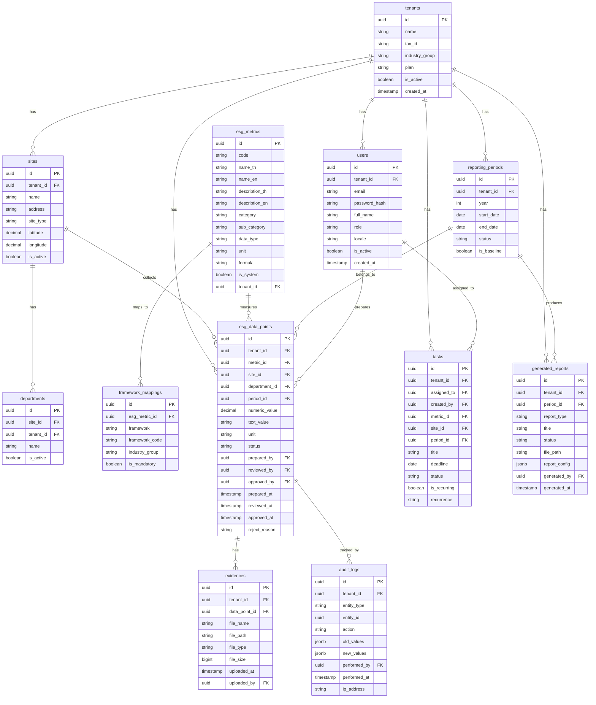

# Thai ESG Hub — System Design Document

> **Date**: 2026-03-08
> **Status**: Approved
> **Author**: Solo Dev + Claude Code AI

---

## 1. Project Summary

Thai ESG Hub เป็น Multi-tenant SaaS Platform สำหรับ บจ.ไทย จัดการ ESG Reporting + Carbon/GHG Management ตั้งแต่เก็บข้อมูลจนถึงส่งรายงาน

### Key Decisions

| หัวข้อ | Decision |
|--------|----------|
| Team | Solo dev + Claude Code AI |
| Frontend | Next.js 15 (App Router) |
| Backend | ASP.NET Core 9 Web API |
| Database | PostgreSQL 17 |
| Cache | Redis 7 |
| Auth | JWT (httpOnly cookie) |
| Hosting | VPS / Self-managed (Docker Compose) |
| Multi-tenant | Shared DB + PostgreSQL Row-Level Security |
| UI Language | Bilingual (TH + EN) via next-intl |
| Data Grid | AG Grid Community Edition (free) |
| UI Components | shadcn/ui + Tailwind CSS |
| Charts | Recharts or Tremor |
| PDF Generation | QuestPDF (.NET) |
| Word Generation | DocumentFormat.OpenXml (.NET) |
| Email | MailKit + SMTP |
| File Storage | Local disk → MinIO (S3-compatible) later |
| Validation | FluentValidation |
| CI/CD | GitHub Actions |
| Architecture | Modular Monolith |
| UI Design | Use `frontend-design` skill |
| Next.js Code | Use `vercel-react-best-practices` skill |

### Phase Strategy

```
Phase A: 56-1 One Report Generator (MVP — ขายได้เลย)
    ↓
Phase B: ESG Data Collection + Dashboard (ESG Excel replacement)
    ↓
Phase C: Carbon Accounting / GHG Inventory (รองรับ พ.ร.บ. Climate Change)
```

---

## 2. System Architecture

```
┌─────────────────────────────────────────────────────┐
│                    Client (Browser)                  │
└──────────────────────┬──────────────────────────────┘
                       │
┌──────────────────────▼──────────────────────────────┐
│           Next.js 15 (App Router + SSR)             │
│  ┌─────────┐ ┌──────────┐ ┌───────────┐            │
│  │  Pages  │ │Components│ │  i18n     │            │
│  │ (TH/EN)│ │(shadcn/ui)│ │(next-intl)│            │
│  └─────────┘ └──────────┘ └───────────┘            │
│  Data Grid: AG Grid Community (pagination,          │
│    sort, filter, header filter, AJAX)               │
│  Auth: JWT (httpOnly cookie)                        │
└──────────────────────┬──────────────────────────────┘
                       │ REST API (HTTPS)
┌──────────────────────▼──────────────────────────────┐
│            ASP.NET Core 9 Web API                   │
│                                                      │
│  ┌─── Modules ──────────────────────────────────┐   │
│  │  Identity/    → Auth, Users, Roles, JWT      │   │
│  │  Tenants/     → Org, Sites, Departments      │   │
│  │  ESG/         → Metrics, DataPoints, Tasks   │   │
│  │  Carbon/      → Activities, EF, Calculations │   │
│  │  Reporting/   → OneReport, GRI, GHG Report   │   │
│  └──────────────────────────────────────────────┘   │
│  ┌─── SharedKernel ─────────────────────────────┐   │
│  │  Entities, Interfaces, Audit, RLS Filter     │   │
│  └──────────────────────────────────────────────┘   │
│  ┌─── Infrastructure ───────────────────────────┐   │
│  │  EF Core 9, Redis, File Storage, Email       │   │
│  └──────────────────────────────────────────────┘   │
└──────────────┬──────────────────┬───────────────────┘
               │                  │
┌──────────────▼───┐  ┌──────────▼────────┐
│  PostgreSQL 17   │  │   Redis 7         │
│  + RLS Policies  │  │   (Cache/Session) │
└──────────────────┘  └───────────────────┘
```

### API Style

**Minimal APIs** (ASP.NET Core) — แต่ละ module register endpoints ผ่าน `MapGroup()`, boilerplate น้อยกว่า Controllers

---

## 3. Solution Structure

```
ThaiEsgHub/
├── src/
│   ├── ThaiEsgHub.Api/                # ASP.NET Core 9 Web API (entry point)
│   │   ├── Program.cs
│   │   ├── appsettings.json
│   │   └── Endpoints/                 # Minimal API endpoint registration
│   │
│   ├── ThaiEsgHub.Modules.Identity/   # Module: Auth + Users + Roles
│   │   ├── Entities/
│   │   ├── Services/
│   │   ├── DTOs/
│   │   └── DependencyInjection.cs
│   │
│   ├── ThaiEsgHub.Modules.Tenants/    # Module: Org + Sites + Periods
│   ├── ThaiEsgHub.Modules.ESG/        # Module: Metrics + DataPoints + Tasks
│   ├── ThaiEsgHub.Modules.Carbon/     # Module: GHG Inventory + Calculations
│   ├── ThaiEsgHub.Modules.Reporting/  # Module: Report Generation
│   │
│   ├── ThaiEsgHub.SharedKernel/       # Shared: Base entities, Audit, RLS
│   └── ThaiEsgHub.Infrastructure/     # EF Core DbContext, Redis, Email, Files
│
├── frontend/
│   └── thai-esg-hub/                  # Next.js 15 App
│       ├── src/
│       │   ├── app/[locale]/          # i18n routing (th/en)
│       │   ├── components/            # UI components (shadcn/ui)
│       │   ├── lib/                   # API client, utils
│       │   └── messages/              # th.json, en.json
│       └── package.json
│
├── docker-compose.yml                 # API + Next.js + PostgreSQL + Redis
├── docs/
│   ├── requirment/
│   └── plans/
└── ThaiEsgHub.sln
```

---

## 4. Multi-tenant Strategy

### Shared Database + Row-Level Security (Defense in Depth)

```
Layer 1 — EF Core Global Query Filter:
  builder.HasQueryFilter(e => e.TenantId == _currentTenant.Id);

Layer 2 — PostgreSQL RLS Policy:
  CREATE POLICY tenant_isolation ON <table>
    USING (tenant_id = current_setting('app.current_tenant')::uuid);

Flow:
  JWT → API middleware extract tenant_id
    → Set EF Core TenantId
    → SET app.current_tenant = '{tenant_id}' (PostgreSQL session)
    → ทุก query ถูก filter อัตโนมัติทั้ง 2 ชั้น
```

---

## 5. Database Design (Phase A — MVP)

### Core ER Diagram



### System-wide Tables (no tenant_id)

| Table | Purpose |
|-------|---------|
| `esg_metrics` (is_system=true) | Built-in metrics shared across all tenants |
| `framework_mappings` | GRI, SASB, SDG, SET mapping (global reference) |
| `emission_factors` (Phase C) | DEFRA, Thai Grid EF (global reference) |
| `master_units` | Units of measure (kWh, tCO2e, ลบ.ม.) |
| `master_fuel_types` | Fuel types |
| `master_refrigerants` | Refrigerants + GWP values |

### Index Strategy

```sql
-- Every tenant table
CREATE INDEX idx_{table}_tenant ON {table}(tenant_id);

-- Data points lookup
CREATE INDEX idx_esg_data_points_lookup
  ON esg_data_points(tenant_id, period_id, site_id, metric_id);

-- Tasks assignment
CREATE INDEX idx_tasks_assignment
  ON tasks(tenant_id, assigned_to, status);

-- Audit logs entity
CREATE INDEX idx_audit_logs_entity
  ON audit_logs(tenant_id, entity_type, entity_id);
```

---

## 6. Phase A — 56-1 One Report MVP

### User Flow

```
1. Sign Up → Onboarding Wizard
   ├── ใส่ข้อมูลบริษัท (ชื่อ, เลขทะเบียน, กลุ่มอุตสาหกรรม SET)
   ├── เลือก Framework (GRI, SDG, SET ESG Metrics)
   ├── สร้าง Sites (สำนักงาน, โรงงาน)
   └── เชิญ Users (assign roles)

2. ระบบแนะนำ ESG Metrics ตามกลุ่มอุตสาหกรรม
   ├── แสดง Recommended Metrics (SET baseline 30 ตัว + industry-specific)
   ├── User เลือก/เพิ่ม/ลบ metrics
   └── สร้าง "Reporting Set" ของบริษัท

3. Data Collection
   ├── Manager สร้าง Tasks → มอบหมาย Collector
   ├── Collector กรอกข้อมูลผ่าน Form / Excel Import
   ├── แนบ Evidence
   └── Email notifications (assigned, reminder, overdue)

4. Review & Approve
   ├── Collector submit → Reviewer ตรวจ
   ├── Approve / Reject (พร้อมเหตุผล)
   └── Approved data → locked

5. Generate Report
   ├── เลือก Period + Report Type (56-1 One Report ESG section)
   ├── Auto-populate ตัวเลขจาก approved data
   ├── Narrative Template ภาษาไทย (แก้ไขได้)
   ├── Preview → Edit → Finalize
   └── Export Word (.docx) + PDF

6. Dashboard
   ├── Data Collection Progress (% completeness)
   ├── Task Status (pending/completed/overdue)
   ├── ESG Performance Summary (YoY)
   └── Data Quality Score
```

### Page Breakdown

| กลุ่ม | หน้า | Priority |
|-------|------|----------|
| **Public** | Landing Page | Must |
| | Login / Register | Must |
| | Forgot Password | Must |
| **Onboarding** | Wizard (3-4 steps) | Must |
| **Dashboard** | Main Dashboard | Must |
| **Settings** | Organization | Must |
| | Sites & Departments | Must |
| | Reporting Periods | Must |
| | User Management | Must |
| | Reporting Set | Must |
| **ESG Data** | Metric Library (AG Grid) | Must |
| | Framework Explorer | Must |
| | Data Entry Form | Must |
| | Data Review (AG Grid) | Must |
| | Task Management (AG Grid) | Must |
| | Evidence Library | Should |
| **Reports** | One Report Generator | Must |
| | GRI Content Index (AG Grid) | Must |
| **Audit** | Audit Trail (AG Grid) | Must |

### AG Grid Pattern (all data tables)

```typescript
// Server-side pagination/sort/filter via REST API
const gridOptions = {
  rowModelType: 'clientSide',
  pagination: true,
  paginationPageSize: 25,
  defaultColDef: {
    sortable: true,
    resizable: true,
    filter: true,
    floatingFilter: true,  // Header filter row
  },
};

// API: GET /api/esg/data-points?page=1&pageSize=25&sortBy=code&sortDir=asc&filter[category]=environmental
```

### 56-1 One Report ESG Section Structure

```
ส่วนที่ 3: การขับเคลื่อนธุรกิจเพื่อความยั่งยืน
├── 3.1 นโยบายและเป้าหมาย [Narrative template + table]
├── 3.2 ผลกระทบต่อผู้มีส่วนได้เสีย [Narrative + stakeholder table]
├── 3.3 มิติสิ่งแวดล้อม
│   ├── พลังงาน [auto: GRI 302-1, 302-3]
│   ├── น้ำ [auto: GRI 303-5]
│   ├── ของเสีย [auto: GRI 306-3, 306-4, 306-5]
│   └── GHG [auto: GRI 305-1, 305-2]
├── 3.4 มิติสังคม
│   ├── สิทธิมนุษยชน [GRI 412-1]
│   ├── แรงงาน [GRI 2-7, 401-1, 404-1, 405-1]
│   ├── ความปลอดภัย [GRI 403-9]
│   └── ชุมชน [GRI 413-1, 413-2]
└── ตาราง ESG Performance Summary [auto YoY comparison]
```

### Report Generation Flow

```
POST /api/reports/one-report
  → Validate: period = approved
  → Query approved ESG data points
  → Group by report section
  → Load narrative templates + merge data
  → Generate YoY comparison tables
  → Return JSON preview

User edits narratives in frontend

POST /api/reports/one-report/{id}/export?format=docx
  → QuestPDF (PDF) / OpenXml (Word)
  → Save to file storage
  → Return download URL
```

---

## 7. Phase B — ESG Data Collection + Dashboard

เพิ่มหลัง Phase A เสร็จ:

- **Enhanced Dashboard**: Executive KPI cards, ESG trend charts, data completeness heatmap, task donut chart
- **Advanced Data Collection**: Bulk Excel import wizard, Excel template download, recurring tasks, basic anomaly detection (±300%), data gap analysis
- **Materiality Assessment**: Topic library, internal scoring, materiality matrix chart, link topics → metrics
- **Enhanced Reporting**: Custom sustainability report template, dashboard PDF export

### Phase B Additional Tables

```
materiality_topics (id, tenant_id, name_th, name_en, category)
materiality_scores (id, topic_id, tenant_id, period_id, impact_score, financial_score, scored_by, is_material)
import_jobs (id, tenant_id, file_path, status, error_log, row_count)
```

---

## 8. Phase C — Carbon Accounting

เพิ่มหลัง Phase B เสร็จ:

- **Emission Factor Library**: Master data (fuels, refrigerants), factor CRUD + versioning, source tracking, factor selection algorithm
- **Activity Data Collection**: Scope 1 (stationary/mobile combustion, fugitive), Scope 2 (electricity, RECs)
- **GHG Calculation Engine**: Auto-calculate tCO2e, unit conversion, location-based + market-based, intensity metrics, calculation transparency, manual override with audit
- **Carbon Dashboard**: Total footprint, breakdown by scope/source/site, trend analysis, progress vs target
- **Target Setting**: Absolute + intensity targets, baseline comparison, progress tracking
- **GHG Report Generator**: Inventory report, PDF/Excel export

### Phase C Additional Tables

```
emission_factors (id, name, category, scope, fuel_type, factor_value, unit_input, unit_output, region, year, source, source_url, is_custom, tenant_id)
activity_data (id, tenant_id, site_id, period_id, scope, source_type, fuel_type, quantity, unit, evidence_id)
ghg_calculations (id, tenant_id, activity_data_id, emission_factor_id, scope, co2e_tonnes, co2_tonnes, ch4_tonnes, n2o_tonnes, calculation_method, is_override, override_reason)
reduction_targets (id, tenant_id, target_type, scope, baseline_year, target_year, target_value, unit)
target_progress (id, target_id, period_id, actual_value)
master_fuel_types (id, name_th, name_en, category, unit)
master_refrigerants (id, name, formula, gwp_ar5, gwp_ar6)
master_units (id, name, symbol, category, conversion_factor, base_unit)
```

### Emission Factor Data Strategy

ยัง research อยู่ — จะตัดสินใจก่อนเริ่ม Phase C ระหว่าง:
- Digitize เอง (PDF/Excel จาก อบก., DEFRA, EPA)
- ใช้ API ภายนอก (Climatiq) + Thai-specific factors เอง
- Hybrid approach

---

## 9. Deployment Architecture

```
VPS (Docker Compose)
├── nginx (reverse proxy + Let's Encrypt SSL)
│   ├── app.thaiesghub.com → next-app:3000
│   └── api.thaiesghub.com → api:8080
├── next-app (Next.js 15)
├── api (ASP.NET Core 9)
├── postgres (PostgreSQL 17 + RLS)
├── redis (Redis 7)
└── (optional) minio (S3-compatible)

CI/CD: GitHub Actions
├── On push to main: build → push images → deploy via SSH
└── On PR: run tests + lint + build check

Backup: Daily pg_dump → Backblaze B2 (30 days daily + 12 months monthly)
Monitoring: UptimeRobot + Seq (structured logging)
```

---

## 10. Skill Usage Guidelines

| Task | Skill to Use |
|------|-------------|
| ออกแบบ UI / หน้าจอ / wireframe | `frontend-design` |
| เขียน Next.js code (components, pages, hooks) | `vercel-react-best-practices` |
| เขียน ASP.NET Core code (API, EF Core, modules) | `dotnet-dev` |
| สร้าง feature ใหม่ (guided workflow) | `feature-dev` |
| API design (endpoints, contracts) | `api-design` |
| EF Core patterns (queries, migrations) | `efcore-patterns` |
| Commit code | `commit-commands:commit` |
| Code review | `superpowers:requesting-code-review` |

---

## 11. Risks & Mitigations

| Risk | Impact | Mitigation |
|------|--------|------------|
| MVP scope creep | High | Strict Phase A scope, ไม่เพิ่ม feature นอก page breakdown |
| 56-1 One Report format ไม่ตรง | Medium | Research format จริงจาก ก.ล.ต. ก่อนเริ่ม report module |
| Emission Factor data (Phase C) | Medium | Research ล่วงหน้าระหว่างทำ Phase A/B |
| Solo dev burnout | Medium | ใช้ Claude Code AI ช่วย, ไม่กำหนด deadline |
| PostgreSQL RLS performance | Low | Benchmark early, index strategy พร้อม |
