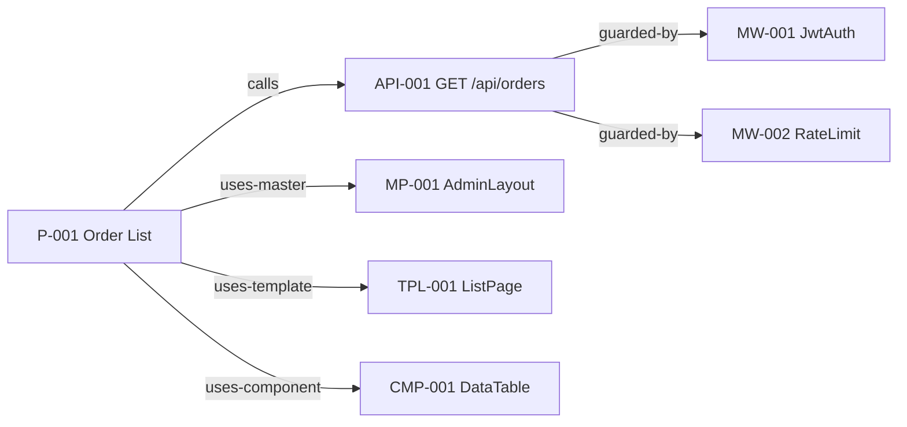
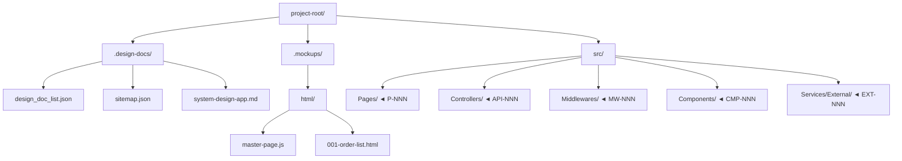
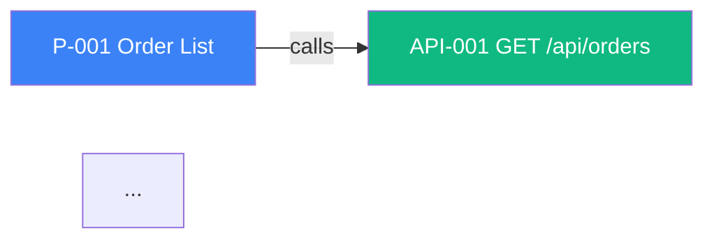
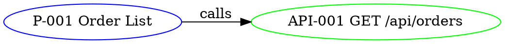

# system-design-doc v2.0 + sitemap.json Implementation Plan

> **For agentic workers:** REQUIRED SUB-SKILL: Use superpowers:subagent-driven-development (recommended) or superpowers:executing-plans to implement this plan task-by-task. Steps use checkbox (`- [ ]`) syntax for tracking.

**Goal:** Extend `system-design-doc` plugin to v2.0 with `sitemap.json` machine-readable schema (8 node types: Master/Template/Nav/Component + Page/API/Middleware/External Function), 8 new slash commands, 5 cross-validation rules (R31-R35), and Section 9 markdown expansion (9.4-9.9). Sub-project B (VS Code extension) is deferred to a separate plan.

**Architecture:** Two co-existing artifacts under `.design-docs/` — `system-design-X.md` remains the human-readable primary, `sitemap.json` (NEW) is a machine-readable mirror synced via `/sync-sitemap`. Downstream plugins (ui-mockup, long-running, qa-ui-test) and a future VS Code extension consume `sitemap.json`. JSON Schema (draft-07) governs the format, validated with `ajv-cli`.

**Tech Stack:** Markdown (docs/templates), JSON (data), JSON Schema draft-07 (validation), `ajv-cli` (schema validator, npm package), Bash/PowerShell (command examples), Mermaid (diagrams).

**Spec Reference:** `docs/superpowers/specs/2026-05-07-system-design-doc-vscode-design.md`

**Branch:** `feature/sitemap-graph-vscode` (already created — currently checked out)

---

## Phase 0 — Cleanup

### Task 1: Delete deprecated plugins

**Files:**
- Delete: `plugins/flow-monitor/` (entire directory)
- Delete: `plugins/flow-monitor-vscode/` (entire directory)
- Delete: `plugins/ai-ui-test/` (entire directory)

- [ ] **Step 1: Verify branch is `feature/sitemap-graph-vscode`**

Run: `git branch --show-current`
Expected: `feature/sitemap-graph-vscode`

If not on this branch, stop and switch: `git checkout feature/sitemap-graph-vscode`

- [ ] **Step 2: Verify deletion targets exist**

Run:
```bash
ls plugins/flow-monitor plugins/flow-monitor-vscode plugins/ai-ui-test
```
Expected: All three directories listed (no "No such file or directory")

- [ ] **Step 3: Remove plugin directories**

Run:
```bash
git rm -r plugins/flow-monitor
git rm -r plugins/flow-monitor-vscode
git rm -r plugins/ai-ui-test
```

Expected output: each command prints lines starting with `rm 'plugins/flow-monitor/...'`

- [ ] **Step 4: Verify staging area**

Run: `git status --short | head -20`
Expected: Only `D` (deleted) entries for the three plugin paths. No other unexpected changes.

- [ ] **Step 5: Commit**

```bash
git commit -m "chore: remove deprecated plugins (flow-monitor, flow-monitor-vscode, ai-ui-test)

flow-monitor and flow-monitor-vscode are superseded by the upcoming
VS Code extension (sub-project B). ai-ui-test is a duplicate of qa-ui-test.

Co-Authored-By: Claude Opus 4.7 (1M context) <noreply@anthropic.com>"
```

---

## Phase 1 — JSON Schema foundation

### Task 2: Set up ajv-cli for schema validation

**Files:**
- Create: `tests/sitemap/package.json`
- Create: `tests/sitemap/.gitignore`

- [ ] **Step 1: Create test directory**

Run:
```bash
mkdir -p tests/sitemap/fixtures
```

- [ ] **Step 2: Create `tests/sitemap/package.json`**

```json
{
  "name": "sitemap-schema-tests",
  "private": true,
  "version": "1.0.0",
  "description": "Schema validation harness for plugins/system-design-doc/skills/system-design-doc/references/sitemap-schema.json",
  "scripts": {
    "validate": "ajv -s ../../plugins/system-design-doc/skills/system-design-doc/references/sitemap-schema.json -d 'fixtures/valid/*.json' --strict=false",
    "validate-invalid": "ajv -s ../../plugins/system-design-doc/skills/system-design-doc/references/sitemap-schema.json -d 'fixtures/invalid/*.json' --strict=false; if [ $? -eq 0 ]; then echo 'FAIL: invalid fixtures should not validate'; exit 1; else echo 'PASS: invalid fixtures correctly rejected'; fi"
  },
  "devDependencies": {
    "ajv-cli": "^5.0.0"
  }
}
```

- [ ] **Step 3: Create `tests/sitemap/.gitignore`**

```
node_modules/
package-lock.json
```

- [ ] **Step 4: Install ajv-cli**

Run:
```bash
cd tests/sitemap && npm install
```

Expected: `ajv-cli` installed in `node_modules/`. No errors.

- [ ] **Step 5: Commit**

```bash
git add tests/sitemap/package.json tests/sitemap/.gitignore
git commit -m "test(sitemap): set up ajv-cli validation harness

Co-Authored-By: Claude Opus 4.7 (1M context) <noreply@anthropic.com>"
```

---

### Task 3: Write failing fixture before schema (TDD)

**Files:**
- Create: `tests/sitemap/fixtures/valid/minimal.json`
- Create: `tests/sitemap/fixtures/invalid/missing-schema-version.json`
- Create: `tests/sitemap/fixtures/invalid/orphan-edge.json`

- [ ] **Step 1: Create minimal valid fixture**

`tests/sitemap/fixtures/valid/minimal.json`:
```json
{
  "schema_version": "1.0.0",
  "design_doc_ref": "system-design-app.md",
  "project_name": "Test Project",
  "generated_at": "2026-05-07T10:30:00Z",
  "last_synced_at": "2026-05-07T10:30:00Z",
  "last_modified_by": "claude",
  "etag": "abc123",
  "workflow_stages": [
    { "id": "design", "name": "System Design", "owner_plugin": "system-design-doc", "order": 1 }
  ],
  "design_system": {
    "masters": [],
    "templates": [],
    "navs": [],
    "components": []
  },
  "application": {
    "pages": [],
    "apis": [],
    "middlewares": [],
    "external_functions": []
  },
  "edges": [],
  "sync_status": {
    "ui_mockup":    { "covered": 0, "gap": 0, "last_sync": "2026-05-07T10:30:00Z" },
    "long_running": { "covered": 0, "gap": 0, "last_sync": "2026-05-07T10:30:00Z" },
    "qa_tracker":   { "covered_acs": 0, "gap_acs": 0, "last_sync": "2026-05-07T10:30:00Z" }
  }
}
```

- [ ] **Step 2: Create invalid fixture — missing schema_version**

`tests/sitemap/fixtures/invalid/missing-schema-version.json`:
```json
{
  "design_doc_ref": "system-design-app.md",
  "project_name": "Test Project",
  "workflow_stages": [],
  "design_system": { "masters": [], "templates": [], "navs": [], "components": [] },
  "application": { "pages": [], "apis": [], "middlewares": [], "external_functions": [] },
  "edges": [],
  "sync_status": {
    "ui_mockup": { "covered": 0, "gap": 0 },
    "long_running": { "covered": 0, "gap": 0 },
    "qa_tracker": { "covered_acs": 0, "gap_acs": 0 }
  }
}
```

- [ ] **Step 3: Create invalid fixture — orphan edge**

`tests/sitemap/fixtures/invalid/orphan-edge.json`:
```json
{
  "schema_version": "1.0.0",
  "design_doc_ref": "system-design-app.md",
  "project_name": "Test Project",
  "generated_at": "2026-05-07T10:30:00Z",
  "last_synced_at": "2026-05-07T10:30:00Z",
  "last_modified_by": "claude",
  "etag": "abc123",
  "workflow_stages": [],
  "design_system": { "masters": [], "templates": [], "navs": [], "components": [] },
  "application": { "pages": [], "apis": [], "middlewares": [], "external_functions": [] },
  "edges": [
    { "from": "P-999", "to": "API-999", "type": "calls" }
  ],
  "sync_status": {
    "ui_mockup":    { "covered": 0, "gap": 0, "last_sync": "2026-05-07T10:30:00Z" },
    "long_running": { "covered": 0, "gap": 0, "last_sync": "2026-05-07T10:30:00Z" },
    "qa_tracker":   { "covered_acs": 0, "gap_acs": 0, "last_sync": "2026-05-07T10:30:00Z" }
  }
}
```

> Note: orphan edge cannot be caught by JSON Schema alone — it requires programmatic validator (R34, implemented in Task 9). Fixture stays here for downstream rule test.

- [ ] **Step 4: Verify schema does not exist yet (test should fail)**

Run from `tests/sitemap/`:
```bash
npm run validate
```

Expected: FAIL — `error: ENOENT` or similar (schema file does not exist yet)

- [ ] **Step 5: Commit fixtures**

```bash
git add tests/sitemap/fixtures/
git commit -m "test(sitemap): add valid + invalid fixtures (red phase)

Co-Authored-By: Claude Opus 4.7 (1M context) <noreply@anthropic.com>"
```

---

### Task 4: Implement sitemap-schema.json

**Files:**
- Create: `plugins/system-design-doc/skills/system-design-doc/references/sitemap-schema.json`

- [ ] **Step 1: Create schema file**

`plugins/system-design-doc/skills/system-design-doc/references/sitemap-schema.json`:
```json
{
  "$schema": "http://json-schema.org/draft-07/schema#",
  "title": "sitemap.json",
  "description": "Machine-readable sitemap mirror for system-design-doc v2.0+ — covers Design System (Master/Template/Nav/Component) + Application (Page/API/Middleware/External Function)",
  "type": "object",
  "required": [
    "schema_version", "design_doc_ref", "project_name",
    "generated_at", "last_synced_at", "last_modified_by", "etag",
    "workflow_stages", "design_system", "application", "edges", "sync_status"
  ],
  "properties": {
    "schema_version": { "type": "string", "pattern": "^\\d+\\.\\d+\\.\\d+$" },
    "design_doc_ref": { "type": "string", "minLength": 1 },
    "project_name":   { "type": "string", "minLength": 1 },
    "generated_at":   { "type": "string", "format": "date-time" },
    "last_synced_at": { "type": "string", "format": "date-time" },
    "last_modified_by": { "type": "string", "enum": ["user", "claude", "extension"] },
    "etag": { "type": "string", "minLength": 1 },

    "workflow_stages": {
      "type": "array",
      "items": {
        "type": "object",
        "required": ["id", "name", "owner_plugin", "order"],
        "properties": {
          "id":           { "type": "string", "pattern": "^[a-z][a-z0-9_-]*$" },
          "name":         { "type": "string", "minLength": 1 },
          "owner_plugin": { "type": "string", "minLength": 1 },
          "order":        { "type": "integer", "minimum": 1 }
        }
      }
    },

    "design_system": {
      "type": "object",
      "required": ["masters", "templates", "navs", "components"],
      "properties": {
        "masters":    { "type": "array", "items": { "$ref": "#/definitions/master" } },
        "templates":  { "type": "array", "items": { "$ref": "#/definitions/template" } },
        "navs":       { "type": "array", "items": { "$ref": "#/definitions/nav" } },
        "components": { "type": "array", "items": { "$ref": "#/definitions/component" } }
      }
    },

    "application": {
      "type": "object",
      "required": ["pages", "apis", "middlewares", "external_functions"],
      "properties": {
        "pages":              { "type": "array", "items": { "$ref": "#/definitions/page" } },
        "apis":               { "type": "array", "items": { "$ref": "#/definitions/api" } },
        "middlewares":        { "type": "array", "items": { "$ref": "#/definitions/middleware" } },
        "external_functions": { "type": "array", "items": { "$ref": "#/definitions/external_function" } }
      }
    },

    "edges": {
      "type": "array",
      "items": {
        "type": "object",
        "required": ["from", "to", "type"],
        "properties": {
          "from": { "$ref": "#/definitions/node_id" },
          "to":   { "$ref": "#/definitions/node_id" },
          "type": { "type": "string", "enum": [
            "calls", "guarded-by", "calls-external",
            "uses-master", "uses-template", "uses-component",
            "has-nav", "links-to"
          ] }
        }
      }
    },

    "sync_status": {
      "type": "object",
      "required": ["ui_mockup", "long_running", "qa_tracker"],
      "properties": {
        "ui_mockup":    { "$ref": "#/definitions/sync_block" },
        "long_running": { "$ref": "#/definitions/sync_block" },
        "qa_tracker": {
          "type": "object",
          "required": ["covered_acs", "gap_acs", "last_sync"],
          "properties": {
            "covered_acs": { "type": "integer", "minimum": 0 },
            "gap_acs":     { "type": "integer", "minimum": 0 },
            "last_sync":   { "type": "string", "format": "date-time" }
          }
        }
      }
    }
  },
  "definitions": {
    "node_id": { "type": "string", "pattern": "^(MP|TPL|NAV|CMP|P|API|MW|EXT)-\\d{3,}$" },

    "linked_artifacts": {
      "type": "object",
      "properties": {
        "mockups":          { "type": "array", "items": { "type": "string" } },
        "features":         { "type": "array", "items": { "type": "string" } },
        "qa_scenarios":     { "type": "array", "items": { "type": "string" } },
        "test_cases_count": { "type": "integer", "minimum": 0 },
        "code_files":       { "type": "array", "items": { "type": "string" } }
      }
    },

    "stage_status_entry": {
      "type": "object",
      "required": ["stage", "status"],
      "properties": {
        "stage":      { "type": "string" },
        "status":     { "type": "string", "enum": ["not-started", "in-progress", "done", "blocked", "ready", "n/a"] },
        "progress":   { "type": "number", "minimum": 0, "maximum": 1 },
        "passed":     { "type": "integer", "minimum": 0 },
        "total":      { "type": "integer", "minimum": 0 },
        "blocked_by": { "type": "string" }
      }
    },

    "available_action": {
      "type": "object",
      "required": ["label", "command"],
      "properties": {
        "label":   { "type": "string", "minLength": 1 },
        "command": { "type": "string", "minLength": 1 }
      }
    },

    "sync_block": {
      "type": "object",
      "required": ["covered", "gap", "last_sync"],
      "properties": {
        "covered":   { "type": "integer", "minimum": 0 },
        "gap":       { "type": "integer", "minimum": 0 },
        "last_sync": { "type": "string", "format": "date-time" }
      }
    },

    "master": {
      "type": "object",
      "required": ["id", "name"],
      "properties": {
        "id":          { "type": "string", "pattern": "^MP-\\d{3,}$" },
        "name":        { "type": "string", "minLength": 1 },
        "description": { "type": "string" },
        "source_file": { "type": "string" },
        "css_file":    { "type": "string" },
        "regions":     { "type": "array", "items": { "type": "string" } },
        "linked_artifacts": { "$ref": "#/definitions/linked_artifacts" }
      }
    },

    "template": {
      "type": "object",
      "required": ["id", "name"],
      "properties": {
        "id":            { "type": "string", "pattern": "^TPL-\\d{3,}$" },
        "name":          { "type": "string", "minLength": 1 },
        "description":   { "type": "string" },
        "uses_master":   { "type": "string", "pattern": "^MP-\\d{3,}$" },
        "default_components": { "type": "array", "items": { "type": "string", "pattern": "^CMP-\\d{3,}$" } },
        "source_file":   { "type": "string" }
      }
    },

    "nav": {
      "type": "object",
      "required": ["id", "name", "type"],
      "properties": {
        "id":   { "type": "string", "pattern": "^NAV-\\d{3,}$" },
        "name": { "type": "string", "minLength": 1 },
        "type": { "type": "string", "enum": ["sidebar", "navbar", "breadcrumb", "tabs", "footer"] },
        "items": {
          "type": "array",
          "items": {
            "type": "object",
            "required": ["label"],
            "properties": {
              "label":    { "type": "string" },
              "url":      { "type": "string" },
              "page_ref": { "type": "string", "pattern": "^P-\\d{3,}$" }
            }
          }
        },
        "source_file": { "type": "string" }
      }
    },

    "component": {
      "type": "object",
      "required": ["id", "name"],
      "properties": {
        "id":            { "type": "string", "pattern": "^CMP-\\d{3,}$" },
        "name":          { "type": "string", "minLength": 1 },
        "category":      { "type": "string" },
        "props_schema":  { "type": "object" },
        "source_file":   { "type": "string" },
        "used_by_pages": { "type": "array", "items": { "type": "string", "pattern": "^P-\\d{3,}$" } }
      }
    },

    "page": {
      "type": "object",
      "required": ["id", "name", "url"],
      "properties": {
        "id":              { "type": "string", "pattern": "^P-\\d{3,}$" },
        "name":            { "type": "string", "minLength": 1 },
        "url":             { "type": "string" },
        "access_level":    { "type": "string" },
        "uses_master":     { "type": "string", "pattern": "^MP-\\d{3,}$" },
        "uses_template":   { "type": "string", "pattern": "^TPL-\\d{3,}$" },
        "uses_components": { "type": "array", "items": { "type": "string", "pattern": "^CMP-\\d{3,}$" } },
        "calls_apis":      { "type": "array", "items": { "type": "string", "pattern": "^API-\\d{3,}$" } },
        "ac_refs":         { "type": "array", "items": { "type": "string", "pattern": "^AC-\\d{3,}$" } },
        "uc_refs":         { "type": "array", "items": { "type": "string", "pattern": "^UC-\\d{3,}$" } },
        "source_file":     { "type": "string" },
        "linked_artifacts": { "$ref": "#/definitions/linked_artifacts" },
        "stage_status":     { "type": "array", "items": { "$ref": "#/definitions/stage_status_entry" } },
        "available_actions":{ "type": "array", "items": { "$ref": "#/definitions/available_action" } }
      }
    },

    "api": {
      "type": "object",
      "required": ["id", "method", "path"],
      "properties": {
        "id":              { "type": "string", "pattern": "^API-\\d{3,}$" },
        "method":          { "type": "string", "enum": ["GET", "POST", "PUT", "PATCH", "DELETE", "HEAD", "OPTIONS", "WS"] },
        "path":            { "type": "string", "minLength": 1 },
        "controller":      { "type": "string" },
        "auth_required":   { "type": "boolean" },
        "middlewares":     { "type": "array", "items": { "type": "string", "pattern": "^MW-\\d{3,}$" } },
        "calls_external":  { "type": "array", "items": { "type": "string", "pattern": "^EXT-\\d{3,}$" } },
        "called_by_pages": { "type": "array", "items": { "type": "string", "pattern": "^P-\\d{3,}$" } },
        "request_schema":  { "type": "object" },
        "response_schema": { "type": "object" },
        "source_file":     { "type": "string" },
        "linked_artifacts": { "$ref": "#/definitions/linked_artifacts" },
        "stage_status":     { "type": "array", "items": { "$ref": "#/definitions/stage_status_entry" } }
      }
    },

    "middleware": {
      "type": "object",
      "required": ["id", "name", "type"],
      "properties": {
        "id":          { "type": "string", "pattern": "^MW-\\d{3,}$" },
        "name":        { "type": "string", "minLength": 1 },
        "type":        { "type": "string", "enum": ["auth", "rate-limit", "logging", "cors", "validation", "compression", "exception-handler", "other"] },
        "applies_to":  { "type": "string" },
        "order":       { "type": "integer" },
        "source_file": { "type": "string" },
        "linked_artifacts": { "$ref": "#/definitions/linked_artifacts" }
      }
    },

    "external_function": {
      "type": "object",
      "required": ["id", "name", "kind"],
      "properties": {
        "id":            { "type": "string", "pattern": "^EXT-\\d{3,}$" },
        "name":          { "type": "string", "minLength": 1 },
        "kind":          { "type": "string", "enum": ["3rd-party-api", "webhook-out", "webhook-in", "cron", "queue", "cloud-function"] },
        "provider":      { "type": "string" },
        "auth_method":   { "type": "string" },
        "called_by_apis": { "type": "array", "items": { "type": "string", "pattern": "^API-\\d{3,}$" } },
        "linked_artifacts": { "$ref": "#/definitions/linked_artifacts" }
      }
    }
  }
}
```

- [ ] **Step 2: Run validator on valid fixture (should now pass)**

Run from `tests/sitemap/`:
```bash
npm run validate
```

Expected: `fixtures/valid/minimal.json valid`

- [ ] **Step 3: Run validator on invalid `missing-schema-version.json` fixture (should fail)**

Run from `tests/sitemap/`:
```bash
npx ajv -s ../../plugins/system-design-doc/skills/system-design-doc/references/sitemap-schema.json -d 'fixtures/invalid/missing-schema-version.json' --strict=false
```

Expected: Validation error mentioning `schema_version` is required.

- [ ] **Step 4: Run validator on invalid `orphan-edge.json` fixture (should pass schema, fail R34 later)**

Run from `tests/sitemap/`:
```bash
npx ajv -s ../../plugins/system-design-doc/skills/system-design-doc/references/sitemap-schema.json -d 'fixtures/invalid/orphan-edge.json' --strict=false
```

Expected: `valid` — confirms orphan-edge passes schema (caught by R34 programmatic validator later).

- [ ] **Step 5: Commit**

```bash
git add plugins/system-design-doc/skills/system-design-doc/references/sitemap-schema.json
git commit -m "feat(sitemap): add JSON Schema draft-07 for sitemap.json

Defines 8 node types (Master/Template/Nav/Component + Page/API/Middleware/External),
workflow_stages, edges, sync_status. ID prefix patterns enforced via regex.

Co-Authored-By: Claude Opus 4.7 (1M context) <noreply@anthropic.com>"
```

---

## Phase 2 — Templates

### Task 5: Create sitemap-template.json (empty starter)

**Files:**
- Create: `plugins/system-design-doc/skills/system-design-doc/templates/sitemap-template.json`

- [ ] **Step 1: Create template**

`plugins/system-design-doc/skills/system-design-doc/templates/sitemap-template.json`:
```json
{
  "schema_version": "1.0.0",
  "design_doc_ref": "system-design-{PROJECT_SLUG}.md",
  "project_name": "{PROJECT_NAME}",
  "generated_at": "{ISO_TIMESTAMP}",
  "last_synced_at": "{ISO_TIMESTAMP}",
  "last_modified_by": "claude",
  "etag": "{INITIAL_ETAG}",
  "workflow_stages": [
    { "id": "design",  "name": "System Design",  "owner_plugin": "system-design-doc", "order": 1 },
    { "id": "mockup",  "name": "UI Mockup",      "owner_plugin": "ui-mockup",         "order": 2 },
    { "id": "code",    "name": "Implementation", "owner_plugin": "long-running",      "order": 3 },
    { "id": "qa",      "name": "QA Testing",     "owner_plugin": "qa-ui-test",        "order": 4 },
    { "id": "release", "name": "Release Gate",   "owner_plugin": "long-running",      "order": 5 }
  ],
  "design_system": {
    "masters":    [],
    "templates":  [],
    "navs":       [],
    "components": []
  },
  "application": {
    "pages":              [],
    "apis":               [],
    "middlewares":        [],
    "external_functions": []
  },
  "edges": [],
  "sync_status": {
    "ui_mockup":    { "covered": 0, "gap": 0, "last_sync": "{ISO_TIMESTAMP}" },
    "long_running": { "covered": 0, "gap": 0, "last_sync": "{ISO_TIMESTAMP}" },
    "qa_tracker":   { "covered_acs": 0, "gap_acs": 0, "last_sync": "{ISO_TIMESTAMP}" }
  }
}
```

- [ ] **Step 2: Validate template against schema (after substituting placeholders)**

Run:
```bash
cd tests/sitemap
node -e "
const t = require('../../plugins/system-design-doc/skills/system-design-doc/templates/sitemap-template.json');
const s = JSON.stringify(t)
  .replace(/\\{PROJECT_SLUG\\}/g, 'test')
  .replace(/\\{PROJECT_NAME\\}/g, 'Test')
  .replace(/\\{ISO_TIMESTAMP\\}/g, '2026-05-07T10:30:00Z')
  .replace(/\\{INITIAL_ETAG\\}/g, 'init');
require('fs').writeFileSync('fixtures/valid/template-substituted.json', s);
"
npm run validate
```

Expected: `fixtures/valid/template-substituted.json valid` and `fixtures/valid/minimal.json valid`

- [ ] **Step 3: Cleanup substituted file**

Run: `rm tests/sitemap/fixtures/valid/template-substituted.json`

- [ ] **Step 4: Commit**

```bash
git add plugins/system-design-doc/skills/system-design-doc/templates/sitemap-template.json
git commit -m "feat(sitemap): add sitemap-template.json starter

Pre-filled workflow_stages (5 stages) + empty node arrays.
Placeholders: {PROJECT_SLUG}, {PROJECT_NAME}, {ISO_TIMESTAMP}, {INITIAL_ETAG}.

Co-Authored-By: Claude Opus 4.7 (1M context) <noreply@anthropic.com>"
```

---

### Task 6: Expand `design-doc-template.md` Section 9 (9.4-9.9)

**Files:**
- Modify: `plugins/system-design-doc/skills/system-design-doc/templates/design-doc-template.md` (around line 605, after Section 9.3)

- [ ] **Step 1: Open template, locate insertion point**

Read file `plugins/system-design-doc/skills/system-design-doc/templates/design-doc-template.md` lines 600-615 to confirm exact location after Section 9.3 (Navigation Structure).

- [ ] **Step 2: Insert Section 9.4-9.9 between Section 9.3 and Section 10**

Use Edit tool. Find the exact text:
```
**User Menu**:
- Profile
- Settings
- Logout

---

## 10. User Roles & Permissions
```

Replace with:
```
**User Menu**:
- Profile
- Settings
- Logout

---

### 9.4 Design System Inventory

> **Source of truth**: `.design-docs/sitemap.json` `design_system` block.
> **Sync command**: `/sync-sitemap`

#### 9.4.1 Master Pages

| ID | Name | Description | Source File |
|----|------|-------------|-------------|
| MP-001 | AdminLayout | Sidebar + topbar + profile chrome | `.mockups/html/master-page.js` |

#### 9.4.2 Page Templates

| ID | Name | Uses Master | Default Components |
|----|------|-------------|--------------------|
| TPL-001 | ListPage | MP-001 | CMP-001, CMP-002 |

#### 9.4.3 Nav Templates

| ID | Name | Type | Items |
|----|------|------|-------|
| NAV-001 | PrimarySidebar | sidebar | Dashboard, Orders, Reports |

#### 9.4.4 Components

| ID | Name | Category | Source File |
|----|------|----------|-------------|
| CMP-001 | DataTable | data-display | `src/Components/DataTable.tsx` |

---

### 9.5 API Inventory (flat unified list)

> Mirror of `application.apis` in `sitemap.json`. Section 3.3 (Module APIs) groups APIs by module for human reading; this section is the flat machine-readable inventory.

| ID | Method | Path | Controller | Auth | Middlewares |
|----|--------|------|------------|------|-------------|
| API-001 | GET | /api/orders | OrdersController.GetAll | ✓ | MW-001, MW-002 |

---

### 9.6 Middleware Inventory

| ID | Name | Type | Applies To | Order |
|----|------|------|------------|-------|
| MW-001 | JwtAuth | auth | all-api-except-public | 1 |
| MW-002 | RateLimit | rate-limit | all-api | 2 |

---

### 9.7 External Functions Inventory

| ID | Name | Kind | Provider | Auth Method |
|----|------|------|----------|-------------|
| EXT-001 | Stripe Charge | 3rd-party-api | Stripe | api-key |

---

### 9.8 Node Relationships



**Edge Table** (auto-extracted by `/sitemap-graph`):

| From | To | Type |
|------|-----|------|
| P-001 | API-001 | calls |
| API-001 | MW-001 | guarded-by |
| API-001 | MW-002 | guarded-by |
| P-001 | MP-001 | uses-master |
| P-001 | TPL-001 | uses-template |
| P-001 | CMP-001 | uses-component |

---

### 9.9 File Structure Map



**File-to-Node Mapping** (auto-extracted from `source_file` fields):

| Path | Node IDs |
|------|----------|
| `.mockups/html/master-page.js` | MP-001 |
| `src/Pages/OrderListPage.tsx` | P-001 |
| `src/Controllers/OrdersController.cs` | API-001 |
| `src/Middlewares/JwtAuthMiddleware.cs` | MW-001 |
| `src/Components/DataTable.tsx` | CMP-001 |

---

## 10. User Roles & Permissions
```

- [ ] **Step 3: Verify edit applied**

Run:
```bash
grep -n "9.9 File Structure Map" plugins/system-design-doc/skills/system-design-doc/templates/design-doc-template.md
```
Expected: One line match showing the line number.

- [ ] **Step 4: Commit**

```bash
git add plugins/system-design-doc/skills/system-design-doc/templates/design-doc-template.md
git commit -m "feat(template): expand Section 9 with sub-sections 9.4-9.9

Adds Design System Inventory, API/Middleware/External Functions Inventories,
Node Relationships (Mermaid + edge table), and File Structure Map.

Co-Authored-By: Claude Opus 4.7 (1M context) <noreply@anthropic.com>"
```

---

## Phase 3 — Reference docs

### Task 7: Create node-types.md reference

**Files:**
- Create: `plugins/system-design-doc/skills/system-design-doc/references/node-types.md`

- [ ] **Step 1: Create reference document**

`plugins/system-design-doc/skills/system-design-doc/references/node-types.md`:
````markdown
# sitemap.json — 8 Node Types Reference

> **Schema source**: `references/sitemap-schema.json`
> **Spec**: `docs/superpowers/specs/2026-05-07-system-design-doc-vscode-design.md`

---

## Two Layers

| Layer | Purpose |
|-------|---------|
| **Design System** | Reusable building blocks (Master/Template/Nav/Component) |
| **Application** | Concrete instances (Page/API/Middleware/External Function) |

## ID Prefixes

| Prefix | Type | Layer |
|--------|------|-------|
| `MP-NNN`  | Master Page | Design System |
| `TPL-NNN` | Page Template | Design System |
| `NAV-NNN` | Nav Template | Design System |
| `CMP-NNN` | Component | Design System |
| `P-NNN`   | Page | Application |
| `API-NNN` | API Endpoint | Application |
| `MW-NNN`  | Middleware | Application |
| `EXT-NNN` | External Function | Application |

All IDs use 3-digit zero-padded format (consistent with existing AC-NNN / UC-NNN).

---

## Layer 1 — Design System

### Master Page (MP-NNN)
Overall chrome shared across pages: sidebar + topbar + profile + footer.

```json
{
  "id": "MP-001",
  "name": "AdminLayout",
  "description": "Sidebar + topbar + profile dropdown chrome for authenticated admin pages",
  "source_file": ".mockups/html/master-page.js",
  "css_file": ".mockups/html/master-page.css",
  "regions": ["sidebar", "topbar", "main", "profile"]
}
```

### Page Template (TPL-NNN)
Page archetype that pages instantiate (ListPage, DetailPage, FormPage, DashboardPage).

```json
{
  "id": "TPL-001",
  "name": "ListPage",
  "uses_master": "MP-001",
  "default_components": ["CMP-001", "CMP-002"]
}
```

### Nav Template (NAV-NNN)
Navigation pattern (`type` ∈ sidebar | navbar | breadcrumb | tabs | footer).

```json
{
  "id": "NAV-001",
  "name": "PrimarySidebar",
  "type": "sidebar",
  "items": [
    { "label": "Orders", "url": "/orders", "page_ref": "P-001" }
  ]
}
```

### Component (CMP-NNN)
Reusable UI building block.

```json
{
  "id": "CMP-001",
  "name": "DataTable",
  "category": "data-display",
  "props_schema": { "columns": "ColumnDef[]", "data": "T[]" }
}
```

---

## Layer 2 — Application

### Page (P-NNN)
Concrete page instance — must reference a Master + Template + Components.

Required fields: `id`, `name`, `url`.
Optional cross-refs: `uses_master` (MP-), `uses_template` (TPL-), `uses_components[]` (CMP-),
`calls_apis[]` (API-), `ac_refs[]` (AC-), `uc_refs[]` (UC-).

Drilldown payload (`linked_artifacts`):
- `mockups`: paths to mockup files
- `features`: refs into `feature_list.json`
- `qa_scenarios`: refs into `qa-tracker.json`
- `test_cases_count`: integer count
- `code_files`: paths to source code

Sequence/pipeline payload (`stage_status[]`): one entry per applicable stage from `workflow_stages`.

### API Endpoint (API-NNN)
Internal HTTP/WS endpoint.

Required: `id`, `method` (GET/POST/PUT/PATCH/DELETE/HEAD/OPTIONS/WS), `path`.
Cross-refs: `middlewares[]` (MW-), `calls_external[]` (EXT-), `called_by_pages[]` (P-).

### Middleware (MW-NNN)
Cross-cutting pipeline component.

Required: `id`, `name`, `type` (auth | rate-limit | logging | cors | validation | compression | exception-handler | other).

### External Function (EXT-NNN)
3rd-party / out-of-system function.

Required: `id`, `name`, `kind` (3rd-party-api | webhook-out | webhook-in | cron | queue | cloud-function).

---

## Edge Types

| Type | From → To | Meaning |
|------|-----------|---------|
| `calls` | Page → API | Page invokes API |
| `guarded-by` | API → Middleware | Middleware applied to API |
| `calls-external` | API → External | API calls external service |
| `uses-master` | Page → Master | Page uses chrome |
| `uses-template` | Page → Template | Page is instance of template |
| `uses-component` | Page → Component | Page uses component |
| `has-nav` | Master → Nav | Master contains nav |
| `links-to` | Nav → Page | Nav item links to page |

---

## See Also

- `references/sitemap-schema.json` — full JSON Schema
- `references/sitemap-validation-rules.md` — R31-R35 + integration rules
- `templates/sitemap-template.json` — empty starter
````

- [ ] **Step 2: Commit**

```bash
git add plugins/system-design-doc/skills/system-design-doc/references/node-types.md
git commit -m "docs(sitemap): add 8 node types reference

Co-Authored-By: Claude Opus 4.7 (1M context) <noreply@anthropic.com>"
```

---

### Task 8: Create sitemap-validation-rules.md

**Files:**
- Create: `plugins/system-design-doc/skills/system-design-doc/references/sitemap-validation-rules.md`

- [ ] **Step 1: Create rules document**

`plugins/system-design-doc/skills/system-design-doc/references/sitemap-validation-rules.md`:
```markdown
# sitemap.json Validation Rules

> Cross-validation rules for `.design-docs/sitemap.json` — extends R1-R30 from `SKILL.md`.

---

## Schema-level (enforced by `references/sitemap-schema.json`)

- Root must include all required top-level fields (schema_version, design_doc_ref, project_name, generated_at, last_synced_at, last_modified_by, etag, workflow_stages, design_system, application, edges, sync_status)
- All node IDs must match prefix pattern: `(MP|TPL|NAV|CMP|P|API|MW|EXT)-\d{3,}`
- All cross-references (uses_master, uses_template, calls_apis, etc.) must match correct prefix pattern
- Edge `type` ∈ {calls, guarded-by, calls-external, uses-master, uses-template, uses-component, has-nav, links-to}
- `last_modified_by` ∈ {user, claude, extension}

---

## Programmatic rules (R31-R35)

Each rule has a severity level and check description. Implement in `/sitemap-validate`.

### R31 — Page must declare design system membership
**Severity**: warn (or error if any Design System nodes exist in sitemap)
**Check**:
```
For each page in application.pages:
  If sitemap.design_system has any masters/templates/navs/components:
    Assert page.uses_master is set → else ERROR
    Assert page.uses_template is set → else WARN
  Else:
    All Page DS fields are optional
```
**Reason**: Once a project adopts a Design System, every Page should declare its membership for consistency.

### R32 — API mirror consistency (sitemap ↔ md Section 3.3)
**Severity**: error
**Check**:
```
Parse Section 3.3 of design_doc_ref → extract list of (method, path) tuples → MD_APIS
For each api in application.apis:
  Assert (api.method, api.path) ∈ MD_APIS → else ERROR (sitemap has API not in md)
For each md_api in MD_APIS:
  Assert ∃ api in application.apis with (api.method, api.path) == md_api → else ERROR (md has API not in sitemap)
```
**Reason**: Section 3.3 is the human-readable source for module-grouped APIs; Section 9.5 / sitemap is the flat machine source. Both must match.

### R33 — source_file existence
**Severity**: warn (default), error (with `--strict`)
**Check**:
```
For each node with source_file field set:
  Assert file exists at workspace_root/source_file → else WARN/ERROR
```
**Reason**: Stale references degrade navigation/extension UX.

### R34 — No orphan edges
**Severity**: error
**Check**:
```
all_node_ids = union of all node.id from design_system.* and application.*
For each edge in edges:
  Assert edge.from ∈ all_node_ids → else ERROR
  Assert edge.to ∈ all_node_ids → else ERROR
```
**Reason**: Orphan edges break graph rendering and indicate stale data.

### R35 — Cross-doc artifact integrity
**Severity**: error
**Check**:
```
For each page in application.pages:
  For each mockup_path in page.linked_artifacts.mockups (if any):
    Parse mockup_list.json (if exists)
    Assert mockup_path ∈ mockup_list entries → else ERROR

  For each feature_ref in page.linked_artifacts.features (if any):
    Parse feature_list.json
    feature_id = feature_ref.split('#')[1]
    Assert feature_id ∈ feature_list IDs → else ERROR

  For each qa_ref in page.linked_artifacts.qa_scenarios (if any):
    Parse qa-tracker.json
    scenario_id = qa_ref.split('#')[1]
    Assert scenario_id ∈ qa-tracker scenarios → else ERROR
```
**Reason**: Cross-doc references must stay valid; broken refs cause drilldown failures.

---

## Integration with `/validate-design-doc`

When running `/validate-design-doc`, R31-R35 are appended to existing R1-R30 checks. Output:

```
Design Doc Validation:
  ✓ R1-R30 ........... 30 passed
  ✓ R31 (DS membership): 12 pages OK
  ✓ R32 (API mirror):    8 APIs match md ↔ sitemap
  ⚠ R33 (source_file):   2 stale references (src/Old.tsx, src/Removed.cs)
  ✓ R34 (orphan edge):   0 orphans
  ✗ R35 (artifact link): 1 broken — P-005.linked_artifacts.qa_scenarios has "qa-tracker.json#OLD-001" not found

Result: FAIL (1 error, 2 warnings)
```
```

- [ ] **Step 2: Commit**

```bash
git add plugins/system-design-doc/skills/system-design-doc/references/sitemap-validation-rules.md
git commit -m "docs(sitemap): add R31-R35 cross-validation rules reference

Co-Authored-By: Claude Opus 4.7 (1M context) <noreply@anthropic.com>"
```

---

## Phase 4 — Commands

### Task 9: Create `/sitemap-init` + `/sitemap-add-node` + `/sitemap-link` commands

**Files:**
- Create: `plugins/system-design-doc/commands/sitemap-init.md`
- Create: `plugins/system-design-doc/commands/sitemap-add-node.md`
- Create: `plugins/system-design-doc/commands/sitemap-link.md`

- [ ] **Step 1: Create `/sitemap-init`**

`plugins/system-design-doc/commands/sitemap-init.md`:
````markdown
---
description: Initialize .design-docs/sitemap.json from template
allowed-tools: Bash(*), Read(*), Write(*), Edit(*), Glob(*), Grep(*)
---

# /sitemap-init

Create a new `.design-docs/sitemap.json` from `templates/sitemap-template.json`, substituting placeholders with project metadata.

## Usage

```
/sitemap-init
/sitemap-init --project-name "HR Management"
/sitemap-init --force      # overwrite existing
```

## Process

### Step 1: Pre-flight checks
```bash
# Check if .design-docs exists
test -d .design-docs || { echo "ERROR: .design-docs/ does not exist. Run /create-design-doc first."; exit 1; }

# Check if sitemap.json already exists
if [ -f .design-docs/sitemap.json ] && [ -z "$FORCE" ]; then
  echo "ERROR: .design-docs/sitemap.json already exists. Pass --force to overwrite."
  exit 1
fi
```

### Step 2: Resolve project metadata
1. If `--project-name` not given, read `.design-docs/design_doc_list.json` and use `documents[0].project_name`
2. Compute `project_slug` = lowercase + replace spaces with `-`
3. Compute `iso_timestamp` = current UTC time in ISO 8601
4. Compute `etag` = first 8 hex chars of SHA-256(`project_slug + iso_timestamp`)

### Step 3: Substitute template

Read `${CLAUDE_PLUGIN_ROOT}/skills/system-design-doc/templates/sitemap-template.json`, replace:
- `{PROJECT_SLUG}` → resolved slug
- `{PROJECT_NAME}` → resolved name
- `{ISO_TIMESTAMP}` → resolved timestamp
- `{INITIAL_ETAG}` → resolved etag

Write result to `.design-docs/sitemap.json`.

### Step 4: Validate output

```bash
# Schema validation
npx ajv -s ${CLAUDE_PLUGIN_ROOT}/skills/system-design-doc/references/sitemap-schema.json \
  -d .design-docs/sitemap.json --strict=false
```

Expected: `valid`

### Step 5: Output

```
✅ สร้าง .design-docs/sitemap.json สำเร็จ

📁 File: .design-docs/sitemap.json
📋 Project: {PROJECT_NAME}
🔖 Schema: 1.0.0
🏷️  ETag: {etag}

💡 Next steps:
  /sitemap-scan         → Auto-scan codebase to populate nodes
  /sitemap-add-node     → Add nodes manually
  /sync-sitemap         → Sync with md Section 9
```

> 💬 Note: Responds in Thai.
````

- [ ] **Step 2: Create `/sitemap-add-node`**

`plugins/system-design-doc/commands/sitemap-add-node.md`:
````markdown
---
description: Add a new node (page/api/middleware/external/master/template/nav/component) to sitemap.json
allowed-tools: Bash(*), Read(*), Write(*), Edit(*), Glob(*), Grep(*)
---

# /sitemap-add-node

Add a new node to `.design-docs/sitemap.json` and assign next-available ID.

## Usage

```
/sitemap-add-node page name="Order List" url="/orders" access_level="User"
/sitemap-add-node api  method="GET" path="/api/orders" controller="OrdersController.GetAll"
/sitemap-add-node middleware name="JwtAuth" type="auth" applies_to="all-api"
/sitemap-add-node external name="Stripe Charge" kind="3rd-party-api" provider="Stripe"
/sitemap-add-node master name="AdminLayout" source_file=".mockups/html/master-page.js"
/sitemap-add-node template name="ListPage" uses_master="MP-001"
/sitemap-add-node nav name="PrimarySidebar" type="sidebar"
/sitemap-add-node component name="DataTable" category="data-display"
```

## Process

### Step 1: Parse arguments
- First positional arg = node type ∈ {page, api, middleware, external, master, template, nav, component}
- Remaining = `key=value` pairs → field assignments

### Step 2: Resolve next ID
Map node type → ID prefix:

| Type | Prefix | Array path |
|------|--------|-----------|
| page | P- | `application.pages` |
| api | API- | `application.apis` |
| middleware | MW- | `application.middlewares` |
| external | EXT- | `application.external_functions` |
| master | MP- | `design_system.masters` |
| template | TPL- | `design_system.templates` |
| nav | NAV- | `design_system.navs` |
| component | CMP- | `design_system.components` |

```
existing_ids = all id values in target array
next_num = max(parse last 3 digits) + 1 (or 001 if empty)
new_id = "{PREFIX}-{next_num zero-padded to 3 digits}"
```

### Step 3: Construct node object
- Set `id` = resolved ID
- Set required fields from args
- Validate against `references/sitemap-schema.json` definition (`#/definitions/<type>`)

If validation fails → print error + exit (do not write file).

### Step 4: Append + update metadata
- Append node to target array
- Update `last_synced_at` = now
- Update `last_modified_by` = "claude"
- Recompute `etag`

### Step 5: Write + re-validate full file

```bash
npx ajv -s ${CLAUDE_PLUGIN_ROOT}/skills/system-design-doc/references/sitemap-schema.json \
  -d .design-docs/sitemap.json --strict=false
```

### Step 6: Output

```
✅ Added P-005 "Customer Detail" → application.pages

📊 Sitemap stats:
   Pages: 5 · APIs: 8 · Middlewares: 3 · External: 2
   Design System: 1M / 2T / 1N / 5C

💡 Next: /sitemap-link from=P-005 to=API-008 type=calls
```

> 💬 Note: Responds in Thai.
````

- [ ] **Step 3: Create `/sitemap-link`**

`plugins/system-design-doc/commands/sitemap-link.md`:
````markdown
---
description: Add an edge between two nodes in sitemap.json
allowed-tools: Bash(*), Read(*), Write(*), Edit(*), Glob(*), Grep(*)
---

# /sitemap-link

Add an edge to `edges[]` array in `.design-docs/sitemap.json`.

## Usage

```
/sitemap-link from=P-001 to=API-001 type=calls
/sitemap-link from=API-001 to=MW-001 type=guarded-by
/sitemap-link from=API-005 to=EXT-001 type=calls-external
/sitemap-link from=P-001 to=MP-001 type=uses-master
```

## Edge type validation

`type` must be one of:
| type | from prefix | to prefix |
|------|-------------|-----------|
| `calls` | P- | API- |
| `guarded-by` | API- | MW- |
| `calls-external` | API- | EXT- |
| `uses-master` | P-, TPL- | MP- |
| `uses-template` | P- | TPL- |
| `uses-component` | P-, TPL- | CMP- |
| `has-nav` | MP- | NAV- |
| `links-to` | NAV- | P- |

## Process

### Step 1: Parse arguments
Extract `from`, `to`, `type` from `key=value` args.

### Step 2: Validate prefix combination
Check from/to prefixes against type table above. Reject if invalid.

### Step 3: Validate node existence
Read sitemap.json. Confirm both `from` and `to` exist in `design_system.*` or `application.*`. Reject if not found.

### Step 4: Check duplicate
Reject if `{from, to, type}` already exists in `edges[]`.

### Step 5: Append + sync cross-ref fields (best-effort)
For convenience, also update relevant cross-ref fields on the source node:
- `type=calls` → push `to` into `pages[].calls_apis`
- `type=guarded-by` → push `to` into `apis[].middlewares`
- `type=calls-external` → push `to` into `apis[].calls_external`
- `type=uses-master` → set `pages[].uses_master = to`
- `type=uses-template` → set `pages[].uses_template = to`
- `type=uses-component` → push `to` into `pages[].uses_components`

### Step 6: Update metadata + write + validate

### Step 7: Output

```
✅ Edge added: P-001 --calls--> API-001

📊 Edges: 12 total (4 calls, 3 guarded-by, 2 uses-master, ...)
```

> 💬 Note: Responds in Thai.
````

- [ ] **Step 4: Commit**

```bash
git add plugins/system-design-doc/commands/sitemap-init.md plugins/system-design-doc/commands/sitemap-add-node.md plugins/system-design-doc/commands/sitemap-link.md
git commit -m "feat(sitemap): add /sitemap-init, /sitemap-add-node, /sitemap-link commands

Co-Authored-By: Claude Opus 4.7 (1M context) <noreply@anthropic.com>"
```

---

### Task 10: Create `/sitemap-scan` + `/sync-sitemap` + `/sitemap-validate`

**Files:**
- Create: `plugins/system-design-doc/commands/sitemap-scan.md`
- Create: `plugins/system-design-doc/commands/sync-sitemap.md`
- Create: `plugins/system-design-doc/commands/sitemap-validate.md`

- [ ] **Step 1: Create `/sitemap-scan`**

`plugins/system-design-doc/commands/sitemap-scan.md`:
````markdown
---
description: Auto-scan codebase to populate sitemap.json nodes
allowed-tools: Bash(*), Read(*), Write(*), Edit(*), Glob(*), Grep(*), Agent(*)
---

# /sitemap-scan

Auto-discover Pages / APIs / Middlewares / External Functions / Components from codebase and populate `.design-docs/sitemap.json`.

Inherits framework detection logic from `/reverse-engineer` (see `references/codebase-analysis.md`).

## Usage

```
/sitemap-scan                          # full scan
/sitemap-scan --types page,api          # only specific types
/sitemap-scan --dry-run                 # show what would be added without writing
```

## Process

### Step 1: Pre-flight
- Assert `.design-docs/sitemap.json` exists (if not, suggest `/sitemap-init`)
- Detect framework (`.csproj` → .NET, `package.json` → Node, etc.)

### Step 2: Discover by type

For each requested type, run framework-specific discovery:

| Type | .NET pattern | Node pattern | Python pattern |
|------|--------------|--------------|----------------|
| page | `**/Pages/*.razor`, `**/Views/*.cshtml`, `**/*Page.tsx` | `pages/**/*.tsx`, `app/**/page.tsx` | `templates/**/*.html` |
| api | `**/Controllers/*.cs` (actions) | `routes/**/*.js`, `app/api/**/route.ts` | `**/views.py`, `**/urls.py` |
| middleware | `**/Middlewares/*.cs` | `middlewares/**/*.js` | `**/middleware.py` |
| external | `**/Services/External/*.cs`, IHttpClient | `lib/clients/**/*.ts` | `**/clients/*.py` |
| component | `**/Components/*.tsx`, `*.razor` | `components/**/*.tsx` | n/a |

For each match:
- Generate ID using slug-of-name + counter
- Extract: name (from class/file), path (URL for page/api), source_file
- Construct node object with required fields filled

### Step 3: Detect cross-references (edges)

For pages:
- Grep file content for `fetch('/api/...')`, `axios.get('/api/...')`, `HttpClient.GetAsync(...)` → infer Page → API edges (type=calls)
- Grep for component imports → infer Page → Component edges (type=uses-component)

For APIs:
- Grep for `[Authorize]`, `app.UseMiddleware<X>` → infer API → MW edges (type=guarded-by)
- Grep for HttpClient calls inside controller → infer API → EXT edges (type=calls-external)

### Step 4: Diff against existing sitemap

For each discovered node:
- If ID matches existing → skip (or merge if `--update` flag)
- If new → append to staging list

### Step 5: Show plan (always show before writing)

```
📋 Scan plan:
  Pages:       discovered=12  new=4  existing=8
  APIs:        discovered=18  new=10 existing=8
  Middlewares: discovered=3   new=3  existing=0
  External:    discovered=2   new=2  existing=0
  Components:  discovered=15  new=15 existing=0
  Edges:       inferred=42    new=42

  New page IDs: P-009, P-010, P-011, P-012
  New API IDs:  API-009, API-010, ...
```

### Step 6: Apply (skip if --dry-run)

Write merged sitemap.json. Update metadata. Re-validate.

### Step 7: Output summary

```
✅ Scan complete

   +4 pages, +10 APIs, +3 middlewares, +2 external, +15 components, +42 edges
   Total: 38 nodes, 42 edges

⚠️ Warnings:
   - 2 components have no source_file detected
   - 1 page references API-099 which does not exist (broken edge skipped)

💡 Next: /sitemap-validate
```

> 💬 Note: Responds in Thai.
````

- [ ] **Step 2: Create `/sync-sitemap`**

`plugins/system-design-doc/commands/sync-sitemap.md`:
````markdown
---
description: Bidirectional sync between system-design-X.md (Section 9) and sitemap.json + pull downstream stats
allowed-tools: Bash(*), Read(*), Write(*), Edit(*), Glob(*), Grep(*)
---

# /sync-sitemap

Two-phase sync:
1. **md ↔ sitemap.json** — keep Section 9 tables and sitemap.json node arrays consistent
2. **Downstream pull** — refresh `linked_artifacts` and `stage_status` from `mockup_list.json`, `feature_list.json`, `qa-tracker.json`

## Usage

```
/sync-sitemap                       # full bidirectional sync
/sync-sitemap --to-md               # only sitemap → md
/sync-sitemap --from-md             # only md → sitemap
/sync-sitemap --pull-downstream     # only refresh stats
```

## Process

### Step 1: Determine direction

Compute timestamps:
- `md_mtime` = file mtime of design_doc_ref
- `json_modified` = sitemap.json `last_synced_at`

| md_mtime vs json_modified | Default action |
|--------------------------|-----------------|
| md newer | `--from-md` |
| json newer | `--to-md` |
| equal | both directions (idempotent) |

User flags override.

### Step 2: md → json (extract)

Parse design_doc_ref Section 9.4-9.7 tables:
- Section 9.4.1 Master Pages → upsert `design_system.masters`
- Section 9.4.2 Page Templates → upsert `design_system.templates`
- Section 9.4.3 Nav Templates → upsert `design_system.navs`
- Section 9.4.4 Components → upsert `design_system.components`
- Section 9.5 API Inventory → upsert `application.apis`
- Section 9.6 Middleware Inventory → upsert `application.middlewares`
- Section 9.7 External Functions → upsert `application.external_functions`
- Section 9.2 Page Inventory + 9.8 Edge Table → upsert `application.pages` + `edges`

Upsert rule: match by ID; if ID present in md but not json → add; if json but not md → preserve (warn); if both → md wins.

### Step 3: json → md (render)

Re-render Section 9.4-9.9 tables and Mermaid graph using sitemap.json data. Preserve user-authored prose between table headers.

### Step 4: Pull downstream stats

Read these files (skip if absent):
- `.mockups/mockup_list.json` → for each page in sitemap, look up mockup entry by URL or page_ref → write `linked_artifacts.mockups[]`
- `feature_list.json` → for each feature with `page_ref` matching a sitemap page → write into `linked_artifacts.features[]`
- `qa-tracker.json` → for each scenario with `page_id` → write into `linked_artifacts.qa_scenarios[]`

For each page, recompute `stage_status[]`:
- `design.status` = "done" (if page exists in sitemap)
- `mockup.status` = "done" if mockups[] non-empty, else "not-started"
- `code.status` = derived from feature_list[].status (done if all done, in-progress if any in-progress, etc.)
- `qa.status` = derived from qa-tracker[].status + pass rate
- `release.status` = "ready" if all upstream stages done, else "blocked" with `blocked_by`

Update `sync_status` block:
- `ui_mockup.covered` = pages with mockups, `gap` = pages without
- `long_running.covered` = pages/apis with features, `gap` = without
- `qa_tracker.covered_acs` = ACs with linked scenarios, `gap_acs` = without

### Step 5: Update metadata + write + validate

### Step 6: Output

```
✅ Sync complete

📤 md → json:  +2 APIs, +1 middleware
📥 json → md:  Section 9.5 table updated
📊 Downstream:
   ui_mockup:    12 covered, 3 gap
   long_running:  8 covered, 5 gap
   qa_tracker:   25/30 ACs covered

⚠️ Drift detected (resolved): API-007 was in md but missing from sitemap → added
```

> 💬 Note: Responds in Thai.
````

- [ ] **Step 3: Create `/sitemap-validate`**

`plugins/system-design-doc/commands/sitemap-validate.md`:
````markdown
---
description: Validate sitemap.json schema + R31-R35 cross-validation rules
allowed-tools: Bash(*), Read(*), Write(*), Edit(*), Glob(*), Grep(*)
---

# /sitemap-validate

Run schema validation + R31-R35 programmatic checks against `.design-docs/sitemap.json`.

## Usage

```
/sitemap-validate                # default — warn on R33
/sitemap-validate --strict       # upgrade R33 (source_file missing) to error
```

## Process

### Step 1: Schema validation (ajv)

```bash
npx ajv -s ${CLAUDE_PLUGIN_ROOT}/skills/system-design-doc/references/sitemap-schema.json \
  -d .design-docs/sitemap.json --strict=false --all-errors
```

If schema validation fails → STOP, print errors, exit 1.

### Step 2: R31 — Page DS membership

```
DS_exists = sitemap.design_system.{masters|templates|navs|components} non-empty
For each page in pages:
  if DS_exists and !page.uses_master → ERROR "P-NNN missing uses_master (R31)"
  if DS_exists and !page.uses_template → WARN "P-NNN missing uses_template (R31)"
```

### Step 3: R32 — API mirror md ↔ sitemap

Parse Section 3.3 of design_doc_ref. Extract `(method, path)` from each `| METHOD | path | ... |` row. Build set MD_APIS.
```
sitemap_apis = set of (api.method, api.path)
For (m, p) in MD_APIS - sitemap_apis: ERROR "API in md not in sitemap: {m} {p} (R32)"
For (m, p) in sitemap_apis - MD_APIS: ERROR "API in sitemap not in md: {m} {p} (R32)"
```

### Step 4: R33 — source_file existence

```
For each node n with source_file:
  if !file_exists(workspace_root/n.source_file):
    if --strict: ERROR
    else:        WARN "Stale source_file in {n.id}: {n.source_file} (R33)"
```

### Step 5: R34 — Orphan edges

```
all_ids = union of node.id from design_system.* + application.*
For edge in edges:
  if edge.from not in all_ids: ERROR "Orphan edge.from {edge.from} (R34)"
  if edge.to   not in all_ids: ERROR "Orphan edge.to   {edge.to}   (R34)"
```

### Step 6: R35 — Cross-doc artifact integrity

For each `page.linked_artifacts`:
- For each `mockup_path` → look up in `.mockups/mockup_list.json` (if exists). Report ERROR if not found.
- For each `feature_ref = "feature_list.json#N"` → parse N → look up in `feature_list.json`. ERROR if not found.
- For each `qa_ref = "qa-tracker.json#scenario_id"` → look up. ERROR if not found.

Skip silently if downstream file is absent (project may not use that plugin yet).

### Step 7: Output report

```
🔍 sitemap.json Validation Report
─────────────────────────────────────
Schema:                    ✓ valid
R31 (DS membership):       ✓ 12 pages OK
R32 (API mirror):          ✓ 8 APIs match md ↔ sitemap
R33 (source_file):         ⚠ 2 stale (src/Old.tsx, src/Removed.cs)
R34 (orphan edge):         ✓ 0 orphans (42 edges)
R35 (cross-doc artifact):  ✗ 1 broken — P-005 → qa-tracker.json#OLD-001 not found

Summary: 3 ERROR · 2 WARN · 38 nodes · 42 edges
─────────────────────────────────────
Result: FAIL
```

Exit code: `0` if all pass, `1` if any ERROR.

> 💬 Note: Responds in Thai.
````

- [ ] **Step 4: Commit**

```bash
git add plugins/system-design-doc/commands/sitemap-scan.md plugins/system-design-doc/commands/sync-sitemap.md plugins/system-design-doc/commands/sitemap-validate.md
git commit -m "feat(sitemap): add /sitemap-scan, /sync-sitemap, /sitemap-validate commands

Co-Authored-By: Claude Opus 4.7 (1M context) <noreply@anthropic.com>"
```

---

### Task 11: Create `/sitemap-graph` + `/sitemap-export`

**Files:**
- Create: `plugins/system-design-doc/commands/sitemap-graph.md`
- Create: `plugins/system-design-doc/commands/sitemap-export.md`

- [ ] **Step 1: Create `/sitemap-graph`**

`plugins/system-design-doc/commands/sitemap-graph.md`:
````markdown
---
description: Render Mermaid graph from sitemap.json edges
allowed-tools: Bash(*), Read(*), Write(*), Edit(*), Glob(*), Grep(*)
---

# /sitemap-graph

Generate Mermaid `flowchart` graph from `.design-docs/sitemap.json` `edges[]` and embed/replace into Section 9.8 of the design doc.

## Usage

```
/sitemap-graph                  # render all node types into one graph
/sitemap-graph --types page,api # filter by node types
/sitemap-graph --to-stdout       # print to terminal, do not modify md
```

## Process

### Step 1: Read sitemap.json and design_doc_ref

### Step 2: Build node label map
For each node N in design_system + application:
- label = `{N.id}[{N.id} {N.name}]` (Mermaid node syntax)
- Optionally style by type (color)

### Step 3: Build edge lines
For each edge E in edges[]:
- Render: `{from} -->|{type}| {to}`
- Filter by `--types` if given

### Step 4: Wrap in Mermaid



### Step 5: Update md (if not --to-stdout)

Locate Section 9.8 in design_doc_ref. Replace existing Mermaid block (between ` ```mermaid ` and ` ``` `) with new content. Preserve surrounding prose.

### Step 6: Output

```
✅ Section 9.8 graph updated

   38 nodes rendered (12 pages, 18 APIs, ...)
   42 edges rendered

📁 Updated: .design-docs/system-design-app.md (Section 9.8)
```

> 💬 Note: Responds in Thai.
````

- [ ] **Step 2: Create `/sitemap-export`**

`plugins/system-design-doc/commands/sitemap-export.md`:
````markdown
---
description: Export sitemap.json to other graph formats (Cytoscape JSON, GraphML, DOT)
allowed-tools: Bash(*), Read(*), Write(*), Edit(*), Glob(*), Grep(*)
---

# /sitemap-export

Convert `.design-docs/sitemap.json` to alternate graph formats for use in external tools (Cytoscape Desktop, yEd, Graphviz).

## Usage

```
/sitemap-export cytoscape > sitemap.cy.json
/sitemap-export graphml   > sitemap.graphml
/sitemap-export dot       > sitemap.dot
```

## Output formats

### cytoscape (Cytoscape.js JSON)

```json
{
  "elements": {
    "nodes": [
      { "data": { "id": "P-001", "label": "Order List", "type": "page" } }
    ],
    "edges": [
      { "data": { "source": "P-001", "target": "API-001", "type": "calls" } }
    ]
  }
}
```

### graphml (yEd / Gephi compatible)

Standard GraphML XML with `<node>` per node and `<edge source="" target="">`.

### dot (Graphviz)



(Replace `-` with `_` in IDs since DOT uses `-` for arrows.)

## Process

### Step 1: Read sitemap.json
### Step 2: Apply format-specific renderer (one per format)
### Step 3: Print to stdout (or write file if `>` redirect)

> 💬 Note: Responds in Thai.
````

- [ ] **Step 3: Commit**

```bash
git add plugins/system-design-doc/commands/sitemap-graph.md plugins/system-design-doc/commands/sitemap-export.md
git commit -m "feat(sitemap): add /sitemap-graph, /sitemap-export commands

Co-Authored-By: Claude Opus 4.7 (1M context) <noreply@anthropic.com>"
```

---

## Phase 5 — Integrate validation rules

### Task 12: Integrate R31-R35 into `/validate-design-doc`

**Files:**
- Modify: `plugins/system-design-doc/commands/validate-design-doc.md`

- [ ] **Step 1: Read existing file**

Read `plugins/system-design-doc/commands/validate-design-doc.md` to find the section listing existing rules R1-R30.

- [ ] **Step 2: Append sitemap validation step**

Use Edit tool. Find the validation result output section (typically near the end where checks are listed). Insert after the last existing rule block:

```markdown
---

## Sitemap Validation (R31-R35)

If `.design-docs/sitemap.json` exists, also run:

```bash
/sitemap-validate
```

Append result to combined report:

```
─────────────────────────────────────
sitemap.json (R31-R35):
  R31 (DS membership):       ✓ pass
  R32 (API mirror):          ✓ pass
  R33 (source_file):         ⚠ N stale
  R34 (orphan edge):         ✓ pass
  R35 (cross-doc artifact):  ✓ pass
─────────────────────────────────────
```

If sitemap.json is absent → skip with note `sitemap.json not present (run /sitemap-init to enable R31-R35)`.
```

- [ ] **Step 3: Verify integration**

Run:
```bash
grep -n "Sitemap Validation (R31-R35)" plugins/system-design-doc/commands/validate-design-doc.md
```
Expected: One line match.

- [ ] **Step 4: Commit**

```bash
git add plugins/system-design-doc/commands/validate-design-doc.md
git commit -m "feat(validate): integrate R31-R35 sitemap validation

Co-Authored-By: Claude Opus 4.7 (1M context) <noreply@anthropic.com>"
```

---

## Phase 6 — Skill manifest update

### Task 13: Update SKILL.md and plugin.json to v2.0.0

**Files:**
- Modify: `plugins/system-design-doc/skills/system-design-doc/SKILL.md`
- Modify: `plugins/system-design-doc/.claude-plugin/plugin.json`
- Modify: `plugins/system-design-doc/README.md`

- [ ] **Step 1: Bump plugin.json version**

Edit `plugins/system-design-doc/.claude-plugin/plugin.json`. Replace:
```
"version": "1.7.0",
```
with:
```
"version": "2.0.0",
```

Also update `description` to mention sitemap.json. Replace existing description string with:
```
"Create standardized system design documents — Reverse Engineering, Import from plan, Brainstorming with Mermaid diagrams, Architecture patterns (Microservices/Event-driven/Clean/DDD), qa-ui-test v2.5 integration (AC + UC IDs), v2.0 adds sitemap.json machine-readable schema with 8 node types (Master/Template/Nav/Component + Page/API/Middleware/External Function), 8 new commands (/sitemap-init, /sitemap-add-node, /sitemap-link, /sitemap-scan, /sync-sitemap, /sitemap-validate, /sitemap-graph, /sitemap-export), 5 new validation rules (R31-R35)"
```

- [ ] **Step 2: Add sitemap commands to SKILL.md Commands Overview**

Edit `plugins/system-design-doc/skills/system-design-doc/SKILL.md`. Find the Commands Overview table. Add 8 rows after `/brainstorm-design`:

```
| `/sitemap-init` | Initialize .design-docs/sitemap.json |
| `/sitemap-add-node` | Add node (page/api/mw/ext/master/template/nav/component) |
| `/sitemap-link` | Add edge between two nodes |
| `/sitemap-scan` | Auto-scan codebase to populate nodes |
| `/sync-sitemap` | Bidirectional sync md ↔ sitemap.json + pull downstream |
| `/sitemap-validate` | Run schema + R31-R35 validation |
| `/sitemap-graph` | Render Mermaid graph from edges |
| `/sitemap-export` | Export to Cytoscape / GraphML / DOT |
```

- [ ] **Step 3: Add sitemap section to SKILL.md Resources**

Find the Resources table in SKILL.md. Add after the existing `Tracking File` row:

```
| Sitemap Schema | `references/sitemap-schema.json` | JSON Schema draft-07 for sitemap.json |
| Node Types Reference | `references/node-types.md` | 8 node types reference |
| Sitemap Validation Rules | `references/sitemap-validation-rules.md` | R31-R35 details |
| Sitemap Template | `templates/sitemap-template.json` | Empty starter for sitemap.json |
```

- [ ] **Step 4: Add R31-R35 to CRITICAL RULES section**

In SKILL.md, find the "### Cross-Validation Rules" section (around R20). Add after R30:

```markdown
### Sitemap Rules (v2.0.0 — sitemap.json integration)

31. **Page DS membership** — once Design System is defined, every Page must declare `uses_master` (error) and `uses_template` (warn)
32. **API mirror** — every API in sitemap.application.apis must have a matching `(method, path)` in md Section 3.3 (bidirectional)
33. **source_file existence** — every node with `source_file` set must reference an existing file (warn; error in `--strict` mode)
34. **No orphan edges** — every `edges[].from` and `edges[].to` must reference an existing node ID
35. **Cross-doc artifact integrity** — `linked_artifacts.{mockups, features, qa_scenarios}` paths/IDs must exist in their respective files
```

- [ ] **Step 5: Add Version History entry**

In SKILL.md, find the Version History table. Add row at top:

```
| 2.0.0 | 2026-05-07 | Major: introduce `.design-docs/sitemap.json` (machine-readable mirror) with 8 node types in 2 layers (Design System: Master/Template/Nav/Component + Application: Page/API/Middleware/External Function), 8 new commands (`/sitemap-init`, `/sitemap-add-node`, `/sitemap-link`, `/sitemap-scan`, `/sync-sitemap`, `/sitemap-validate`, `/sitemap-graph`, `/sitemap-export`), Section 9 expansion (9.4-9.9), 5 new cross-validation rules (R31-R35), JSON Schema draft-07 validator (`ajv-cli`), `workflow_stages` + `linked_artifacts` + `stage_status` schema features for downstream VS Code extension (sub-project B) |
```

- [ ] **Step 6: Update Workflow 4 diagram in SKILL.md**

In Workflow 4 (Integration with Other Skills), update the section to add VS Code extension. Find:
```
    SD -->|Sitemap, Entities| UM
```

Replace with:
```
    SD -->|sitemap.json| EXT[VS Code Extension]
    SD -->|Sitemap, Entities| UM
```

And add at top of subgraph list:
```
    subgraph VSCode["VS Code"]
        EXT[VS Code Extension]
    end
```

- [ ] **Step 7: Update README.md**

Read `plugins/system-design-doc/README.md`. Add a "What's new in v2.0" section at the top (after the title), summarizing sitemap.json + new commands.

If README is sparse, add minimal:
```markdown
## What's new in v2.0

- **`.design-docs/sitemap.json`** — machine-readable mirror of Section 9 with 8 node types (Master/Template/Nav/Component + Page/API/Middleware/External Function)
- **8 new commands** — `/sitemap-init`, `/sitemap-add-node`, `/sitemap-link`, `/sitemap-scan`, `/sync-sitemap`, `/sitemap-validate`, `/sitemap-graph`, `/sitemap-export`
- **5 new validation rules** — R31-R35
- **Section 9 expansion** — 9.4 Design System Inventory, 9.5 API Inventory, 9.6 Middleware Inventory, 9.7 External Functions, 9.8 Node Relationships, 9.9 File Structure Map
- **JSON Schema draft-07** — `references/sitemap-schema.json` for `ajv-cli` validation
```

- [ ] **Step 8: Commit**

```bash
git add plugins/system-design-doc/.claude-plugin/plugin.json plugins/system-design-doc/skills/system-design-doc/SKILL.md plugins/system-design-doc/README.md
git commit -m "feat(system-design-doc): bump v1.7 → v2.0 — sitemap.json + 8 commands + R31-R35

- plugin.json version 2.0.0 + description updated
- SKILL.md: add 8 commands, R31-R35 rules, v2.0.0 version history entry, updated Workflow 4 diagram
- README.md: 'What's new in v2.0' section

Co-Authored-By: Claude Opus 4.7 (1M context) <noreply@anthropic.com>"
```

---

## Phase 7 — Dogfood

### Task 14: Migrate one sample project end-to-end

**Goal:** Pick the simplest existing design doc in `.design-docs/` (or create a tiny dummy one) and run through the full v2.0 pipeline as smoke test.

- [ ] **Step 1: Pick or create sample project**

Run:
```bash
find . -name "design_doc_list.json" -not -path "*/node_modules/*" -not -path "*/.git/*" 2>/dev/null
```

If existing project found → use it.
If none → create minimal sample at `samples/dummy-shop/.design-docs/` with `design_doc_list.json` + `system-design-dummy.md` containing a tiny example (1 page, 2 APIs, 1 middleware).

- [ ] **Step 2: Run `/sitemap-init`**

Invoke (in project's working dir):
```
/sitemap-init --project-name "Dummy Shop"
```

Expected: `.design-docs/sitemap.json` created with empty node arrays + populated workflow_stages.

- [ ] **Step 3: Run `/sitemap-scan` (or manual `/sitemap-add-node` × 4)**

If codebase exists → `/sitemap-scan`.
If sample is markdown-only → manually:
```
/sitemap-add-node page name="Order List" url="/orders" access_level=User
/sitemap-add-node api method=GET path=/api/orders controller=OrdersController.GetAll
/sitemap-add-node middleware name=JwtAuth type=auth applies_to=all-api
/sitemap-add-node external name="Stripe" kind=3rd-party-api provider=Stripe
```

- [ ] **Step 4: Add edges**

```
/sitemap-link from=P-001 to=API-001 type=calls
/sitemap-link from=API-001 to=MW-001 type=guarded-by
```

- [ ] **Step 5: Validate**

```
/sitemap-validate
```

Expected: All rules pass (or warn on R33 if source_file paths are placeholders).

- [ ] **Step 6: Generate graph + sync to md**

```
/sitemap-graph
/sync-sitemap
```

- [ ] **Step 7: Visually inspect output**

Open `samples/dummy-shop/.design-docs/system-design-dummy.md` Section 9.8 — confirm Mermaid graph rendered correctly. Open `sitemap.json` — confirm structure matches schema.

- [ ] **Step 8: Commit dogfood result**

```bash
git add samples/dummy-shop/  # if created
git commit -m "test(sitemap): dogfood end-to-end with samples/dummy-shop

Validates init → scan → link → validate → graph → sync pipeline.

Co-Authored-By: Claude Opus 4.7 (1M context) <noreply@anthropic.com>"
```

If using existing project (not samples/), skip the commit (no files to add).

---

## Phase 8 — Final cross-checks

### Task 15: Final verification + push

- [ ] **Step 1: Run all schema fixtures one more time**

```bash
cd tests/sitemap && npm run validate
```
Expected: All `fixtures/valid/*.json` pass.

- [ ] **Step 2: Run `/validate-design-doc` on dogfood project**

If dogfood project exists, invoke `/validate-design-doc` and confirm R31-R35 appear in report.

- [ ] **Step 3: Inspect git log**

```bash
git log --oneline feature/sitemap-graph-vscode ^main
```

Expected: ~13-15 clean commits in order: cleanup, schema setup, fixtures, schema, template, Section 9, references, commands (3 batches), validate integration, skill bump, dogfood, final.

- [ ] **Step 4: Push branch (when user requests)**

> Wait for explicit user request before pushing.

```bash
git push -u origin feature/sitemap-graph-vscode
```

- [ ] **Step 5: Create PR (when user requests)**

> Wait for explicit user request. Use spec doc as PR description anchor.

---

## Self-Review Checklist (executed before saving plan)

**1. Spec coverage** — Each spec section maps to tasks:
- §2 Branch + Cleanup → Task 1
- §3 Architecture (sync mechanism) → Tasks 10 (`/sync-sitemap`) + 12 (validate integration)
- §4 sitemap.json schema → Tasks 3-5 (fixtures, schema, template)
- §5 Section 9 expansion → Task 6
- §6 8 commands → Tasks 9, 10, 11
- §7 R31-R35 → Tasks 8 (reference doc) + 10 (`/sitemap-validate`) + 12 (integration)
- §8 Sub-project B notes → Schema features (`workflow_stages`, `linked_artifacts`, `stage_status`, `available_actions`) all in Task 4 schema
- §9 Versioning → Task 13 (plugin.json + SKILL.md bump)
- §10 Testing → Tasks 2, 3, 5 (ajv harness + fixtures), 14 (dogfood)
- §11 Open questions → not implemented (deferred per spec); R1 (sync drift) handled by R34 + `/sitemap-validate`
- §12 Implementation order → Phase ordering matches

**2. Placeholder scan** — No "TBD/TODO/implement later" appears in any task code/step.

**3. Type consistency** — `test_cases_count` (not `test_cases`) used everywhere; `last_modified_by` enum (`user`|`claude`|`extension`) consistent in schema (Task 4) and template (Task 5); ID prefix patterns identical between schema (Task 4) and node-types.md (Task 7) and validation rules (Task 8).

**4. Sub-project B not in this plan** — `available_actions` field in schema enables future extension AI orchestrator without schema change. VS Code extension implementation NOT scheduled here (separate spec/plan to follow).

---

**End of plan.**
