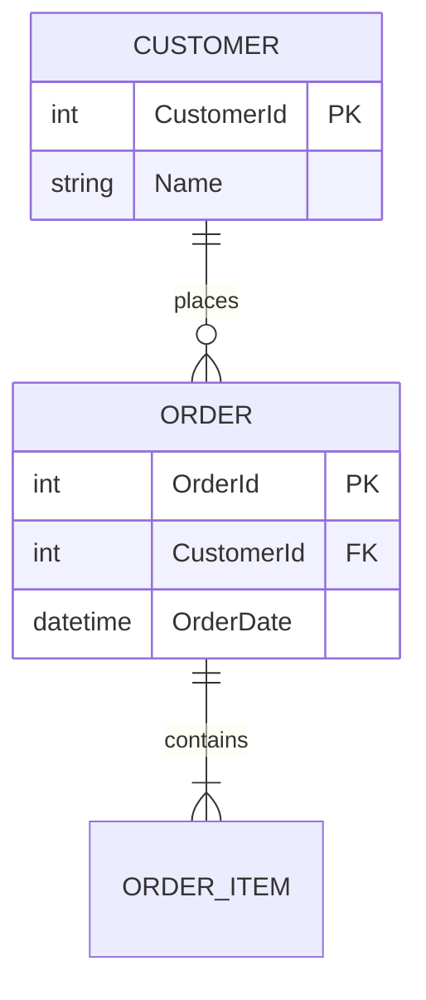
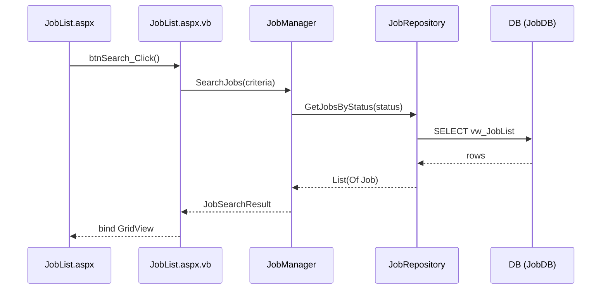

# Brain Scan — Deep Codebase Scanner with Dependency Tracing

ALL responses MUST be in Thai language.

**Graph Protocol:** Follow rules in `${CLAUDE_PLUGIN_ROOT}/GRAPH_PROTOCOL.md` for all save operations.

## Scan Modes

| Argument | Mode | What it does |
|----------|------|-------------|
| (none) | **Smart** (default) | Auto-detect: first scan or incremental |
| `folder-path` | Folder | Scan specific folder only |
| `--full` | Full | All 10 phases, ignore existing (recommended first time) |
| `--deps` | Dependencies | Phase 4 only — trace call chains |
| `--auth` | Authorization | Phase 5 only — permission matrix |
| `--docs` | Documents | Phase 8 only — scan .md, .docx, .txt |
| `--force` | Force Full | Re-scan everything, overwrite all existing notes |

## Smart Scan Strategy (Default Behavior)

When `/brain-scan` is called without flags, it automatically decides what to do:

### Step 1: Check existing brain state
```
Call mcp__graph-brain__search-knowledge query="{project-name}" limit=20
```

### Step 2: Classify situation

| Situation | How to Detect | Action |
|-----------|--------------|--------|
| **First scan** (brain empty) | 0 notes found for this project | Run full 10-phase scan |
| **Brain has data** (returning user) | 1+ notes found | Run incremental scan |
| **Different project** (reuse skill) | Notes found but for different project | Run full scan for new project |

### Step 3: Incremental Scan (brain already has data)

When brain already has knowledge for this project:

```
🧠 พบความรู้เดิมใน Brain: {N} ชิ้น สำหรับ {project-name}
   อัพเดทล่าสุด: {latest note date}

กำลังตรวจสอบว่ามีอะไรเปลี่ยนแปลง...
```

#### 3a: Detect changes since last scan

หา "last scan state" ตามลำดับ (Freshness Protocol §5.3 — commit เป็น primary source):

1. **Primary — commit จาก note:** เรียก `mcp__graph-brain__get-knowledge` บน note ที่ update ล่าสุดจากผล search ใน Step 1 (search-knowledge ให้แค่ผลค้น — ต้อง get-knowledge จึงได้ full content) → parse `Scanned-At-Commit` จาก `## Scan Metadata` ท้าย content ("ล่าสุด" = `Scanned-At` ล่าสุด ตาม §5.2 ข้อ 2) แล้ว:
   ```bash
   git diff --name-only "{last_scan_commit}..HEAD"
   git diff --name-only            # unstaged
   git diff --staged --name-only   # staged
   git ls-files --others --exclude-standard   # untracked
   ```
   แม่นสุด — hash ติดไปกับ brain server ใช้ได้ทุกเครื่อง (ไม่พึ่งไฟล์ local)
2. **Fallback — activity log:** `.brain/activity-log.json` หา last completed scan date (local เท่านั้น — gitignore)
3. **Fallback สุดท้าย — date-based:**
   ```bash
   git log --since="{latest_note_date}" --name-only --pretty=format: | sort -u
   ```

**Tag detection (v3.2):** `git diff` จับ tag ไม่ได้ (tag เป็น ref ไม่ใช่ file) — เช็คแยก `git tag --contains "{last_scan_commit}"` เพื่อจับ tag ใหม่ที่ทับ commit ที่ scan ไปแล้ว (เคสปกติของการ cut release); **Phase 7.5 Release re-run ทุก incremental scan เสมอ** (`git tag -l` ต้นทุนต่ำ) เพื่อกัน Release History ค้าง stale (Freshness Protocol §5.3)

If git is not available, fall back to file modification timestamps (เทียบกับ `Scanned-At` date จาก note)

#### 3b: Classify changed files into scan phases
Map each changed file to which phase should re-run:

| Changed File Pattern | Re-run Phase |
|---------------------|-------------|
| *.sln, *.csproj, packages.config | Phase 2 (Architecture) |
| Web.config connection strings, appsettings.json | Phase 3 (Database) |
| *Context*, *.edmx, *Repository* | Phase 3 (Database) |
| *Model*, *Entity*, Models/, Entities/, Domain/, *Migration* (POCO entity classes) | Phase 3 (Database — รวม regen ER ที่กระทบ) |
| *.aspx, *.aspx.vb/cs, *Controller* | Phase 4 (Dependencies) + Phase 5 (Auth) |
| *BasePage*, *MasterPage*, *Login*, *Auth* | Phase 5 (Authorization) |
| *Manager*, *Service* (business logic) | Phase 4 (Dependencies) + Phase 6 (Workflow) |
| *Mail*, *SMS*, *Notify*, *FTP* | Phase 7 (Integration) |
| Dockerfile*, docker-compose*, .github/workflows/*, azure-pipelines*, Jenkinsfile, *.pubxml, appsettings.{env}.json, web.{env}.config | Phase 7.5 (Deployment) — + Phase 3 ถ้า connection string เปลี่ยน (Database Connections สดด้วย) |
| CHANGELOG*, HISTORY*, RELEASES*, new git tag (detect ด้วย `git tag --contains`, §3a — ไม่ใช่ file diff), *.csproj &lt;Version&gt;, package.json version | Phase 7.5 (Release — re-run ทุก incremental) |
| README*, launchSettings.json, Makefile, global.json, .nvmrc, *.ps1, *.sh | Phase 2 (Dev Setup) |
| .design-docs/design_doc_list.json, .design-docs/**/*.md | Phase 8 (Design Doc Registry — Requirements/Design Diagrams) |
| *.md, *.docx, *.txt | Phase 8 (Documents) |
| Program.cs, Startup.cs, Global.asax | Phase 2 + 3 (Architecture + Config) |
| No changes detected | Skip scan, report "up to date" |

**Diagram regen (v3.2):** การ re-run แต่ละ phase ครอบ diagram ของ phase นั้นด้วย —
- Phase 3 re-run → regen **ER Diagram** notes ที่กระทบ (เฉพาะ module ที่ entity/model เปลี่ยน; overview note อัปเดตเมื่อ module-level relationships เปลี่ยน)
- Phase 4 re-run → regen **sequenceDiagram** ใน dependency map notes ที่กระทบ (เฉพาะ page/controller/service ที่เปลี่ยน)

#### 3c: Run only affected phases
```
🧠 Smart Scan — ตรวจพบการเปลี่ยนแปลง:

📝 ไฟล์ที่เปลี่ยน: {N} ไฟล์ (ตั้งแต่ scan ล่าสุด: {last_scan_commit} หรือ {last_scan_date} ตามแหล่งที่ใช้ใน 3a)

🔄 Phases ที่ต้องรีสแกน:
   ✅ Phase 4: Dependencies (changed files)
   ⏭️ Phase 2, 3, 6: ข้ามได้ (ไม่มีไฟล์เปลี่ยน)

ดำเนินการ? [1] สแกนเฉพาะที่เปลี่ยน  [2] สแกนใหม่ทั้งหมด  [3] ยกเลิก
```

#### 3d: Update existing notes (not duplicate)
For each affected note:
- Search brain for existing note with same title
- Load existing content
- Re-scan the relevant files
- **Merge**: keep unchanged parts, update changed parts, add new parts
- **Refresh Scan Metadata footer** → `{scan_commit}` + วันนี้ (แทนที่ footer เดิม — ห้ามมี footer ซ้ำ 2 อัน)
- Save with updated content + updated timestamp in note

#### 3e: Detect deleted/renamed files
มี `{last_scan_commit}` จาก primary path → ใช้ commit-based (แม่นกว่า — date เพี้ยนได้หลัง rebase/squash):
```bash
git diff --name-status --diff-filter=DR "{last_scan_commit}..HEAD"
```
ไม่มี commit (fallback path) → date-based ({last_scan_date} = `Scanned-At` จาก note หรือ activity log):
```bash
git log --since="{last_scan_date}" --diff-filter=DR --name-only
```
- If a scanned page was deleted → mark the brain note as `[DELETED]` or remove
- If a file was renamed → update note references

## Activity Logging

Every brain-scan MUST write activity logs to `.brain/activity-log.json` at project root.

### Log file setup
- If `.brain/` directory doesn't exist → create it
- If `.brain/activity-log.json` doesn't exist → create with empty array `[]`
- Add `.brain/` to `.gitignore` if not already there

### Log entries to write

**On scan START** (after Phase 1 pre-flight):
```json
{
  "timestamp": "<ISO 8601 UTC>",
  "session_id": "<use $CLAUDE_SESSION_ID or generate date-based ID>",
  "command": "brain-scan",
  "args": "<raw args: --full, --docs, folder-path, etc.>",
  "project": "<project-name from cwd>",
  "status": "started",
  "details": {
    "scan_mode": "smart|full|incremental|folder|docs|deps|auth|force",
    "phases_planned": [1,2,3],
    "existing_notes": "<N notes found in pre-flight>",
    "files_changed": "<N files from git diff, or null if first scan>"
  }
}
```

**On scan COMPLETE** (after Phase 10 report):
```json
{
  "timestamp": "<ISO 8601 UTC>",
  "session_id": "<same session_id>",
  "command": "brain-scan",
  "args": "<same args>",
  "project": "<project-name>",
  "status": "completed",
  "details": {
    "scan_mode": "smart|full|incremental|folder|docs|deps|auth|force",
    "phases_run": [1,2,3,4,5,6,7,7.5,8,9,10],
    "notes_created": "<N>",
    "notes_updated": "<M>",
    "notes_skipped": "<K identical>",
    "changelogs_created": "<C>",
    "elapsed": "<human readable e.g. 4m 32s>"
  }
}
```

**On scan FAILED/CANCELLED**:
```json
{
  "timestamp": "<ISO 8601 UTC>",
  "session_id": "<same>",
  "command": "brain-scan",
  "project": "<project-name>",
  "status": "failed|cancelled",
  "details": {
    "reason": "<error message or 'user cancelled'>",
    "phase_reached": "<last completed phase number>"
  }
}
```

### How to write log entries
Use Bash to append to the JSON array:
```bash
# Read existing log, append new entry, write back
# If file is empty or missing, start with []
```
Or use the Write/Edit tool to append the entry to the array.

## Execution Phases

### Phase 0: Project Awareness (NEW)
- Call `mcp__graph-brain__get-project` name="{project-name}"
- If project exists → display: "🏗️ Project {name} พบใน Brain — tech: [{tech stack}], notes: {N}"
- If project not found → note: "🆕 Project ใหม่ — จะสร้างเมื่อ save notes"
- This informs subsequent phases about existing project context

### Phase 1: Pre-flight Check
- Call `mcp__graph-brain__brain-stats` to verify connection
- If failed → offer retry or cancel (never block)
- Detect project type from files: .sln (.NET), package.json (Node), *.csproj, etc.
- **Capture scan commit (v3.2):** `git rev-parse --short HEAD` → เก็บเป็น `{scan_commit}` ใช้กับ **ทุก note** ใน run นี้ (Freshness Protocol §5.1) — non-git project หรือ rev-parse ล้มเหลว (เช่น repo ยังไม่มี commit) → skip (notes จะไม่มีบรรทัด Scanned-At-Commit)
- Run Smart Scan Strategy (check existing brain state + git changes)
- Count files to estimate scan time, confirm with user if large

### Phase 2: Architecture Scan (Agent 1)
**Goal:** Solution structure, project list, technology stack

Scan patterns:
```
*.sln, *.csproj, *.vbproj     → project list, references, target framework
packages.config, *.deps.json   → NuGet packages, versions
package.json, node_modules     → npm packages (if any)
Global.asax, Program.cs        → app startup, DI registration
Startup.cs, WebApiConfig.cs    → middleware, routing config
```

Output note: `{Project} - Solution Structure`

#### Dev Setup & Run Guide (v3.2)

**Goal:** ตอบคำถาม support "โปรเจกต์นี้ build/run/test/debug ยังไง ต้องมีอะไรก่อน" — คนที่กลับมาดูงานเก่าไม่ต้องไล่อ่านเอง

Scan patterns:
```
README*, CONTRIBUTING*, docs/setup*   → setup steps ที่เขียนไว้
package.json (scripts), Makefile        → build/run/test/lint commands
launchSettings.json, *.ps1, *.sh        → run profiles, dev scripts
global.json, .nvmrc, .tool-versions     → SDK/runtime versions ที่ pin
*.csproj <TargetFramework>              → .NET version
.env.example, appsettings.Development.* → local config ที่ต้องตั้ง (ชื่อ key เท่านั้น — Secret Masking Protocol §6)
docker-compose*.yml (dev services)      → dependencies ที่ต้องรัน local (DB, redis ฯลฯ)
```

เนื้อหา note:
- **Prerequisites:** SDK/runtime versions, tools ที่ต้องติดตั้ง (จาก global.json/.nvmrc/TargetFramework)
- **Build:** คำสั่ง build (dotnet build / npm run build / make)
- **Run:** คำสั่ง run + local URL/port (จาก launchSettings.json profiles)
- **Test:** คำสั่ง test + framework
- **Debug:** วิธี attach debugger / debug launch profile (จาก launchSettings.json profiles)
- **Local config:** ไฟล์/env ที่ต้องตั้งก่อนรัน (ชื่อ key เท่านั้น ไม่เก็บค่า secret — §6)
- ไม่พบข้อมูล setup เลย → note ระบุ "ไม่พบ setup docs/scripts ในโค้ด — บันทึกเพิ่มด้วย /brain-save" (ไม่เงียบหาย)

Output note: `{Project} - Dev Setup & Run Guide` — folderPath `/projects/{name}/core/`, tags `[{project}, architecture]`

### Phase 3: Database & Data Layer Scan (Agent 2)
**Goal:** Connections, models, entities, repositories, views

Scan patterns:
```
Web.config, appsettings.json   → connection strings, DB servers
*Context*.cs, *Context*.vb     → DbContext classes, DbSets
*.edmx                         → EF6 EDMX models
*Repository*, *UnitOfWork*     → data access patterns
*Migration*                    → DB migration history
```

**⚠️ Mask secrets (v3.2):** `connection strings, DB servers` มี credential — `{Project} - Database Connections` note ต้องทำตาม **Secret Masking Protocol §6** ใน `${CLAUDE_PLUGIN_ROOT}/GRAPH_PROTOCOL.md`: เก็บ **Server + Database name แยก field** (§6.2 ข้อ 1) ห้ามเก็บ connection string ทั้งเส้น + ไม่เก็บ `<appSettings>`/`<connectionStrings>` values เต็ม + pre-save sanity check (§6.3)

#### ER Diagram Generation (v3.2)

จาก entities ที่สแกนได้ สร้าง Mermaid `erDiagram` — entity names, PK/FK, relationships พร้อม cardinality:

````markdown
## ER Diagram

````

**Split rule:**
- **≤20 entities** → note เดียว: `{Project} - ER Diagram`
- **>20 entities** → แยกต่อ module: `{Project} - ER Diagram: {Module}` (จัดกลุ่มตาม domain/folder/DbContext) + overview note `{Project} - ER Diagram` แสดง module-level relationships (module ไหนอ้าง entity ของ module ไหน)

**กฎ:**
- **Attributes = scalar columns เท่านั้น** (PK/FK/คอลัมน์จริง) — **ห้ามใส่ navigation properties/generic collections**: `List(Of Job) Jobs` หรือ `List<Job> Jobs` ทำ Mermaid parse พังทันที; ถ้าจำเป็นต้องแสดง generic type ให้ escape ด้วย tilde `List~Job~` และ type ห้ามมี space หรือ `<>`
- Entity/table ชื่อมี space หรืออักขระพิเศษ → ครอบ double quotes (`"Order Detail"`) — unquoted จะถูกแตกเป็นคนละ entity เงียบๆ โดยไม่ error
- Title คงที่ตามรูปแบบข้างบนเสมอ (upsert-by-title — สแกนซ้ำ = update note เดิม ไม่สร้างซ้ำ)
- folderPath: `/projects/{name}/database/` (เดียวกับ notes อื่นของ Phase 3); tags: `[{project}, database, diagram]`
- Link `[[{Project} - Entity Models]]` ↔ ER notes (ทั้งสองทิศ)
- **Cleanup orphan modules:** หลัง regen → search notes ที่ title ขึ้นต้น `{Project} - ER Diagram:` แล้ว mark `[DELETED]` หรือลบอันที่ module ไม่อยู่ในผล scan ปัจจุบัน (รวมเคส entities ลดจน ≤20 แล้วยุบกลับเป็น note เดียว)
- Diagram อยู่ใน content ก่อน Scan Metadata footer — ทุก ER note มี footer (§5.1) เหมือน note อื่น

Output notes:
- `{Project} - Database Connections`
- `{Project} - Entity Models`
- `{Project} - Data Access Patterns`
- `{Project} - ER Diagram` (+ `{Project} - ER Diagram: {Module}` เมื่อ >20 entities)

### Phase 4: Dependency Tracing (Agent 3 + 4)
**Goal:** Map cross-layer call chains from UI → Business Logic → API → Data → Entity

#### Step 4a: Identify entry points
```
*.aspx, *.aspx.vb, *.aspx.cs  → Web Forms pages
*.cshtml, *.razor              → MVC/Razor pages
*Controller*.cs                → API controllers
*.master                       → Master pages
*.asmx                         → SOAP web services
```

#### Step 4b: Trace call chains FROM each entry point
```
[Page/Endpoint]
  └─→ calls [Function/Method in code-behind]
       └─→ calls [Service/Manager class.Method()]
            └─→ calls [Repository/UnitOfWork.Method()]
                 └─→ accesses [Entity/Table/View/StoredProc]
                      └─→ connects to [Database via ConnectionString]
```

#### Step 4c: Build dependency maps per page/feature

**Sequence Diagram (v3.2):** **ทุก** dependency map note ต้องแนบ Mermaid `sequenceDiagram` ของ call chain ที่ trace ได้ใน 4b — ไม่จำกัดเฉพาะ feature หลัก ครบทุก entry point:

````markdown
## Sequence Diagram

````

กฎ:
- participants ตามชั้นจริงที่ trace ได้: Page/Endpoint → Function → Service/Manager → Repository → Entity/Table/StoredProc → DB (Entity/Table แยกเป็น participant เมื่อ chain ผ่าน entity class จริง — ตัวอย่างข้างบนยุบเป็น message label เพราะเป็น view-based query)
- ใส่ parameters/return หลักบน arrow เมื่อระบุได้จากโค้ด (ไม่บังคับทุก arrow) — **ห้ามมี `;` ใน message text และ participant alias** (Mermaid ตีความ `;` เป็นตัวคั่น statement → parse พัง): SQL/โค้ดที่มี `;` ให้ตัดออกหรือสรุปเป็นข้อความสั้น
- tags ของ dependency map note ที่มี sequence diagram: เพิ่ม `diagram` (เช่น `[{project}, dependency, diagram]`)
- Diagram อยู่ใน note `{Project} - Dependency Map: {Feature}` เดิม (title คงที่ — upsert ไม่ duplicate) และนับเป็นส่วนหนึ่งของ content ก่อน Scan Metadata footer

#### Step 4d: Cross-reference and group by Feature, Entity, Service, Database

Output notes:
- `{Project} - Dependency Map: {Feature}` (แต่ละ note มี sequenceDiagram ในตัว — v3.2)
- `{Project} - Entity Usage Map`
- `{Project} - Service Call Map`

### Phase 5: Authorization & Permission Matrix (Agent 5)
**Goal:** Build complete permission matrix — every page, every API, every function mapped to roles

#### Step 5a: Discover all roles in the system
#### Step 5b: Scan page-level authorization
#### Step 5c: Scan API-level authorization
#### Step 5d: Build Permission Matrix (Web Pages + API Endpoints + Role Details)
#### Step 5e: Build "Why Can't I Access?" Troubleshooting Map

Output notes:
- `{Project} - Permission Matrix: Web Pages`
- `{Project} - Permission Matrix: API Endpoints`
- `{Project} - Permission Matrix: Role Details`
- `{Project} - Access Troubleshooting Map`
- `{Project} - Data Scope by Role`

### Phase 6: Workflow & Business Logic Scan (Agent 6)
**Goal:** State machines, business rules, status transitions

Output notes:
- `{Project} - Workflow States`
- `{Project} - Business Rules`

### Phase 7: Integration & Infrastructure Scan (Agent 7)
**Goal:** External APIs, notifications, file storage, servers

Output notes:
- `{Project} - API Endpoints`
- `{Project} - External Integrations`
- `{Project} - Notification Systems`
- `{Project} - File Storage`

### Phase 7.5: Release & Deployment Scan (Agent 7.5) — v3.2
**Goal:** ตอบคำถาม support ที่พบบ่อยสุด — "ลูกค้าใช้ version ไหน / bug นี้แก้ใน release ไหน" และ "ระบบ deploy ไปไหน มี environment อะไรบ้าง config ต่างกันตรงไหน"

#### Step 7.5a: Release History

Scan patterns:
```
git tag -l --sort=-creatordate    → version tags + creation dates
CHANGELOG*, HISTORY*, RELEASES*    → changelog entries
*.csproj <Version>/<AssemblyVersion> → .NET assembly version
package.json "version"             → npm package version
plugin.json / manifest "version"   → plugin/app manifest version
```

เนื้อหา note: ตาราง `version | date | highlights` (เรียงใหม่→เก่า) + ระบุ **current version ณ HEAD** (จาก version field ที่ HEAD) + latest tag

Output note: `{Project} - Release History` — folderPath `/projects/{name}/releases/`, tags `[{project}, release]`

ไม่พบ tag/CHANGELOG/version field เลย → note ระบุ "ไม่พบข้อมูล release ในโค้ด (ไม่มี tag/CHANGELOG/version field) — บันทึกเพิ่มด้วย /brain-save" (ไม่เงียบหาย)

#### Step 7.5b: Deployment Topology

Scan patterns:
```
Dockerfile*, docker-compose*.yml       → container images, services, ports
.github/workflows/*.yml, .gitlab-ci.yml → CI/CD pipeline steps, deploy targets
azure-pipelines*.yml, Jenkinsfile       → build/release pipeline
*.pubxml (publish profiles)             → publish target (server/IIS/folder)
appsettings.{env}.json                  → per-environment config (เทียบ diff ระหว่าง env)
web.config + web.{env}.config transforms → config transform per environment
Procfile, netlify.toml, vercel.json, app.yaml → PaaS deploy config
```

**⚠️ Mask secrets ก่อน extract:** ไฟล์ deployment เหล่านี้มี credential จริง — ต้องทำตาม **Secret Masking Protocol §6** ใน `${CLAUDE_PLUGIN_ROOT}/GRAPH_PROTOCOL.md` ทุกขั้นก่อน save (นิยาม secret §6.1, กฎ extract §6.2 — connection string เก็บแค่ Server+DB แยก field, endpoint strip credential, literal-vs-reference, config diff เก็บชื่อ key ไม่ใช่ค่า, pre-save sanity check §6.3). **อ่าน §6 ก่อนเขียน note นี้**

เนื้อหา note (ทุก bullet ผ่าน §6 masking):
- **Deploy target:** deploy ไปไหน (server/cloud/registry/PaaS) — endpoint strip credential (§6.2 ข้อ 2)
- **Environments:** env ที่มี (Development/Staging/Production ฯลฯ) + **ชื่อ key/setting** ที่ต่างต่อ env (§6.2 ข้อ 4 — ไม่ใช่ค่า; delta ที่เป็น secret เก็บแค่ "key X ต่าง")
- **Pipeline:** สรุป CI/CD steps (build → test → deploy) — env/secret ใน pipeline เป็น reference เก็บชื่อได้ literal ต้อง mask (§6.2 ข้อ 3)
- **DB per env:** Server + Database name แยก field (§6.2 ข้อ 1 — ห้ามเก็บ connection string ทั้งเส้น)

Output note: `{Project} - Deployment Topology` — folderPath `/projects/{name}/deployment/`, tags `[{project}, deployment]`

ไม่พบ deployment config เลย → note ระบุ "ไม่พบ deployment config ในโค้ด (ไม่มี Dockerfile/pipeline/publish profile) — บันทึกเพิ่มด้วย /brain-save" (ไม่เงียบหาย)

### Phase 8: Document Scan (Agent 8)
**Goal:** Extract knowledge from project documentation files

#### Step 8a: Design Doc Registry (first-class — v3.2)

**ก่อน** generic .md scan → เช็ค `.design-docs/design_doc_list.json` (schema 2.3.0 ของ system-design-doc plugin) — ถ้าพบ ใช้เป็น structured source แทนการอ่าน .md ดิบ:

1. **Requirements/AC/UC:** จาก `documents[].sections[]` (key=`requirements`) + `documents[].acceptance_criteria[]` (AC-NNN) + `documents[].use_cases[]` (UC-NNN)
   → note `{Project} - Requirements: {doc-name}` ใน `/projects/{name}/requirements/`, tags `[{project}, requirement]`
   → เก็บ: FR/AC list (id + title + type), UC list (id + title + main_flow), section file paths สำหรับอ้างอิง

2. **Design diagrams (ไม่ generate ซ้ำ):** จาก `diagrams.*` ที่ `exists:true` + `format:"mermaid"` + มี `file_path` — เป็น Mermaid สำเร็จรูปจาก design doc (er_diagram, flow_diagrams[], sequence_diagrams[], dfd, sitemap, state_diagrams[], class_diagrams[])
   → อ่าน Mermaid จากไฟล์ `file_path` ที่ registry ชี้ (อยู่ใต้ `documents[].doc_dir/`) แล้ว embed เข้า note `{Project} - Design Diagrams: {doc-name}` ใน `/projects/{name}/documents/`
   → **label ที่มา** `[Design-doc]` — ต่างจาก `[Code-derived]` ของ ER/sequence จาก Phase 3/4 (#13)
   → **ไม่ generate ใหม่** ถ้า design doc มี diagram อยู่แล้ว; link `[[{Project} - ER Diagram]]` (code-derived, Phase 3) ↔ design-doc ER เพื่อเทียบ design vs จริง

3. **De-dup:** design doc files (sections[].file, diagrams[].file_path — ทั้งหมดใต้ `doc_dir/`) ที่ดึงแล้วใน 8a → **ไม่ต้องเข้า generic .md scan (Step 8b) ซ้ำ**

4. ไม่พบ `.design-docs/design_doc_list.json` → ข้าม 8a ไป 8b ทำงานแบบเดิมทุกประการ

#### Step 8b: Generic Document Scan

Scan documentation files (ยกเว้นไฟล์ที่ 8a ดึงไปแล้ว):
```
**/*.md, **/*.docx, **/*.txt, **/*.pdf
**/docs/**, **/documentation/**
*CLAUDE.md, *AGENTS.md
```

Output notes:
- `{Project} - Documentation Index` (README ถูก index ที่นี่เป็น document — ส่วน setup steps ไปอยู่ `{Project} - Dev Setup & Run Guide` ของ Phase 2; link ถึงกันด้วย `[[wiki link]]`)
- `{Project} - Requirements: {topic}` (จาก 8a ถ้ามี design doc / จาก .md ดิบถ้าไม่มี)
- `{Project} - Design Diagrams: {doc-name}` (จาก 8a — design-doc Mermaid, ถ้ามี)
- `{Project} - Deployment Guide` (จาก .md ที่มนุษย์เขียน — คู่กับ code-derived `{Project} - Deployment Topology` ของ Phase 7.5; link ถึงกันใน Phase 9)

### Phase 9: Cross-Reference & Link Building
- Build master index
- Add `[[wiki links]]` between related notes
- **Link diagram notes (v3.2):** `[[{Project} - ER Diagram]]` ↔ `[[{Project} - Entity Models]]` (สองทิศ) และ dependency map ↔ ER note + `[[{Project} - Entity Models]]` ของ module ที่ entity ถูกใช้
- **Link design-doc notes (v3.2):** `[[{Project} - Design Diagrams: {doc}]]` (design-doc, Phase 8) ↔ `[[{Project} - ER Diagram]]` (code-derived, Phase 3) เพื่อเทียบ design vs จริง; `[[{Project} - Requirements: {doc}]]` ↔ feature/dependency notes ที่ implement requirement นั้น
- Create `{Project} - Knowledge Map (Auto-generated)` summary
- Verify links with `mcp__graph-brain__explore-graph`:
  - For each saved note, call `explore-graph` nodeId="{note-id}" depth=1
  - Check that `[[wiki links]]` point to existing notes
  - Remove broken links, add missing links to newly created notes

### Phase 10.5: Versioning (NEW — runs before Report)

For each note that was **updated** (not created new):
1. Follow Versioning Protocol from `${CLAUDE_PLUGIN_ROOT}/GRAPH_PROTOCOL.md`:
   - Snapshot was already taken in Phase 3d (update existing notes)
   - Determine changelog number for each updated note
   - Create changelog note with diff summary
   - Update original note with Version History section (**วางก่อน `## Scan Metadata` เสมอ** — Scan Metadata ต้องคงเป็น section สุดท้ายตาม §5.1)
2. Track: `changelogs_created` count for report

### Phase 10: Report Results (Thai)
```
🧠 Brain Scan เสร็จสิ้น — {Project}

⏱️ สแกน: {elapsed time}
📊 สรุป:
   สร้างใหม่: {N} ชิ้น
   อัพเดท:    {M} ชิ้น
   Diagrams:  {E} ER + {S} sequence (v3.2)
   Changelogs: {C} ชิ้น
   เอกสาร:   {D} ไฟล์ indexed

📦 ความรู้ที่เก็บ:
├── 🏗️ core/ — Solution, Architecture, Dev Setup & Run Guide
├── 🗄️ database/ — Connections, Entities, Data Access, ER Diagram
├── 🔗 dependencies/ — Page→Function→API→Entity maps (+ sequence diagram ทุก map)
├── 🔒 permissions/ — Role Matrix, Page Auth, API Auth ⭐
├── 🔄 workflow/ — States, Business Rules
├── 🌐 integration/ — APIs, Notifications, File Storage
├── 🚀 releases/ — Release History (v3.2)
├── 📦 deployment/ — Deployment Topology (v3.2)
├── 📋 requirements/ — Requirements, AC, UC from design docs (v3.2)
├── 📝 changelog/ — Version changelogs
└── 📄 documents/ — .md, .docx, .txt, Design Diagrams indexed

💡 ถัดไป:
   /brain ทำไมเข้า JobList ไม่ได้    ← ถาม permission ได้เลย
   /brain-explain billing             ← อธิบายแบบละเอียด
   /brain-search JobAssignment        ← ค้นหา dependency map
```

### IMPORTANT: Write activity log
After Phase 10 report, ALWAYS write the "completed" log entry to `.brain/activity-log.json`.
If scan was cancelled or failed at any point, write the "failed/cancelled" entry instead.
Never skip logging — this is how users track what was scanned across sessions.

## Scan Metadata Footer (v3.2 — ทุก note ที่ scan สร้าง/อัปเดต)

ทุก note จาก brain-scan **ทุก phase** ต้องลงท้าย content ด้วย footer ตาม Freshness Protocol §5.1 ใน `${CLAUDE_PLUGIN_ROOT}/GRAPH_PROTOCOL.md`:

```markdown
## Scan Metadata
- Scanned-At-Commit: `{scan_commit}`
- Scanned-At: {YYYY-MM-DD}
- Source-Files: `{path1}`, `{path2}`, ...
```

- `Source-Files`: ไฟล์หลักที่ note สรุปมา — backtick แยกต่อ path; ถ้าเยอะใช้ระดับ folder ได้ (เช่น `Controllers/`)

- `{scan_commit}` จาก Phase 1 — **hash เดียวกันทั้ง run** (ห้ามเรียก rev-parse ใหม่ระหว่าง run)
- Note ที่ **update** → แทนที่ footer เดิมด้วยอันใหม่ (ห้ามซ้อนสอง footer)
- Non-git project → ละบรรทัด Scanned-At-Commit
- Footer นี้คือสิ่งที่ `/brain` และ `/brain-load` ใช้เช็คความสด (Freshness Protocol §5.2) — ห้ามข้าม

## Deduplicate Strategy
Before saving each note:
- Search brain for existing note with same title
- If found → compare content, update if changed, skip if identical
- If not found → create new
- All saves must follow Graph Protocol Save Rules:
  - projectName, tags (min 2), folderPath per convention
  - Add [[wiki links]] to related notes found during scan
  - **Scan Metadata footer ท้าย content ทุก note** (v3.2 — ดู section ด้านบน)

## Folder Categories for Saved Notes
```
/projects/{name}/core/          — architecture, solution, infrastructure
/projects/{name}/database/      — connections, entities, models, views, ER diagrams
/projects/{name}/dependencies/  — dependency maps, call chains, entity usage
/projects/{name}/permissions/   — role matrix, page auth, API auth, troubleshooting
/projects/{name}/workflow/      — states, business rules
/projects/{name}/integration/   — external APIs, notifications, file storage
/projects/{name}/releases/      — release history, version timeline (v3.2)
/projects/{name}/deployment/    — deployment topology, environments, CI/CD (v3.2)
/projects/{name}/requirements/  — requirements, AC, use cases from design docs (v3.2)
/projects/{name}/documents/     — indexed documentation files
```
