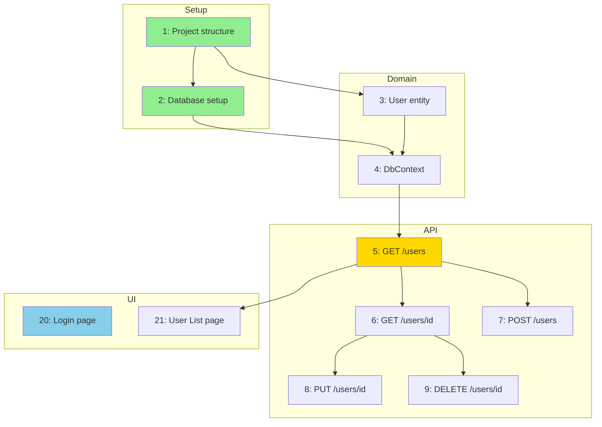
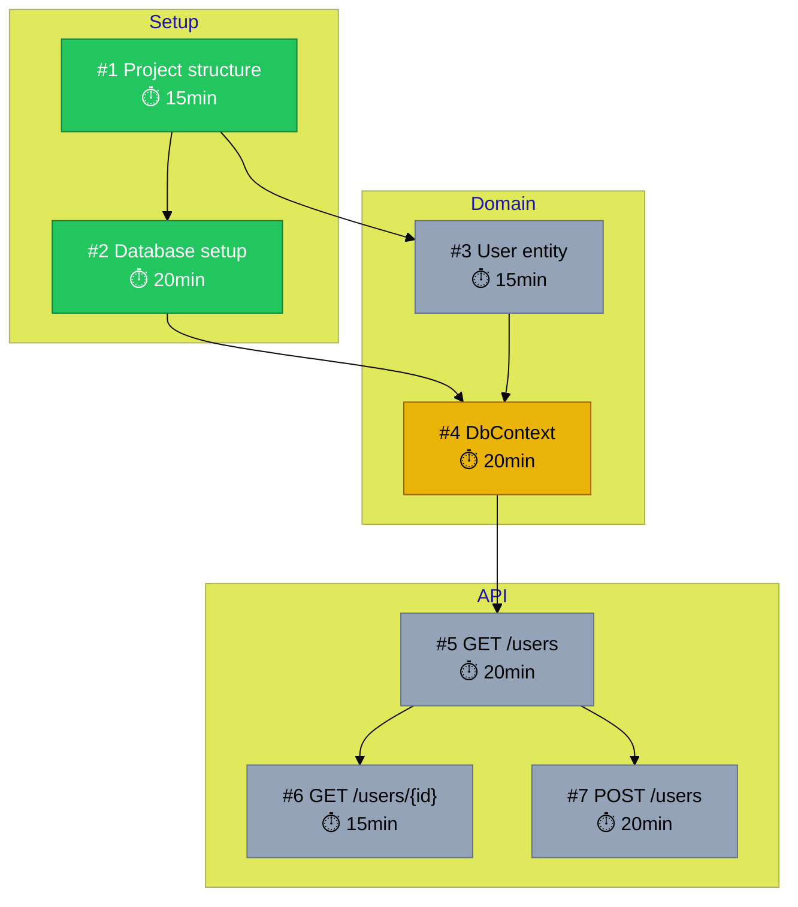

# /agent-dependencies

สร้าง dependency visualization และวิเคราะห์ critical path ของ features

---

## Usage

```
/agent-dependencies
```

---

## Purpose

1. **Visualize** dependencies ระหว่าง features ด้วย Mermaid diagram
2. **Detect** circular dependencies
3. **Identify** critical path (longest dependency chain)
4. **Find** blocked features
5. **Analyze** parallelization opportunities

---

## Output

### 1. Mermaid Dependency Graph



### 2. Dependency Analysis Report

```
╔════════════════════════════════════════════════════════════╗
║               DEPENDENCY ANALYSIS REPORT                    ║
╠════════════════════════════════════════════════════════════╣

1. DEPENDENCY STATISTICS
   ──────────────────────
   Total features: 25
   Features with dependencies: 22
   Features without dependencies: 3 (root nodes)
   Total dependency links: 45
   Average dependencies per feature: 1.8

2. ROOT NODES (No Dependencies)
   ────────────────────────────
   - Feature #1: สร้าง project structure
   - Feature #20: สร้างหน้า Login (standalone)
   - Feature #23: API documentation

3. LEAF NODES (No Dependents)
   ──────────────────────────
   - Feature #9: DELETE /api/users/{id}
   - Feature #21: สร้างหน้า User List
   - Feature #25: Settings page

4. CRITICAL PATH (Longest Chain)
   ─────────────────────────────
   Length: 6 features
   Path: F1 → F2 → F4 → F5 → F6 → F8

   ┌───┐   ┌───┐   ┌───┐   ┌───┐   ┌───┐   ┌───┐
   │ 1 │ → │ 2 │ → │ 4 │ → │ 5 │ → │ 6 │ → │ 8 │
   └───┘   └───┘   └───┘   └───┘   └───┘   └───┘
   Setup   DB      Context  List    Get     Update

   Estimated time: 1h 55min

5. CIRCULAR DEPENDENCIES
   ──────────────────────
   ✅ No circular dependencies found

   (If found, would show):
   ❌ Circular dependency detected:
      F10 → F12 → F15 → F10

6. BLOCKED FEATURES
   ─────────────────
   Features blocked by unfinished dependencies:

   Feature #5 (GET /users) blocked by:
   - #4 DbContext [pending]
     - #2 Database setup [pending]
     - #3 User entity [pending]

7. PARALLELIZATION OPPORTUNITIES
   ──────────────────────────────
   After completing F1, can run in parallel:
   - F2 (Database setup)
   - F3 (User entity)
   - F20 (Login page - no deps)

   After completing F5, can run in parallel:
   - F6 (GET by ID)
   - F7 (POST)
   - F21 (User List page)

8. EPIC DEPENDENCIES
   ──────────────────
   Epic: setup → domain → api → ui

   ┌────────┐   ┌────────┐   ┌────────┐   ┌────────┐
   │ setup  │ → │ domain │ → │  api   │ → │   ui   │
   └────────┘   └────────┘   └────────┘   └────────┘

╚════════════════════════════════════════════════════════════╝
```

---

## Mermaid Export

Command จะสร้างไฟล์ `.agent/dependencies.mmd`:



---

## Dependency Validation

### Circular Dependency Detection

```
Algorithm: DFS with visited tracking

For each feature:
  1. Start DFS from feature
  2. Track visited nodes in current path
  3. If revisit node in same path → circular!
  4. Report cycle path
```

### Missing Dependency Check

```
For each feature:
  1. Check all dependency IDs exist
  2. Check dependency feature is not itself
  3. Check dependency epic order makes sense

Warnings:
- Feature #X depends on non-existent feature #Y
- Feature #X has self-dependency
- Feature #X (api) depends on #Y (ui) - unusual order
```

---

## Recommended Next Actions

Based on analysis:

```
Current Status:
- Passed: 5 features
- In Progress: 1 feature
- Pending: 19 features

Recommended Next:
1. Complete F4 (DbContext) - unblocks 5 features
2. Then F5 (GET /users) - on critical path
3. Parallel: F6, F7 after F5

Optimization:
- F20 (Login) has no dependencies - can start now
- F21 (User List) only needs F5 - can start after F5
```

---

## Usage Examples

### View Dependencies for Specific Feature

```
/agent-dependencies --feature 5
```

Output:
```
Feature #5: GET /api/users

Depends on:
├── #4 DbContext [pending]
│   ├── #2 Database setup [passed]
│   └── #3 User entity [passed]
└── (all resolved)

Blocks:
├── #6 GET /users/{id}
├── #7 POST /users
└── #21 User List page
```

### View Epic Dependencies

```
/agent-dependencies --epics
```

Output:
```
Epic Dependency Graph:

setup (100% done)
   ↓
domain (50% done)
   ↓
api (0% done)
   ↓
ui (0% done)
```

---

## Notes

- Read-only command
- Mermaid diagram can be viewed in VS Code with Mermaid extension
- Use with `/agent-status` for complete project overview
- Run after adding new features to check for issues
