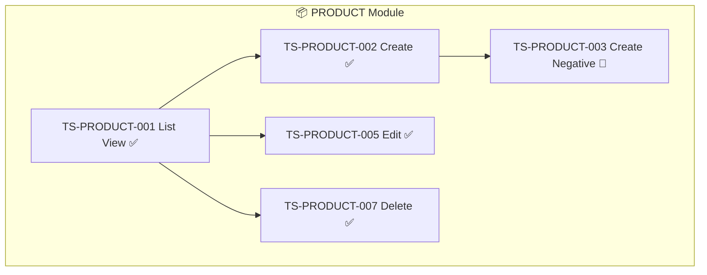

# QA UI Test Plugin — คู่มือการใช้งาน

> AI-powered QA UI Testing ด้วย Playwright — สร้าง, รัน, รีเทส, แก้ไข test scenarios
> พร้อม long-running agent tracking, parallel execution, opus review
> รองรับ Master Data CRUD, Master-Detail Grid, Multi-step Wizard

---

## สารบัญ

1. [ภาพรวม](#1-ภาพรวม)
2. [การติดตั้ง](#2-การติดตั้ง)
3. [แนวคิดหลัก](#3-แนวคิดหลัก)
4. [Quick Start — เริ่มต้นใน 5 นาที](#4-quick-start--เริ่มต้นใน-5-นาที)
5. [คำสั่งทั้งหมด](#5-คำสั่งทั้งหมด)
   - [/qa-create-scenario](#51-qa-create-scenario--สร้าง-test-scenarios)
   - [/qa-run](#52-qa-run--รัน-tests)
   - [/qa-retest](#53-qa-retest--รีเทสและรายงานผล)
   - [/qa-edit-scenario](#54-qa-edit-scenario--แก้ไขเคสเมื่อ-logic-เปลี่ยน)
   - [/qa-status](#55-qa-status--ดูสถานะภาพรวม)
   - [/qa-explain](#56-qa-explain--อธิบาย-test-plan)
6. [ประเภทหน้าที่รองรับ](#6-ประเภทหน้าที่รองรับ)
7. [Workflow ตัวอย่าง — จากเริ่มต้นจนเสร็จ](#7-workflow-ตัวอย่าง--จากเริ่มต้นจนเสร็จ)
8. [qa-tracker.json — หัวใจของระบบ](#8-qa-trackerjson--หัวใจของระบบ)
9. [Parallel Execution ด้วย Subagents](#9-parallel-execution-ด้วย-subagents)
10. [Opus Review — ตรวจคุณภาพ](#10-opus-review--ตรวจคุณภาพ)
11. [การ integrate กับ plugin อื่น](#11-การ-integrate-กับ-plugin-อื่น)
12. [FAQ — คำถามที่พบบ่อย](#12-faq--คำถามที่พบบ่อย)

---

## 1. ภาพรวม

QA UI Test Plugin ช่วยให้คุณทดสอบหน้าเว็บแบบ **อัตโนมัติ** โดย AI Agent จะ:

```
คุณบอก URL ของหน้าเว็บ
        │
        ▼
Agent วิเคราะห์หน้าเว็บ → ตรวจจับประเภท → ถาม brainstorm
        │
        ▼
สร้าง test scenarios + Playwright scripts + test data อัตโนมัติ
        │
        ▼
รัน tests → จับ screenshots → สร้าง reports
        │
        ▼
รีเทสเมื่อแก้ bug → เปรียบเทียบผล → opus review
```

### ทำอะไรได้บ้าง

| ความสามารถ | คำอธิบาย |
|-----------|---------|
| สร้าง Scenarios อัตโนมัติ | วิเคราะห์หน้าเว็บ + brainstorm + สร้างตาม IEEE 829 |
| รัน Tests | ทีละเคส, ทั้ง module, หรือ parallel ด้วย subagents |
| รีเทส + เปรียบเทียบ | รันซ้ำจาก scripts เดิม + แสดง delta (ดีขึ้น/แย่ลง) |
| แก้ไขเคส | Impact analysis เมื่อ logic เปลี่ยน + สร้างเคสใหม่อ้างอิงเคสเก่า |
| ดูสถานะ | Progress bar, module breakdown, failed details |
| อธิบาย Test Plan | Mermaid flowchart + coverage matrix + dependency map |
| Opus Review | ตรวจ test quality + coverage gaps + แนะนำเคสเพิ่ม |
| Master-Detail Grid | รองรับ expand row, inline editing, sync verification |

---

## 2. การติดตั้ง

### Prerequisites

- Node.js 18+
- Claude Code CLI

### ติดตั้ง Plugin

Plugin อยู่ใน `plugins/qa-ui-test/` — Claude Code จะ auto-discover เมื่ออยู่ใน project

### ติดตั้ง Playwright (ทำครั้งแรกครั้งเดียว)

```bash
npm install -D @playwright/test
npx playwright install chromium
```

หรือใช้ setup script:

```bash
node plugins/qa-ui-test/skills/qa-ui-test/scripts/setup.js --base-url http://localhost:5000
```

Script จะสร้างโครงสร้างโฟลเดอร์ให้อัตโนมัติ:

```
your-project/
├── tests/
│   ├── pages/          ← Page Object Models
│   ├── fixtures/       ← Test data
│   └── helpers/        ← Screenshot + Report helpers
├── test-data/          ← JSON fixtures per scenario
├── test-results/       ← ผลลัพธ์ (screenshots, reports)
├── test-scenarios/     ← เอกสาร scenarios (IEEE 829)
└── qa-tracker.json     ← Tracking file (สร้างตอน /qa-create-scenario)
```

---

## 3. แนวคิดหลัก

### 3.1 Long-running Agent Style

Plugin นี้ทำงานเหมือน long-running agent — **จำสถานะข้าม sessions**:

```
Session 1                  Session 2                  Session 3
┌──────────────┐          ┌──────────────┐          ┌──────────────┐
│ สร้าง 13     │          │ รัน tests    │          │ รีเทส failed │
│ scenarios     │    →     │ 10/13 passed │    →     │ 2/3 fixed!   │
│              │          │              │          │              │
│ qa-tracker   │          │ qa-tracker   │          │ qa-tracker   │
│ updated      │          │ updated      │          │ updated      │
└──────────────┘          └──────────────┘          └──────────────┘
                    qa-tracker.json เก็บสถานะทุกอย่าง
```

### 3.2 ทุกอย่าง Track ใน qa-tracker.json

```
qa-tracker.json คือ "สมอง" ของระบบ:
  • รายชื่อ scenarios ทั้งหมด
  • สถานะ (pending/running/passed/failed/deprecated)
  • ประวัติการรันทุกครั้ง (run-001, run-002, ...)
  • Model assignment (sonnet/opus)
  • Review results
  • Summary statistics
```

### 3.3 ลำดับการทำงาน

```
/qa-create-scenario  →  /qa-explain  →  /qa-run  →  /qa-status  →  /qa-retest
     สร้าง              อธิบาย          รัน         ดูสถานะ         รีเทส

                    ↑ /qa-edit-scenario (เมื่อ logic เปลี่ยน)
```

---

## 4. Quick Start — เริ่มต้นใน 5 นาที

### ขั้นตอนที่ 1: สร้าง Scenarios

```
/qa-create-scenario http://localhost:5000/admin/products
```

Agent จะถาม brainstorm 5 คำถาม:

```
🧠 Brainstorm — เริ่มระดมสมองกันเลย!

❓ หน้านี้มีหน้าที่หลักอะไร?
   a) Master Data CRUD (List/Create/Edit/Delete)
   b) Form submission
   c) Multi-step wizard
   d) Dashboard / Report
   e) Search / Filter
   f) อื่นๆ
```

ตอบ: `a`

Agent จะถามต่อเรื่อง business rules, edge cases, user roles
จากนั้นจะสร้างไฟล์ทั้งหมดให้อัตโนมัติ:

```
✅ สร้าง scenarios สำเร็จ!

📋 Module: PRODUCT (master-data)
📍 URL: http://localhost:5000/admin/products

Scenarios ที่สร้าง:
├── TS-PRODUCT-001: List view (high) → sonnet
├── TS-PRODUCT-002: Create happy path (critical) → opus
├── TS-PRODUCT-003: Create negative (high) → sonnet
├── ...
└── TS-PRODUCT-013: Duplicate (medium) → sonnet

📊 Total: 13 pending | 0 passed | 0 failed

🔜 Next: /qa-run --module PRODUCT
```

### ขั้นตอนที่ 2: รัน Tests

```
/qa-run --module PRODUCT
```

```
🧪 Running 13 scenarios...

✅ TS-PRODUCT-001: PASSED (3.2s)
✅ TS-PRODUCT-002: PASSED (4.1s)
❌ TS-PRODUCT-003: FAILED (3.8s)
   Step 3: Expected "Name is required" — got nothing
✅ TS-PRODUCT-004: PASSED (2.9s)
...

📊 Results: 10/13 passed (77%) | Duration: 42s
```

### ขั้นตอนที่ 3: ดูสถานะ

```
/qa-status
```

```
📊 QA UI Test Status — MyApp

  Total: 13 | ✅ Passed: 10 | ❌ Failed: 3 | Pass Rate: 77%
```

### ขั้นตอนที่ 4: แก้ Bug แล้วรีเทส

(Developer แก้ code ในแอพก่อน แล้ว...)

```
/qa-retest
```

```
🔄 Re-testing 3 failed scenarios...

✅ TS-PRODUCT-003: PASSED — Fixed! (❌→✅)
✅ TS-PRODUCT-006: PASSED — Fixed! (❌→✅)
❌ TS-PRODUCT-011: STILL FAILING

📊 Retest: 2/3 fixed | 1 still failing
```

---

## 5. คำสั่งทั้งหมด

### 5.1 `/qa-create-scenario` — สร้าง Test Scenarios

สร้าง test scenarios ใหม่สำหรับหน้าเว็บ พร้อม brainstorming

#### วิธีเรียก

```bash
# แบบพื้นฐาน — ระบุ URL
/qa-create-scenario http://localhost:5000/admin/products

# ระบุ module name + URL
/qa-create-scenario --module PRODUCT --url /admin/products

# บอกว่าเป็น Master Data
/qa-create-scenario --master-data --url /admin/categories

# บอกว่าเป็น Master-Detail Grid
/qa-create-scenario --master-detail --url /admin/orders

# สร้างจาก system design document
/qa-create-scenario --from-design-doc
```

#### สิ่งที่ต้องระบุ

| Parameter | จำเป็น? | คำอธิบาย |
|-----------|---------|---------|
| URL | **ต้องระบุ** | URL ของหน้าที่จะทดสอบ |
| `--module` | ไม่จำเป็น | ชื่อ module (ถ้าไม่ระบุ Agent จะตั้งให้) |
| `--master-data` | ไม่จำเป็น | บอกว่าเป็นหน้า CRUD (ถ้าไม่ระบุ Agent ตรวจจับเอง) |
| `--master-detail` | ไม่จำเป็น | บอกว่าเป็นหน้า master-detail grid |

#### สิ่งที่ Agent ทำอัตโนมัติ

```
1. เปิดหน้าเว็บ → จับ screenshot
2. วิเคราะห์ elements (ตาราง, form, ปุ่ม)
3. ตรวจจับ page type อัตโนมัติ
4. ถาม brainstorm 5 คำถาม
5. สร้างไฟล์ทั้งหมด:
   • test-scenarios/TS-XXX-NNN.md     (เอกสาร)
   • test-data/TS-XXX-NNN.json        (test data)
   • tests/TS-XXX-NNN.spec.ts         (Playwright script)
   • tests/pages/xxx.page.ts          (Page Object Model)
6. อัพเดท qa-tracker.json
7. Commit อัตโนมัติ
```

#### ตัวอย่าง Brainstorm Session

```
คุณ: /qa-create-scenario http://localhost:5000/admin/products

Agent: 🧠 Brainstorm — เริ่มระดมสมองกันเลย!
       ❓ หน้านี้มีหน้าที่หลักอะไร?
          a) Master Data CRUD
          b) Form submission
          ...

คุณ: a

Agent: ❓ มี business rules อะไรบ้าง?
       เช่น: ราคาต้องมากกว่า 0, ชื่อห้ามซ้ำ

คุณ: ชื่อ product ห้ามซ้ำ, ราคาต้อง > 0, SKU ต้องเป็น format XXX-999

Agent: ❓ มี edge cases อะไรที่ต้องระวัง?

คุณ: ชื่อภาษาไทย, upload รูปขนาดใหญ่

Agent: ❓ มี user roles กี่แบบ?

คุณ: admin กับ viewer

Agent: 📋 สรุปผลระดมสมอง:
       • ประเภท: Master Data CRUD
       • Business rules: ชื่อห้ามซ้ำ, ราคา > 0, SKU format
       • Edge cases: ชื่อไทย, upload ใหญ่
       • Roles: admin (full), viewer (read-only)
       • จำนวน scenarios: ~15

       ✅ ดำเนินการสร้าง scenarios ต่อ?

คุณ: ตกลง

Agent: ✅ สร้าง 15 scenarios สำเร็จ!
       ...
```

---

### 5.2 `/qa-run` — รัน Tests

รัน Playwright tests ที่สร้างไว้

#### วิธีเรียก

```bash
# รันเคสเดียว
/qa-run TS-PRODUCT-001

# รันทั้ง module
/qa-run --module PRODUCT

# รันทั้งหมด (sequential)
/qa-run --all

# รันทั้งหมด (parallel ด้วย subagents — เร็วกว่า)
/qa-run --parallel

# รันเฉพาะ module แบบ parallel
/qa-run --parallel --module PRODUCT

# รันเฉพาะ failed
/qa-run --failed
```

#### ไม่ต้องระบุ URL — Agent อ่านจาก qa-tracker.json

#### ผลลัพธ์

```
🧪 QA Test Run Complete!

📊 Results:
┌─────────────────────────────────────────────┐
│  Total: 13 | ✅ 10 | ❌ 3 | Pass Rate: 77% │
└─────────────────────────────────────────────┘

✅ Passed:
├── TS-PRODUCT-001: Product list (3.2s)
├── TS-PRODUCT-002: Create happy path (4.1s)
└── ...

❌ Failed:
├── TS-PRODUCT-003: Create negative (3.8s)
│   Step 3: Expected "Name is required" — got nothing
└── TS-PRODUCT-011: Pagination (5.2s)
    Step 2: Timeout — next page button not found

📷 Screenshots: test-results/*/run-*/screenshots/
📝 Report: test-results/summary-report.md
```

#### Sequential vs Parallel

| Mode | คำสั่ง | เมื่อไหร่ใช้ |
|------|--------|-------------|
| Sequential | `/qa-run --all` | ต้องการดูผลทีละเคส, debug |
| Parallel | `/qa-run --parallel` | เคสเยอะ ต้องการรันเร็ว |

---

### 5.3 `/qa-retest` — รีเทสและรายงานผล

รันทดสอบซ้ำจาก **scripts เดิม** (ไม่สร้าง script ใหม่) พร้อมเปรียบเทียบผลกับครั้งก่อน

#### วิธีเรียก

```bash
# รีเทส failed ทั้งหมด (default)
/qa-retest

# รีเทสเคสเฉพาะ
/qa-retest TS-PRODUCT-003

# รีเทสทั้ง module
/qa-retest --module PRODUCT

# รีเทสทุกเคส (regression test)
/qa-retest --all

# รีเทส + ส่ง opus review
/qa-retest --review

# รีเทส parallel
/qa-retest --parallel
```

#### เปรียบเทียบผล (Comparison)

Agent จะแสดง delta ระหว่าง run ก่อนกับ run ปัจจุบัน:

```
🔄 TS-PRODUCT-003: Create product — negative
   Run #1 (10:00): ❌ FAILED — 2/4 steps
      Step 3: Expected "Name is required" — got nothing
   Run #2 (14:30): ✅ PASSED — 4/4 steps
   📈 Delta: FIXED! ❌→✅
```

#### ความแตกต่างระหว่าง `/qa-run` กับ `/qa-retest`

| | `/qa-run` | `/qa-retest` |
|--|-----------|-------------|
| จุดประสงค์ | รัน tests ครั้งแรก/ปกติ | รันซ้ำหลังแก้ bug |
| สร้าง script ใหม่? | ไม่ | ไม่ |
| Comparison? | ไม่ | **แสดง delta เทียบ run ก่อน** |
| Default filter | ทั้งหมด | **เฉพาะ failed** |
| Opus review? | ไม่ | มี (`--review`) |

---

### 5.4 `/qa-edit-scenario` — แก้ไขเคสเมื่อ Logic เปลี่ยน

เมื่อ business logic เปลี่ยน (เช่น เพิ่ม field, เปลี่ยน flow) Agent จะวิเคราะห์ว่าเคสไหนได้รับผลกระทบ

#### วิธีเรียก

```bash
# แก้เคสเฉพาะ
/qa-edit-scenario TS-LOGIN-001 "เพิ่ม OTP verification หลัง login"

# แก้ทั้ง module
/qa-edit-scenario --module LOGIN "เปลี่ยน validation rules ของ email"

# วิเคราะห์ impact จาก description
/qa-edit-scenario --impact "เพิ่ม field discount ใน order detail"
```

#### Impact Analysis

Agent จะวิเคราะห์ระดับผลกระทบ:

```
🔍 Impact Analysis

Logic Change: เพิ่ม OTP verification หลัง login

Affected Scenarios:
│  ID              │ Title              │ Impact          │
│  TS-LOGIN-001    │ Login valid         │ 🔴 HIGH — flow  │
│                  │                     │    เปลี่ยนทั้งหมด│
│  TS-LOGIN-002    │ Login invalid       │ 🟡 MEDIUM —     │
│                  │                     │    เพิ่ม step    │
│  TS-LOGIN-003    │ Login empty         │ 🟢 LOW —        │
│                  │                     │    ไม่กระทบ      │
```

#### วิธีจัดการ

| Impact | สิ่งที่ Agent ทำ | เคสเดิม |
|--------|----------------|---------|
| 🔴 HIGH | สร้างเคสใหม่ทดแทน | Mark `deprecated` + `superseded_by` |
| 🟡 MEDIUM | ปรับ script + เพิ่ม steps | Update `version` + `change_log` |
| 🟢 LOW | ไม่ทำอะไร | ไม่เปลี่ยน |

**สำคัญ: ไม่ลบเคสเดิม** — เก็บไว้เป็น history เสมอ

---

### 5.5 `/qa-status` — ดูสถานะภาพรวม

แสดงสถานะ scenarios ทั้งหมด (read-only ไม่แก้ไขไฟล์)

#### วิธีเรียก

```bash
# ภาพรวมทั้งหมด
/qa-status

# เฉพาะ module
/qa-status --module PRODUCT

# เฉพาะ failed
/qa-status --failed

# สถานะ review
/qa-status --review
```

#### ตัวอย่างผลลัพธ์

```
📊 QA UI Test Status — MyApp

┌─────────────────────────────────────────────────────┐
│  Total Scenarios: 36                                 │
│                                                      │
│  ✅ Passed:    28  ████████████████████░░░  78%      │
│  ❌ Failed:     5  ███░░░░░░░░░░░░░░░░░░░  14%      │
│  ⏳ Pending:    3  ██░░░░░░░░░░░░░░░░░░░░   8%      │
│                                                      │
└─────────────────────────────────────────────────────┘

📋 Breakdown by Module:
│ Module   │ Total │ ✅ │ ❌ │ ⏳ │ Rate │ Page Type      │
│ LOGIN    │   8   │  6 │  1 │  1 │  75% │ form           │
│ PRODUCT  │  13   │ 10 │  2 │  1 │  77% │ master-data    │
│ ORDER    │  15   │ 12 │  2 │  1 │  80% │ master-detail  │

💡 Recommended:
   /qa-retest              — รีเทส 5 failed scenarios
   /qa-run --failed        — รัน pending 3 scenarios
```

---

### 5.6 `/qa-explain` — อธิบาย Test Plan

อธิบายว่าจะทดสอบอะไรบ้าง พร้อม Mermaid flowchart

#### วิธีเรียก

```bash
# อธิบายทั้งหมด
/qa-explain

# เฉพาะ module
/qa-explain --module ORDER

# บันทึกเป็นไฟล์
/qa-explain --save
```

#### สิ่งที่ได้

1. **Mermaid Flowchart** — แสดง test flow ภาพรวม + แต่ละ module
2. **คำอธิบาย Scenario** — จุดประสงค์, สิ่งที่ทดสอบ, ทำไมถึงสำคัญ
3. **Coverage Matrix** — ครอบคลุม test types อะไรบ้าง (happy path, negative, boundary, ...)
4. **Dependency Map** — เคสไหนต้องรันก่อน-หลัง

#### ตัวอย่าง Flowchart



#### ตัวอย่าง Coverage Matrix

```
📊 Test Coverage Matrix — PRODUCT:

│ Test Type      │ Count │ Scenarios        │ Coverage    │
│ Happy Path     │   4   │ 001,002,005,007  │ ✅ Complete │
│ Negative       │   3   │ 003,006,013      │ ✅ Complete │
│ Boundary       │   2   │ 004,012          │ ✅ Complete │
│ Search/Filter  │   1   │ 009              │ ✅ Complete │
│ Security       │   0   │ —                │ ❌ Missing  │

Overall: 9/10 types (90%)
```

---

## 6. ประเภทหน้าที่รองรับ

### 6.1 Master Data CRUD

หน้าที่มี **ตาราง + ปุ่ม Add/Edit/Delete** เช่น Products, Categories, Users

```
┌─────────────────────────────────────────┐
│  Products                    [+ Add]     │
├────┬──────────┬────────┬────────────────┤
│ ID │ Name     │ Price  │ Actions        │
├────┼──────────┼────────┼────────────────┤
│ 1  │ Widget A │ 100    │ [Edit] [Delete]│
│ 2  │ Widget B │ 200    │ [Edit] [Delete]│
└────┴──────────┴────────┴────────────────┘
│ ← 1 2 3 →                               │
└──────────────────────────────────────────┘
```

**Standard: 13 scenarios ต่อ 1 module**

| # | Scenario | Priority |
|---|----------|----------|
| 001 | List view | high |
| 002 | Create — happy path | critical |
| 003 | Create — negative (validation) | high |
| 004 | Create — boundary values | medium |
| 005 | Edit — happy path | high |
| 006 | Edit — negative | medium |
| 007 | Delete — confirm | high |
| 008 | Delete — cancel | medium |
| 009 | Search / Filter | medium |
| 010 | Sort columns | medium |
| 011 | Pagination | medium |
| 012 | Empty state | low |
| 013 | Duplicate entry | medium |

---

### 6.2 Master-Detail Grid

หน้าที่มี **master row ที่คลิกขยาย detail grid** เช่น Orders → OrderItems

```
┌──────────────────────────────────────────────────┐
│  Orders                                  [+ New]  │
├──────┬──────────┬────────┬───────────────────────┤
│ ID   │ Customer │ Total  │ Status                │
├──────┼──────────┼────────┼───────────────────────┤
│ ▶ 01 │ John     │ 1,500  │ Active                │  ← คลิกเพื่อขยาย
├──────┴──────────┴────────┴───────────────────────┤
│ ▼ 02 │ Jane     │ 3,200  │ Active                │  ← ขยายแล้ว
│ ┌────────────────────────────────────────────┐   │
│ │ Detail: Order Items                 [+ Add]│   │
│ ├─────┬──────────┬─────┬───────┬────────────┤   │
│ │ #   │ Product  │ Qty │ Price │ Actions     │   │
│ ├─────┼──────────┼─────┼───────┼────────────┤   │
│ │ 1   │ Widget A │ 2   │ 200   │ [✏️] [🗑️]  │   │  ← inline edit
│ │ 2   │ Widget B │ 1   │ 3,000 │ [✏️] [🗑️]  │   │
│ └─────┴──────────┴─────┴───────┴────────────┘   │
├──────┬──────────┬────────┬───────────────────────┤
│ ▶ 03 │ Bob      │ 800    │ Pending               │
└──────┴──────────┴────────┴───────────────────────┘
```

**Standard: 15 scenarios ต่อ 1 module**

| # | Scenario | ทดสอบอะไร |
|---|----------|-----------|
| 001 | Master list view | แสดงตาราง master |
| 002 | Master search/filter | ค้นหา/กรอง master |
| 003 | Master pagination | เปลี่ยนหน้า master |
| 004 | Create new master | สร้าง record ใหม่ |
| 005 | **Expand detail grid** | **คลิก row → detail ขยาย** |
| 006 | View detail rows | ดูข้อมูล detail |
| 007 | **Add detail row** | **เพิ่มแถวใน detail (inline)** |
| 008 | Add detail — negative | validation ตอนเพิ่ม |
| 009 | **Edit detail row** | **แก้ไข inline ใน detail** |
| 010 | Edit detail — negative | validation ตอนแก้ |
| 011 | **Delete detail — confirm** | **ลบแถว detail** |
| 012 | Delete detail — cancel | ยกเลิกลบ |
| 013 | **Master-detail sync** | **total ใน master อัพเดทตาม detail** |
| 014 | Collapse detail grid | ยุบ detail กลับ |
| 015 | Multiple expand/collapse | ขยาย/ยุบหลาย master rows |

**สิ่งที่ Agent ทดสอบ inline editing:**

```
1. Double-click cell → เข้า edit mode
2. เปลี่ยนค่า (เช่น quantity 2 → 5)
3. กด Save / Enter
4. ตรวจว่า detail row อัพเดท
5. ตรวจว่า master total อัพเดทตาม (sync)
6. กด Cancel → ค่ากลับเป็นเดิม
```

---

### 6.3 Form Page

หน้าที่มี **form + submit** เช่น Login, Register, Contact

**Standard: 8-10 scenarios**

| Scenario | คำอธิบาย |
|----------|---------|
| Happy path | กรอกถูกต้อง submit สำเร็จ |
| Required fields empty | ส่งฟอร์มเปล่า |
| Each field invalid | ผิดทีละ field |
| All fields invalid | ผิดทุก field |
| Boundary min | ค่าน้อยสุด |
| Boundary max | ค่ามากสุด |
| Special characters | ภาษาไทย, emoji, script injection |
| Duplicate submission | กด submit 2 ครั้ง |

---

### 6.4 Multi-step Wizard

หน้าที่มี **stepper/wizard หลายขั้นตอน** เช่น Checkout, Registration

**Scenarios per step + cross-step tests**

---

### 6.5 Dashboard

หน้า **dashboard/report** ที่มี charts, metrics, filters

---

## 7. Workflow ตัวอย่าง — จากเริ่มต้นจนเสร็จ

### สถานการณ์: ทดสอบระบบ E-Commerce (4 หน้า)

```
วันที่ 1 — สร้าง Scenarios
──────────────────────────

# หน้า Login (Form)
/qa-create-scenario http://localhost:5000/login
→ สร้าง 8 scenarios

# หน้า Product (Master Data)
/qa-create-scenario --master-data --url http://localhost:5000/admin/products
→ สร้าง 13 scenarios

# หน้า Order (Master-Detail Grid)
/qa-create-scenario --master-detail --url http://localhost:5000/admin/orders
→ สร้าง 15 scenarios

# หน้า Checkout (Wizard)
/qa-create-scenario --url http://localhost:5000/checkout
→ สร้าง 10 scenarios

# ดู test plan ทั้งหมด
/qa-explain --save
→ สร้าง test-plan.md + Mermaid flowcharts

# ดูสถานะ
/qa-status
→ Total: 46 scenarios | 46 pending


วันที่ 2 — รัน Tests
────────────────────

# รันทั้งหมดแบบ parallel (เร็ว)
/qa-run --parallel
→ 38/46 passed (83%)

# ดูรายละเอียด failed
/qa-status --failed
→ 8 scenarios failed


วันที่ 3 — แก้ Bug + รีเทส
──────────────────────────

# Developer แก้ bug ในแอพ...

# รีเทส failed ทั้งหมด
/qa-retest
→ 6/8 fixed! 2 still failing

# รีเทสอีกรอบหลังแก้เพิ่ม
/qa-retest
→ 2/2 fixed!

# ส่ง opus review
/qa-retest --all --review
→ Score: 88/100
→ Recommendation: เพิ่ม accessibility tests


วันที่ 4 — Logic เปลี่ยน
───────────────────────

# เพิ่ม discount field ใน order detail
/qa-edit-scenario --module ORDER "เพิ่ม discount field ใน detail grid"
→ Impact: 3 HIGH, 2 MEDIUM, 10 LOW
→ สร้าง 3 เคสใหม่, ปรับ 2 เคส

# รันเคสที่ปรับปรุง
/qa-run --module ORDER
→ 14/15 passed


สถานะสุดท้าย
──────────────

/qa-status
→ Total: 49 | ✅ 46 passed | ❌ 1 failed | ⏳ 2 pending
→ Pass Rate: 94%
→ Deprecated: 3 (replaced by new scenarios)
```

---

## 8. qa-tracker.json — หัวใจของระบบ

### โครงสร้าง

```json
{
  "schema_version": "1.1.0",
  "project": "MyECommerce",
  "base_url": "http://localhost:5000",
  "technology": "ASP.NET Core MVC",

  "model_config": {
    "scenario_creator": "sonnet",
    "test_runner": "sonnet",
    "reviewer": "opus",
    "assignment_strategy": {
      "auto_assign_rules": [
        { "condition": "priority == 'critical'", "assign": "opus" },
        { "condition": "page_type == 'master-detail' && priority == 'critical'", "assign": "opus" },
        { "condition": "default", "assign": "sonnet" }
      ]
    }
  },

  "summary": {
    "total_scenarios": 46,
    "passed": 38,
    "failed": 5,
    "pending": 3,
    "running": 0,
    "deprecated": 0,
    "pass_rate": "83%"
  },

  "scenarios": [
    {
      "id": "TS-PRODUCT-001",
      "title": "Product list view",
      "module": "PRODUCT",
      "priority": "high",
      "type": "happy-path",
      "page_type": "master-data",
      "status": "passed",
      "assigned_model": "sonnet",
      "url": "/admin/products",
      "depends_on": ["TS-LOGIN-001"],
      "test_script": "tests/TS-PRODUCT-001.spec.ts",
      "test_data": "test-data/TS-PRODUCT-001.json",
      "scenario_doc": "test-scenarios/TS-PRODUCT-001.md",
      "runs": [
        {
          "run_number": 1,
          "status": "passed",
          "duration_ms": 3200,
          "steps_passed": 5,
          "steps_total": 5,
          "timestamp": "2026-03-20T10:00:00Z",
          "report_path": "test-results/TS-PRODUCT-001/run-001/"
        }
      ],
      "review": null,
      "last_run_status": "passed",
      "created_at": "2026-03-20T09:00:00Z",
      "brainstorm_notes": "ต้องทดสอบ pagination, search by name"
    }
  ]
}
```

### Status Flow

```
pending → running → passed
                  → failed → (แก้ bug) → running → passed
                                                  → failed (loop)

deprecated (เมื่อถูกแทนที่โดย /qa-edit-scenario)
```

---

## 9. Parallel Execution ด้วย Subagents

เมื่อใช้ `--parallel` Agent จะแบ่งงานให้ subagents:

```
┌──────────────────────────────────────────────┐
│  Main Agent (Orchestrator)                    │
│                                               │
│  1. อ่าน qa-tracker.json                       │
│  2. แบ่ง scenarios เป็นกลุ่ม                    │
│  3. ส่งงานให้ subagents                        │
│                                               │
│  ┌──────────┐ ┌──────────┐ ┌──────────┐      │
│  │Subagent 1│ │Subagent 2│ │Subagent 3│      │
│  │LOGIN 001 │ │PRODUCT   │ │ORDER     │      │
│  │LOGIN 002 │ │001-005   │ │001-005   │      │
│  │LOGIN 003 │ │          │ │          │      │
│  └────┬─────┘ └────┬─────┘ └────┬─────┘      │
│       │            │            │             │
│       ▼            ▼            ▼             │
│  4. รวมผลทุก subagent                         │
│  5. อัพเดท qa-tracker.json                     │
│  6. สร้าง summary report                      │
└──────────────────────────────────────────────┘
```

**ข้อดี:** รัน 46 scenarios ใน ~30 วินาที แทน ~3 นาที

---

## 10. Opus Review — ตรวจคุณภาพ

เมื่อใช้ `/qa-retest --review` ระบบจะส่ง opus ตรวจ:

```
🔍 Opus Review Report

Score: 88/100

Test Quality: 90/100
  ✅ Assertions ครบถ้วน
  ✅ Error messages verified
  ⚠️ บาง scenario ไม่มี explicit wait

Coverage Gaps:
  ❌ ไม่มี accessibility tests (keyboard nav)
  ❌ ไม่มี security tests (XSS)
  ⚠️ Master-detail sync ทดสอบเฉพาะ add ยังไม่ทดสอบ delete

Recommendations:
  1. เพิ่ม TS-PRODUCT-014: Accessibility test
  2. เพิ่ม TS-PRODUCT-015: XSS security test
  3. ปรับ TS-ORDER-013: เพิ่ม sync test หลัง delete
```

---

## 11. การ integrate กับ plugin อื่น

| Plugin | วิธี integrate |
|--------|---------------|
| **long-running** | Link scenario กับ feature: `"feature_id": 5` |
| **system-design-doc** | `/qa-create-scenario --from-design-doc` อ่านหน้าจาก design doc |
| **ui-mockup** | ตรวจจับ mockup pages → สร้าง scenarios อัตโนมัติ |
| **test-runner** | test-runner สำหรับ unit/integration, qa-ui-test สำหรับ E2E UI |
| **code-review** | ตรวจ test scripts ก่อน commit |

---

## 12. FAQ — คำถามที่พบบ่อย

### Q: ต้องรัน dev server ก่อนไหม?

**ต้อง.** Playwright จะเปิด browser ไปที่ URL ที่ระบุ ดังนั้นแอพต้องรันอยู่

```bash
# Terminal 1: รัน dev server
dotnet run
# หรือ
npm run dev

# Terminal 2: ใช้ Claude Code
/qa-create-scenario http://localhost:5000/admin/products
```

### Q: รองรับภาษาไทยไหม?

**รองรับ.** ทั้ง UI elements, test data, และ report outputs รองรับภาษาไทย
Agent ใช้ selector pattern:
```typescript
page.getByRole('button', { name: /เข้าสู่ระบบ|Login/i })
```

### Q: ถ้าหน้าเว็บต้อง login ก่อน?

Agent จะจัดการ dependencies — ถ้า scenario ขึ้นอยู่กับ TS-LOGIN-001 จะรัน login ก่อน

### Q: screenshots เก็บไว้ที่ไหน?

```
test-results/
├── TS-PRODUCT-001/
│   ├── run-001/
│   │   └── screenshots/
│   │       ├── 01-navigate.png
│   │       ├── 02-fill-form.png
│   │       └── 03-submit.png
│   └── run-002/
│       └── screenshots/
│           └── ...
```

### Q: ใช้กับ CI/CD ได้ไหม?

**ได้.** มี GitHub Actions template:

```bash
# Copy template
cp plugins/qa-ui-test/skills/qa-ui-test/templates/github-actions-ui-test.yml \
   .github/workflows/ui-test.yml
```

### Q: ถ้าต้องการลบ scenario ออกทั้งหมด?

**ไม่แนะนำลบ.** ใช้ `/qa-edit-scenario` mark เป็น `deprecated` แทน เพื่อเก็บ history
ถ้าจะเริ่มใหม่ทั้งหมด ลบ `qa-tracker.json` แล้วรัน `/qa-create-scenario` ใหม่

### Q: รองรับกี่ browser?

Default: Chromium เท่านั้น (เร็วที่สุด)
Cross-browser: เพิ่มใน `playwright.config.ts` ได้ (Firefox, WebKit, Mobile)
