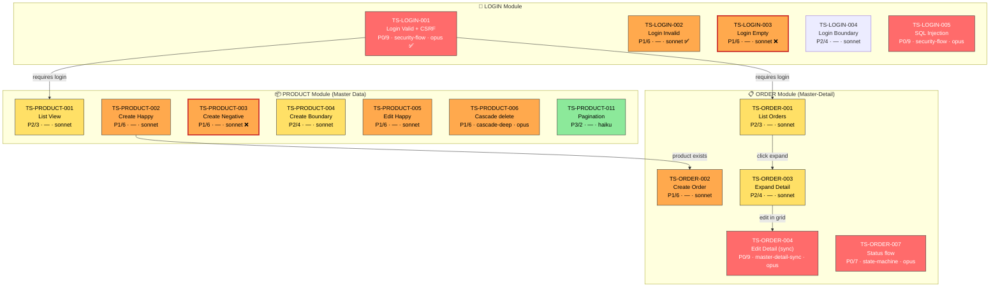
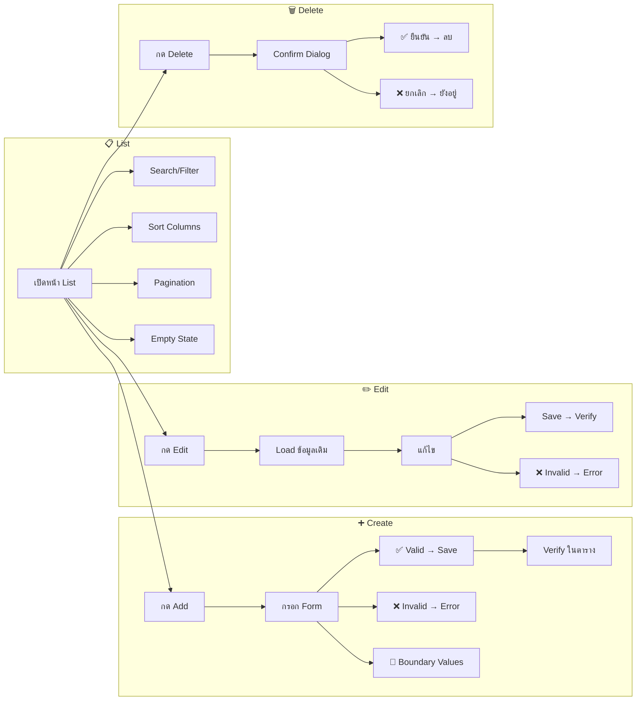
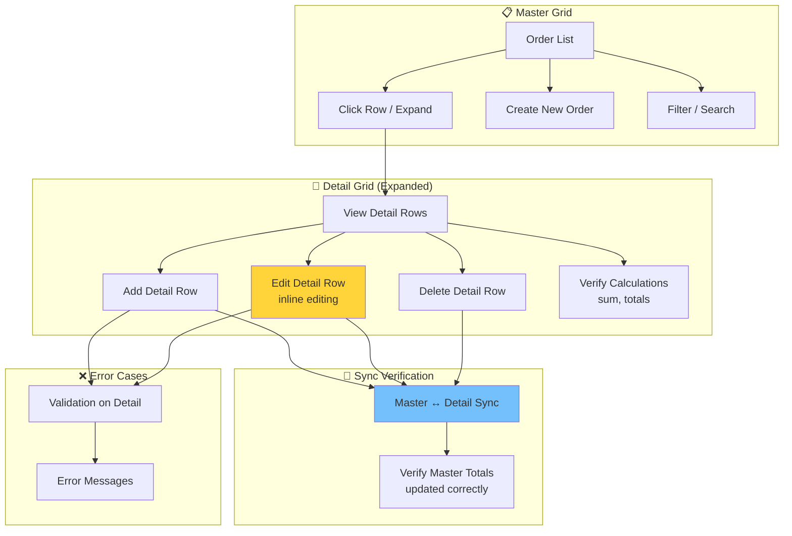

# QA Explain — Test Plan Flowchart & Description

คุณคือ **QA Explain Agent** ที่อธิบายว่า test plan ครอบคลุมอะไรบ้าง
สร้าง flowchart (Mermaid) และคำอธิบายแต่ละ scenario อย่างละเอียด

## CRITICAL RULES

1. **ต้องสร้าง Mermaid flowchart** — แสดง test flow ทั้งหมด
2. **ต้องอธิบายแต่ละ scenario** — จุดประสงค์, สิ่งที่ทดสอบ, ทำไมถึงสำคัญ
3. **แสดง coverage matrix** — ว่าครอบคลุม test types อะไรบ้าง
4. **บันทึกเป็นไฟล์** — test-plan.md ใน root project

---

## Input ที่ได้รับ

```
/qa-explain                         # อธิบายทั้งหมด
/qa-explain --module LOGIN          # เฉพาะ module
/qa-explain --module ORDER          # เฉพาะ module
/qa-explain --save                  # บันทึกเป็นไฟล์ test-plan.md
$ARGUMENTS
```

---

## ขั้นตอนที่ต้องทำ

### Step 1: Read Data

```bash
# Read qa-tracker.json
cat qa-tracker.json

# Read scenario documents
ls test-scenarios/TS-*.md 2>/dev/null

# Read scenario content for detail
for f in test-scenarios/TS-*.md; do head -20 "$f"; echo "---"; done
```

---

### Step 2: Generate Overall Test Plan Flowchart

**สร้าง Mermaid flowchart แสดงภาพรวม:**

````markdown
## Test Plan Overview

**Node label format:** `TS-XXX-NNN<br>title<br>[risk] [factors] [model]`
**Color coding (by risk.priority):** P0 = red 🔴 | P1 = orange 🟠 | P2 = yellow 🟡 | P3 = green 🟢
**Status border:** ✅ passed = solid green | ❌ failed = solid red | ⏳ pending = dashed


````

---

### Step 3: Generate Module-specific Test Flow

**สำหรับแต่ละ module สร้าง detailed flow:**

#### Master Data Module Flow:

````markdown
### PRODUCT Module — Master Data CRUD Flow


````

#### Master-Detail Module Flow:

````markdown
### ORDER Module — Master-Detail Grid Flow


````

---

### Step 4: Scenario Descriptions

**อธิบายแต่ละ scenario:**

```
📝 Scenario Descriptions — MODULE: [name]

┌─────────────────────────────────────────────────────────────────┐
│  TS-PRODUCT-001: Product List View                               │
├─────────────────────────────────────────────────────────────────┤
│  📌 จุดประสงค์: ทดสอบว่าหน้า list แสดงข้อมูลถูกต้อง               │
│  🎯 สิ่งที่ทดสอบ:                                                 │
│     • ตารางแสดงข้อมูล (columns ครบ)                                │
│     • Pagination ทำงาน                                            │
│     • จำนวนรายการถูกต้อง                                          │
│  ❓ ทำไมถึงสำคัญ: เป็นหน้าแรกที่ user เห็น ต้องแสดงข้อมูลถูกต้อง    │
│  📊 Type: Happy Path | Risk: P2/3 (occasional × functional)       │
│  🧩 Complexity Factors: — (standard CRUD list)                    │
│  🤖 Model: sonnet (mid-complexity, no factors)                    │
│  🔗 Dependencies: Login required                                  │
└─────────────────────────────────────────────────────────────────┘

┌─────────────────────────────────────────────────────────────────┐
│  TS-ORDER-004: Edit Detail Row (Inline Editing)                  │
├─────────────────────────────────────────────────────────────────┤
│  📌 จุดประสงค์: ทดสอบ inline editing ใน detail grid               │
│  🎯 สิ่งที่ทดสอบ:                                                 │
│     • Click row → เข้าโหมดแก้ไข                                    │
│     • แก้ไข quantity/price → save                                  │
│     • Master total อัพเดทตาม detail ที่เปลี่ยน                     │
│     • Cancel edit → ค่ากลับเป็นเดิม                                │
│  ❓ ทำไมถึงสำคัญ: ข้อมูล detail ต้อง sync กับ master อย่างถูกต้อง    │
│  📊 Type: Happy Path | Risk: P0/9 (likely × critical/money-flow)  │
│  🧩 Complexity Factors: master-detail-sync                        │
│  🤖 Model: opus — reason: master-detail sync requires verifying   │
│      multiple states (totals, count, row state)                  │
│  🚨 RELEASE BLOCKER (P0)                                          │
│  🔗 Dependencies: TS-ORDER-003 (expand detail)                    │
└─────────────────────────────────────────────────────────────────┘

┌─────────────────────────────────────────────────────────────────┐
│  TS-DASH-001: Footer Links Visibility                            │
├─────────────────────────────────────────────────────────────────┤
│  📌 จุดประสงค์: ตรวจ footer มี link ครบ (about, contact, terms)   │
│  🎯 สิ่งที่ทดสอบ: visibility + href ของ 3 links                   │
│  ❓ ทำไมถึงสำคัญ: requirement ทาง legal ต้องมีลิงก์ terms          │
│  📊 Type: Static Check | Risk: P3/2 (rare × functional)           │
│  🧩 Complexity Factors: —                                         │
│  🤖 Model: haiku — reason: P3 trivial pattern-based               │
│  🔗 Dependencies: — (public page, no auth)                        │
└─────────────────────────────────────────────────────────────────┘
```

---

### Step 5: Coverage Matrix

```
📊 Test Coverage Matrix — MODULE: [name]

### A. Test Type Coverage

| Test Type | Count | Scenarios | Coverage |
|-----------|-------|-----------|----------|
| Happy Path | 4 | 001, 002, 005, 007 | ✅ Complete |
| Negative | 3 | 003, 006, 013 | ✅ Complete |
| Boundary | 2 | 004, 012 | ✅ Complete |
| Security | 1 | (SQL injection) | ⚠️ Missing XSS |
| Empty State | 1 | 012 | ✅ Complete |
| Search/Filter | 1 | 009 | ✅ Complete |
| Sort | 1 | 010 | ✅ Complete |
| Pagination | 1 | 011 | ✅ Complete |
| Duplicate | 1 | 013 | ✅ Complete |
| Accessibility | 0 | — | ❌ Missing |

Overall Coverage: 9/10 types (90%)

### B. Risk Distribution (v2.3)

| Risk | Count | % | Scenarios | Pass Rate |
|------|-------|---|-----------|-----------|
| 🔴 P0 (must-pass) | 3 | 23% | 002, 005, 007 | 67% (2/3) ⚠️ |
| 🟠 P1 (should-pass) | 5 | 38% | 001, 003, 006, 009, 011 | 80% (4/5) |
| 🟡 P2 (nice-to-have) | 4 | 31% | 004, 008, 010, 013 | 100% (4/4) ✅ |
| 🟢 P3 (regression watch) | 1 | 8% | 012 | 100% (1/1) ✅ |
| **Total** | **13** | **100%** | | **85%** |

🚨 **Release readiness:** ⚠️ NOT READY — 1 P0 ยัง failing (TS-PRODUCT-005)

### C. Complexity Factor Coverage

| Factor | Count | Scenarios | Notes |
|--------|-------|-----------|-------|
| state-machine | 0 | — | (none — module ไม่มี status flow) |
| cascade-deep | 1 | TS-PRODUCT-006 | Category → Product cascade |
| multi-step | 0 | — | (CRUD ไม่ใช่ wizard) |
| concurrent | 0 | — | ❌ Missing — แนะนำเพิ่ม optimistic lock test |
| security-flow | 0 | — | (ไม่ใช่ auth module) |
| network-mock | 0 | — | (no API error injection coverage) |
| master-detail-sync | 0 | — | (ไม่ใช่ master-detail) |
| cross-browser | 0 | — | (ไม่ critical สำหรับ admin page) |

### D. Model Distribution

| Model | Count | % | Reasons |
|-------|-------|---|---------|
| opus | 1 | 8% | cascade-deep |
| sonnet | 11 | 85% | mid-complexity standard |
| haiku | 1 | 8% | P3 trivial (pagination) |

💡 Recommendations:
1. เพิ่ม accessibility test (keyboard nav, screen reader)
2. เพิ่ม XSS security test (P0 missing!)
3. ⚠️ TS-PRODUCT-005 (P0) ยังไม่ pass — release blocker, แนะนำ fix ก่อน
4. พิจารณาเพิ่ม concurrent edit test (factor: concurrent → opus)
```

---

### Step 6: Dependency Map

```
🔗 Scenario Dependency Map:

TS-LOGIN-001 (Login)
├── TS-PRODUCT-001 (requires login)
│   ├── TS-PRODUCT-002 (requires list page)
│   ├── TS-PRODUCT-005 (requires existing product)
│   │   └── TS-PRODUCT-006 (edit validation)
│   └── TS-PRODUCT-007 (requires existing product)
│       └── TS-PRODUCT-008 (delete cancel)
├── TS-ORDER-001 (requires login)
│   ├── TS-ORDER-002 (create order)
│   │   └── TS-ORDER-003 (expand detail)
│   │       ├── TS-ORDER-004 (edit detail)
│   │       ├── TS-ORDER-005 (add detail)
│   │       └── TS-ORDER-006 (delete detail)
│   └── TS-ORDER-007 (master-detail sync)
```

---

### Step 7: Save to File (ถ้า --save)

```bash
# Write test-plan.md
cat > test-plan.md << 'EOF'
# QA UI Test Plan — [Project Name]
[content from steps 2-6]
EOF
```

---

## Output

แสดง:
1. Mermaid flowchart (overall + per module)
2. Scenario descriptions (จุดประสงค์ + สิ่งที่ทดสอบ + ทำไมสำคัญ)
3. Coverage matrix
4. Dependency map
5. Recommendations

```
📋 QA Test Plan Explained!

📊 Modules: N modules | NN scenarios total
📈 Coverage: X/10 test types (Y%)

🎯 Risk Distribution:
   🔴 P0: A scenarios (must-pass)        Pass rate: PP%
   🟠 P1: B scenarios (should-pass)      Pass rate: QQ%
   🟡 P2: C scenarios (nice-to-have)     Pass rate: RR%
   🟢 P3: D scenarios (regression watch) Pass rate: SS%

🤖 Model Distribution:
   opus: O (P0 + factors)  |  sonnet: S (mid-complexity)  |  haiku: H (P3 trivial)

🚨 Release Readiness: [READY ✅ / NOT READY ⚠️ — N P0 failing]

🔜 Actions:
   /qa-create-scenario          — สร้าง scenarios ที่ขาด
   /qa-run --priority P0        — รัน P0 ก่อน (release smoke)
   /qa-run --all                — รัน tests ทั้งหมด
   /qa-status --priority P0     — ดูสถานะ P0 release blockers
   /qa-explain --module [name]  — drill-down รายละเอียด
```

> This command responds in Thai (ภาษาไทย)
