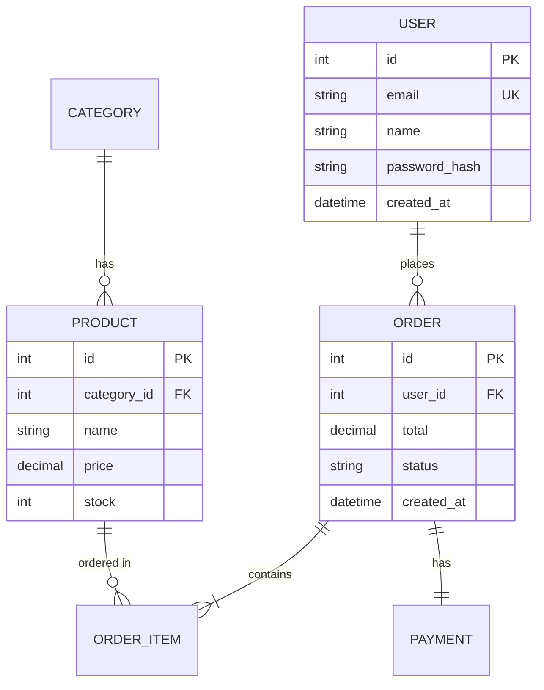
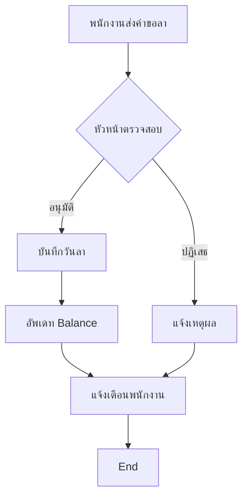
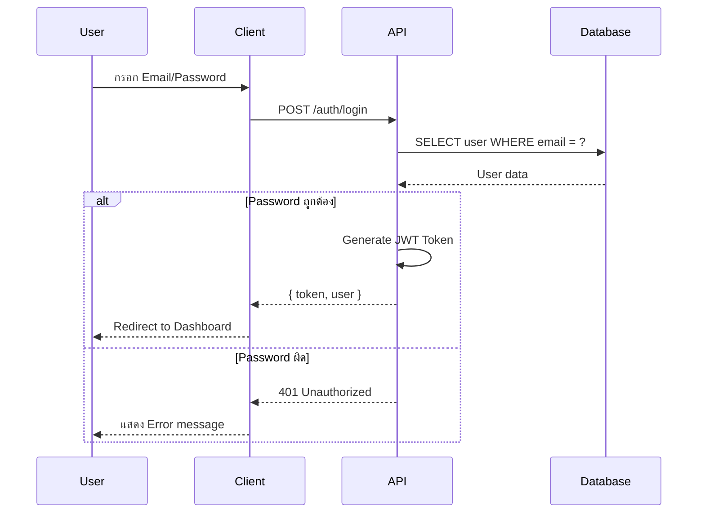

# System Design Document Plugin

> สร้างเอกสารออกแบบระบบมาตรฐาน รองรับ Reverse Engineering จาก codebase พร้อม Mermaid diagrams

## Overview

Plugin สำหรับสร้างเอกสารออกแบบระบบ (System Design Document) แบบครบวงจร รองรับทั้งการสร้างใหม่จาก requirements และ reverse engineering จาก codebase ที่มีอยู่

### Features

- **สร้างเอกสารใหม่** - สร้างจาก requirements/scope ที่ผู้ใช้ระบุ
- **Reverse Engineering** - วิเคราะห์ codebase แล้วสร้างเอกสารอัตโนมัติ
- **Mermaid Diagrams** - รองรับ diagrams หลากหลายรูปแบบ
- **รองรับหลาย Technology** - .NET, Node.js, Python, Java, Go, etc.
- **ภาษาไทย/อังกฤษ** - รองรับทั้งสองภาษา

---

## Quick Start

### Command พื้นฐาน

```
/system-design-doc [คำสั่งหรือรายละเอียด]
```

### ตัวอย่างการใช้งาน

```bash
# สร้างเอกสารใหม่
/system-design-doc สร้างเอกสารสำหรับระบบ HR

# Reverse Engineering จาก codebase
/system-design-doc วิเคราะห์ codebase นี้แล้วสร้างเอกสาร

# สร้าง Diagram เฉพาะ
/system-design-doc สร้าง ER Diagram สำหรับระบบจองห้องประชุม
```

---

## Modes การทำงาน

### Mode 1: สร้างเอกสารใหม่

เหมาะสำหรับโปรเจคใหม่ที่ยังไม่มี code

**ตัวอย่างคำสั่ง:**
```bash
/system-design-doc สร้าง System Design Document สำหรับระบบ HR
/system-design-doc สร้างเอกสารระบบจองห้องประชุม
/system-design-doc ออกแบบระบบ E-commerce
```

**Workflow:**
```
1. รวบรวม Requirements → รายละเอียด scope, features, users
2. กำหนดโครงสร้าง → Modules, Technology Stack
3. สร้าง Diagrams → ER, Flow, DFD, Sitemap, Sequence
4. เขียน Data Dictionary → Tables และ Fields ทั้งหมด
5. กำหนด Roles & Permissions → User roles และสิทธิ์
```

---

### Mode 2: Reverse Engineering

เหมาะสำหรับโปรเจคที่มี code อยู่แล้ว แต่ไม่มีเอกสาร

**ตัวอย่างคำสั่ง:**
```bash
/system-design-doc วิเคราะห์ codebase นี้แล้วสร้างเอกสาร
/system-design-doc reverse engineer จาก code
/system-design-doc อ่าน code แล้วสร้าง System Design Document
```

**Workflow:**
```
1. Scan → สแกนโครงสร้าง project
2. Identify → ระบุ framework และ technology
3. Analyze → วิเคราะห์ไฟล์สำคัญ (Models, Controllers, Routes)
4. Extract → สกัดข้อมูลจาก code
5. Generate → สร้างเอกสารตาม template
6. Validate → ตรวจสอบความถูกต้อง
```

**ไฟล์ที่วิเคราะห์:**

| Component | ไฟล์ที่อ่าน | สร้าง Diagram |
|-----------|-------------|---------------|
| Models/Entities | `models/`, `entities/` | ER Diagram |
| Controllers/APIs | `controllers/`, `api/` | Sequence Diagram |
| Services | `services/`, `usecases/` | Flow Diagram |
| Routes/Pages | `routes/`, `pages/` | Sitemap |
| Database | `migrations/`, `schema.prisma` | Data Dictionary |

---

### Mode 3: สร้าง Diagram เฉพาะ

สร้าง diagram เฉพาะส่วนที่ต้องการ

**ตัวอย่างคำสั่ง:**

| Diagram | คำสั่ง |
|---------|-------|
| ER Diagram | `/system-design-doc สร้าง ER Diagram สำหรับระบบจองห้องประชุม` |
| Flow Diagram | `/system-design-doc เขียน Flow Diagram สำหรับกระบวนการอนุมัติลา` |
| Data Dictionary | `/system-design-doc ทำ Data Dictionary สำหรับตาราง employees` |
| DFD | `/system-design-doc สร้าง Data Flow Diagram Level 1 สำหรับระบบสั่งซื้อ` |
| Sitemap | `/system-design-doc ออกแบบ Sitemap สำหรับเว็บ E-commerce` |
| Sequence Diagram | `/system-design-doc เขียน Sequence Diagram สำหรับ Login process` |

---

## Examples

### Example 1: สร้างเอกสารระบบ HR

```bash
/system-design-doc สร้าง System Design Document สำหรับระบบ HR Management
```

**Output:**
```
✅ สร้าง System Design Document สำเร็จ!

📁 File: system-design-hr-management.md

📊 Document Summary:
   • 10 sections completed
   • 5 diagrams (ER, Flow, DFD, Sitemap, Sequence)
   • 12 tables in Data Dictionary
   • 4 User Roles defined

📈 Diagrams included:
   • ER Diagram: 8 entities, 12 relationships
   • Flow Diagrams: 3 (Leave Request, Approval, Payroll)
   • DFD Level 1: 5 processes
   • Sitemap: 15 pages
   • Sequence: 2 (Login, Leave Request)

💡 Next steps:
   • /ui-mockup → สร้าง UI Mockups จากเอกสาร
   • Review และปรับปรุงเอกสาร
```

---

### Example 2: Reverse Engineering .NET Project

```bash
/system-design-doc วิเคราะห์ codebase .NET นี้แล้วสร้างเอกสาร
```

**Process:**
```
1. Scan project structure
   ├── *.sln, *.csproj → ระบุเป็น .NET project
   ├── Entities/ → พบ 8 Entity classes
   ├── Controllers/ → พบ 5 API Controllers
   └── Services/ → พบ 6 Business Services

2. Analyze files
   ├── Read Entity classes → สร้าง ER Diagram
   ├── Read Controllers → สร้าง API endpoints list
   └── Read Services → สร้าง Flow Diagrams

3. Generate document → system-design-[project-name].md
```

---

### Example 3: สร้าง ER Diagram เฉพาะ

```bash
/system-design-doc สร้าง ER Diagram สำหรับระบบ E-commerce
```

**Output:**
```
✅ สร้าง ER Diagram สำเร็จ!

📊 ER Diagram Summary:
   • Entities: 6 (User, Product, Category, Order, OrderItem, Payment)
   • Relationships: 8
   • Primary Keys: 6
   • Foreign Keys: 5
```



---

### Example 4: สร้าง Flow Diagram จาก Code

```bash
/system-design-doc อ่าน code แล้วสร้าง Flow Diagram ของ process อนุมัติลา
```

**Output:**



---

### Example 5: สร้าง Sequence Diagram สำหรับ Login

```bash
/system-design-doc เขียน Sequence Diagram สำหรับ Login process
```

**Output:**



---

## Document Structure

เอกสารที่สร้างประกอบด้วย 10 ส่วนหลัก:

```
📄 system-design-[project-name].md
├── 1. บทนำและภาพรวมระบบ (Introduction & Overview)
│   ├── ชื่อโครงการ
│   ├── วัตถุประสงค์
│   ├── ขอบเขต (Scope)
│   └── สถาปัตยกรรมภาพรวม
├── 2. ความต้องการระบบ (System Requirements)
│   ├── Functional Requirements
│   ├── Non-Functional Requirements
│   └── Business Rules
├── 3. โมดูลที่เกี่ยวข้อง (Module Overview)
├── 4. Data Model
├── 5. Data Flow Diagram
├── 6. Flow Diagrams
├── 7. ER Diagram
├── 8. Data Dictionary
├── 9. Sitemap
└── 10. User Roles & Permissions
```

---

## Supported Technologies

Plugin รองรับการ Reverse Engineering จาก:

| Technology | File Patterns |
|------------|---------------|
| **.NET/C#** | `*.csproj`, `*.sln`, `Entities/`, `Controllers/` |
| **Node.js** | `package.json`, `src/`, `routes/`, `models/` |
| **Python** | `requirements.txt`, `pyproject.toml`, `models.py` |
| **Java/Spring** | `pom.xml`, `build.gradle`, `@Entity`, `@Controller` |
| **Go** | `go.mod`, `handlers/`, `models/` |
| **Ruby/Rails** | `Gemfile`, `app/models/`, `app/controllers/` |
| **Rust** | `Cargo.toml`, `src/` |

---

## Diagram Types

### 1. ER Diagram (Entity Relationship)
- แสดงความสัมพันธ์ระหว่าง entities/tables
- รองรับ 1:1, 1:N, M:N relationships
- แสดง PK, FK, attributes

### 2. Flow Diagram
- แสดงขั้นตอนการทำงาน (Flowchart)
- รองรับ decisions, loops, subprocesses

### 3. Data Flow Diagram (DFD)
- แสดงการไหลของข้อมูลในระบบ
- External entities, Processes, Data stores

### 4. Sequence Diagram
- แสดงลำดับการทำงานระหว่าง components
- Request/Response patterns

### 5. Sitemap
- แสดงโครงสร้างหน้าเว็บ
- Navigation paths

### 6. State Diagram
- แสดงการเปลี่ยนสถานะ
- State transitions

### 7. Class Diagram
- แสดงโครงสร้าง classes
- Inheritance, composition

---

## Best Practices

### 1. ก่อนใช้งาน
- ใช้ Plan Mode วางแผนก่อน (พิมพ์ "plan" หรือกด Shift+Tab)
- สร้าง CLAUDE.md ก่อนด้วย `/init-project`

### 2. การสร้างเอกสารใหม่
- ระบุ scope และ features ให้ชัดเจน
- ระบุ technology stack ที่จะใช้
- กำหนด user roles ตั้งแต่เริ่มต้น

### 3. การ Reverse Engineering
- ตรวจสอบว่า codebase มีโครงสร้างชัดเจน
- ระบุ entry point ของระบบ
- Review เอกสารที่สร้างก่อน finalize

### 4. หลังสร้างเอกสาร
- Review และปรับปรุงเอกสาร
- ใช้ `/init-mockup` → `/create-mockup` สร้าง UI Mockups
- ใช้ `/init-agent` เริ่ม development

---

## Workflow Integration

### Complete Development Workflow

```
┌─────────────────────────────────────────────────────────────────────────────┐
│                         COMPLETE WORKFLOW                                    │
├─────────────────────────────────────────────────────────────────────────────┤
│                                                                              │
│  Step 0: Plan Mode (Built-in)                                               │
│       ↓                                                                      │
│  Step 1: /init-project                                                       │
│       │   └── สร้าง CLAUDE.md                                               │
│       ↓                                                                      │
│  Step 2: /system-design-doc  ◄── คุณอยู่ที่นี่                               │
│       │   └── สร้าง System Design Document                                  │
│       ↓                                                                      │
│  Step 3: /init-mockup → /create-mockup                                       │
│       │   └── สร้าง UI Mockups                                              │
│       ↓                                                                      │
│  Step 4: /init-agent                                                         │
│       │   └── Initialize development environment                             │
│       ↓                                                                      │
│  Step 5: /continue (Development Loop)                                        │
│       │   └── พัฒนา features ตาม feature_list.json                          │
│       ↓                                                                      │
│  Step 6: /test, /ui-test                                                     │
│          └── Testing                                                         │
│                                                                              │
└─────────────────────────────────────────────────────────────────────────────┘
```

---

## Resources

| File | Description |
|------|-------------|
| `skills/system-design-doc/SKILL.md` | รายละเอียด skill และ commands |
| `commands/system-design-doc.md` | Command specification |
| `templates/design-doc-template.md` | Template เอกสารฉบับเต็ม |
| `references/codebase-analysis.md` | วิธีวิเคราะห์ codebase |
| `references/mermaid-patterns.md` | รูปแบบ Mermaid diagrams |
| `references/document-sections.md` | รายละเอียดแต่ละ section |
| `references/data-dictionary-template.md` | Template Data Dictionary |

---

## Troubleshooting

### Q: เอกสารที่สร้างไม่ครบ
**A:** ระบุ scope และ features ให้ละเอียดมากขึ้น หรือแยกสร้างทีละ diagram

### Q: Reverse Engineering ไม่พบข้อมูล
**A:** ตรวจสอบว่า:
- อยู่ใน root directory ของ project
- Project มีโครงสร้างมาตรฐาน (Models, Controllers, etc.)
- ระบุ technology ที่ใช้ให้ชัดเจน

### Q: Diagram ไม่ render
**A:** ตรวจสอบ Mermaid syntax ใน editor ที่รองรับ (VS Code, GitHub, etc.)

---

## Version

- **Version:** 1.1.0
- **Author:** Mounchons
- **Last Updated:** 2025-12

---

## Related Skills

- **[ui-mockup](../ui-mockup/)** - สร้าง UI Mockups จากเอกสาร
- **[long-running-agent](../long-running-agent/)** - Development workflow
- **[dotnet-dev](../dotnet-dev/)** - .NET Development patterns
