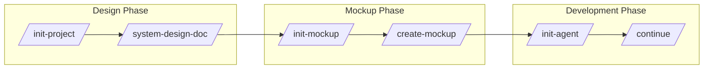

# System Design Document Plugin

> สร้างเอกสารออกแบบระบบมาตรฐาน รองรับ Reverse Engineering จาก codebase พร้อม Mermaid diagrams และ Architecture patterns

## Overview

Plugin สำหรับสร้างเอกสารออกแบบระบบ (System Design Document) แบบครบวงจร รองรับทั้งการสร้างใหม่จาก requirements และ reverse engineering จาก codebase ที่มีอยู่ พร้อม Architecture patterns สำหรับ Microservices, Event-driven, Clean Architecture และ DDD

### Features

- **สร้างเอกสารใหม่** - สร้างจาก requirements/scope ที่ผู้ใช้ระบุ
- **Reverse Engineering** - วิเคราะห์ codebase แล้วสร้างเอกสารอัตโนมัติ
- **Mermaid Diagrams** - รองรับ 8 ประเภท diagrams
- **Architecture Patterns** - Microservices, Event-driven, Clean Architecture, DDD
- **รองรับหลาย Technology** - .NET, Node.js, Python, Java, Go, Ruby, PHP
- **Tracking System** - ติดตามสถานะเอกสารด้วย `design_doc_list.json`
- **Validation** - ตรวจสอบความครบถ้วนและความสอดคล้อง
- **ภาษาไทย/อังกฤษ** - รองรับทั้งสองภาษา

---

## Commands

| Command | Description |
|---------|-------------|
| `/create-design-doc` | สร้างเอกสารออกแบบระบบใหม่จาก requirements |
| `/reverse-engineer` | สร้างเอกสารจาก codebase ที่มีอยู่ |
| `/create-diagram` | สร้าง diagram เฉพาะประเภท (ER, Flow, DFD, Sequence, etc.) |
| `/edit-section` | แก้ไขส่วนใดส่วนหนึ่งของเอกสาร |
| `/validate-design-doc` | ตรวจสอบความครบถ้วนและความสอดคล้อง |
| `/sync-with-mockups` | Sync entities และ pages กับ ui-mockup |
| `/sync-with-features` | Sync APIs และ entities กับ long-running-agent |
| `/validate-integration` | ตรวจสอบ cross-references ทั้ง 3 plugins |
| `/system-design-doc` | คำสั่งทั่วไป (รองรับทุก mode) |

---

## Quick Start

### สร้างเอกสารใหม่

```bash
/create-design-doc สร้างเอกสารสำหรับระบบ HR
```

### Reverse Engineering จาก codebase

```bash
/reverse-engineer วิเคราะห์ codebase นี้
```

### สร้าง Diagram เฉพาะ

```bash
/create-diagram ER Diagram สำหรับระบบจองห้องประชุม
/create-diagram Flow Diagram สำหรับกระบวนการอนุมัติลา
/create-diagram Sequence Diagram สำหรับ Login process
```

### แก้ไขและตรวจสอบ

```bash
/edit-section ER Diagram - เพิ่ม entity Payment
/validate-design-doc
```

---

## Modes การทำงาน

### Mode 1: สร้างเอกสารใหม่

เหมาะสำหรับโปรเจคใหม่ที่ยังไม่มี code

**Workflow:**
```
1. รวบรวม Requirements → รายละเอียด scope, features, users
2. กำหนดโครงสร้าง → 10 Sections ตาม template
3. สร้าง Diagrams → ER, Flow, DFD, Sitemap, Sequence
4. เขียน Data Dictionary → Tables และ Fields ทั้งหมด
5. กำหนด Roles & Permissions → User roles และสิทธิ์
6. Validate → ตรวจสอบความครบถ้วน
```

### Mode 2: Reverse Engineering

เหมาะสำหรับโปรเจคที่มี code อยู่แล้ว แต่ไม่มีเอกสาร

**Workflow:**
```
1. Scan → สแกนโครงสร้าง project
2. Identify → ระบุ framework และ technology
3. Analyze → วิเคราะห์ไฟล์สำคัญ (Models, Controllers, Routes)
4. Extract → สกัดข้อมูลจาก code
5. Generate → สร้างเอกสารตาม template
6. Validate → ตรวจสอบความถูกต้องกับ code
```

### Mode 3: สร้าง Diagram เฉพาะ

สร้าง diagram เฉพาะส่วนที่ต้องการ

| Diagram | ตัวอย่างคำสั่ง |
|---------|---------------|
| ER Diagram | `/create-diagram ER Diagram สำหรับระบบ E-commerce` |
| Flow Diagram | `/create-diagram Flow Diagram กระบวนการอนุมัติลา` |
| DFD | `/create-diagram DFD Level 1 ระบบสั่งซื้อ` |
| Sequence | `/create-diagram Sequence Diagram Login process` |
| Sitemap | `/create-diagram Sitemap เว็บ E-commerce` |
| State | `/create-diagram State Diagram Order status` |
| Architecture | `/create-diagram Architecture Microservices` |

---

## Document Structure

เอกสารที่สร้างประกอบด้วย 10 ส่วนหลัก:

| # | Section | Description |
|---|---------|-------------|
| 1 | Introduction & Overview | ข้อมูลโครงการ, วัตถุประสงค์, ขอบเขต, Architecture |
| 2 | System Requirements | FR, NFR, Business Rules, Constraints |
| 3 | Module Overview | รายการ modules, dependencies |
| 4 | Data Model | Entity overview, relationships |
| 5 | Data Flow Diagram | DFD Level 0, 1, 2 |
| 6 | Flow Diagrams | Business process flows |
| 7 | ER Diagram | Entity relationships, cardinality |
| 8 | Data Dictionary | Table definitions, columns, constraints |
| 9 | Sitemap | Page hierarchy, navigation |
| 10 | User Roles & Permissions | Roles, permission matrix |

---

## Architecture Patterns

### Supported Patterns

| Category | Patterns |
|----------|----------|
| **Microservices** | Service Boundary, API Gateway, Service Mesh, Database per Service |
| **Event-driven** | Event Sourcing, CQRS, Saga (Choreography/Orchestration), Message Broker |
| **Clean Architecture** | Layer Diagram, Dependency Flow, Use Case Flow |
| **DDD** | Bounded Context, Aggregate, Domain Events, Context Mapping |

### When to Use

| Pattern | Use When |
|---------|----------|
| **Microservices** | Large team, independent deployment needs |
| **Event-Driven** | Loose coupling, async processing needed |
| **CQRS** | Different read/write patterns |
| **Event Sourcing** | Full audit history required |
| **Clean Architecture** | Long-lived apps, testability priority |
| **DDD** | Complex domain logic |

---

## Supported Technologies

Plugin รองรับการ Reverse Engineering จาก:

| Technology | Detection Files | Entities Location |
|------------|-----------------|-------------------|
| **.NET/C#** | `*.csproj`, `*.sln` | `Models/`, `Entities/` |
| **Node.js/Express** | `package.json` | `models/` |
| **Node.js/Prisma** | `schema.prisma` | `prisma/schema.prisma` |
| **Python/Django** | `requirements.txt` | `*/models.py` |
| **Laravel** | `composer.json` | `app/Models/` |
| **Java/Spring** | `pom.xml`, `build.gradle` | `**/entity/*.java` |
| **Go** | `go.mod` | `models/` |
| **Ruby/Rails** | `Gemfile` | `app/models/` |

### Legacy Support

| Technology | Files to Analyze |
|------------|------------------|
| **ASP.NET WebForms** | `*.aspx`, `App_Code/`, `Web.config` |
| **Classic ASP** | `*.asp`, `includes/` |

---

## Diagram Types

| Diagram | Mermaid Syntax | Use Case |
|---------|----------------|----------|
| ER Diagram | `erDiagram` | Entity relationships, database design |
| Flow Diagram | `flowchart TD/LR` | Business processes, approval workflows |
| DFD | `flowchart` + subgraphs | Data flow between systems |
| Sequence Diagram | `sequenceDiagram` | API calls, system interactions |
| Sitemap | `flowchart TD` | Page structure, navigation |
| State Diagram | `stateDiagram-v2` | Status transitions, lifecycle |
| Class Diagram | `classDiagram` | Data model, OOP structure |
| Architecture | `flowchart` + subgraphs | System architecture |

---

## Output Files

### Directory Structure

```
.design-docs/
├── design_doc_list.json          # Tracking file
├── system-design-[project].md    # Main document
├── diagrams/                     # (optional) Exported diagrams
└── exports/                      # (optional) PDF, DOCX exports
```

### Example Output

```
✅ สร้าง System Design Document สำเร็จ!

📁 File: .design-docs/system-design-hr-management.md

📊 Document Summary:
   • 10 sections completed
   • 7 diagrams (ER, 3 Flow, DFD L0+L1, Sitemap, 2 Sequence)
   • 12 tables in Data Dictionary
   • 4 User Roles defined

📈 Statistics:
   • Entities: 8
   • Relationships: 12
   • API Endpoints: 15
   • Pages: 20

💡 Next steps:
   • /ui-mockup → สร้าง UI Mockups จากเอกสาร
   • /validate-design-doc → ตรวจสอบความครบถ้วน
```

---

## Best Practices

### 1. ก่อนใช้งาน
- ใช้ Plan Mode วางแผนก่อน (พิมพ์ "plan" หรือกด Shift+Tab)
- สร้าง CLAUDE.md ก่อนด้วย `/init-project`

### 2. การสร้างเอกสารใหม่
- ระบุ scope และ features ให้ชัดเจน
- ระบุ technology stack ที่จะใช้
- กำหนด user roles ตั้งแต่เริ่มต้น

### 3. การ Reverse Engineering
- ตรวจสอบว่า codebase มีโครงสร้างชัดเจน
- ระบุ entry point ของระบบ
- Review เอกสารที่สร้างก่อน finalize

### 4. หลังสร้างเอกสาร
- ใช้ `/validate-design-doc` ตรวจสอบความครบถ้วน
- Review และปรับปรุงเอกสาร
- ใช้ `/init-mockup` → `/create-mockup` สร้าง UI Mockups
- ใช้ `/init-agent` เริ่ม development

---

## Workflow Integration

### Complete Development Workflow



---

## Resources

| File | Description |
|------|-------------|
| `skills/system-design-doc/SKILL.md` | รายละเอียด skill และ commands |
| `commands/create-design-doc.md` | สร้างเอกสารใหม่ |
| `commands/reverse-engineer.md` | Reverse engineering |
| `commands/create-diagram.md` | สร้าง diagram เฉพาะ |
| `commands/edit-section.md` | แก้ไข section |
| `commands/validate-design-doc.md` | ตรวจสอบเอกสาร |
| `references/mermaid-patterns.md` | รูปแบบ Mermaid diagrams |
| `references/architecture-patterns.md` | Architecture patterns |
| `references/troubleshooting.md` | แก้ไขปัญหาที่พบบ่อย |
| `references/codebase-analysis.md` | วิธีวิเคราะห์ codebase |
| `references/document-sections.md` | รายละเอียดแต่ละ section |
| `references/data-dictionary-template.md` | Template Data Dictionary |
| `templates/design-doc-template.md` | Template เอกสารฉบับเต็ม |
| `templates/design_doc_list.json` | Schema สำหรับ tracking |

---

## Troubleshooting

### Q: เอกสารที่สร้างไม่ครบ
**A:** ระบุ scope และ features ให้ละเอียดมากขึ้น หรือใช้ `/edit-section` เพิ่มทีละส่วน

### Q: Reverse Engineering ไม่พบข้อมูล
**A:** ตรวจสอบว่า:
- อยู่ใน root directory ของ project
- Project มีโครงสร้างมาตรฐาน (Models, Controllers, etc.)
- ระบุ technology ที่ใช้ให้ชัดเจน

### Q: Diagram ไม่ render
**A:** ตรวจสอบ Mermaid syntax ด้วย `/validate-design-doc` หรือดู `references/troubleshooting.md`

### Q: ER Diagram และ Data Dictionary ไม่ตรงกัน
**A:** ใช้ `/validate-design-doc` เพื่อตรวจสอบ consistency แล้วใช้ `/edit-section` แก้ไข

---

## Cross-Plugin Integration

### Plugin Ecosystem

system-design-doc ทำงานร่วมกับ ui-mockup และ long-running-agent:

```
┌─────────────────────┐
│  system-design-doc  │  ← Source of Truth
│  design_doc_list    │     (Entities, APIs, Diagrams)
└──────────┬──────────┘
           │
    ┌──────┴──────┐
    ▼             ▼
┌─────────┐  ┌──────────────┐
│ui-mockup│  │long-running  │
│ Pages   │  │ Features     │
└─────────┘  └──────────────┘
```

### Integration Fields (v2.0.0)

**design_doc_list.json:**
```json
{
  "schema_version": "2.0.0",
  "integration": {
    "mockup_list_path": ".mockups/mockup_list.json",
    "feature_list_path": "feature_list.json",
    "last_synced_with_mockups": null,
    "last_synced_with_features": null
  },
  "entities": [...],
  "api_endpoints": [...],
  "layers": [...]
}
```

### Sync Workflow

```bash
# 1. สร้างเอกสาร design
/create-design-doc หรือ /reverse-engineer

# 2. Sync กับ mockups
/sync-with-mockups

# 3. Sync กับ features
/sync-with-features

# 4. Validate integration
/validate-integration
```

### Compatible Versions

| Plugin | Minimum Version |
|--------|-----------------|
| design_doc_list.json | 2.0.0 |
| mockup_list.json | 1.6.0 |
| feature_list.json | 1.10.0 |

---

## Version

- **Version:** 1.3.0
- **Author:** Mounchons
- **Last Updated:** 2025-01

### What's New in 1.3.0
- **Cross-Plugin Integration** - เชื่อมโยงกับ ui-mockup และ long-running-agent
- **New Schema v2.0.0** - เพิ่ม integration, entities, api_endpoints, layers
- **Sync Commands** - /sync-with-mockups, /sync-with-features, /validate-integration
- **Bidirectional References** - cross-references ระหว่าง 3 plugins
- **Integration Score** - คำนวณ coverage score โดยอัตโนมัติ

### What's New in 1.2.0
- Added 5 granular commands (create-design-doc, reverse-engineer, create-diagram, edit-section, validate-design-doc)
- Added Architecture Patterns (Microservices, Event-driven, Clean Architecture, DDD)
- Added Troubleshooting guide
- Added design_doc_list.json for tracking
- Expanded SKILL.md with workflows, rules, and integration patterns

---

## Related Skills

- **[ui-mockup](../ui-mockup/)** - สร้าง UI Mockups จากเอกสาร (ต้อง v1.4.0+)
- **[long-running-agent](../long-running-agent/)** - Development workflow (ต้อง v1.10.0+)
- **[dotnet-dev](../dotnet-dev/)** - .NET Development patterns
