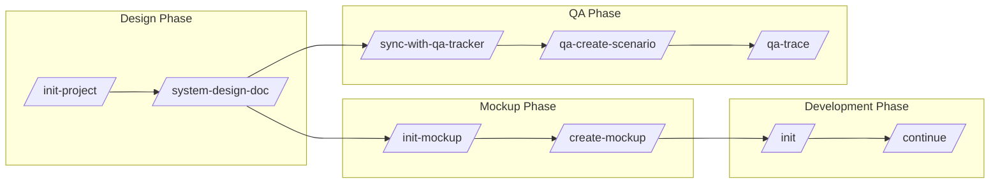

# System Design Document Plugin

> สร้างเอกสารออกแบบระบบมาตรฐาน รองรับ Reverse Engineering จาก codebase พร้อม Mermaid diagrams, Architecture patterns, split per-section layout และ machine-readable registry

## What's new in v2.2

- **Documentation sync** — README + `/help` ตรงกับความสามารถจริงครบ 22 commands
- **Main entry migrated** — `/system-design-doc` สร้าง split layout (default) เหมือน `/create-design-doc` และ `/import-plan` แล้ว
- **qa-ui-test contract ซ่อมครบ 2 ฝั่ง** — `/qa-trace` (qa-ui-test v2.6.1) resolve AC/UC ผ่าน registry, ตัวอย่าง AC เป็น flat `AC-NNN`, เพิ่ม `scenario.use_case_id`
- **Frontmatter ครบทุก command** — เพิ่มให้ `/sync-with-features`, `/sync-with-mockups`, `/validate-integration` + แก้ allowed-tools ที่ขัดกับ steps (brainstorm-design, sitemap-scan)
- **`${CLAUDE_PLUGIN_ROOT}` paths** — template/reference paths ใน commands resolve จาก plugin install dir

### Highlights จาก v2.1 / v2.0

- **Split per-section layout (v2.1 — default)** — เอกสารแยกเป็น `.design-docs/<slug>/00-index.md` + `01..10-<key>.md` พร้อม registry `design_doc_list.json` schema 2.3.0 (`doc_layout`, `doc_dir`, `sections[]`) + `/split-design-doc` สำหรับ migrate เอกสารเก่า
- **sitemap.json (v2.0)** — machine-readable mirror ของ Section 9: 8 node types (Master/Template/Nav/Component + Page/API/Middleware/External Function), 8 commands `/sitemap-*`, validation rules R31-R35, JSON Schema draft-07 (`ajv-cli`)

---

## Overview

Plugin สำหรับสร้างเอกสารออกแบบระบบ (System Design Document) แบบครบวงจร รองรับทั้งการสร้างใหม่จาก requirements และ reverse engineering จาก codebase ที่มีอยู่ พร้อม Architecture patterns สำหรับ Microservices, Event-driven, Clean Architecture และ DDD

### Features

- **สร้างเอกสารใหม่** - สร้างจาก requirements/scope ที่ผู้ใช้ระบุ (หรือ brainstorm 8 phases ก่อน)
- **Reverse Engineering** - วิเคราะห์ codebase แล้วสร้างเอกสารอัตโนมัติ
- **Import Plan** - แปลง implementation plan / free-form doc เป็นเอกสารมาตรฐาน
- **Split Layout (default)** - เอกสารแยกไฟล์ราย section อ่าน/แก้เฉพาะส่วน ประหยัด token
- **Machine-readable Registry** - `design_doc_list.json` schema 2.3.0 ให้ plugins อื่น resolve sections ได้โดยไม่ parse prose
- **Mermaid Diagrams** - รองรับ 8 ประเภท diagrams
- **Sitemap Graph** - `.design-docs/sitemap.json` + 8 commands จัดการ nodes/edges
- **AC/UC Source of Truth** - Acceptance Criteria (`AC-NNN`) + Use Cases (`UC-NNN`) สำหรับ qa-ui-test
- **Architecture Patterns** - Microservices, Event-driven, Clean Architecture, DDD
- **รองรับหลาย Technology** - .NET, Node.js, Python, Java, Go, Ruby, PHP
- **Validation** - ตรวจสอบความครบถ้วน ความสอดคล้อง และ cross-plugin integration
- **ภาษาไทย/อังกฤษ** - รองรับทั้งสองภาษา

---

## Commands (22)

### Generation

| Command | Description |
|---------|-------------|
| `/system-design-doc` | Main entry — เลือก mode อัตโนมัติจาก argument (create / reverse / diagram เดี่ยว) |
| `/create-design-doc` | สร้างเอกสารออกแบบระบบใหม่จาก requirements (split layout default) |
| `/reverse-engineer` | สร้างเอกสารจาก codebase ที่มีอยู่ |
| `/import-plan` | นำเข้าจาก implementation plan หรือ free-form design doc |
| `/brainstorm-design` | Interactive brainstorming 8 phases เก็บ requirements ก่อนสร้างเอกสาร |

### Diagrams & Editing

| Command | Description |
|---------|-------------|
| `/create-diagram` | สร้าง diagram เฉพาะประเภท (ER, Flow, DFD, Sequence, Sitemap, State, Class, Architecture) |
| `/edit-section` | แก้ไขส่วนใดส่วนหนึ่งของเอกสาร (split-aware) |
| `/split-design-doc` | Migrate เอกสาร single-file เดิม → split per-section layout |

### Validation

| Command | Description |
|---------|-------------|
| `/validate-design-doc` | ตรวจสอบความครบถ้วนและความสอดคล้อง (layout-aware) |
| `/validate-integration` | ตรวจ cross-references ทั้ง 4 plugins (+ qa-ui-test) — read-only |
| `/sitemap-validate` | ตรวจ sitemap.json ด้วย ajv schema + กฎ R31-R35 |

### Sync

| Command | Description |
|---------|-------------|
| `/sync-with-mockups` | Sync entities และ pages กับ ui-mockup |
| `/sync-with-features` | Sync APIs และ entities กับ long-running |
| `/sync-with-qa-tracker` | Sync AC + UC กับ qa-ui-test (push IDs, pull coverage) |
| `/sync-sitemap` | Sync Section 9 ↔ sitemap.json + pull downstream stats |

### Sitemap Graph

| Command | Description |
|---------|-------------|
| `/sitemap-init` | สร้าง .design-docs/sitemap.json จาก template |
| `/sitemap-add-node` | เพิ่ม node (page/api/middleware/external/master/template/nav/component) |
| `/sitemap-link` | เพิ่ม edge ระหว่าง nodes พร้อม validate type/prefix |
| `/sitemap-scan` | Auto-scan codebase populate nodes + infer edges |
| `/sitemap-graph` | Render Mermaid graph จาก edges → Section 9.8 |
| `/sitemap-export` | Export เป็น Cytoscape JSON / GraphML / DOT |

### Utility

| Command | Description |
|---------|-------------|
| `/help` | คู่มือใช้งาน — `--quick`, `--workflow`, `--integration`, `--diagrams`, `--reverse`, `--validation`, `--qa`, `--new` |

---

## Quick Start

### สร้างเอกสารใหม่

```bash
/brainstorm-design ระบบ HR          # (optional) เก็บ requirements ก่อน
/create-design-doc สร้างเอกสารสำหรับระบบ HR
```

### Reverse Engineering จาก codebase

```bash
/reverse-engineer วิเคราะห์ codebase นี้
```

### สร้าง Diagram เฉพาะ

```bash
/create-diagram ER Diagram สำหรับระบบจองห้องประชุม
/create-diagram Flow Diagram สำหรับกระบวนการอนุมัติลา
/create-diagram Sequence Diagram สำหรับ Login process
```

### แก้ไข ตรวจสอบ และ migrate

```bash
/edit-section ER Diagram - เพิ่ม entity Payment
/validate-design-doc
/split-design-doc                   # migrate เอกสารเก่า single-file → split
```

---

## Modes การทำงาน

### Mode 1: สร้างเอกสารใหม่

เหมาะสำหรับโปรเจคใหม่ที่ยังไม่มี code

**Workflow:**
```
1. รวบรวม Requirements → รายละเอียด scope, features, users (หรือใช้ /brainstorm-design)
2. กำหนดโครงสร้าง → 10 Sections ตาม templates/sections/
3. สร้าง Diagrams → ER, Flow, DFD, Sitemap, Sequence
4. เขียน Data Dictionary → Tables และ Fields ทั้งหมด
5. กำหนด Roles & Permissions → User roles และสิทธิ์
6. เขียนไฟล์ split layout + register ใน design_doc_list.json
7. Validate → ตรวจสอบความครบถ้วน
```

### Mode 2: Reverse Engineering

เหมาะสำหรับโปรเจคที่มี code อยู่แล้ว แต่ไม่มีเอกสาร

**Workflow:**
```
1. Scan → สแกนโครงสร้าง project
2. Identify → ระบุ framework และ technology
3. Analyze → วิเคราะห์ไฟล์สำคัญ (Models, Controllers, Routes)
4. Extract → สกัดข้อมูลจาก code
5. Generate → สร้างเอกสาร split layout + registry
6. Validate → ตรวจสอบความถูกต้องกับ code
```

### Mode 3: สร้าง Diagram เฉพาะ

สร้าง diagram เฉพาะส่วนที่ต้องการ

| Diagram | ตัวอย่างคำสั่ง |
|---------|---------------|
| ER Diagram | `/create-diagram ER Diagram สำหรับระบบ E-commerce` |
| Flow Diagram | `/create-diagram Flow Diagram กระบวนการอนุมัติลา` |
| DFD | `/create-diagram DFD Level 1 ระบบสั่งซื้อ` |
| Sequence | `/create-diagram Sequence Diagram Login process` |
| Sitemap | `/create-diagram Sitemap เว็บ E-commerce` |
| State | `/create-diagram State Diagram Order status` |
| Class | `/create-diagram Class Diagram สำหรับ domain model` |
| Architecture | `/create-diagram Architecture Microservices` |

---

## Document Structure

เอกสารที่สร้างประกอบด้วย 10 ส่วนหลัก (split layout: 1 section = 1 ไฟล์):

| # | Section | File (split) | Description |
|---|---------|--------------|-------------|
| 1 | Introduction & Overview | `01-introduction.md` | ข้อมูลโครงการ, วัตถุประสงค์, ขอบเขต, Architecture |
| 2 | System Requirements | `02-requirements.md` | FR, NFR, Business Rules + **AC-NNN / UC-NNN** (qa source of truth) |
| 3 | Module Overview | `03-modules.md` | รายการ modules, dependencies |
| 4 | Data Model | `04-data-model.md` | Entity overview, relationships |
| 5 | Data Flow Diagram | `05-dfd.md` | DFD Level 0, 1, 2 |
| 6 | Flow Diagrams | `06-flow-diagrams.md` | Business process flows |
| 7 | ER Diagram | `07-er-diagram.md` | Entity relationships, cardinality |
| 8 | Data Dictionary | `08-data-dictionary.md` | Table definitions, columns, constraints |
| 9 | Sitemap | `09-sitemap.md` | Page hierarchy, navigation (+ sitemap.json mirror) |
| 10 | User Roles & Permissions | `10-permissions.md` | Roles, permission matrix |

ทุก section file มี marker `<!-- sdd-section: <key> | doc: <slug> | schema: 2.3.0 -->` ที่บรรทัดแรก เพื่อให้ consumers ตรวจสอบได้

---

## Architecture Patterns

### Supported Patterns

| Category | Patterns |
|----------|----------|
| **Microservices** | Service Boundary, API Gateway, Service Mesh, Database per Service |
| **Event-driven** | Event Sourcing, CQRS, Saga (Choreography/Orchestration), Message Broker |
| **Clean Architecture** | Layer Diagram, Dependency Flow, Use Case Flow |
| **DDD** | Bounded Context, Aggregate, Domain Events, Context Mapping |

### When to Use

| Pattern | Use When |
|---------|----------|
| **Microservices** | Large team, independent deployment needs |
| **Event-Driven** | Loose coupling, async processing needed |
| **CQRS** | Different read/write patterns |
| **Event Sourcing** | Full audit history required |
| **Clean Architecture** | Long-lived apps, testability priority |
| **DDD** | Complex domain logic |

---

## Supported Technologies

Plugin รองรับการ Reverse Engineering จาก:

| Technology | Detection Files | Entities Location |
|------------|-----------------|-------------------|
| **.NET/C#** | `*.csproj`, `*.sln` | `Models/`, `Entities/` |
| **Node.js/Express** | `package.json` | `models/` |
| **Node.js/Prisma** | `schema.prisma` | `prisma/schema.prisma` |
| **Python/Django** | `requirements.txt` | `*/models.py` |
| **Laravel** | `composer.json` | `app/Models/` |
| **Java/Spring** | `pom.xml`, `build.gradle` | `**/entity/*.java` |
| **Go** | `go.mod` | `models/` |
| **Ruby/Rails** | `Gemfile` | `app/models/` |

### Legacy Support

| Technology | Files to Analyze |
|------------|------------------|
| **ASP.NET WebForms** | `*.aspx`, `App_Code/`, `Web.config` |
| **Classic ASP** | `*.asp`, `includes/` |

---

## Diagram Types

| Diagram | Mermaid Syntax | Use Case |
|---------|----------------|----------|
| ER Diagram | `erDiagram` | Entity relationships, database design |
| Flow Diagram | `flowchart TD/LR` | Business processes, approval workflows |
| DFD | `flowchart` + subgraphs | Data flow between systems |
| Sequence Diagram | `sequenceDiagram` | API calls, system interactions |
| Sitemap | `flowchart TD` | Page structure, navigation |
| State Diagram | `stateDiagram-v2` | Status transitions, lifecycle |
| Class Diagram | `classDiagram` | Data model, OOP structure |
| Architecture | `flowchart` + subgraphs | System architecture |

---

## Output Files

### Directory Structure (split layout — default ตั้งแต่ v2.1)

```
.design-docs/
├── design_doc_list.json          # Registry (schema 2.3.0) — machine source of truth
├── sitemap.json                  # Sitemap graph (v2.0, optional)
├── <project-slug>/               # เอกสาร 1 ชุด = 1 โฟลเดอร์
│   ├── 00-index.md               # TOC + section status
│   ├── 01-introduction.md
│   ├── 02-requirements.md        # AC-NNN + UC-NNN
│   ├── ...                       # 03..09
│   └── 10-permissions.md
├── system-design-[project].md    # LEGACY single-file (doc_layout:"single" เท่านั้น)
├── diagrams/                     # (optional) Exported diagrams
└── exports/                      # (optional) PDF, DOCX exports
```

**Reading Protocol สำหรับ consumers** (long-running, qa-ui-test, ui-mockup): อ่าน `design_doc_list.json` ก่อนเสมอ → เช็ค `doc_layout` → เปิดเฉพาะไฟล์ที่ต้องใช้จาก `sections[]` — ห้าม `cat` ทั้งเอกสาร (รายละเอียดใน `skills/system-design-doc/SKILL.md`)

### Example Output

```
✅ สร้าง System Design Document สำเร็จ!

📁 Output: .design-docs/hr-management/ (00-index.md + 10 section files)
📋 Registry: .design-docs/design_doc_list.json (schema 2.3.0, doc_layout: split)

📊 Document Summary:
   • 10 sections completed
   • 7 diagrams (ER, 3 Flow, DFD L0+L1, Sitemap, 2 Sequence)
   • 12 tables in Data Dictionary
   • 4 User Roles defined

📈 Statistics:
   • Entities: 8
   • Relationships: 12
   • API Endpoints: 15
   • Pages: 20

💡 Next steps:
   • /ui-mockup → สร้าง UI Mockups จากเอกสาร
   • /validate-design-doc → ตรวจสอบความครบถ้วน
   • /sync-with-qa-tracker → push AC/UC ไป qa-ui-test
```

---

## Best Practices

### 1. ก่อนใช้งาน
- ใช้ Plan Mode วางแผนก่อน (พิมพ์ "plan" หรือกด Shift+Tab)
- สร้าง CLAUDE.md ก่อนด้วย `/init-project`

### 2. การสร้างเอกสารใหม่
- ใช้ `/brainstorm-design` เก็บ requirements แบบ 8 phases ก่อน (auto-detect ตอน create)
- ระบุ scope และ features ให้ชัดเจน
- ระบุ technology stack ที่จะใช้
- กำหนด user roles ตั้งแต่เริ่มต้น

### 3. การ Reverse Engineering
- ตรวจสอบว่า codebase มีโครงสร้างชัดเจน
- ระบุ entry point ของระบบ
- Review เอกสารที่สร้างก่อน finalize

### 4. หลังสร้างเอกสาร
- ใช้ `/validate-design-doc` ตรวจสอบความครบถ้วน
- เอกสารเก่า single-file → `/split-design-doc` เพื่อ migrate
- ใช้ `/init-mockup` → `/create-mockup` สร้าง UI Mockups
- ใช้ `/sync-with-qa-tracker` push AC/UC ไป qa-tracker แล้วค่อยสร้าง test scenarios
- ใช้ `/init` เริ่ม development

---

## Workflow Integration

### Complete Development Workflow


```mermaid
flowchart LR
    subgraph DesignPhase["Design Phase"]
        P1[/init-project/]
        P2[/system-design-doc/]
    end

    subgraph MockupPhase["Mockup Phase"]
        M1[/init-mockup/]
        M2[/create-mockup/]
    end

    subgraph DevPhase["Development Phase"]
        D1[/init/]
        D2[/continue/]
    end

    subgraph QAPhase["QA Phase"]
        Q1[/sync-with-qa-tracker/]
        Q2[/qa-create-scenario/]
        Q3[/qa-trace/]
    end

    P1 --> P2
    P2 --> M1
    M1 --> M2
    M2 --> D1
    D1 --> D2
    P2 --> Q1
    Q1 --> Q2
    Q2 --> Q3
```

---

## Resources

| File | Description |
|------|-------------|
| `skills/system-design-doc/SKILL.md` | รายละเอียด skill, CRITICAL RULES, Reading Protocol |
| `commands/*.md` | 22 commands (ดูตารางด้านบน) |
| `references/mermaid-patterns.md` | รูปแบบ Mermaid diagrams |
| `references/architecture-patterns.md` | Architecture patterns |
| `references/troubleshooting.md` | แก้ไขปัญหาที่พบบ่อย |
| `references/codebase-analysis.md` | วิธีวิเคราะห์ codebase |
| `references/document-sections.md` | รายละเอียดแต่ละ section |
| `references/data-dictionary-template.md` | Template Data Dictionary |
| `references/sitemap-schema.json` | JSON Schema (draft-07) สำหรับ sitemap.json |
| `templates/index-template.md` | Template ไฟล์ index (`00-index.md`) |
| `templates/sections/NN-<key>.md` | Templates ราย section (split layout — default) |
| `templates/design-doc-template.md` | LEGACY template single-file (`doc_layout:"single"` เท่านั้น) |
| `templates/design_doc_list.json` | Registry schema 2.3.0 สำหรับ tracking |

---

## Troubleshooting

### Q: เอกสารที่สร้างไม่ครบ
**A:** ระบุ scope และ features ให้ละเอียดมากขึ้น หรือใช้ `/edit-section` เพิ่มทีละส่วน

### Q: Reverse Engineering ไม่พบข้อมูล
**A:** ตรวจสอบว่า:
- อยู่ใน root directory ของ project
- Project มีโครงสร้างมาตรฐาน (Models, Controllers, etc.)
- ระบุ technology ที่ใช้ให้ชัดเจน

### Q: Diagram ไม่ render
**A:** ตรวจสอบ Mermaid syntax ด้วย `/validate-design-doc` หรือดู `references/troubleshooting.md`

### Q: ER Diagram และ Data Dictionary ไม่ตรงกัน
**A:** ใช้ `/validate-design-doc` เพื่อตรวจสอบ consistency แล้วใช้ `/edit-section` แก้ไข

### Q: มีเอกสารเก่าแบบไฟล์เดียว อยากใช้ split layout
**A:** รัน `/split-design-doc` — original ถูกเก็บเป็น `.bak` และ registry อัปเดตอัตโนมัติ

---

## Cross-Plugin Integration

### Plugin Ecosystem

system-design-doc เป็น **source of truth** ของ ecosystem 4 plugins:

```
┌──────────────────────────────┐
│      system-design-doc       │  ← Source of Truth
│  design_doc_list (2.3.0)     │     (Entities, APIs, Diagrams, AC/UC)
└──────────────┬───────────────┘
               │
    ┌──────────┼─────────────┐
    ▼          ▼             ▼
┌─────────┐ ┌──────────────┐ ┌──────────────┐
│ui-mockup│ │ long-running │ │  qa-ui-test  │
│ Pages   │ │ Features     │ │ AC ↔ Scenario│
│ Entities│ │ CRUD gates   │ │ Traceability │
└─────────┘ └──────────────┘ └──────────────┘
```

### Integration Fields (schema 2.3.0)

**design_doc_list.json:**
```json
{
  "schema_version": "2.3.0",
  "integration": {
    "mockup_list_path": ".mockups/mockup_list.json",
    "feature_list_path": "feature_list.json",
    "qa_tracker_path": "qa-tracker.json",
    "last_synced_with_mockups": null,
    "last_synced_with_features": null,
    "last_synced_with_qa_tracker": null
  },
  "documents": [{ "doc_layout": "split", "doc_dir": "<slug>", "sections": ["..."] }],
  "entities": ["..."],
  "api_endpoints": ["..."],
  "acceptance_criteria": ["AC-NNN ..."],
  "use_cases": ["UC-NNN ..."]
}
```

### Sync Workflow

```bash
# 1. สร้างเอกสาร design
/create-design-doc หรือ /reverse-engineer

# 2. Sync กับ mockups
/sync-with-mockups

# 3. Sync กับ features
/sync-with-features

# 4. Sync AC/UC กับ qa-tracker
/sync-with-qa-tracker

# 5. Validate integration ทั้ง 4 plugins
/validate-integration
```

### Compatible Versions

| Artifact | Version |
|----------|---------|
| design_doc_list.json (schema) | 2.3.0 |
| mockup_list.json | >= 1.6.0 |
| feature_list.json | >= 1.10.0 |
| qa-tracker.json | >= 1.7.0 |

---

## Version

- **Version:** 2.2.0
- **Author:** Mounchons
- **Last Updated:** 2026-06-13

### Changelog

| Version | Date | Highlights |
|---------|------|-----------|
| **2.2.0** | 2026-06-13 | Doc sync ครบ 22 commands, main entry → split layout, qa-ui-test contract fix 2 ฝั่ง (qa-trace registry-first + flat AC-NNN + use_case_id), frontmatter ครบทุก command, `${CLAUDE_PLUGIN_ROOT}` paths |
| **2.1.0** | 2026-05-29 | Split per-section layout (default): `<slug>/00-index.md` + `NN-<key>.md`, registry schema 2.3.0 (`doc_layout`, `doc_dir`, `sections[]`), `/split-design-doc`, per-section edit/diagram, CRITICAL RULES 36-38 |
| **2.0.0** | 2026-05-07 | `.design-docs/sitemap.json` 8 node types 2 layers, 8 commands `/sitemap-*`, Section 9.4-9.9, validation rules R31-R35, JSON Schema + ajv-cli |
| **1.7.0** | 2026-05-05 | qa-ui-test integration: Sections 2.4 AC + 2.5 UC (flat `AC-NNN`/`UC-NNN`), `/sync-with-qa-tracker`, `/validate-integration` ครอบ 4 plugins, schema 2.2.0, CRITICAL RULES 24-30 |
| **1.5.0** | 2026-03-24 | Cross-validation rules: ER↔DD bidirectional, DD↔DDL sync, FK type consistency, API↔DD cross-ref, post-edit consistency report |
| **1.4.0** | — | CRITICAL RULES + self-check checklist, `/brainstorm-design` (8 phases), hybrid brainstorm auto-detect, แปลเนื้อหาเป็นอังกฤษ |
| **1.3.0** | 2025-01-25 | `/import-plan`, cross-plugin integration (sync-with-mockups/features, validate-integration), schema 2.1.0 (CRUD enabled/disabled, soft delete strategy) |
| **1.2.0** | 2025-01-20 | 5 granular commands, Architecture Patterns, Troubleshooting, design_doc_list.json tracking |
| **1.1.0** | 2024-12-15 | DDD patterns, improved reverse engineering |
| **1.0.0** | 2024-11-01 | Initial release |

---

## Related Skills

- **[ui-mockup](../ui-mockup/)** - สร้าง UI Mockups จากเอกสาร (split-aware ตั้งแต่ v1.10.0)
- **[long-running](../long-running/)** - Development workflow + CRUD gates (split-aware ตั้งแต่ v2.9.0)
- **[qa-ui-test](../qa-ui-test/)** - Test scenarios + traceability matrix (registry-aware ตั้งแต่ v2.6.1)
- **[dotnet-dev](../dotnet-dev/)** - .NET Development patterns
