# Create Diagram Command

สร้าง diagram เฉพาะประเภทที่ต้องการ โดยไม่ต้องสร้างเอกสารทั้งฉบับ

## Input ที่ได้รับ

```
/create-diagram ER Diagram สำหรับระบบจองห้องประชุม
/create-diagram Flow Diagram กระบวนการอนุมัติลา
/create-diagram DFD Level 1 ระบบสั่งซื้อสินค้า
/create-diagram Sequence Diagram สำหรับ Login process
/create-diagram Sitemap เว็บ E-commerce
/create-diagram State Diagram สำหรับ Order status
/create-diagram $ARGUMENTS
```

## วิเคราะห์ประเภท Diagram

| Keyword | Diagram Type |
|---------|--------------|
| `ER`, `ERD`, `Entity Relationship` | ER Diagram |
| `Flow`, `Flowchart`, `Process` | Flow Diagram |
| `DFD`, `Data Flow` | Data Flow Diagram |
| `Sequence`, `API Flow` | Sequence Diagram |
| `Sitemap`, `Navigation` | Sitemap |
| `State`, `Status`, `Lifecycle` | State Diagram |
| `Class`, `Data Model` | Class Diagram |
| `Architecture`, `System` | Architecture Diagram |

---

## ER Diagram

### Input Required
- ชื่อระบบหรือ domain
- Entities หลัก (ถ้าทราบ)
- Relationships ที่สำคัญ

### Pattern

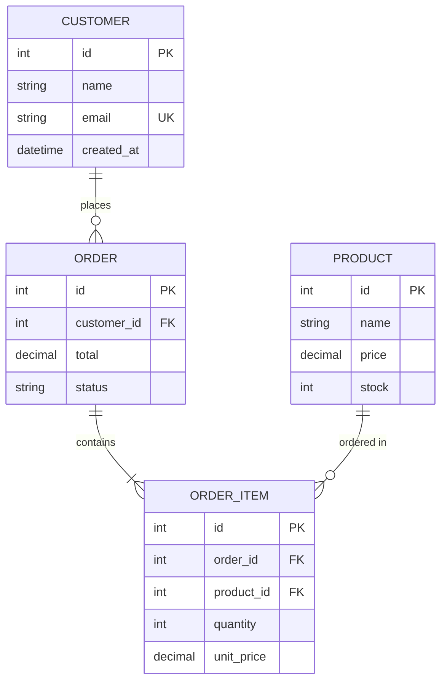

### Relationship Notation

| Notation | Meaning |
|----------|---------|
| `\|\|` | One (mandatory) |
| `o\|` | Zero or One |
| `\|{` | One or Many |
| `o{` | Zero or Many |

---

## Flow Diagram

### Input Required
- ชื่อ process
- Steps หลัก
- Decision points
- Actors (ถ้ามี)

### Patterns

#### Basic Process Flow
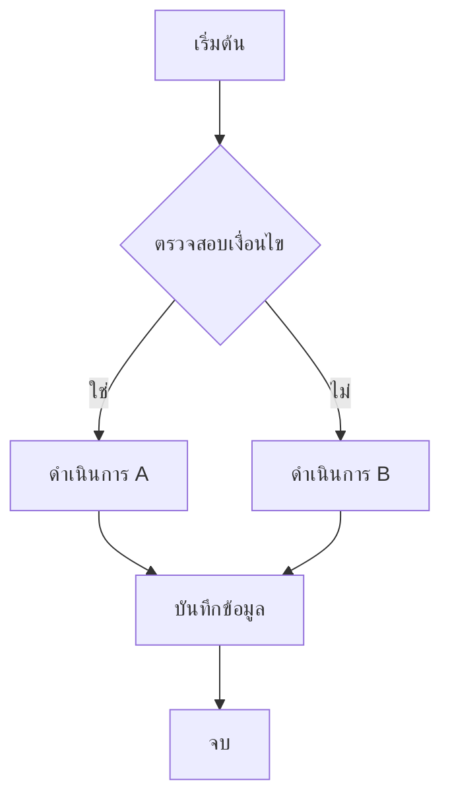

#### Approval Workflow
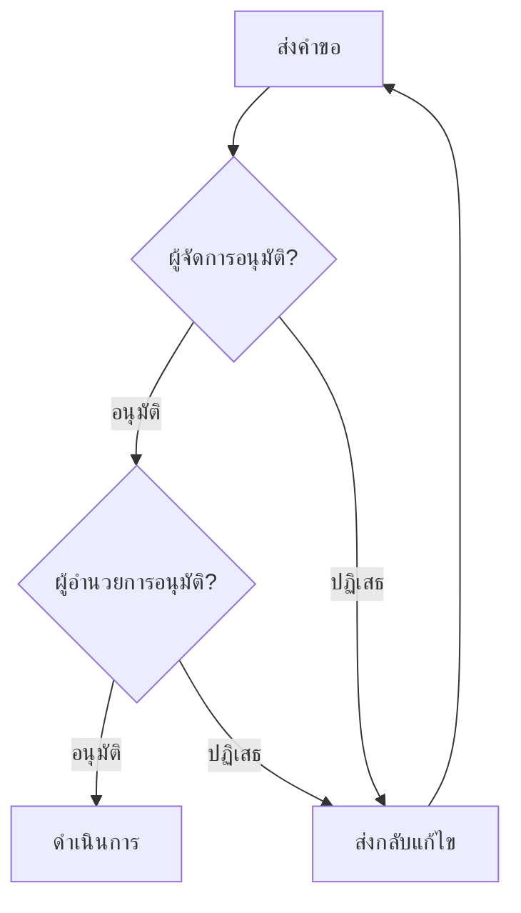

#### Business Process with Swimlanes
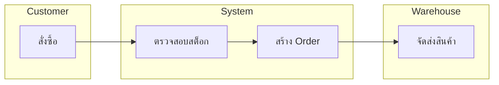

---

## Data Flow Diagram (DFD)

### Input Required
- ชื่อระบบ
- External entities
- Processes หลัก
- Data stores

### Patterns

#### Level 0 (Context Diagram)
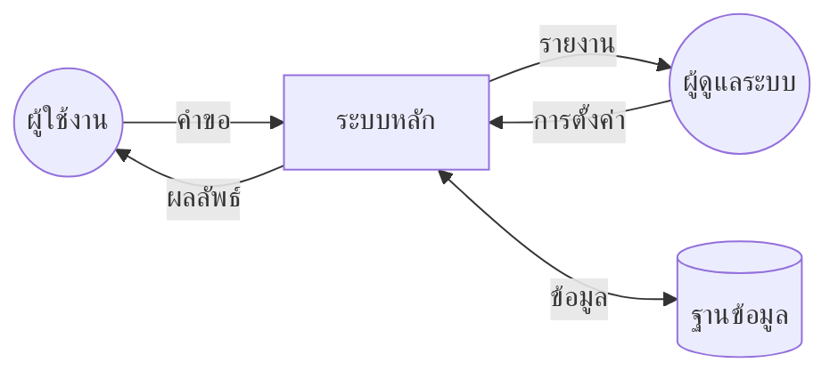

#### Level 1 DFD
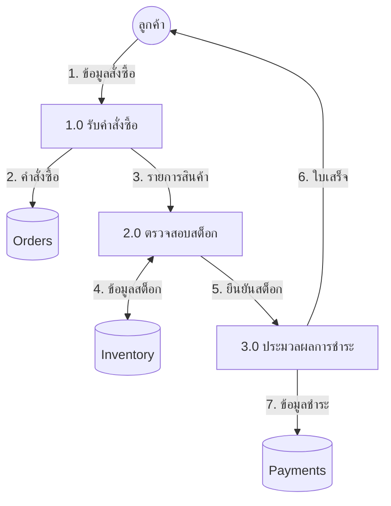

---

## Sequence Diagram

### Input Required
- ชื่อ process/API
- Participants (User, Frontend, API, Database, etc.)
- Request/Response flow

### Patterns

#### Basic API Flow
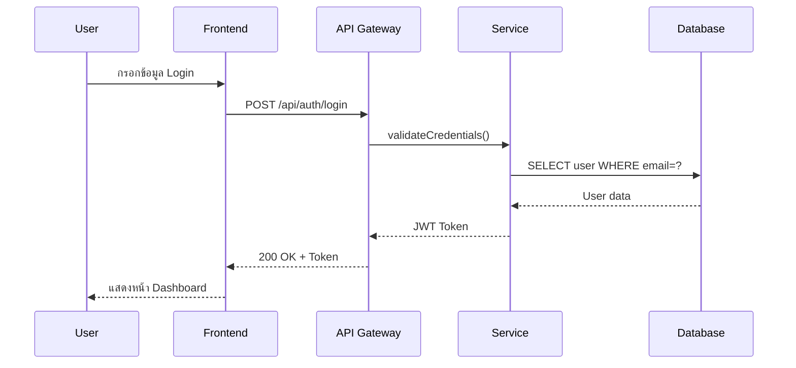

#### With Error Handling
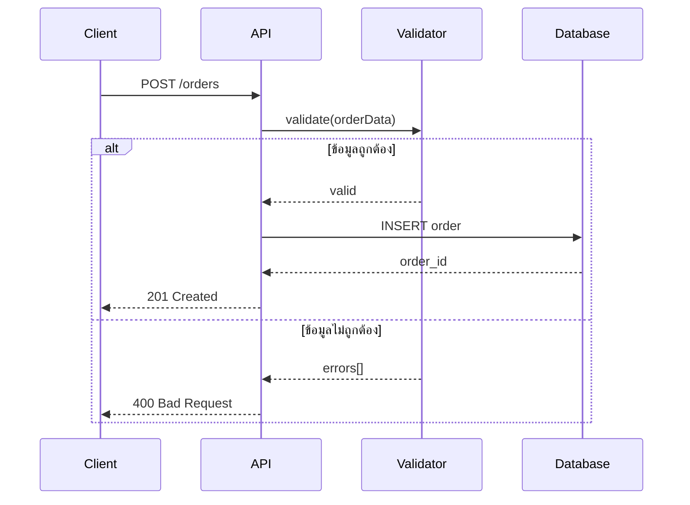

#### Async Processing
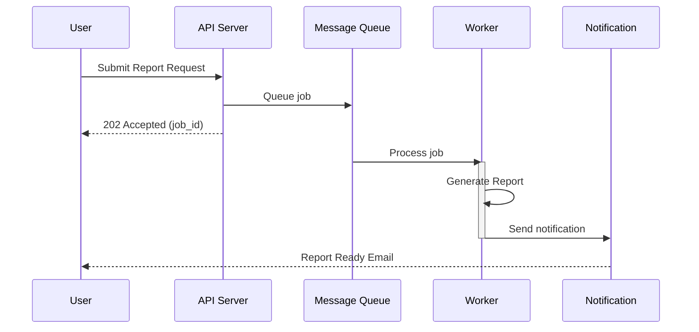

---

## Sitemap

### Input Required
- ชื่อเว็บไซต์/แอพ
- หน้าหลัก
- User roles และ access levels

### Patterns

#### Hierarchical Sitemap
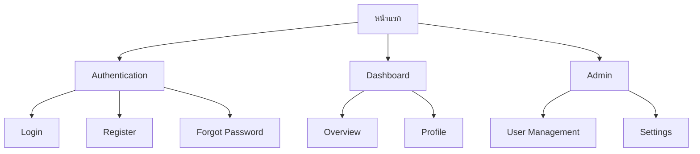

#### With Role-Based Access
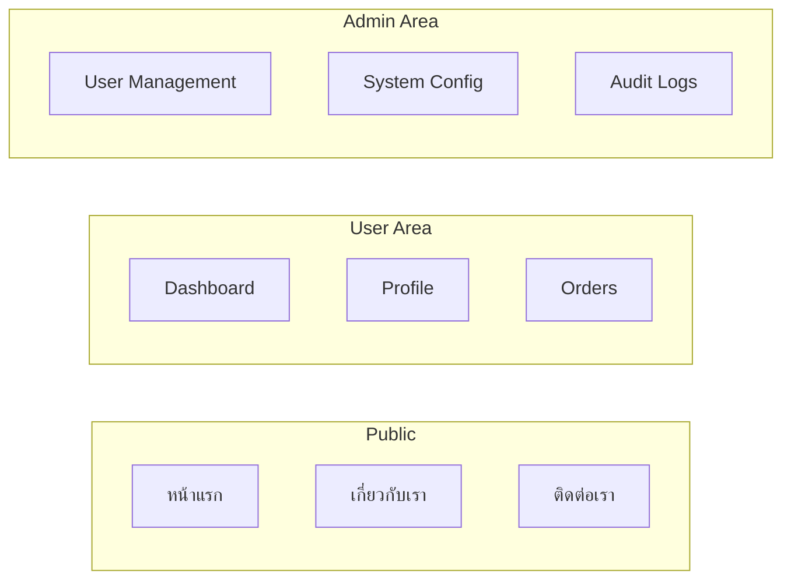

---

## State Diagram

### Input Required
- Entity ที่มี state
- States ทั้งหมด
- Transitions และ triggers

### Pattern

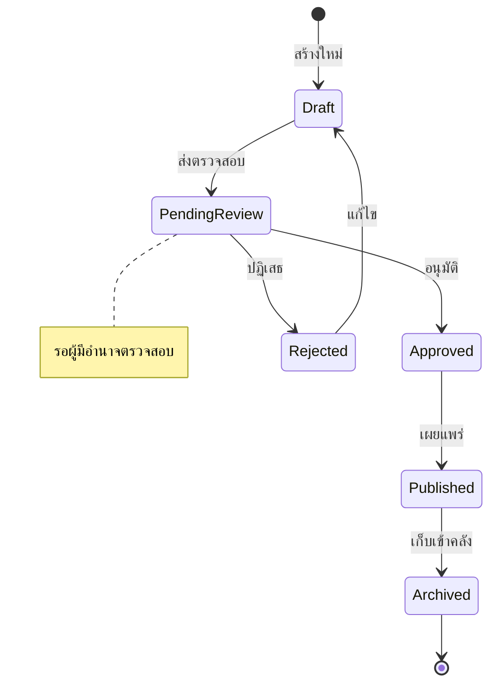

---

## Class Diagram

### Input Required
- Domain/System
- Classes หลัก
- Properties และ Methods
- Relationships

### Pattern

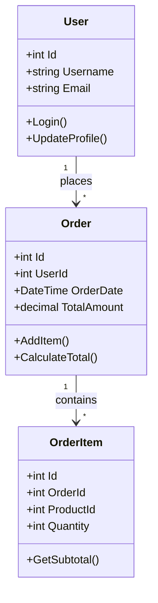

---

## Output

### Success

```
✅ สร้าง [Diagram Type] สำเร็จ!

📊 Diagram Summary:
   • Type: ER Diagram
   • Entities: 8
   • Relationships: 12

```mermaid
[Generated Diagram Here]
```

💡 Next steps:
   • Copy diagram ไปใช้ในเอกสาร
   • /create-design-doc → สร้างเอกสารฉบับเต็ม
   • /create-diagram [other-type] → สร้าง diagram อื่น
```

---

## Resources

| Resource | Description |
|----------|-------------|
| `references/mermaid-patterns.md` | รูปแบบ diagrams ทั้งหมด |
| `references/architecture-patterns.md` | Architecture patterns |
| `references/troubleshooting.md` | แก้ไข Mermaid syntax errors |
