# Create Diagram Command

Create a specific diagram type without creating the entire document.

## Input Received

```
/create-diagram ER Diagram for meeting room booking system
/create-diagram Flow Diagram for leave approval process
/create-diagram DFD Level 1 for product ordering system
/create-diagram Sequence Diagram for Login process
/create-diagram Sitemap for E-commerce website
/create-diagram State Diagram for Order status
/create-diagram $ARGUMENTS
```

## Analyze Diagram Type

| Keyword | Diagram Type |
|---------|--------------|
| `ER`, `ERD`, `Entity Relationship` | ER Diagram |
| `Flow`, `Flowchart`, `Process` | Flow Diagram |
| `DFD`, `Data Flow` | Data Flow Diagram |
| `Sequence`, `API Flow` | Sequence Diagram |
| `Sitemap`, `Navigation` | Sitemap |
| `State`, `Status`, `Lifecycle` | State Diagram |
| `Class`, `Data Model` | Class Diagram |
| `Architecture`, `System` | Architecture Diagram |

---

## ER Diagram

### Input Required
- System or domain name
- Main entities (if known)
- Important relationships

### Pattern

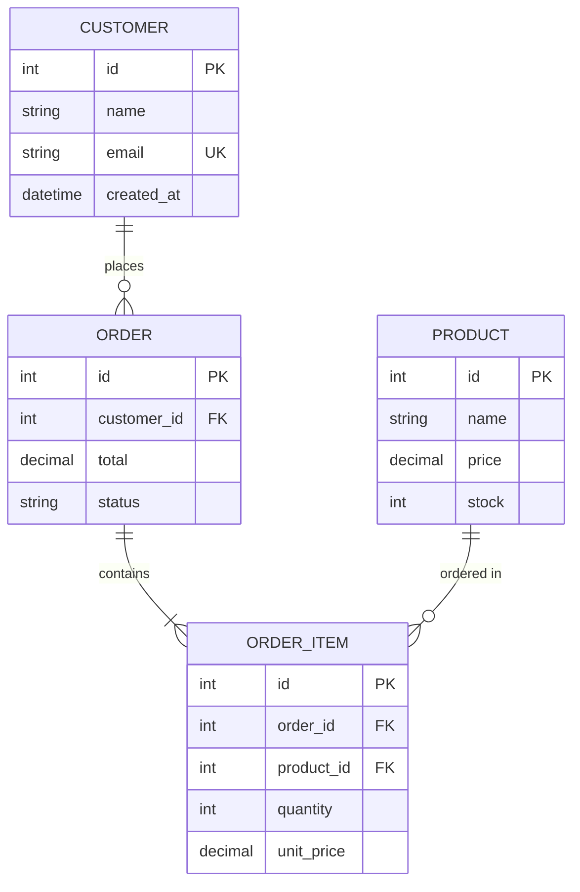
```mermaid
erDiagram
    CUSTOMER ||--o{ ORDER : places
    ORDER ||--|{ ORDER_ITEM : contains
    PRODUCT ||--o{ ORDER_ITEM : "ordered in"

    CUSTOMER {
        int id PK
        string name
        string email UK
        datetime created_at
    }
    ORDER {
        int id PK
        int customer_id FK
        decimal total
        string status
    }
    ORDER_ITEM {
        int id PK
        int order_id FK
        int product_id FK
        int quantity
        decimal unit_price
    }
    PRODUCT {
        int id PK
        string name
        decimal price
        int stock
    }
```

### Relationship Notation

| Notation | Meaning |
|----------|---------|
| `\|\|` | One (mandatory) |
| `o\|` | Zero or One |
| `\|{` | One or Many |
| `o{` | Zero or Many |

---

## Flow Diagram

### Input Required
- Process name
- Main steps
- Decision points
- Actors (if any)

### Patterns

#### Basic Process Flow
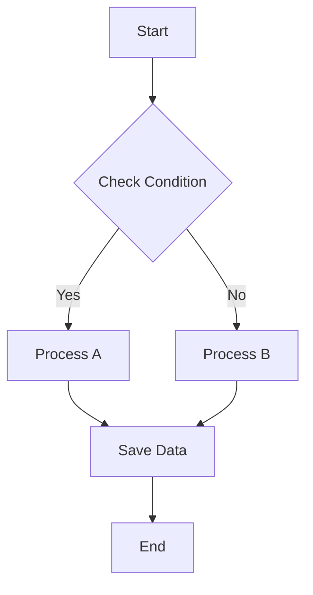
```mermaid
flowchart TD
    A[Start] --> B{Check Condition}
    B -->|Yes| C[Process A]
    B -->|No| D[Process B]
    C --> E[Save Data]
    D --> E
    E --> F[End]
```

#### Approval Workflow
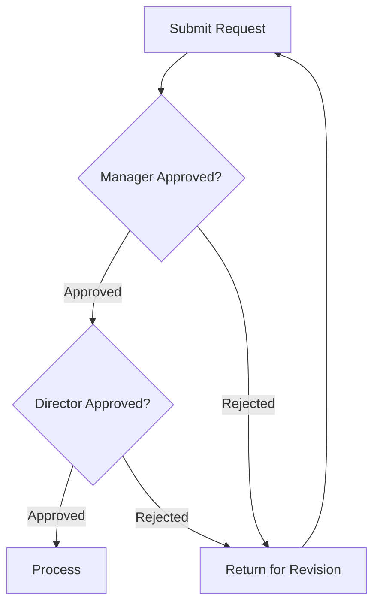
```mermaid
flowchart TD
    A[Submit Request] --> B{Manager Approved?}
    B -->|Approved| C{Director Approved?}
    B -->|Rejected| D[Return for Revision]
    C -->|Approved| E[Process]
    C -->|Rejected| D
    D --> A
```

#### Business Process with Swimlanes
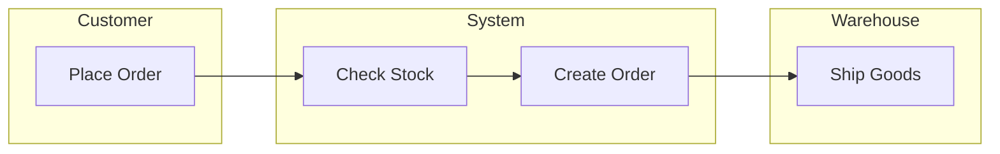
```mermaid
flowchart LR
    subgraph Customer
        A[Place Order]
    end
    subgraph System
        B[Check Stock]
        C[Create Order]
    end
    subgraph Warehouse
        D[Ship Goods]
    end
    A --> B
    B --> C
    C --> D
```

---

## Data Flow Diagram (DFD)

### Input Required
- System name
- External entities
- Main processes
- Data stores

### Patterns

#### Level 0 (Context Diagram)
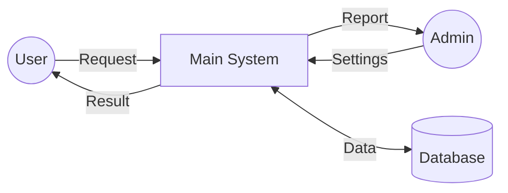
```mermaid
flowchart LR
    E1((User)) -->|Request| S[Main System]
    S -->|Result| E1
    E2((Admin)) -->|Settings| S
    S -->|Report| E2
    S <-->|Data| D1[(Database)]
```

#### Level 1 DFD
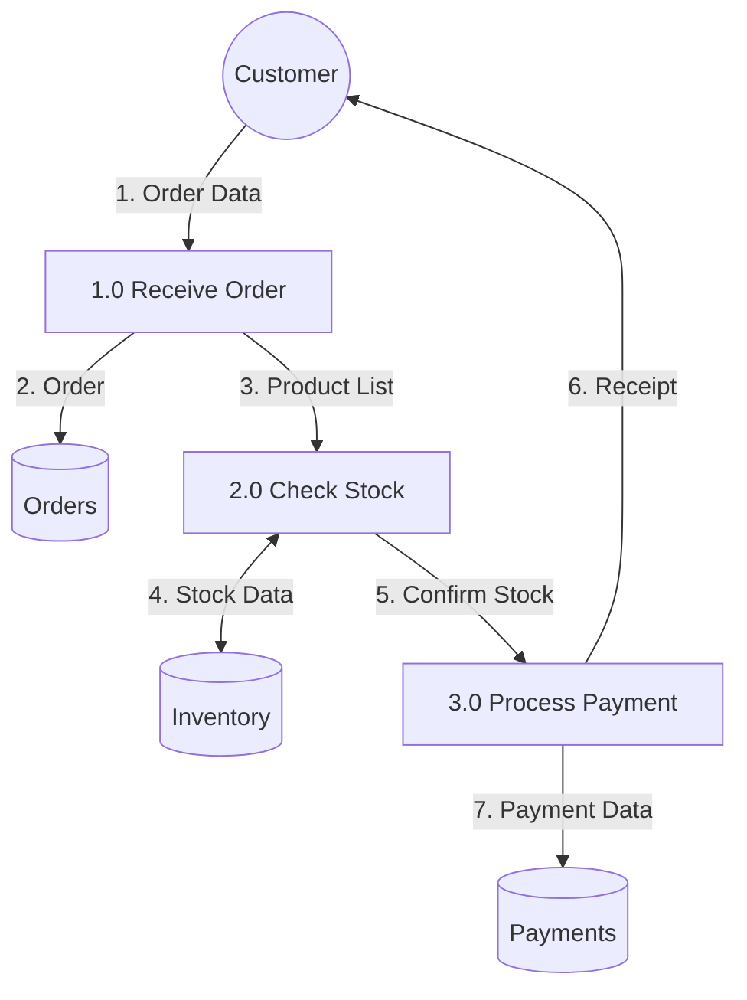
```mermaid
flowchart TB
    E1((Customer)) -->|1. Order Data| P1[1.0 Receive Order]
    P1 -->|2. Order| D1[(Orders)]
    P1 -->|3. Product List| P2[2.0 Check Stock]
    P2 <-->|4. Stock Data| D2[(Inventory)]
    P2 -->|5. Confirm Stock| P3[3.0 Process Payment]
    P3 -->|6. Receipt| E1
    P3 -->|7. Payment Data| D3[(Payments)]
```

---

## Sequence Diagram

### Input Required
- Process/API name
- Participants (User, Frontend, API, Database, etc.)
- Request/Response flow

### Patterns

#### Basic API Flow
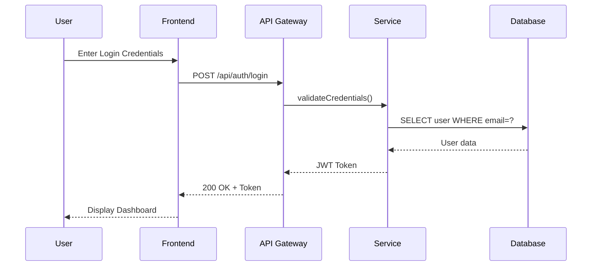
```mermaid
sequenceDiagram
    participant U as User
    participant F as Frontend
    participant A as API Gateway
    participant S as Service
    participant D as Database

    U->>F: Enter Login Credentials
    F->>A: POST /api/auth/login
    A->>S: validateCredentials()
    S->>D: SELECT user WHERE email=?
    D-->>S: User data
    S-->>A: JWT Token
    A-->>F: 200 OK + Token
    F-->>U: Display Dashboard
```

#### With Error Handling
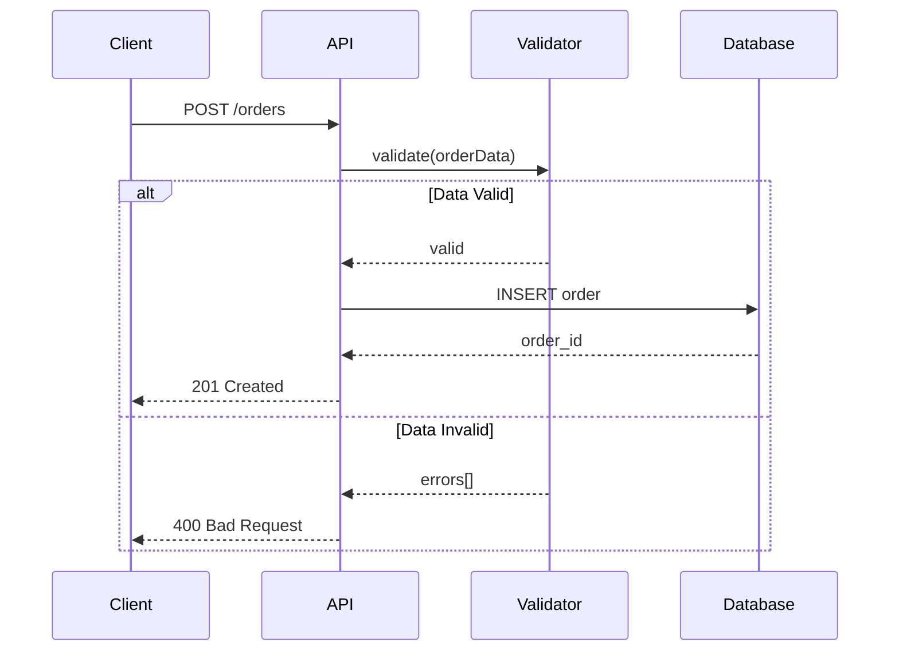
```mermaid
sequenceDiagram
    participant C as Client
    participant A as API
    participant V as Validator
    participant DB as Database

    C->>A: POST /orders
    A->>V: validate(orderData)
    alt Data Valid
        V-->>A: valid
        A->>DB: INSERT order
        DB-->>A: order_id
        A-->>C: 201 Created
    else Data Invalid
        V-->>A: errors[]
        A-->>C: 400 Bad Request
    end
```

#### Async Processing
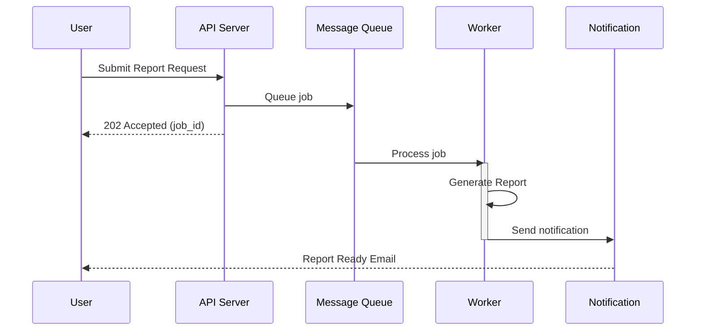
```mermaid
sequenceDiagram
    participant U as User
    participant API as API Server
    participant Q as Message Queue
    participant W as Worker
    participant N as Notification

    U->>API: Submit Report Request
    API->>Q: Queue job
    API-->>U: 202 Accepted (job_id)

    Q->>W: Process job
    activate W
    W->>W: Generate Report
    W->>N: Send notification
    deactivate W
    N-->>U: Report Ready Email
```

---

## Sitemap

### Input Required
- Website/app name
- Main pages
- User roles and access levels

### Patterns

#### Hierarchical Sitemap
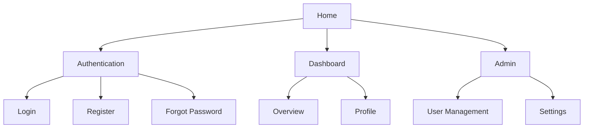
```mermaid
flowchart TD
    HOME[Home]

    HOME --> AUTH[Authentication]
    HOME --> DASH[Dashboard]
    HOME --> ADMIN[Admin]

    AUTH --> LOGIN[Login]
    AUTH --> REGISTER[Register]
    AUTH --> FORGOT[Forgot Password]

    DASH --> OVERVIEW[Overview]
    DASH --> PROFILE[Profile]

    ADMIN --> USERS[User Management]
    ADMIN --> SETTINGS[Settings]
```

#### With Role-Based Access
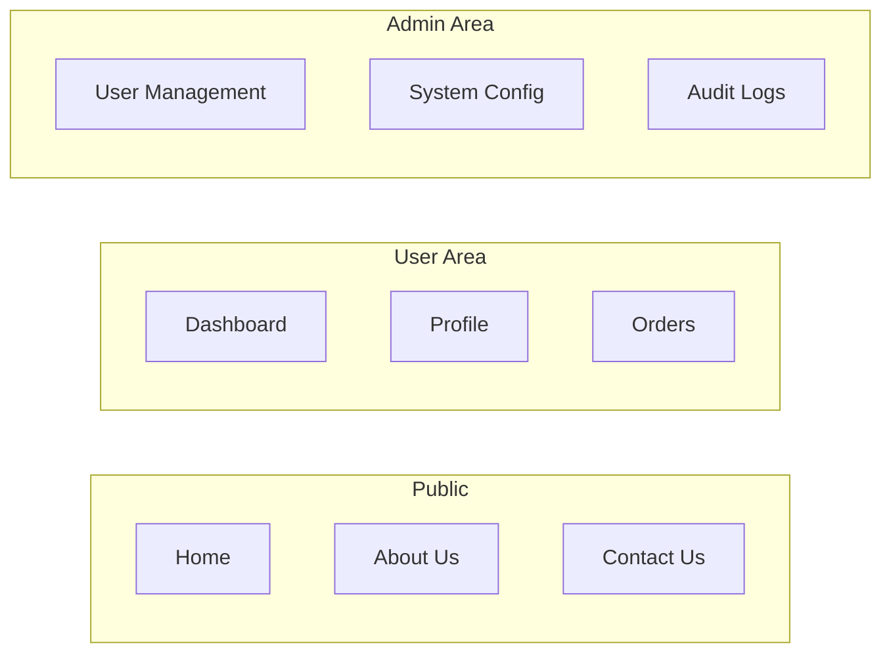
```mermaid
flowchart LR
    subgraph Public
        P1[Home]
        P2[About Us]
        P3[Contact Us]
    end

    subgraph User["User Area"]
        U1[Dashboard]
        U2[Profile]
        U3[Orders]
    end

    subgraph Admin["Admin Area"]
        A1[User Management]
        A2[System Config]
        A3[Audit Logs]
    end
```

---

## State Diagram

### Input Required
- Entity that has states
- All states
- Transitions and triggers

### Pattern

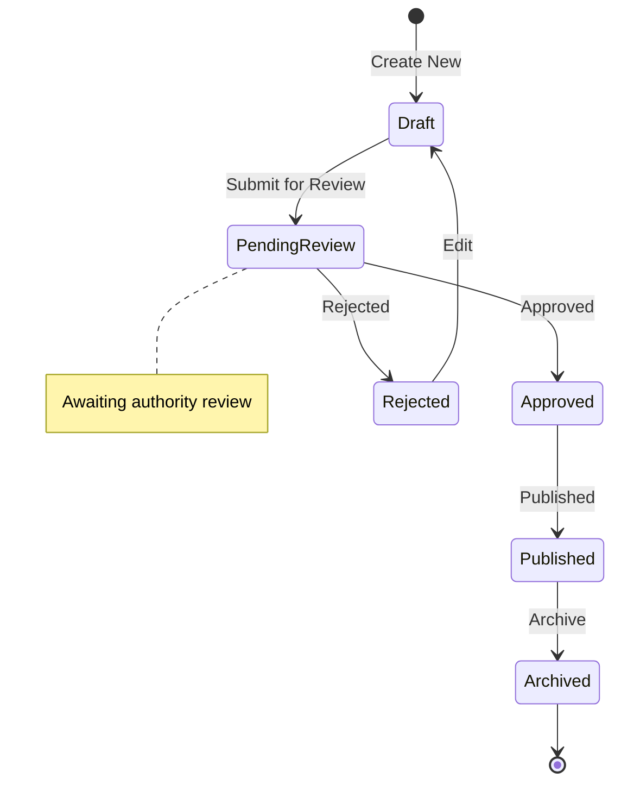
```mermaid
stateDiagram-v2
    [*] --> Draft: Create New
    Draft --> PendingReview: Submit for Review
    PendingReview --> Approved: Approved
    PendingReview --> Rejected: Rejected
    Rejected --> Draft: Edit
    Approved --> Published: Published
    Published --> Archived: Archive
    Archived --> [*]

    note right of PendingReview: Awaiting authority review
```

---

## Class Diagram

### Input Required
- Domain/System
- Main classes
- Properties and Methods
- Relationships

### Pattern

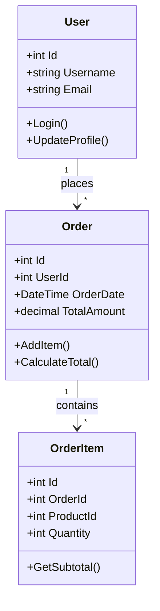
```mermaid
classDiagram
    class User {
        +int Id
        +string Username
        +string Email
        +Login()
        +UpdateProfile()
    }

    class Order {
        +int Id
        +int UserId
        +DateTime OrderDate
        +decimal TotalAmount
        +AddItem()
        +CalculateTotal()
    }

    class OrderItem {
        +int Id
        +int OrderId
        +int ProductId
        +int Quantity
        +GetSubtotal()
    }

    User "1" --> "*" Order : places
    Order "1" --> "*" OrderItem : contains
```

---

## Architecture Diagram

### Input Required
- System name / bounded contexts
- Architecture style (Microservices, Event-driven, Clean Architecture, DDD)
- Major components and their dependencies

### Pattern

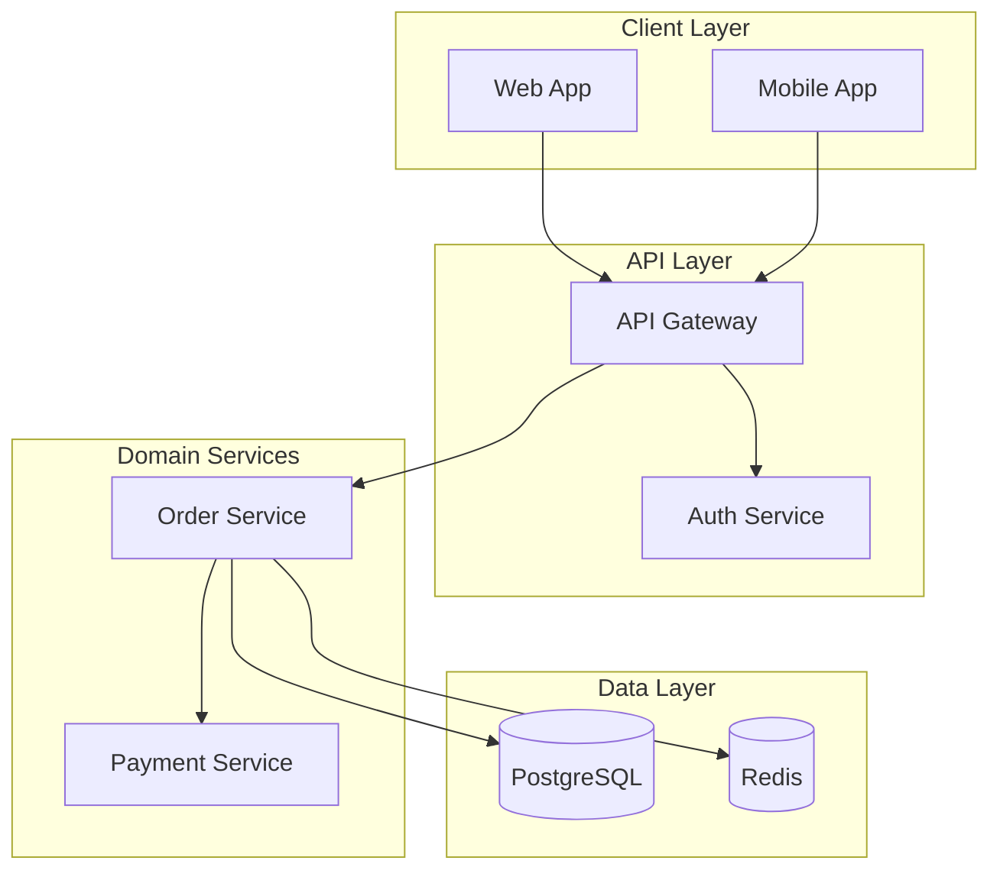
```mermaid
flowchart TB
    subgraph Client["Client Layer"]
        Web[Web App]
        Mobile[Mobile App]
    end

    subgraph API["API Layer"]
        GW[API Gateway]
        Auth[Auth Service]
    end

    subgraph Domain["Domain Services"]
        Order[Order Service]
        Payment[Payment Service]
    end

    subgraph Data["Data Layer"]
        DB[(PostgreSQL)]
        Cache[(Redis)]
    end

    Web --> GW
    Mobile --> GW
    GW --> Auth
    GW --> Order
    Order --> Payment
    Order --> DB
    Order --> Cache
```

> Pattern reference: `${CLAUDE_PLUGIN_ROOT}/skills/system-design-doc/references/architecture-patterns.md` (Microservices / Event-driven / Clean Architecture / DDD)

---

## Output

**Split layout:** write the diagram into its owning section file only — ER→`<slug>/07-er-diagram.md`, Sitemap→`<slug>/09-sitemap.md`, DFD→`<slug>/05-dfd.md`, Flow→`<slug>/06-flow-diagrams.md`, Sequence→`<slug>/06-flow-diagrams.md`. Then update that `sections[].status`/`updated_at` and the matching `diagrams.*.file_path` in `design_doc_list.json`. Resolve the file via the registry (same as edit-section Step 3).

### Success

```
✅ สร้าง [Diagram Type] สำเร็จ!

📊 Diagram Summary:
   • Type: ER Diagram
   • Entities: 8
   • Relationships: 12

```mermaid
[Generated Diagram Here]
```

💡 Next steps:
   • Copy diagram ไปใช้ในเอกสาร
   • /create-design-doc → สร้างเอกสารฉบับเต็ม
   • /create-diagram [other-type] → สร้าง diagram อื่น
```

---

## Resources

| Resource | Description |
|----------|-------------|
| `${CLAUDE_PLUGIN_ROOT}/skills/system-design-doc/references/mermaid-patterns.md` | All diagram patterns |
| `${CLAUDE_PLUGIN_ROOT}/skills/system-design-doc/references/architecture-patterns.md` | Architecture patterns |
| `${CLAUDE_PLUGIN_ROOT}/skills/system-design-doc/references/troubleshooting.md` | Mermaid syntax error fixes |

> 💬 **Note**: This command responds in Thai (คำสั่งนี้จะตอบกลับเป็นภาษาไทย)
