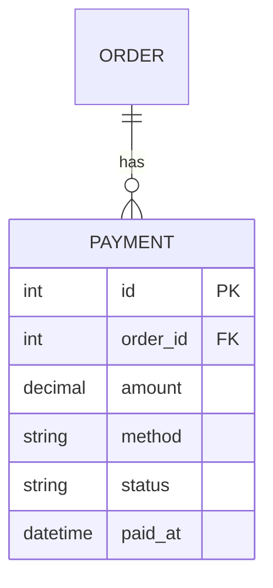
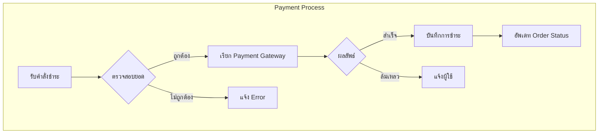
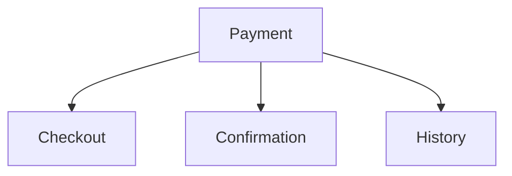

# Edit Section Command

แก้ไขหรืออัพเดทส่วนใดส่วนหนึ่งของเอกสารออกแบบระบบที่มีอยู่

## Input ที่ได้รับ

```
/edit-section ER Diagram - เพิ่ม entity Payment
/edit-section Data Dictionary - เพิ่มตาราง payments
/edit-section Flow Diagram - อัพเดท approval process
/edit-section system-design-hr.md - section 7 เพิ่ม relationship
/edit-section $ARGUMENTS
```

## ขั้นตอนที่ต้องทำ

### Step 1: ระบุเอกสารที่ต้องแก้ไข

**ถ้าไม่ได้ระบุไฟล์:**

```bash
# ค้นหาเอกสารออกแบบระบบ
ls -la .design-docs/*.md 2>/dev/null

# หรือดู design_doc_list.json
cat .design-docs/design_doc_list.json 2>/dev/null
```

**แสดงรายการให้เลือก:**
```
📋 Available Design Documents:

   ┌────┬─────────────────────────────────┬────────────┬─────────────┐
   │ #  │ Document                        │ Status     │ Last Update │
   ├────┼─────────────────────────────────┼────────────┼─────────────┤
   │ 1  │ system-design-hr-management.md  │ completed  │ 2025-01-15  │
   │ 2  │ system-design-inventory.md      │ draft      │ 2025-01-18  │
   │ 3  │ system-design-ecommerce.md      │ in_progress│ 2025-01-20  │
   └────┴─────────────────────────────────┴────────────┴─────────────┘

   เลือกหมายเลข (1-3):
```

### Step 2: ระบุ Section ที่ต้องแก้ไข

**Document Sections:**

| # | Section | Keywords |
|---|---------|----------|
| 1 | Introduction & Overview | intro, overview, architecture |
| 2 | System Requirements | requirements, FR, NFR |
| 3 | Module Overview | modules, dependencies |
| 4 | Data Model | data model, entities |
| 5 | Data Flow Diagram | DFD, data flow |
| 6 | Flow Diagrams | flow, process, workflow |
| 7 | ER Diagram | ER, ERD, entity relationship |
| 8 | Data Dictionary | DD, data dictionary, tables |
| 9 | Sitemap | sitemap, pages, navigation |
| 10 | User Roles & Permissions | roles, permissions, access |

### Step 3: อ่านเอกสารปัจจุบัน

```bash
# อ่านเอกสาร
cat .design-docs/system-design-[name].md

# หรืออ่านเฉพาะ section
grep -A 100 "## 7. ER Diagram" .design-docs/system-design-[name].md
```

### Step 4: ดำเนินการแก้ไข

**ประเภทการแก้ไข:**

| Action | Description |
|--------|-------------|
| `add` | เพิ่มข้อมูลใหม่ |
| `update` | อัพเดทข้อมูลที่มีอยู่ |
| `remove` | ลบข้อมูล |
| `rewrite` | เขียนใหม่ทั้ง section |

---

## Section-Specific Guidelines

### Section 7: ER Diagram

**เพิ่ม Entity:**


**เพิ่ม Relationship:**
- ระบุ cardinality ให้ถูกต้อง
- ตรวจสอบ FK ใน entity ที่เกี่ยวข้อง

**Checklist:**
- [ ] Entity มี PK
- [ ] FK ชี้ไปที่ entity ที่มีอยู่
- [ ] Cardinality ถูกต้อง
- [ ] Syntax Mermaid ถูกต้อง

### Section 8: Data Dictionary

**เพิ่มตาราง:**
```markdown
### Table: payments

**Description**: เก็บข้อมูลการชำระเงิน

**Module**: PAYMENT

| Column | Data Type | Constraints | Default | Description |
|--------|-----------|-------------|---------|-------------|
| id | INT | PK, AI | - | รหัสการชำระเงิน |
| order_id | INT | FK→orders.id, NN | - | รหัสคำสั่งซื้อ |
| amount | DECIMAL(12,2) | NN | - | จำนวนเงิน |
| method | VARCHAR(20) | NN | - | วิธีชำระ (card, bank, cash) |
| status | ENUM | NN | 'pending' | สถานะ |
| paid_at | DATETIME | | NULL | วันที่ชำระ |
| created_at | DATETIME | NN | CURRENT_TIMESTAMP | วันที่สร้าง |

**Indexes**:
- PRIMARY KEY (id)
- INDEX idx_order (order_id)
- INDEX idx_status (status)

**Foreign Keys**:
- FK_payments_order: order_id → orders(id)
```

### Section 6: Flow Diagrams

**เพิ่ม Flow ใหม่:**


### Section 5: Data Flow Diagram

**อัพเดท DFD:**
- ตรวจสอบ consistency ระหว่าง Level 0 และ Level 1
- Process numbers ต้องต่อเนื่อง
- Data stores ต้องตรงกับ Data Dictionary

### Section 9: Sitemap

**เพิ่มหน้าใหม่:**


### Section 10: User Roles & Permissions

**เพิ่ม Permission:**
```markdown
| Permission | Super Admin | Admin | Manager | User |
|------------|-------------|-------|---------|------|
| View Payments | ✅ | ✅ | ✅ | ✅ |
| Process Refund | ✅ | ✅ | ❌ | ❌ |
| Export Payment Report | ✅ | ✅ | ✅ | ❌ |
```

---

## Consistency Check

**หลังแก้ไข ต้องตรวจสอบ:**

| Section Changed | Also Check |
|-----------------|------------|
| ER Diagram | Data Dictionary, Data Model |
| Data Dictionary | ER Diagram |
| Flow Diagrams | DFD, Sequence Diagrams |
| Sitemap | User Roles (access) |
| User Roles | Sitemap (access rules) |

---

## Output

### Success

```
✅ แก้ไข Section สำเร็จ!

📁 File: .design-docs/system-design-ecommerce.md
📝 Section: 7. ER Diagram

📊 Changes:
   • Added entity: Payment (7 columns)
   • Added relationship: ORDER ||--o{ PAYMENT

🔄 Consistency Reminders:
   • อัพเดท Data Dictionary เพิ่มตาราง payments
   • ตรวจสอบ DFD ว่ามี Payment process หรือยัง

💡 Next steps:
   • /edit-section Data Dictionary - เพิ่มตาราง payments
   • /validate-design-doc → ตรวจสอบความครบถ้วน
```

### Warning (Potential Inconsistency)

```
⚠️ แก้ไข Section สำเร็จ แต่พบความไม่สอดคล้อง!

📁 File: .design-docs/system-design-ecommerce.md
📝 Section: 7. ER Diagram

⚠️ Inconsistencies Found:
   • Payment entity added to ER but not in Data Dictionary
   • Payment relationship exists but no Payment process in DFD

📋 Recommended Actions:
   1. /edit-section Data Dictionary - เพิ่มตาราง payments
   2. /edit-section DFD - เพิ่ม Payment process
```

---

## Resources

| Resource | Description |
|----------|-------------|
| `references/document-sections.md` | รายละเอียดแต่ละ section |
| `references/mermaid-patterns.md` | รูปแบบ diagrams |
| `references/data-dictionary-template.md` | รูปแบบ Data Dictionary |
| `references/troubleshooting.md` | แก้ไขปัญหาที่พบ |
