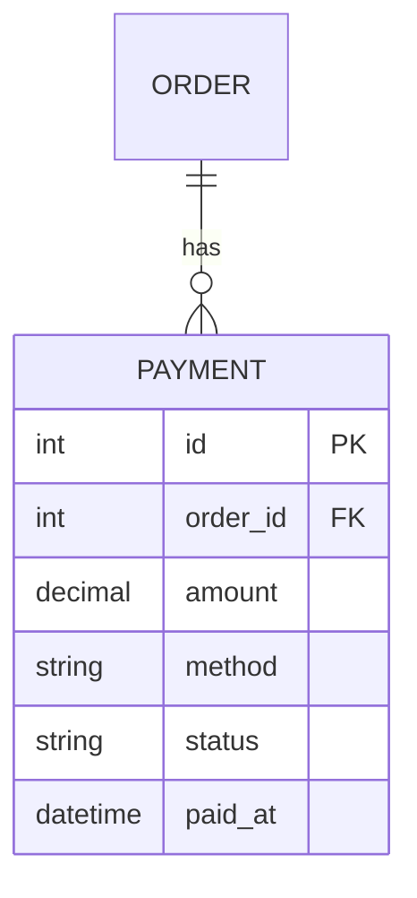
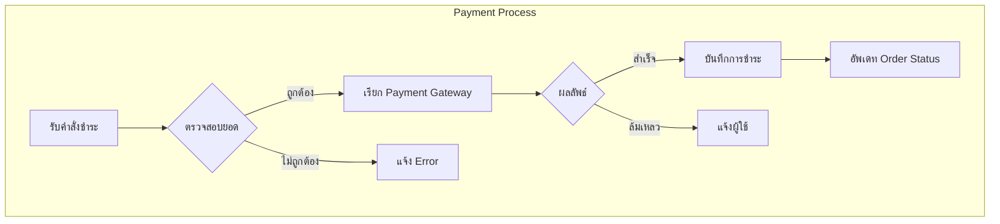
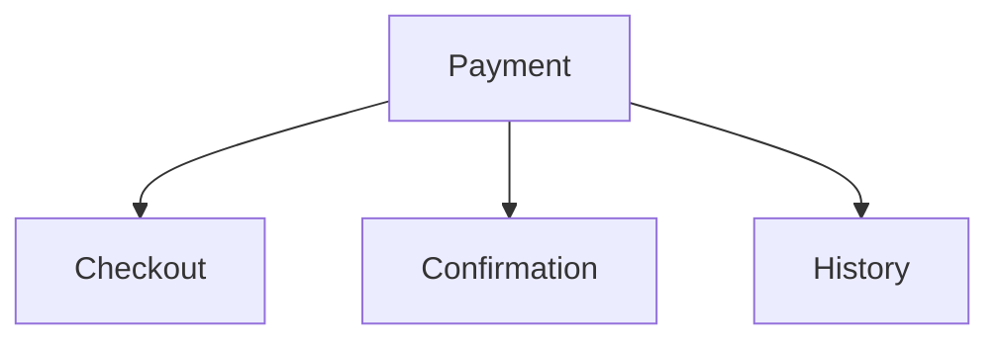

# Edit Section Command

Edit or update a specific section of an existing system design document.

## Input Received

```
/edit-section ER Diagram - add Payment entity
/edit-section Data Dictionary - add payments table
/edit-section Flow Diagram - update approval process
/edit-section system-design-hr.md - section 7 add relationship
/edit-section $ARGUMENTS
```

## Steps to Follow

### Step 1: Identify the Document to Edit

**If no file is specified:**

```bash
# Search for system design documents
ls -la .design-docs/*.md 2>/dev/null

# Or check design_doc_list.json
cat .design-docs/design_doc_list.json 2>/dev/null
```

**Display a list for selection:**
```
📋 Available Design Documents:

   ┌────┬─────────────────────────────────┬────────────┬─────────────┐
   │ #  │ Document                        │ Status     │ Last Update │
   ├────┼─────────────────────────────────┼────────────┼─────────────┤
   │ 1  │ system-design-hr-management.md  │ completed  │ 2025-01-15  │
   │ 2  │ system-design-inventory.md      │ draft      │ 2025-01-18  │
   │ 3  │ system-design-ecommerce.md      │ in_progress│ 2025-01-20  │
   └────┴─────────────────────────────────┴────────────┴─────────────┘

   เลือกหมายเลข (1-3):
```

### Step 2: Identify the Section to Edit

**Document Sections:**

| # | Section | Keywords |
|---|---------|----------|
| 1 | Introduction & Overview | intro, overview, architecture |
| 2 | System Requirements | requirements, FR, NFR |
| 3 | Module Overview | modules, dependencies |
| 4 | Data Model | data model, entities |
| 5 | Data Flow Diagram | DFD, data flow |
| 6 | Flow Diagrams | flow, process, workflow |
| 7 | ER Diagram | ER, ERD, entity relationship |
| 8 | Data Dictionary | DD, data dictionary, tables |
| 9 | Sitemap | sitemap, pages, navigation |
| 10 | User Roles & Permissions | roles, permissions, access |

### Step 3: Read the Current Document

```bash
# Read the document
cat .design-docs/system-design-[name].md

# Or read only the specific section
grep -A 100 "## 7. ER Diagram" .design-docs/system-design-[name].md
```

### Step 4: Perform the Edit

**Edit types:**

| Action | Description |
|--------|-------------|
| `add` | Add new data |
| `update` | Update existing data |
| `remove` | Remove data |
| `rewrite` | Rewrite the entire section |

---

## Section-Specific Guidelines

### Section 7: ER Diagram

**Add Entity:**

```mermaid
erDiagram
    %% Existing entities...

    %% NEW: Payment entity
    PAYMENT {
        int id PK
        int order_id FK
        decimal amount
        string method
        string status
        datetime paid_at
    }

    ORDER ||--o{ PAYMENT : has
```

**Add Relationship:**
- Specify the correct cardinality
- Verify the FK in the related entity

**Checklist:**
- [ ] Entity has a PK
- [ ] FK points to an existing entity
- [ ] Cardinality is correct
- [ ] Mermaid syntax is valid

### Section 8: Data Dictionary

**Add Table:**
```markdown
### Table: payments

**Description**: Stores payment information

**Module**: PAYMENT

| Column | Data Type | Constraints | Default | Description |
|--------|-----------|-------------|---------|-------------|
| id | INT | PK, AI | - | Payment ID |
| order_id | INT | FK→orders.id, NN | - | Order ID |
| amount | DECIMAL(12,2) | NN | - | Amount |
| method | VARCHAR(20) | NN | - | Payment method (card, bank, cash) |
| status | ENUM | NN | 'pending' | Status |
| paid_at | DATETIME | | NULL | Payment date |
| created_at | DATETIME | NN | CURRENT_TIMESTAMP | Created date |

**Indexes**:
- PRIMARY KEY (id)
- INDEX idx_order (order_id)
- INDEX idx_status (status)

**Foreign Keys**:
- FK_payments_order: order_id → orders(id)
```

### Section 6: Flow Diagrams

**Add New Flow:**

```mermaid
flowchart TD
    subgraph PaymentProcess["Payment Process"]
        P1[รับคำสั่งชำระ] --> P2{ตรวจสอบยอด}
        P2 -->|ถูกต้อง| P3[เรียก Payment Gateway]
        P2 -->|ไม่ถูกต้อง| P4[แจ้ง Error]
        P3 --> P5{ผลลัพธ์}
        P5 -->|สำเร็จ| P6[บันทึกการชำระ]
        P5 -->|ล้มเหลว| P7[แจ้งผู้ใช้]
        P6 --> P8[อัพเดท Order Status]
    end
```

### Section 5: Data Flow Diagram

**Update DFD:**
- Verify consistency between Level 0 and Level 1
- Process numbers must be sequential
- Data stores must match Data Dictionary

### Section 9: Sitemap

**Add New Pages:**

```mermaid
flowchart TD
    %% Existing...

    %% NEW: Payment pages
    PAYMENT[Payment]
    PAYMENT --> PAY_CHECKOUT[Checkout]
    PAYMENT --> PAY_CONFIRM[Confirmation]
    PAYMENT --> PAY_HISTORY[History]
```

### Section 10: User Roles & Permissions

**Add Permission:**
```markdown
| Permission | Super Admin | Admin | Manager | User |
|------------|-------------|-------|---------|------|
| View Payments | ✅ | ✅ | ✅ | ✅ |
| Process Refund | ✅ | ✅ | ❌ | ❌ |
| Export Payment Report | ✅ | ✅ | ✅ | ❌ |
```

---

## Consistency Check

**After editing, verify:**

| Section Changed | Also Check |
|-----------------|------------|
| ER Diagram | Data Dictionary, Data Model |
| Data Dictionary | ER Diagram |
| Flow Diagrams | DFD, Sequence Diagrams |
| Sitemap | User Roles (access) |
| User Roles | Sitemap (access rules) |

---

## Output

### Success

```
✅ แก้ไข Section สำเร็จ!

📁 File: .design-docs/system-design-ecommerce.md
📝 Section: 7. ER Diagram

📊 Changes:
   • Added entity: Payment (7 columns)
   • Added relationship: ORDER ||--o{ PAYMENT

🔄 Consistency Reminders:
   • อัพเดท Data Dictionary เพิ่มตาราง payments
   • ตรวจสอบ DFD ว่ามี Payment process หรือยัง

💡 Next steps:
   • /edit-section Data Dictionary - เพิ่มตาราง payments
   • /validate-design-doc → ตรวจสอบความครบถ้วน
```

### Warning (Potential Inconsistency)

```
⚠️ แก้ไข Section สำเร็จ แต่พบความไม่สอดคล้อง!

📁 File: .design-docs/system-design-ecommerce.md
📝 Section: 7. ER Diagram

⚠️ Inconsistencies Found:
   • Payment entity added to ER but not in Data Dictionary
   • Payment relationship exists but no Payment process in DFD

📋 Recommended Actions:
   1. /edit-section Data Dictionary - เพิ่มตาราง payments
   2. /edit-section DFD - เพิ่ม Payment process
```

---

## Resources

| Resource | Description |
|----------|-------------|
| `references/document-sections.md` | Details for each section |
| `references/mermaid-patterns.md` | Diagram patterns |
| `references/data-dictionary-template.md` | Data Dictionary format |
| `references/troubleshooting.md` | Problem solutions |

> 💬 **Note**: This command responds in Thai (คำสั่งนี้จะตอบกลับเป็นภาษาไทย)
