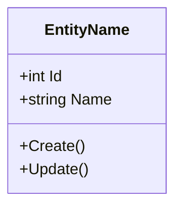
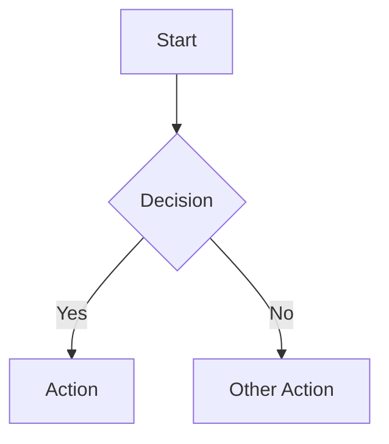
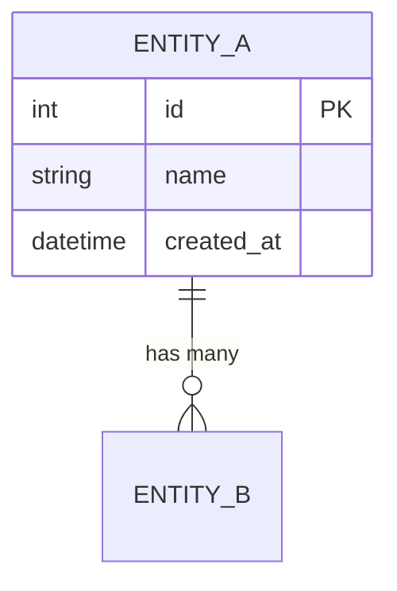
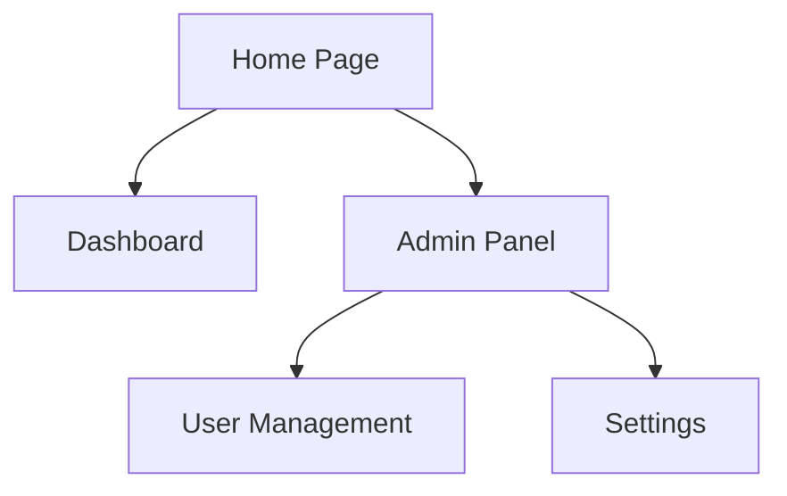

# Import Plan Command

Convert an implementation plan or free-form design doc into a standardized 10-section system design document + design_doc_list.json

---

## Input

```
/import-plan docs/example/2026-03-08-thai-esg-hub-design.md
/import-plan docs/plans/my-project-plan.md
/import-plan $ARGUMENTS
```

The input file is `$ARGUMENTS` (path to the implementation plan or free-form design doc)

---

## Step 0: Validate Input

Verify that the input file exists:

```bash
FILE_PATH="$ARGUMENTS"
cat "$FILE_PATH"
```

- If the file is not found → display error:
  ```
  ❌ ไม่พบไฟล์: $FILE_PATH
  กรุณาระบุ path ที่ถูกต้อง เช่น /import-plan docs/plans/my-project.md
  ```
- If found → read the entire content and store it for use in subsequent steps

---

## Step 1: Detect Input Type

Analyze the file content to classify the input into 2 types:

### Type A: Implementation Plan

Look for these patterns:

- `Task \d+:` or `## Task \d+` — task numbering
- Dependency chains such as `depends on Task 1`, `after Task 3`
- Bash code blocks (````bash`) with actual commands
- Header metadata: `**Goal:**`, `**Architecture:**`, `**Tech Stack:**`
- File paths such as `src/`, `Controllers/`, `Services/`
- NuGet/npm package references

### Type B: Free-form Design Doc

Look for these patterns:

- `erDiagram` block (Mermaid ER diagram)
- Section headers: `## Database`, `## Architecture`, `## API`
- Entity definitions with fields
- Mermaid blocks (````mermaid`)
- ASCII art architecture diagrams
- REST endpoint definitions such as `GET /api/...`, `POST /api/...`
- Role/permission tables
- Page breakdown tables

### Decision

| Scenario | Result |
|----------|--------|
| Only Type A patterns found | → Use Implementation Plan mode |
| Only Type B patterns found | → Use Free-form Design Doc mode |
| Both A and B patterns found | → Use **Free-form Design Doc** mode (more complete data) |
| No patterns found | → Ask the user which type it is |

---

## Step 2: Extract Data

### 2.1 Read Templates and References

Read these files from the plugin directory to use as templates:

| File | Purpose |
|------|---------|
| `templates/design-doc-template.md` | Standard 10-section structure |
| `references/mermaid-patterns.md` | Standard Mermaid diagram syntax |
| `references/document-sections.md` | Details for each section |
| `references/architecture-patterns.md` | Supported architecture patterns |

### 2.2 Extract from Implementation Plan (Type A)

Extract the following data:

- **Project metadata**: project name, goal, architecture from header (`**Goal:**`, `**Architecture:**`, `**Tech Stack:**`)
- **Tech stack**: languages, frameworks, databases, tools
- **Task groupings**: group tasks by module/feature area
- **File paths**: file structure mentioned
- **Packages**: NuGet packages, npm packages, dependencies
- **Task dependencies**: execution order, dependency chains

**Additional checks:**
- If the plan has `**Design Doc:**` pointing to another file → read that file as well and merge the data
- Do NOT extract bash commands or code snippets — only extract design-level information

### 2.3 Extract from Free-form Design Doc (Type B)

Extract the following data:

- **Entities + fields**: from erDiagram blocks — entity name, fields, types
- **Relationships**: relationships between entities (1:N, M:N, 1:1)
- **User flows**: from numbered lists or step-by-step flows
- **Page breakdown**: from tables specifying pages and features
- **Roles**: user roles and permissions
- **Architecture**: from ASCII art or description blocks
- **API patterns**: REST endpoints (method + path + description)
- **Security strategy**: authentication, authorization patterns
- **Phase roadmap**: development plan divided by phases
- **Index patterns**: database indexes mentioned

---

## Step 3: Check Existing Design Docs

Check if design docs already exist:

```bash
# Check folder and registry
ls -la .design-docs/ 2>/dev/null
cat .design-docs/design_doc_list.json 2>/dev/null
```

### Possible Cases

**Case A: Design doc already exists** (`.design-docs/` and `design_doc_list.json` found)

Ask the user:
```
📁 พบ design docs ที่มีอยู่แล้ว:
   • .design-docs/system-design-[name].md
   • .design-docs/design_doc_list.json

เลือกการดำเนินการ:
  1. Reformat ทับ design doc เดิม (อัปเดตด้วยข้อมูลจาก import)
  2. สร้าง design doc ใหม่แยกไฟล์

กรุณาเลือก (1/2):
```

**Case B: No design doc exists yet**

Create the folder:
```bash
mkdir -p .design-docs
```

---

## Step 4: Show Gap Report

Analyze the extracted data and display a Gap Report before generating:

```
📊 Analysis Report: [filename]
──────────────────────────────────────────

Type detected: [Implementation Plan / Free-form Design Doc]

✅ Found (will be reformatted to standard):
   • Entities: 8 entities with fields
   • Relationships: 12 relationships defined
   • User flows: 5 flows identified
   • API endpoints: 15 endpoints
   • Roles: 4 roles with permissions
   • Tech stack: .NET 8, PostgreSQL, Redis

⚠️ Inferred (will be created from context):
   • DFD Level 0/1: created from architecture + API patterns
   • Sitemap: created from page breakdown table
   • Module breakdown: created from task groupings

❌ Missing (will be generated as minimal):
   • NFR (Non-functional Requirements): no data → add placeholder
   • Data Dictionary constraints: not specified → add defaults
   • Permission matrix details: only role names → create basic matrix

Do you want to add more information before generating, or proceed?
```

### Categorization of data per section

| Section | ✅ Found when | ⚠️ Inferred when | ❌ Missing when |
|---------|--------------|-------------------|----------------|
| 1. Introduction | goal, tech stack present | task descriptions present | no data at all |
| 2. Requirements | scope, phases present | created from tasks/features | no requirements |
| 3. Modules | project structure present | grouped from tasks | no structure info |
| 4. Data Model | erDiagram present | entity names present | no entity info |
| 5. DFD | architecture diagram present | created from API + modules | no flow info |
| 6. Flow Diagrams | user flows present | created from features | no flow info |
| 7. ER Diagram | erDiagram present | created from entities | no entity info |
| 8. Data Dictionary | fields + types present | created from erDiagram | no field info |
| 9. Sitemap | page breakdown present | created from features | no page info |
| 10. User Roles | roles + permissions present | created from role names | no role info |

Wait for the user to respond proceed or add more information first.

---

## Step 5: Generate Design Document

Create the file `.design-docs/system-design-[project-name].md`

### 5.1 Generation Rules

- **ALWAYS reformat every section** — do NOT copy verbatim from source
- Use Mermaid syntax per `references/mermaid-patterns.md`
- Use structure per `templates/design-doc-template.md`
- Include content for all 10 sections even if some sections are minimal
- Do NOT create actual code (implementation code)

### 5.2 Section Mapping

Each section is created from extracted data according to this table:

#### Section 1: Introduction
- **Data source**: metadata (goal, architecture), tech stack
- **Output**: Project overview, objectives, tech stack table, architecture summary
- Reformat to standard format, do not copy directly from source

#### Section 2: Requirements (FR/NFR)
- **Data source**: scope, phases, features
- **Output**: Functional Requirements table (REQ-001...), Non-functional Requirements
- Convert scope/phases → FR items; if no NFR → add standard NFR (performance, security, availability)

#### Section 3: Module Breakdown
- **Data source**: project structure, task grouping by feature area
- **Output**: Module table + Mermaid component diagram
- Group tasks/features into modules, specify responsibilities

#### Section 4: Data Model (Class Diagram)
- **Data source**: erDiagram entities → classDiagram
- **Output**: Mermaid classDiagram showing entities + fields + methods
- Convert erDiagram format → classDiagram format per mermaid-patterns.md



#### Section 5: Data Flow Diagrams (DFD)
- **Data source**: architecture description → Level 0, Level 1
- **Output**: DFD Level 0 (context diagram), DFD Level 1 (process breakdown)
- Create Mermaid flowchart showing data flow between systems

#### Section 6: Flow Diagrams
- **Data source**: user flows (numbered lists, step-by-step)
- **Output**: Mermaid flowchart for each user flow
- Convert numbered steps → flowchart nodes + edges



#### Section 7: ER Diagram
- **Data source**: erDiagram from source → reformat per patterns
- **Output**: Reformatted Mermaid erDiagram
- Verify all relationships are complete, add audit fields if missing (created_at, updated_at)



#### Section 8: Data Dictionary
- **Data source**: entity fields from erDiagram
- **Output**: Data Dictionary tables separated by entity

For each entity, create a table:

| Column | Type | Constraints | Default | Description |
|--------|------|-------------|---------|-------------|
| id | int | PK, AUTO_INCREMENT | - | Primary key |
| name | varchar(255) | NOT NULL | - | Name |
| created_at | datetime | NOT NULL | CURRENT_TIMESTAMP | Created date |

- If source does not specify constraints → add appropriate defaults
- If source does not specify type → infer from field name (e.g., `_at` → datetime, `is_` → boolean)

#### Section 9: Sitemap
- **Data source**: page breakdown table → Mermaid flowchart TD
- **Output**: Mermaid flowchart showing page structure



#### Section 10: User Roles & Permissions
- **Data source**: roles from source
- **Output**: Role description table + Permission matrix

Role table:
| Role | Description | Access Level |
|------|-------------|-------------|

Permission matrix:
| Feature | Admin | Manager | User | Guest |
|---------|-------|---------|------|-------|
| View Dashboard | ✅ | ✅ | ✅ | ❌ |
| Manage Users | ✅ | ❌ | ❌ | ❌ |

---

## Step 6: Generate design_doc_list.json

Create or update the file `.design-docs/design_doc_list.json`

### Schema v2.1.0

Use the structure from `templates/design_doc_list.json` (schema v2.1.0)

**Example of key fields to include:**

```json
{
  "schema_version": "2.1.0",
  "project_name": "[project-name]",
  "description": "[project description/goal]",
  "technology_stack": {
    "backend": "[framework]",
    "frontend": "[framework]",
    "database": "[database]",
    "cache": "[cache if any]"
  },

  "entities": [
    {
      "id": "ENT-001",
      "name": "EntityName",
      "name_th": "ชื่อ Entity",
      "table_name": "entity_table",
      "description": "คำอธิบาย entity",
      "crud_operations": {
        "create": { "enabled": true, "api": "API-002", "feature_id": null, "page": null },
        "read":   { "enabled": true, "api": "API-003", "feature_id": null, "page": null },
        "update": { "enabled": true, "api": "API-004", "feature_id": null, "page": null },
        "delete": { "enabled": true, "api": "API-005", "feature_id": null, "page": null, "strategy": "soft" },
        "list":   { "enabled": true, "api": "API-001", "feature_id": null, "page": null }
      },
      "relationships": [
        { "target": "ENT-002", "type": "1:N", "description": "has many" }
      ],
      "status": "draft"
    },
    {
      "id": "ENT-010",
      "name": "AuditLog",
      "name_th": "บันทึกการใช้งาน",
      "table_name": "audit_logs",
      "description": "บันทึกการใช้งานระบบ — read-only entity",
      "crud_operations": {
        "create": { "enabled": false, "api": null, "feature_id": null, "page": null },
        "read":   { "enabled": true,  "api": "API-040", "feature_id": null, "page": null },
        "update": { "enabled": false, "api": null, "feature_id": null, "page": null },
        "delete": { "enabled": false, "api": null, "feature_id": null, "page": null, "strategy": "soft" },
        "list":   { "enabled": true,  "api": "API-041", "feature_id": null, "page": null }
      },
      "relationships": [],
      "status": "draft"
    }
  ],

  "api_endpoints": [
    {
      "id": "API-001",
      "method": "GET",
      "path": "/api/[entities]",
      "description": "List [entities]",
      "entity_ref": "ENT-001",
      "auth_required": true,
      "status": "draft"
    }
  ],

  "documents": [
    {
      "id": "DOC-001",
      "name": "[Project] System Design",
      "file_path": "system-design-[project-name].md",
      "source": "imported",
      "source_file": "[original-file-path]",
      "status": "draft",
      "sections_completed": ["introduction", "requirements", "modules", "data_model", "dfd", "flow_diagrams", "er_diagram", "data_dictionary", "sitemap", "permissions"]
    }
  ]
}
```

**Important:** Use the full structure from `templates/design_doc_list.json` — the example above shows only key fields

### Important Rules for design_doc_list.json

- **Entity IDs**: sequential ENT-001, ENT-002, ENT-003...
- **API IDs**: sequential API-001, API-002, API-003...
- **`source`**: must always be `"imported"` for this command
- **`source_file`**: path to the original source file being imported
- **`crud_operations`**: every operation must have an `enabled` field (boolean)
- **`delete.strategy`**: default is `"soft"` — always specify even if delete is disabled
- **Not every entity needs full CRUD**: e.g., audit_logs → read-only (create=true, read=true, update=false, delete=false)

### Merge Behavior (if design_doc_list.json already exists)

- Read the existing file
- Add new entities/APIs
- Check for duplicates by comparing `name` — if name matches → skip (do not overwrite)
- New Entity/API IDs must continue from the last existing ID

---

## Step 7: Validate & Output

### 7.1 Consistency Checks

Verify consistency between sections:

| Check | Method |
|-------|--------|
| ER Diagram ↔ Data Dictionary | Every entity in ER must have a Data Dictionary table |
| Sitemap ↔ Page descriptions | Every page in Sitemap must have a description |
| Roles ↔ Permission matrix | Every role must be in the permission matrix |
| Entities ↔ design_doc_list.json | Every entity must be in the JSON registry |
| APIs ↔ design_doc_list.json | Every API endpoint must be in the JSON registry |

If inconsistencies are found → fix them before output

### 7.2 Success Output

Display results on success:

```
✅ Import สำเร็จ!
──────────────────────────────────────────

📄 Source: [source-file-path]
   Type: [Implementation Plan / Free-form Design Doc]

📁 Output files:
   • .design-docs/system-design-[project-name].md
   • .design-docs/design_doc_list.json

📊 Sections generated:
   ✅ Section 1: Introduction
   ✅ Section 2: Requirements (12 FRs, 5 NFRs)
   ✅ Section 3: Module Breakdown (6 modules)
   ✅ Section 4: Data Model (8 classes)
   ✅ Section 5: DFD (Level 0 + Level 1)
   ✅ Section 6: Flow Diagrams (5 flows)
   ✅ Section 7: ER Diagram (8 entities, 12 relationships)
   ✅ Section 8: Data Dictionary (8 tables)
   ✅ Section 9: Sitemap (15 pages)
   ✅ Section 10: User Roles (4 roles)

📋 Entities registered: 8 (ENT-001 to ENT-008)
📋 APIs registered: 15 (API-001 to API-015)

🔍 Review recommendations:
   • ตรวจสอบ NFR ที่ generate อัตโนมัติ (Section 2)
   • ตรวจสอบ Data Dictionary constraints (Section 8)
   • ตรวจสอบ Permission matrix (Section 10)

🚀 Next steps:
   • /validate-design-doc — ตรวจสอบความถูกต้องของ design doc
   • /edit-section [section-number] — แก้ไข section ที่ต้องการ
   • /init — เริ่มสร้าง implementation tasks จาก design doc
```

### 7.3 Git Commit

Create a commit for the created/modified files:

```bash
git add .design-docs/system-design-*.md .design-docs/design_doc_list.json
git commit -m "docs: import design doc from [source-filename]

- Source: [source-file-path]
- Type: [detected-type]
- Entities: [count]
- APIs: [count]"
```

---

## Important Rules

### Do NOT
- Do NOT create actual code (implementation code, controllers, services, etc.)
- Do NOT create `feature_list.json` — this command only creates design doc + `design_doc_list.json`
- Do NOT modify the original input file — the source file must remain unchanged
- Do NOT copy content from source verbatim — every section must be reformatted

### Must Do
- Must generate all 10 sections (even if some sections are minimal/placeholder)
- Must reformat every section according to the standard template
- Must create `design_doc_list.json` with `crud_operations` that have an `enabled` field
- Must show a Gap Report before generating (Step 4) and wait for user confirmation
- Must git commit when finished
- Must validate consistency between sections before output

---

## Resources

| File | Purpose |
|------|---------|
| `references/document-sections.md` | Standard 10-section details |
| `references/mermaid-patterns.md` | Mermaid syntax patterns for diagrams |
| `references/architecture-patterns.md` | Supported architecture patterns |
| `templates/design-doc-template.md` | Design document structure template |
| `templates/design_doc_list.json` | Design doc registry template |

> 💬 **Note**: This command responds in Thai (คำสั่งนี้จะตอบกลับเป็นภาษาไทย)
