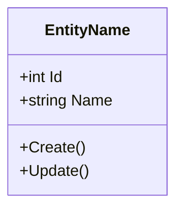
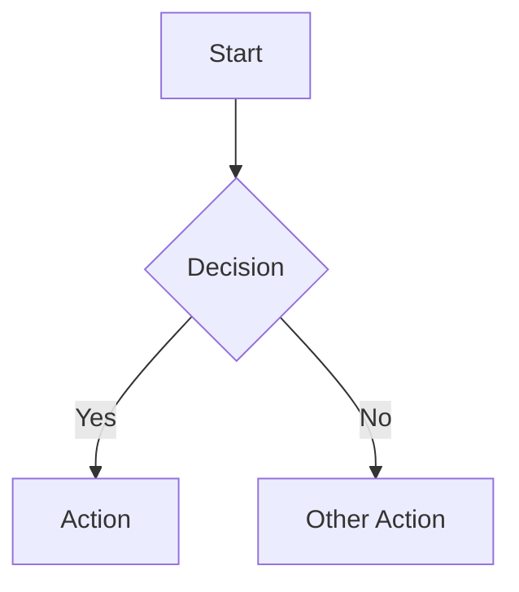
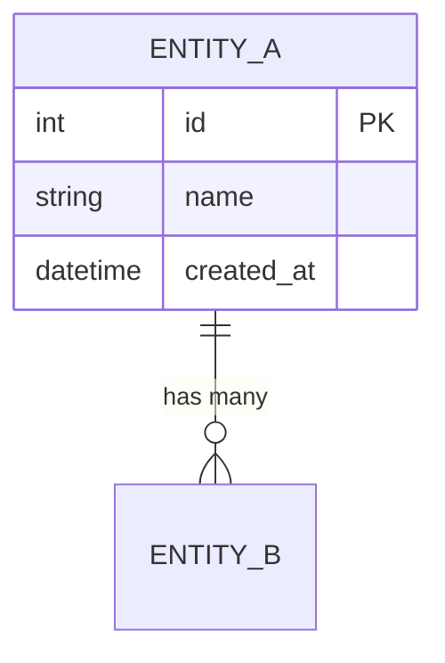
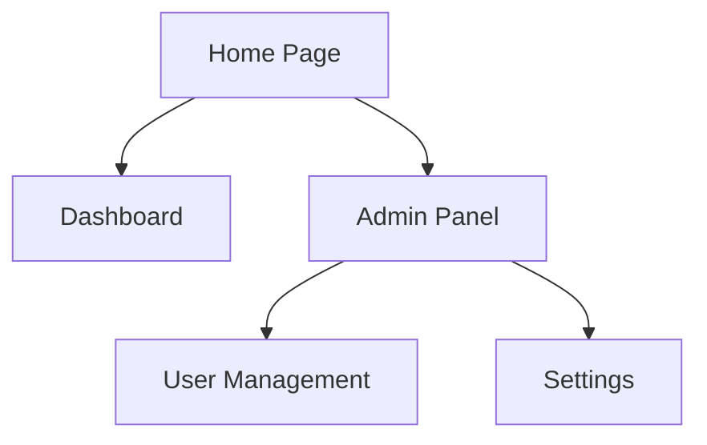

# Import Plan Command

แปลง implementation plan หรือ free-form design doc เข้าเป็นเอกสารออกแบบระบบมาตรฐาน 10 sections + design_doc_list.json

---

## Input

```
/import-plan docs/example/2026-03-08-thai-esg-hub-design.md
/import-plan docs/plans/my-project-plan.md
/import-plan $ARGUMENTS
```

ไฟล์ input คือ `$ARGUMENTS` (path ไปยัง implementation plan หรือ free-form design doc)

---

## Step 0: Validate Input

ตรวจสอบว่าไฟล์ input มีอยู่จริง:

```bash
FILE_PATH="$ARGUMENTS"
cat "$FILE_PATH"
```

- ถ้าไฟล์ไม่พบ → แสดง error:
  ```
  ❌ ไม่พบไฟล์: $FILE_PATH
  กรุณาระบุ path ที่ถูกต้อง เช่น /import-plan docs/plans/my-project.md
  ```
- ถ้าพบ → อ่านเนื้อหาทั้งหมดเก็บไว้ใช้ในขั้นตอนถัดไป

---

## Step 1: Detect Input Type

วิเคราะห์เนื้อหาไฟล์เพื่อจำแนกประเภท input เป็น 2 ประเภท:

### ประเภท A: Implementation Plan

ตรวจหา pattern เหล่านี้:

- `Task \d+:` หรือ `## Task \d+` — task numbering
- Dependency chains เช่น `depends on Task 1`, `after Task 3`
- Bash code blocks (````bash`) ที่มี commands จริง
- Header metadata: `**Goal:**`, `**Architecture:**`, `**Tech Stack:**`
- File paths เช่น `src/`, `Controllers/`, `Services/`
- NuGet/npm package references

### ประเภท B: Free-form Design Doc

ตรวจหา pattern เหล่านี้:

- `erDiagram` block (Mermaid ER diagram)
- Section headers: `## Database`, `## Architecture`, `## API`
- Entity definitions พร้อม fields
- Mermaid blocks (````mermaid`)
- ASCII art architecture diagrams
- REST endpoint definitions เช่น `GET /api/...`, `POST /api/...`
- Role/permission tables
- Page breakdown tables

### การตัดสิน

| สถานการณ์ | ผลลัพธ์ |
|-----------|---------|
| พบ pattern A เท่านั้น | → ใช้โหมด Implementation Plan |
| พบ pattern B เท่านั้น | → ใช้โหมด Free-form Design Doc |
| พบทั้ง A และ B | → ใช้โหมด **Free-form Design Doc** (มีข้อมูลครบกว่า) |
| ไม่พบ pattern ใดเลย | → ถามผู้ใช้ว่าเป็นประเภทไหน |

---

## Step 2: Extract Data

### 2.1 อ่าน Templates และ References

อ่านไฟล์เหล่านี้จาก plugin directory เพื่อใช้เป็นแม่แบบ:

| ไฟล์ | วัตถุประสงค์ |
|------|-------------|
| `templates/design-doc-template.md` | โครงสร้าง 10 sections มาตรฐาน |
| `references/mermaid-patterns.md` | Syntax มาตรฐานสำหรับ Mermaid diagrams |
| `references/document-sections.md` | รายละเอียดแต่ละ section |
| `references/architecture-patterns.md` | Architecture patterns ที่รองรับ |

### 2.2 Extract จาก Implementation Plan (ประเภท A)

ดึงข้อมูลต่อไปนี้:

- **Project metadata**: ชื่อโปรเจค, goal, architecture จาก header (`**Goal:**`, `**Architecture:**`, `**Tech Stack:**`)
- **Tech stack**: ภาษา, frameworks, databases, tools
- **Task groupings**: จัดกลุ่ม tasks ตาม module/feature area
- **File paths**: โครงสร้างไฟล์ที่กล่าวถึง
- **Packages**: NuGet packages, npm packages, dependencies
- **Task dependencies**: ลำดับการทำงาน, dependency chains

**สิ่งที่ต้องตรวจสอบเพิ่ม:**
- ถ้า plan มี `**Design Doc:**` ที่ชี้ไปยังไฟล์อื่น → อ่านไฟล์นั้นด้วยและรวมข้อมูล
- ❌ **ห้าม** extract bash commands หรือ code snippets — เอาแต่ข้อมูลเชิงออกแบบ

### 2.3 Extract จาก Free-form Design Doc (ประเภท B)

ดึงข้อมูลต่อไปนี้:

- **Entities + fields**: จาก erDiagram blocks — ชื่อ entity, fields, types
- **Relationships**: ความสัมพันธ์ระหว่าง entities (1:N, M:N, 1:1)
- **User flows**: จาก numbered lists หรือ step-by-step flows
- **Page breakdown**: จาก tables ที่ระบุหน้าและ features
- **Roles**: บทบาทผู้ใช้และ permissions
- **Architecture**: จาก ASCII art หรือ description blocks
- **API patterns**: REST endpoints (method + path + description)
- **Security strategy**: authentication, authorization patterns
- **Phase roadmap**: แผนการพัฒนาแบ่ง phase
- **Index patterns**: database indexes ที่กล่าวถึง

---

## Step 3: Check Existing Design Docs

ตรวจสอบว่ามี design docs อยู่แล้วหรือไม่:

```bash
# ตรวจสอบ folder และ registry
ls -la .design-docs/ 2>/dev/null
cat .design-docs/design_doc_list.json 2>/dev/null
```

### กรณีที่เป็นไปได้

**กรณี A: มี design doc อยู่แล้ว** (พบ `.design-docs/` และ `design_doc_list.json`)

ถามผู้ใช้:
```
📁 พบ design docs ที่มีอยู่แล้ว:
   • .design-docs/system-design-[name].md
   • .design-docs/design_doc_list.json

เลือกการดำเนินการ:
  1. Reformat ทับ design doc เดิม (อัปเดตด้วยข้อมูลจาก import)
  2. สร้าง design doc ใหม่แยกไฟล์

กรุณาเลือก (1/2):
```

**กรณี B: ยังไม่มี design doc**

สร้าง folder:
```bash
mkdir -p .design-docs
```

---

## Step 4: Show Gap Report

วิเคราะห์ข้อมูลที่ extract ได้ แล้วแสดง Gap Report ก่อน generate:

```
📊 Analysis Report: [filename]
──────────────────────────────────────────

Type detected: [Implementation Plan / Free-form Design Doc]

✅ Found (จะ reformat เป็นมาตรฐาน):
   • Entities: 8 entities with fields
   • Relationships: 12 relationships defined
   • User flows: 5 flows identified
   • API endpoints: 15 endpoints
   • Roles: 4 roles with permissions
   • Tech stack: .NET 8, PostgreSQL, Redis

⚠️ Inferred (จะสร้างจาก context):
   • DFD Level 0/1: สร้างจาก architecture + API patterns
   • Sitemap: สร้างจาก page breakdown table
   • Module breakdown: สร้างจาก task groupings

❌ Missing (จะ generate แบบ minimal):
   • NFR (Non-functional Requirements): ไม่มีข้อมูล → ใส่ placeholder
   • Data Dictionary constraints: ไม่ระบุ → ใส่ค่า default
   • Permission matrix details: มีแค่ role names → สร้าง basic matrix

ต้องการเสริมข้อมูลก่อน generate หรือ proceed เลย?
```

### การจัดกลุ่มข้อมูลแต่ละ section

| Section | ✅ Found เมื่อ | ⚠️ Inferred เมื่อ | ❌ Missing เมื่อ |
|---------|---------------|-------------------|-----------------|
| 1. Introduction | มี goal, tech stack | มี task descriptions | ไม่มีข้อมูลเลย |
| 2. Requirements | มี scope, phases | สร้างจาก tasks/features | ไม่มี requirements |
| 3. Modules | มี project structure | จัดกลุ่มจาก tasks | ไม่มี structure info |
| 4. Data Model | มี erDiagram | มี entity names | ไม่มี entity info |
| 5. DFD | มี architecture diagram | สร้างจาก API + modules | ไม่มี flow info |
| 6. Flow Diagrams | มี user flows | สร้างจาก features | ไม่มี flow info |
| 7. ER Diagram | มี erDiagram | สร้างจาก entities | ไม่มี entity info |
| 8. Data Dictionary | มี fields + types | สร้างจาก erDiagram | ไม่มี field info |
| 9. Sitemap | มี page breakdown | สร้างจาก features | ไม่มี page info |
| 10. User Roles | มี roles + permissions | สร้างจาก role names | ไม่มี role info |

รอผู้ใช้ตอบ proceed หรือเสริมข้อมูลก่อน

---

## Step 5: Generate Design Document

สร้างไฟล์ `.design-docs/system-design-[project-name].md`

### 5.1 กฎการ Generate

- ✅ **ALWAYS reformat ทุก section ใหม่** — ห้าม copy verbatim จาก source
- ✅ ใช้ Mermaid syntax ตาม `references/mermaid-patterns.md`
- ✅ ใช้โครงสร้างตาม `templates/design-doc-template.md`
- ✅ ใส่ข้อมูลครบทุก 10 sections แม้บาง section จะเป็น minimal
- ❌ ห้ามสร้าง code จริง (implementation code)

### 5.2 Section Mapping

แต่ละ section สร้างจากข้อมูลที่ extract ได้ตามตารางนี้:

#### Section 1: Introduction
- **แหล่งข้อมูล**: metadata (goal, architecture), tech stack
- **Output**: Project overview, objectives, tech stack table, architecture summary
- reformat เป็นรูปแบบมาตรฐาน ไม่ copy ตรงจาก source

#### Section 2: Requirements (FR/NFR)
- **แหล่งข้อมูล**: scope, phases, features
- **Output**: Functional Requirements table (REQ-001...), Non-functional Requirements
- แปลง scope/phases → FR items, ถ้าไม่มี NFR → ใส่ standard NFR (performance, security, availability)

#### Section 3: Module Breakdown
- **แหล่งข้อมูล**: project structure, task grouping by feature area
- **Output**: Module table + Mermaid component diagram
- จัดกลุ่ม tasks/features เข้า modules, ระบุ responsibilities

#### Section 4: Data Model (Class Diagram)
- **แหล่งข้อมูล**: erDiagram entities → classDiagram
- **Output**: Mermaid classDiagram แสดง entities + fields + methods
- แปลง erDiagram format → classDiagram format ตาม mermaid-patterns.md



#### Section 5: Data Flow Diagrams (DFD)
- **แหล่งข้อมูล**: architecture description → Level 0, Level 1
- **Output**: DFD Level 0 (context diagram), DFD Level 1 (process breakdown)
- สร้าง Mermaid flowchart แสดง data flow ระหว่าง systems

#### Section 6: Flow Diagrams
- **แหล่งข้อมูล**: user flows (numbered lists, step-by-step)
- **Output**: Mermaid flowchart สำหรับแต่ละ user flow
- แปลง numbered steps → flowchart nodes + edges



#### Section 7: ER Diagram
- **แหล่งข้อมูล**: erDiagram จาก source → reformat ตาม patterns
- **Output**: Mermaid erDiagram ที่ reformat แล้ว
- ตรวจสอบ relationships ครบ, เพิ่ม audit fields ถ้าไม่มี (created_at, updated_at)



#### Section 8: Data Dictionary
- **แหล่งข้อมูล**: entity fields จาก erDiagram
- **Output**: ตาราง Data Dictionary แยกตาม entity

สำหรับแต่ละ entity สร้างตาราง:

| Column | Type | Constraints | Default | Description |
|--------|------|-------------|---------|-------------|
| id | int | PK, AUTO_INCREMENT | - | Primary key |
| name | varchar(255) | NOT NULL | - | ชื่อ |
| created_at | datetime | NOT NULL | CURRENT_TIMESTAMP | วันที่สร้าง |

- ถ้า source ไม่ระบุ constraints → ใส่ค่า default ที่เหมาะสม
- ถ้า source ไม่ระบุ type → infer จากชื่อ field (เช่น `_at` → datetime, `is_` → boolean)

#### Section 9: Sitemap
- **แหล่งข้อมูล**: page breakdown table → Mermaid flowchart TD
- **Output**: Mermaid flowchart แสดงโครงสร้างหน้า



#### Section 10: User Roles & Permissions
- **แหล่งข้อมูล**: roles จาก source
- **Output**: Role description table + Permission matrix

Role table:
| Role | Description | Access Level |
|------|-------------|-------------|

Permission matrix:
| Feature | Admin | Manager | User | Guest |
|---------|-------|---------|------|-------|
| View Dashboard | ✅ | ✅ | ✅ | ❌ |
| Manage Users | ✅ | ❌ | ❌ | ❌ |

---

## Step 6: Generate design_doc_list.json

สร้างหรืออัปเดตไฟล์ `.design-docs/design_doc_list.json`

### Schema v2.1.0

ใช้โครงสร้างจาก `templates/design_doc_list.json` (schema v2.1.0)

**ตัวอย่างส่วนสำคัญที่ต้องใส่:**

```json
{
  "schema_version": "2.1.0",
  "project_name": "[project-name]",
  "description": "[project description/goal]",
  "technology_stack": {
    "backend": "[framework]",
    "frontend": "[framework]",
    "database": "[database]",
    "cache": "[cache if any]"
  },

  "entities": [
    {
      "id": "ENT-001",
      "name": "EntityName",
      "name_th": "ชื่อ Entity",
      "table_name": "entity_table",
      "description": "คำอธิบาย entity",
      "crud_operations": {
        "create": { "enabled": true, "api": "API-002", "feature_id": null, "page": null },
        "read":   { "enabled": true, "api": "API-003", "feature_id": null, "page": null },
        "update": { "enabled": true, "api": "API-004", "feature_id": null, "page": null },
        "delete": { "enabled": true, "api": "API-005", "feature_id": null, "page": null, "strategy": "soft" },
        "list":   { "enabled": true, "api": "API-001", "feature_id": null, "page": null }
      },
      "relationships": [
        { "target": "ENT-002", "type": "1:N", "description": "has many" }
      ],
      "status": "draft"
    },
    {
      "id": "ENT-010",
      "name": "AuditLog",
      "name_th": "บันทึกการใช้งาน",
      "table_name": "audit_logs",
      "description": "บันทึกการใช้งานระบบ — read-only entity",
      "crud_operations": {
        "create": { "enabled": false, "api": null, "feature_id": null, "page": null },
        "read":   { "enabled": true,  "api": "API-040", "feature_id": null, "page": null },
        "update": { "enabled": false, "api": null, "feature_id": null, "page": null },
        "delete": { "enabled": false, "api": null, "feature_id": null, "page": null, "strategy": "soft" },
        "list":   { "enabled": true,  "api": "API-041", "feature_id": null, "page": null }
      },
      "relationships": [],
      "status": "draft"
    }
  ],

  "api_endpoints": [
    {
      "id": "API-001",
      "method": "GET",
      "path": "/api/[entities]",
      "description": "List [entities]",
      "entity_ref": "ENT-001",
      "auth_required": true,
      "status": "draft"
    }
  ],

  "documents": [
    {
      "id": "DOC-001",
      "name": "[Project] System Design",
      "file_path": "system-design-[project-name].md",
      "source": "imported",
      "source_file": "[original-file-path]",
      "status": "draft",
      "sections_completed": ["introduction", "requirements", "modules", "data_model", "dfd", "flow_diagrams", "er_diagram", "data_dictionary", "sitemap", "permissions"]
    }
  ]
}
```

**⚠️ สำคัญ:** ใช้โครงสร้างเต็มจาก `templates/design_doc_list.json` — ตัวอย่างข้างบนแสดงเฉพาะ fields สำคัญ

### กฎสำคัญสำหรับ design_doc_list.json

- **Entity IDs**: เรียงลำดับ ENT-001, ENT-002, ENT-003...
- **API IDs**: เรียงลำดับ API-001, API-002, API-003...
- **`source`**: ต้องเป็น `"imported"` เสมอสำหรับ command นี้
- **`source_file`**: path ไปยังไฟล์ต้นฉบับที่ import
- **`crud_operations`**: ทุก operation ต้องมี field `enabled` (boolean)
- **`delete.strategy`**: default เป็น `"soft"` — ระบุเสมอแม้ delete จะ disabled
- **ไม่ใช่ทุก entity ต้องมี CRUD ครบ**: เช่น audit_logs → read-only (create=true, read=true, update=false, delete=false)

### Merge Behavior (ถ้าไฟล์ design_doc_list.json มีอยู่แล้ว)

- อ่านไฟล์เดิม
- เพิ่ม entities/APIs ใหม่เข้าไป
- ตรวจสอบ duplicate โดยเทียบ `name` — ถ้าชื่อซ้ำ → ข้าม (ไม่ overwrite)
- Entity/API IDs ใหม่ต้อง continue จาก ID สุดท้ายที่มีอยู่

---

## Step 7: Validate & Output

### 7.1 Consistency Checks

ตรวจสอบความสอดคล้องระหว่าง sections:

| ตรวจสอบ | วิธี |
|---------|------|
| ER Diagram ↔ Data Dictionary | ทุก entity ใน ER ต้องมีตาราง Data Dictionary |
| Sitemap ↔ Page descriptions | ทุกหน้าใน Sitemap ต้องมีคำอธิบาย |
| Roles ↔ Permission matrix | ทุก role ต้องอยู่ใน permission matrix |
| Entities ↔ design_doc_list.json | ทุก entity ต้องมีใน JSON registry |
| APIs ↔ design_doc_list.json | ทุก API endpoint ต้องมีใน JSON registry |

ถ้าพบ inconsistency → แก้ไขให้สอดคล้องก่อน output

### 7.2 Success Output

แสดงผลลัพธ์เมื่อสำเร็จ:

```
✅ Import สำเร็จ!
──────────────────────────────────────────

📄 Source: [source-file-path]
   Type: [Implementation Plan / Free-form Design Doc]

📁 Output files:
   • .design-docs/system-design-[project-name].md
   • .design-docs/design_doc_list.json

📊 Sections generated:
   ✅ Section 1: Introduction
   ✅ Section 2: Requirements (12 FRs, 5 NFRs)
   ✅ Section 3: Module Breakdown (6 modules)
   ✅ Section 4: Data Model (8 classes)
   ✅ Section 5: DFD (Level 0 + Level 1)
   ✅ Section 6: Flow Diagrams (5 flows)
   ✅ Section 7: ER Diagram (8 entities, 12 relationships)
   ✅ Section 8: Data Dictionary (8 tables)
   ✅ Section 9: Sitemap (15 pages)
   ✅ Section 10: User Roles (4 roles)

📋 Entities registered: 8 (ENT-001 to ENT-008)
📋 APIs registered: 15 (API-001 to API-015)

🔍 Review recommendations:
   • ตรวจสอบ NFR ที่ generate อัตโนมัติ (Section 2)
   • ตรวจสอบ Data Dictionary constraints (Section 8)
   • ตรวจสอบ Permission matrix (Section 10)

🚀 Next steps:
   • /validate-design-doc — ตรวจสอบความถูกต้องของ design doc
   • /edit-section [section-number] — แก้ไข section ที่ต้องการ
   • /init — เริ่มสร้าง implementation tasks จาก design doc
```

### 7.3 Git Commit

สร้าง commit สำหรับไฟล์ที่สร้าง/แก้ไข:

```bash
git add .design-docs/system-design-*.md .design-docs/design_doc_list.json
git commit -m "docs: import design doc from [source-filename]

- Source: [source-file-path]
- Type: [detected-type]
- Entities: [count]
- APIs: [count]"
```

---

## กฎสำคัญ

### ❌ ห้าม
- ห้ามสร้าง code จริง (implementation code, controllers, services, etc.)
- ห้ามสร้าง `feature_list.json` — command นี้สร้างเฉพาะ design doc + `design_doc_list.json`
- ห้ามแก้ไข original input file — ไฟล์ต้นฉบับต้องคงเดิม
- ห้าม copy เนื้อหาจาก source verbatim — ต้อง reformat ทุก section

### ✅ ต้องทำ
- ต้อง generate ครบทุก 10 sections (แม้บาง section จะเป็น minimal/placeholder)
- ต้อง reformat ทุก section ใหม่ตามมาตรฐาน template
- ต้องสร้าง `design_doc_list.json` พร้อม `crud_operations` ที่มี `enabled` field
- ต้องแสดง Gap Report ก่อน generate (Step 4) และรอผู้ใช้ confirm
- ต้อง git commit เมื่อเสร็จสิ้น
- ต้อง validate consistency ระหว่าง sections ก่อน output

---

## Resources

| ไฟล์ | วัตถุประสงค์ |
|------|-------------|
| `references/document-sections.md` | รายละเอียด 10 sections มาตรฐาน |
| `references/mermaid-patterns.md` | Mermaid syntax patterns สำหรับ diagrams |
| `references/architecture-patterns.md` | Architecture patterns ที่รองรับ |
| `templates/design-doc-template.md` | Template โครงสร้างเอกสารออกแบบ |
| `templates/design_doc_list.json` | Template สำหรับ design doc registry |
