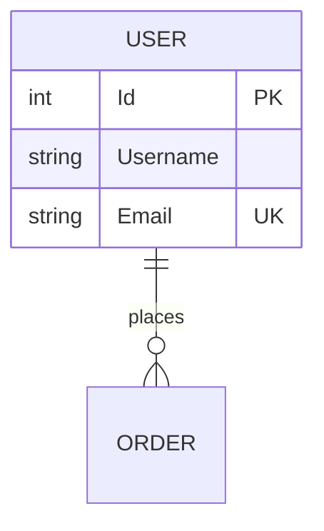

# Reverse Engineer Command

วิเคราะห์ codebase ที่มีอยู่แล้วสร้างเอกสารออกแบบระบบอัตโนมัติ

## Input ที่ได้รับ

```
/reverse-engineer วิเคราะห์ codebase นี้
/reverse-engineer สร้างเอกสารจาก code
/reverse-engineer $ARGUMENTS
```

## ขั้นตอนที่ต้องทำ

### Step 1: สแกนโครงสร้าง Project

```bash
# ดู directory structure
ls -la

# หา config files เพื่อระบุ technology
cat package.json 2>/dev/null | head -30
cat requirements.txt 2>/dev/null | head -20
cat *.csproj 2>/dev/null | head -30
cat pom.xml 2>/dev/null | head -30
cat composer.json 2>/dev/null | head -20
cat go.mod 2>/dev/null | head -10
```

### Step 2: ระบุ Technology Stack

| File Pattern | Technology | Framework |
|--------------|------------|-----------|
| `package.json` | Node.js | Express, NestJS, React, Vue, Angular |
| `requirements.txt`, `pyproject.toml` | Python | Django, FastAPI, Flask |
| `*.csproj`, `*.sln` | .NET | ASP.NET Core, Blazor |
| `pom.xml`, `build.gradle` | Java | Spring Boot |
| `composer.json` | PHP | Laravel, Symfony |
| `Gemfile` | Ruby | Rails |
| `go.mod` | Go | Gin, Echo, Fiber |
| `Cargo.toml` | Rust | Actix, Rocket |

### Step 3: วิเคราะห์ไฟล์สำคัญ

**อ่าน `references/codebase-analysis.md` สำหรับรายละเอียด**

#### สำหรับ ER Diagram & Data Dictionary

| Technology | Files to Analyze |
|------------|------------------|
| .NET Core | `Models/`, `Entities/`, `*DbContext.cs`, `Migrations/` |
| Node.js (Sequelize) | `models/*.js`, `migrations/` |
| Node.js (Prisma) | `prisma/schema.prisma` |
| Python/Django | `*/models.py`, `migrations/` |
| Laravel | `app/Models/`, `database/migrations/` |
| Java/Spring | `**/entity/*.java`, `@Entity` classes |

**สิ่งที่ต้องดู:**
- Class/Model names → Table names
- Properties → Columns
- Data Annotations → Constraints
- Relationships (HasMany, BelongsTo, ForeignKey)

#### สำหรับ Flow Diagram & Sequence Diagram

| Technology | Files to Analyze |
|------------|------------------|
| .NET Core | `Controllers/`, `Services/` |
| Node.js | `routes/`, `services/`, `controllers/` |
| Python/Django | `views.py`, `urls.py` |
| Laravel | `app/Http/Controllers/`, `routes/` |

**สิ่งที่ต้องดู:**
- API endpoints
- Method calls (Controller → Service → Repository)
- Business logic flow
- Async operations

#### สำหรับ Sitemap

| Technology | Files to Analyze |
|------------|------------------|
| .NET Core | `Controllers/`, `Views/`, routing config |
| Node.js/React | `routes/`, `pages/`, `src/components/` |
| Python/Django | `urls.py`, templates |
| Laravel | `routes/web.php`, `routes/api.php` |

### Step 4: สกัดข้อมูลและแปลงเป็น Diagrams

**Mapping:**

| Code Element | Document Section |
|--------------|------------------|
| Project structure, configs | 1. High-Level Architecture |
| Models/Entities | 4. Data Model, 7. ER Diagram |
| Database schema/migrations | 8. Data Dictionary |
| Controllers, Routes | 3. Modules, 9. Sitemap |
| Services, Business logic | 5. DFD, 6. Flow Diagrams |
| API endpoints | Sequence Diagrams |
| Auth/Role code | 10. User Roles & Permissions |

### Step 5: สร้างเอกสาร

**File Output:**
```
.design-docs/system-design-[project-name].md
```

**ใช้ template จาก:**
- `templates/design-doc-template.md`

### Step 6: Validate กับ Code

**ตรวจสอบ:**
- [ ] Entities ใน ER Diagram ตรงกับ Models ใน code
- [ ] Relationships ถูกต้อง
- [ ] API endpoints ใน Sequence Diagram ตรงกับ Controllers
- [ ] Routes ใน Sitemap ครบตาม routing config

---

## Technology-Specific Patterns

### .NET Core/ASP.NET

```csharp
// Entity → Table
public class User
{
    public int Id { get; set; }                    // PK
    public string Username { get; set; }           // Column
    [Required] public string Email { get; set; }   // NOT NULL
    public virtual ICollection<Order> Orders { get; set; }  // 1:N
}

// DbContext → Relationships
modelBuilder.Entity<Order>()
    .HasOne(o => o.User)
    .WithMany(u => u.Orders);
```

**แปลงเป็น ER:**


### Node.js (Prisma)

```prisma
model User {
  id       Int      @id @default(autoincrement())
  username String   @unique
  orders   Order[]
}

model Order {
  id     Int   @id @default(autoincrement())
  userId Int
  user   User  @relation(fields: [userId], references: [id])
}
```

### Python/Django

```python
class User(models.Model):
    username = models.CharField(max_length=50, unique=True)
    email = models.EmailField(unique=True)

class Order(models.Model):
    user = models.ForeignKey(User, on_delete=models.CASCADE, related_name='orders')
    total = models.DecimalField(max_digits=10, decimal_places=2)
```

---

## Output

### Success

```
✅ Reverse Engineering สำเร็จ!

📁 File: .design-docs/system-design-ecommerce-api.md

🔍 Analysis Summary:
   • Technology: Node.js + Express + Prisma
   • Framework: Express.js
   • Database: PostgreSQL
   • Files analyzed: 45

📊 Document Generated:
   • 10 sections completed
   • Entities: 12 (User, Product, Order, OrderItem, etc.)
   • Relationships: 18
   • API Endpoints: 24
   • Pages/Routes: 15

📈 Diagrams:
   • ER Diagram: 12 entities
   • Flow Diagrams: 5 (Order process, Payment, Shipping, etc.)
   • DFD Level 0, 1
   • Sequence Diagrams: 3 (Login, Checkout, Payment)
   • Sitemap: 15 pages

🔐 User Roles Detected:
   • admin, customer, seller

💡 Next steps:
   • /validate-design-doc → ตรวจสอบความครบถ้วน
   • /edit-section [section] → แก้ไขส่วนที่ต้องการ
   • /ui-mockup → สร้าง UI Mockups
```

### Partial Success (บางส่วนไม่สามารถวิเคราะห์ได้)

```
⚠️ Reverse Engineering สำเร็จบางส่วน

📁 File: .design-docs/system-design-legacy-app.md

⚠️ Issues Found:
   • Missing migrations - Data types may be incomplete
   • No clear service layer - Flow diagrams simplified
   • Mixed patterns - Some logic in controllers, some in services

📊 Document Generated:
   • 8/10 sections completed
   • Missing: DFD Level 2, Detailed Sequence Diagrams

💡 Recommended actions:
   • Review Data Dictionary - verify data types
   • Add Flow Diagrams for complex business logic
   • Update Sequence Diagrams for critical flows
```

---

## Legacy Code Support

### ASP.NET WebForms

**ไฟล์ที่ต้องดู:**
```
App_Code/
├── DAL/           → Data Access → ER Diagram
├── BLL/           → Business Logic → Flow Diagram
└── Entities/      → Data Model → Data Dictionary

*.aspx             → Pages → Sitemap
*.aspx.cs          → Code-behind → Logic Flow
Web.config         → Configuration → Tech Stack
```

### Classic ASP

**ไฟล์ที่ต้องดู:**
```
*.asp              → Pages + Logic
includes/
├── db.asp         → Database connection
├── functions.asp  → Business functions
```

**วิเคราะห์ SQL queries เพื่อเข้าใจ schema:**
```vbscript
sql = "SELECT u.Id, u.Username FROM Users u INNER JOIN Roles r ON u.RoleId = r.Id"
```

---

## Troubleshooting

| Issue | Cause | Solution |
|-------|-------|----------|
| No models found | Non-standard folder structure | ค้นหาด้วย pattern `*.entity.*`, `*.model.*` |
| Relationships missing | No FK annotations | ดู migrations หรือ DbContext config |
| Incomplete sitemap | SPA without routes file | ดู router config (React Router, Vue Router) |
| Mixed patterns | Legacy code | วิเคราะห์ทีละ layer แยก |

---

## Resources

| Resource | Description |
|----------|-------------|
| `references/codebase-analysis.md` | รายละเอียดการวิเคราะห์แต่ละ framework |
| `references/mermaid-patterns.md` | รูปแบบ diagrams |
| `references/troubleshooting.md` | แก้ไขปัญหาที่พบบ่อย |
| `templates/design-doc-template.md` | Template เอกสาร |
