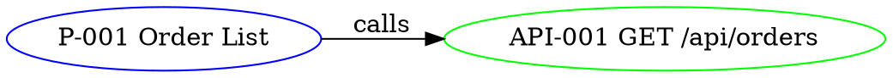

# /sitemap-export

Convert `.design-docs/sitemap.json` to alternate graph formats for use in external tools (Cytoscape Desktop, yEd, Graphviz).

## Usage

```
/sitemap-export cytoscape > sitemap.cy.json
/sitemap-export graphml   > sitemap.graphml
/sitemap-export dot       > sitemap.dot
```

## Output formats

### cytoscape (Cytoscape.js JSON)

```json
{
  "elements": {
    "nodes": [
      { "data": { "id": "P-001", "label": "Order List", "type": "page" } }
    ],
    "edges": [
      { "data": { "source": "P-001", "target": "API-001", "type": "calls" } }
    ]
  }
}
```

### graphml (yEd / Gephi compatible)

Standard GraphML XML with `<node>` per node and `<edge source="" target="">`.

### dot (Graphviz)



(Replace `-` with `_` in IDs since DOT uses `-` for arrows.)

## Process

### Step 1: Read sitemap.json
### Step 2: Apply format-specific renderer (one per format)
### Step 3: Print to stdout (or write file if `>` redirect)

> 💬 Note: Responds in Thai.
