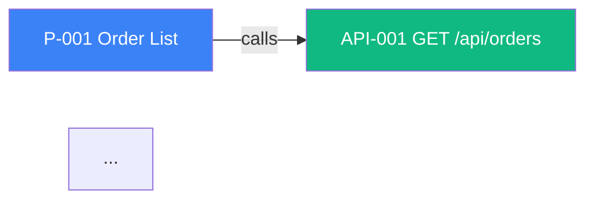

# /sitemap-graph

Generate Mermaid `flowchart` graph from `.design-docs/sitemap.json` `edges[]` and embed/replace into Section 9.8 of the design doc.

## Usage

```
/sitemap-graph                  # render all node types into one graph
/sitemap-graph --types page,api # filter by node types
/sitemap-graph --to-stdout       # print to terminal, do not modify md
```

## Process

### Step 1: Read sitemap.json and design_doc_ref

### Step 2: Build node label map
For each node N in design_system + application:
- label = `{N.id}[{N.id} {N.name}]` (Mermaid node syntax)
- Optionally style by type (color)

### Step 3: Build edge lines
For each edge E in edges[]:
- Render: `{from} -->|{type}| {to}`
- Filter by `--types` if given

### Step 4: Wrap in Mermaid



### Step 5: Update md (if not --to-stdout)

Locate Section 9.8 in design_doc_ref. Replace existing Mermaid block (between ```mermaid and ```) with new content. Preserve surrounding prose.

### Step 6: Output

```
✅ Section 9.8 graph updated

   38 nodes rendered (12 pages, 18 APIs, ...)
   42 edges rendered

📁 Updated: .design-docs/system-design-app.md (Section 9.8)
```

> 💬 Note: Responds in Thai.
