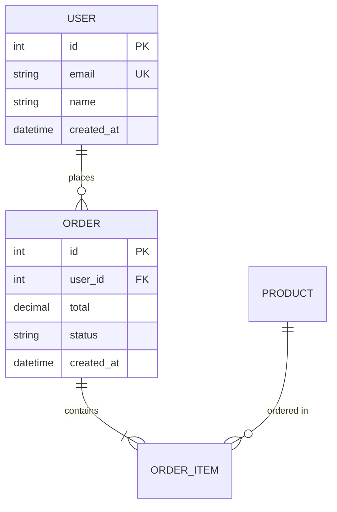
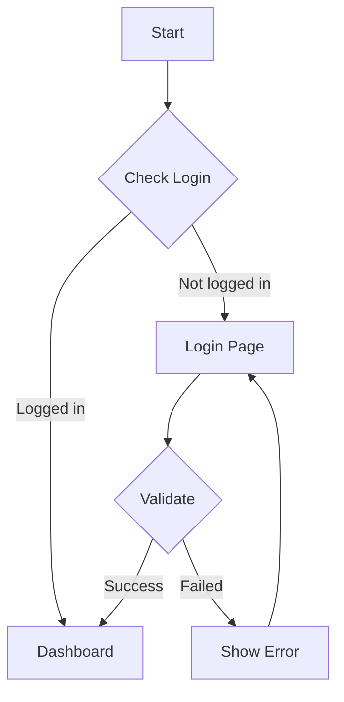
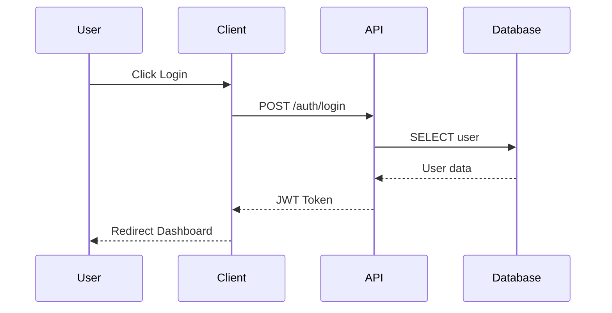
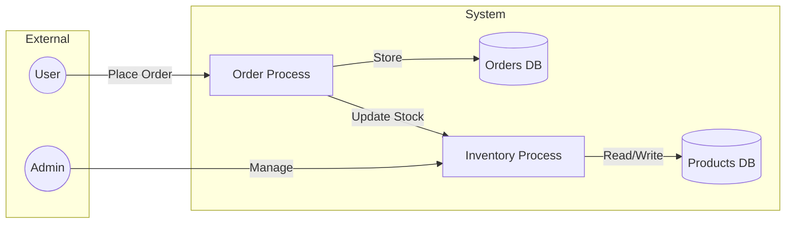
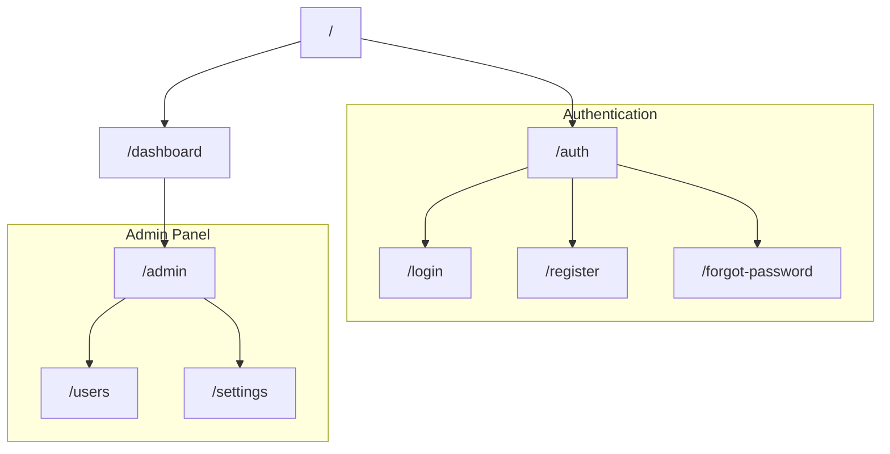

# System Design Document Command

สร้างเอกสารออกแบบระบบมาตรฐานครบวงจร รองรับทั้งการสร้างใหม่และ reverse engineering จาก codebase

## Input ที่ได้รับ

```
/system-design-doc สร้างเอกสารสำหรับระบบ HR
/system-design-doc จาก codebase นี้
/system-design-doc สร้าง ER Diagram สำหรับระบบจองห้องประชุม
/system-design-doc $ARGUMENTS
```

## วิเคราะห์ Mode

| Pattern | Mode | Action |
|---------|------|--------|
| "สร้างเอกสาร", "System Design" | **Create New** | สร้างเอกสารจาก requirements |
| "จาก codebase", "reverse engineer", "วิเคราะห์ code" | **Reverse Engineering** | วิเคราะห์ code แล้วสร้างเอกสาร |
| "ER Diagram", "ERD" | **ER Diagram Only** | สร้าง ER Diagram เฉพาะ |
| "Flow Diagram", "Flowchart" | **Flow Only** | สร้าง Flow Diagram เฉพาะ |
| "Data Dictionary", "DD" | **DD Only** | สร้าง Data Dictionary เฉพาะ |
| "DFD", "Data Flow" | **DFD Only** | สร้าง Data Flow Diagram เฉพาะ |
| "Sitemap" | **Sitemap Only** | สร้าง Sitemap เฉพาะ |
| "Sequence Diagram" | **Sequence Only** | สร้าง Sequence Diagram เฉพาะ |

---

## Mode 1: สร้างเอกสารใหม่จาก Requirements

### ขั้นตอน

1. **รวบรวม Requirements**
   - ถาม user เกี่ยวกับ scope, features, users
   - ระบุ technology stack (ถ้ามี)
   - กำหนด modules หลัก

2. **สร้างโครงสร้างเอกสาร**
   - ใช้ template จาก `templates/design-doc-template.md`
   - เติมข้อมูลตาม sections ใน `references/document-sections.md`

3. **สร้าง Diagrams**
   - ใช้ patterns จาก `references/mermaid-patterns.md`
   - ER Diagram, Flow Diagram, DFD, Sitemap, Sequence Diagram

4. **สร้าง Data Dictionary**
   - ใช้ template จาก `references/data-dictionary-template.md`

5. **บันทึกไฟล์**
   - สร้างไฟล์ `system-design-[project-name].md`

---

## Mode 2: Reverse Engineering จาก Codebase

### ขั้นตอน

1. **Scan โครงสร้าง Project**

```bash
# ดู directory structure
ls -la
find . -type f -name "*.py" -o -name "*.js" -o -name "*.ts" -o -name "*.java" -o -name "*.cs" | head -50

# ระบุ framework
cat package.json 2>/dev/null | head -20
cat requirements.txt 2>/dev/null | head -20
cat pom.xml 2>/dev/null | head -20
cat *.csproj 2>/dev/null | head -20
```

2. **ระบุ Technology Stack**

| File Pattern | Technology |
|--------------|------------|
| `package.json` | Node.js/React/Vue/Angular |
| `requirements.txt`, `pyproject.toml` | Python/Django/FastAPI/Flask |
| `pom.xml`, `build.gradle` | Java/Spring |
| `*.csproj`, `*.sln` | .NET/C# |
| `Gemfile` | Ruby/Rails |
| `go.mod` | Go |
| `Cargo.toml` | Rust |

3. **วิเคราะห์ไฟล์สำคัญ** (ดู `references/codebase-analysis.md`)

| Component | ไฟล์ที่ต้องอ่าน | สร้าง Diagram |
|-----------|----------------|---------------|
| **Models/Entities** | `models/`, `entities/`, `*.entity.ts` | ER Diagram |
| **Controllers/APIs** | `controllers/`, `routes/`, `api/` | Sequence Diagram |
| **Services** | `services/`, `usecases/` | Flow Diagram |
| **Routes/Pages** | `routes/`, `pages/`, `views/` | Sitemap |
| **Database** | `migrations/`, `schema.prisma` | Data Dictionary |

4. **สกัดข้อมูลและสร้างเอกสาร**

5. **Validate กับ Code**

---

## Mode 3: สร้าง Diagram เฉพาะ

### ER Diagram



### Flow Diagram



### Sequence Diagram



### Data Flow Diagram



### Sitemap



---

## Document Structure

เอกสารออกแบบระบบประกอบด้วย 10 ส่วนหลัก:

```
1. บทนำและภาพรวมระบบ (Introduction & Overview)
2. ความต้องการระบบ (System Requirements)
3. โมดูลที่เกี่ยวข้อง (Module Overview)
4. Data Model
5. Data Flow Diagram
6. Flow Diagrams
7. ER Diagram
8. Data Dictionary
9. Sitemap
10. User Roles & Permissions
```

---

## Output

### Success - Full Document

```
✅ สร้าง System Design Document สำเร็จ!

📁 File: system-design-hr-system.md

📊 Document Summary:
   • 10 sections completed
   • 5 diagrams (ER, Flow, DFD, Sitemap, Sequence)
   • 12 tables in Data Dictionary
   • 4 User Roles defined

📈 Diagrams included:
   • ER Diagram: 8 entities, 12 relationships
   • Flow Diagrams: 3 (Leave Request, Approval, Payroll)
   • DFD Level 1: 5 processes
   • Sitemap: 15 pages
   • Sequence: 2 (Login, Leave Request)

💡 Next steps:
   • /ui-mockup → สร้าง UI Mockups จากเอกสาร
   • Review และปรับปรุงเอกสาร
```

### Success - Single Diagram

```
✅ สร้าง ER Diagram สำเร็จ!

📊 ER Diagram Summary:
   • Entities: 8
   • Relationships: 12
   • Primary Keys: 8
   • Foreign Keys: 10

```mermaid
erDiagram
    [diagram here]
```

💡 Next steps:
   • /system-design-doc → สร้างเอกสารเต็มรูปแบบ
   • /data-dictionary → สร้าง Data Dictionary
```

---

## Resources

อ่านไฟล์เหล่านี้เพื่อรายละเอียดเพิ่มเติม:

| Resource | Description |
|----------|-------------|
| `references/codebase-analysis.md` | วิธีวิเคราะห์ code เพื่อสร้างเอกสาร |
| `references/mermaid-patterns.md` | รูปแบบ diagrams ทั้งหมด |
| `references/document-sections.md` | รายละเอียดแต่ละส่วนของเอกสาร |
| `references/data-dictionary-template.md` | รูปแบบ Data Dictionary |
| `templates/design-doc-template.md` | Template เอกสารฉบับเต็ม |
