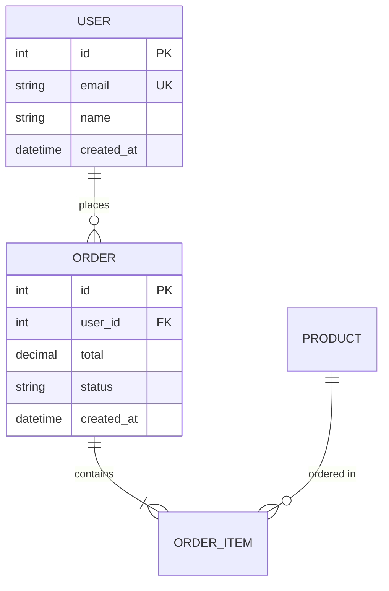
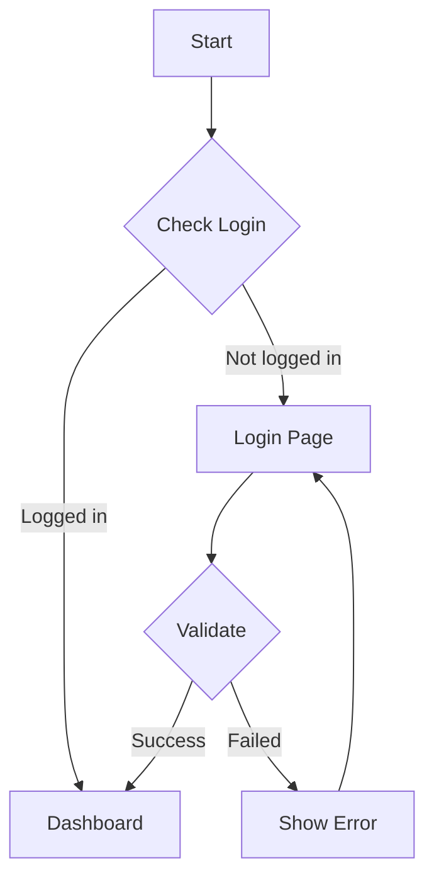
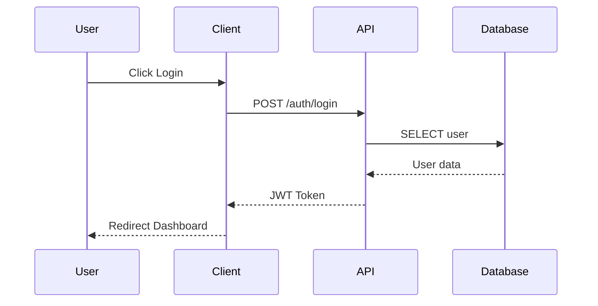
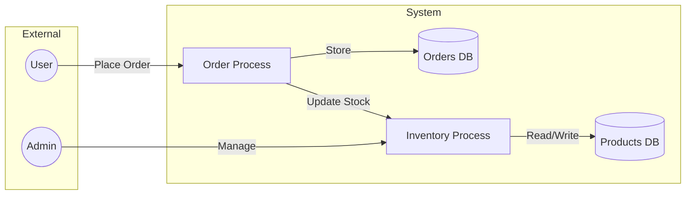
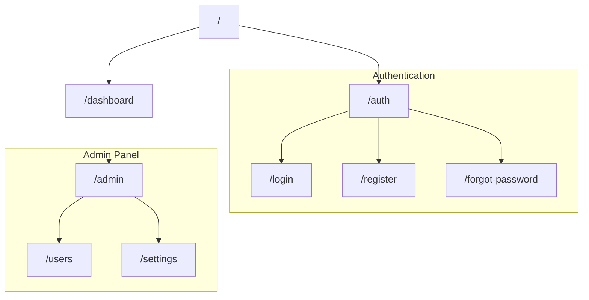

# System Design Document Command

Create a comprehensive standardized system design document. Supports both creating new documents and reverse engineering from codebases.

## Input Received

```
/system-design-doc create document for HR system
/system-design-doc from this codebase
/system-design-doc create ER Diagram for meeting room booking system
/system-design-doc $ARGUMENTS
```

## Analyze Mode

| Pattern | Mode | Action |
|---------|------|--------|
| "create document", "System Design" | **Create New** | Create document from requirements |
| "from codebase", "reverse engineer", "analyze code" | **Reverse Engineering** | Analyze code then create document |
| "ER Diagram", "ERD" | **ER Diagram Only** | Create ER Diagram only |
| "Flow Diagram", "Flowchart" | **Flow Only** | Create Flow Diagram only |
| "Data Dictionary", "DD" | **DD Only** | Create Data Dictionary only |
| "DFD", "Data Flow" | **DFD Only** | Create Data Flow Diagram only |
| "Sitemap" | **Sitemap Only** | Create Sitemap only |
| "Sequence Diagram" | **Sequence Only** | Create Sequence Diagram only |

---

## Mode 1: Create New Document from Requirements

### Steps

1. **Gather Requirements**
   - Ask user about scope, features, users
   - Identify technology stack (if available)
   - Define main modules

2. **Create Document Structure**
   - Use template from `templates/design-doc-template.md`
   - Fill in data per sections in `references/document-sections.md`

3. **Create Diagrams**
   - Use patterns from `references/mermaid-patterns.md`
   - ER Diagram, Flow Diagram, DFD, Sitemap, Sequence Diagram

4. **Create Data Dictionary**
   - Use template from `references/data-dictionary-template.md`

5. **Save File**
   - Create file `system-design-[project-name].md`

---

## Mode 2: Reverse Engineering from Codebase

### Steps

1. **Scan Project Structure**

```bash
# View directory structure
ls -la
find . -type f -name "*.py" -o -name "*.js" -o -name "*.ts" -o -name "*.java" -o -name "*.cs" | head -50

# Identify framework
cat package.json 2>/dev/null | head -20
cat requirements.txt 2>/dev/null | head -20
cat pom.xml 2>/dev/null | head -20
cat *.csproj 2>/dev/null | head -20
```

2. **Identify Technology Stack**

| File Pattern | Technology |
|--------------|------------|
| `package.json` | Node.js/React/Vue/Angular |
| `requirements.txt`, `pyproject.toml` | Python/Django/FastAPI/Flask |
| `pom.xml`, `build.gradle` | Java/Spring |
| `*.csproj`, `*.sln` | .NET/C# |
| `Gemfile` | Ruby/Rails |
| `go.mod` | Go |
| `Cargo.toml` | Rust |

3. **Analyze Key Files** (see `references/codebase-analysis.md`)

| Component | Files to read | Diagram to create |
|-----------|--------------|-------------------|
| **Models/Entities** | `models/`, `entities/`, `*.entity.ts` | ER Diagram |
| **Controllers/APIs** | `controllers/`, `routes/`, `api/` | Sequence Diagram |
| **Services** | `services/`, `usecases/` | Flow Diagram |
| **Routes/Pages** | `routes/`, `pages/`, `views/` | Sitemap |
| **Database** | `migrations/`, `schema.prisma` | Data Dictionary |

4. **Extract Data and Create Document**

5. **Validate Against Code**

---

## Mode 3: Create Specific Diagram

### ER Diagram


```mermaid
erDiagram
    USER ||--o{ ORDER : places
    ORDER ||--|{ ORDER_ITEM : contains
    PRODUCT ||--o{ ORDER_ITEM : "ordered in"

    USER {
        int id PK
        string email UK
        string name
        datetime created_at
    }

    ORDER {
        int id PK
        int user_id FK
        decimal total
        string status
        datetime created_at
    }
```

### Flow Diagram


```mermaid
flowchart TD
    A[Start] --> B{Check Login}
    B -->|Logged in| C[Dashboard]
    B -->|Not logged in| D[Login Page]
    D --> E{Validate}
    E -->|Success| C
    E -->|Failed| F[Show Error]
    F --> D
```

### Sequence Diagram


```mermaid
sequenceDiagram
    participant U as User
    participant C as Client
    participant A as API
    participant D as Database

    U->>C: Click Login
    C->>A: POST /auth/login
    A->>D: SELECT user
    D-->>A: User data
    A-->>C: JWT Token
    C-->>U: Redirect Dashboard
```

### Data Flow Diagram


```mermaid
flowchart LR
    subgraph External
        User((User))
        Admin((Admin))
    end

    subgraph System
        Process1[Order Process]
        Process2[Inventory Process]
        DS1[(Orders DB)]
        DS2[(Products DB)]
    end

    User -->|Place Order| Process1
    Process1 -->|Store| DS1
    Process1 -->|Update Stock| Process2
    Process2 -->|Read/Write| DS2
    Admin -->|Manage| Process2
```

### Sitemap


```mermaid
flowchart TD
    Home["/"]
    Auth["/auth"]
    Dashboard["/dashboard"]
    Admin["/admin"]

    Home --> Auth
    Home --> Dashboard
    Dashboard --> Admin

    subgraph Authentication
        Auth --> Login["/login"]
        Auth --> Register["/register"]
        Auth --> Forgot["/forgot-password"]
    end

    subgraph Admin Panel
        Admin --> Users["/users"]
        Admin --> Settings["/settings"]
    end
```

---

## Document Structure

The system design document consists of 10 main sections:

```
1. Introduction & Overview
2. System Requirements
3. Module Overview
4. Data Model
5. Data Flow Diagram
6. Flow Diagrams
7. ER Diagram
8. Data Dictionary
9. Sitemap
10. User Roles & Permissions
```

---

## Output

### Success - Full Document

```
✅ สร้าง System Design Document สำเร็จ!

📁 File: system-design-hr-system.md

📊 Document Summary:
   • 10 sections completed
   • 5 diagrams (ER, Flow, DFD, Sitemap, Sequence)
   • 12 tables in Data Dictionary
   • 4 User Roles defined

📈 Diagrams included:
   • ER Diagram: 8 entities, 12 relationships
   • Flow Diagrams: 3 (Leave Request, Approval, Payroll)
   • DFD Level 1: 5 processes
   • Sitemap: 15 pages
   • Sequence: 2 (Login, Leave Request)

💡 Next steps:
   • /ui-mockup → สร้าง UI Mockups จากเอกสาร
   • Review และปรับปรุงเอกสาร
```

### Success - Single Diagram

```
✅ สร้าง ER Diagram สำเร็จ!

📊 ER Diagram Summary:
   • Entities: 8
   • Relationships: 12
   • Primary Keys: 8
   • Foreign Keys: 10

```mermaid
erDiagram
    [diagram here]
```

💡 Next steps:
   • /system-design-doc → สร้างเอกสารเต็มรูปแบบ
   • /data-dictionary → สร้าง Data Dictionary
```

---

## Resources

Read these files for additional details:

| Resource | Description |
|----------|-------------|
| `references/codebase-analysis.md` | How to analyze code for document creation |
| `references/mermaid-patterns.md` | All diagram patterns |
| `references/document-sections.md` | Details for each document section |
| `references/data-dictionary-template.md` | Data Dictionary format |
| `templates/design-doc-template.md` | Full document template |

> 💬 **Note**: This command responds in Thai (คำสั่งนี้จะตอบกลับเป็นภาษาไทย)
