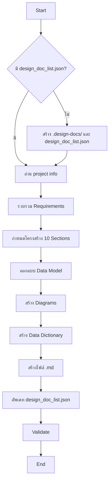
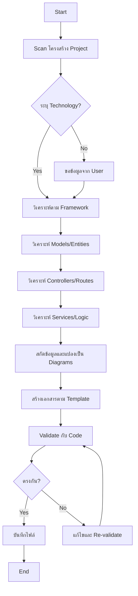
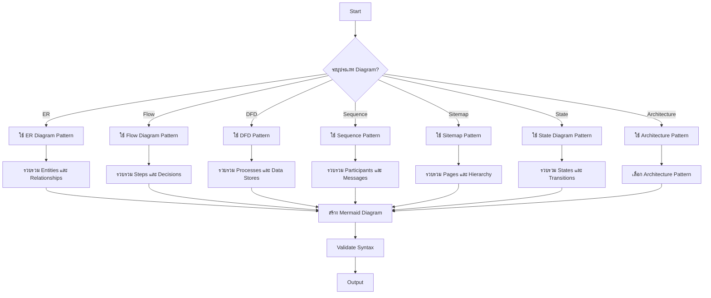
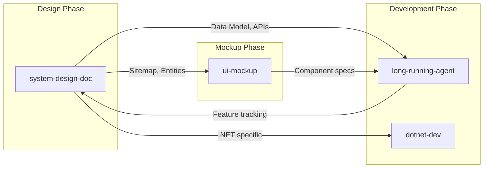

# System Design Document Skill

Skill สำหรับสร้างเอกสารออกแบบระบบมาตรฐานระดับ Enterprise พร้อม Mermaid diagrams รองรับทั้งการสร้างใหม่และ reverse engineering จาก codebase รวมถึง Architecture patterns สำหรับ Microservices, Event-driven, Clean Architecture และ DDD

---

## Commands Overview

| Command | Description |
|---------|-------------|
| `/create-design-doc` | สร้างเอกสารออกแบบระบบใหม่จาก requirements |
| `/reverse-engineer` | สร้างเอกสารจาก codebase ที่มีอยู่ |
| `/create-diagram` | สร้าง diagram เฉพาะประเภท (ER, Flow, DFD, Sequence, etc.) |
| `/edit-section` | แก้ไขส่วนใดส่วนหนึ่งของเอกสาร |
| `/validate-design-doc` | ตรวจสอบความครบถ้วนและความสอดคล้อง |
| `/system-design-doc` | คำสั่งทั่วไป (รองรับทุก mode) |

---

## Quick Start Examples

| สิ่งที่ต้องการ | ตัวอย่างคำสั่ง |
|---------------|---------------|
| **เอกสารฉบับเต็ม** | `/create-design-doc สร้างเอกสารสำหรับระบบ HR` |
| **จาก Codebase** | `/reverse-engineer วิเคราะห์ codebase นี้` |
| **ER Diagram** | `/create-diagram ER Diagram สำหรับระบบจองห้องประชุม` |
| **ER จาก Code** | `/reverse-engineer สร้าง ER Diagram จาก entities` |
| **Flow Diagram** | `/create-diagram Flow Diagram สำหรับกระบวนการอนุมัติลา` |
| **Data Dictionary** | `/create-diagram Data Dictionary สำหรับตาราง employees` |
| **DFD** | `/create-diagram DFD Level 1 สำหรับระบบสั่งซื้อ` |
| **Sitemap** | `/create-diagram Sitemap สำหรับเว็บ E-commerce` |
| **Sequence Diagram** | `/create-diagram Sequence Diagram สำหรับ Login process` |
| **แก้ไข Section** | `/edit-section ER Diagram - เพิ่ม entity Payment` |
| **ตรวจสอบเอกสาร** | `/validate-design-doc` |

---

## Workflow Diagrams

### Workflow 1: สร้างเอกสารใหม่จาก Requirements



### Workflow 2: Reverse Engineering จาก Codebase



### Workflow 3: สร้าง Diagram เฉพาะ



### Workflow 4: Integration with Other Skills



---

## Document Structure (10 Sections)

เอกสารออกแบบระบบประกอบด้วย 10 ส่วนหลัก:

| # | Section | Description | Required Diagrams |
|---|---------|-------------|-------------------|
| 1 | Introduction & Overview | ข้อมูลโครงการ, วัตถุประสงค์, ขอบเขต, Stakeholders | High-Level Architecture |
| 2 | System Requirements | FR, NFR, Business Rules, Constraints | - |
| 3 | Module Overview | รายการ modules, dependencies | Module Dependency Diagram |
| 4 | Data Model | Entity overview, relationships | Class Diagram (optional) |
| 5 | Data Flow Diagram | Data movement, processes, stores | DFD Level 0, 1, 2 |
| 6 | Flow Diagrams | Business processes, workflows | Flowcharts |
| 7 | ER Diagram | Entity relationships, cardinality | ER Diagram |
| 8 | Data Dictionary | Table definitions, columns, constraints | - |
| 9 | Sitemap | Page hierarchy, navigation | Sitemap Diagram |
| 10 | User Roles & Permissions | Roles, permission matrix, access rules | - |

---

## Diagram Types Supported

| Diagram Type | Mermaid Syntax | Use Case |
|--------------|----------------|----------|
| ER Diagram | `erDiagram` | Entity relationships, database design |
| Flow Diagram | `flowchart TD/LR` | Business processes, approval workflows |
| DFD | `flowchart` + subgraphs | Data flow between systems |
| Sequence Diagram | `sequenceDiagram` | API calls, system interactions |
| Sitemap | `flowchart TD` | Page structure, navigation |
| State Diagram | `stateDiagram-v2` | Status transitions, lifecycle |
| Class Diagram | `classDiagram` | Data model, OOP structure |
| Architecture | `flowchart` + subgraphs | System architecture, microservices |

---

## Architecture Patterns

### Supported Patterns

| Category | Patterns |
|----------|----------|
| **Microservices** | Service Boundary, API Gateway, Service Mesh, Database per Service |
| **Event-driven** | Event Sourcing, CQRS, Saga (Choreography/Orchestration), Message Broker |
| **Clean Architecture** | Layer Diagram, Dependency Flow, Use Case Flow |
| **DDD** | Bounded Context, Aggregate, Domain Events, Context Mapping |

### When to Use

| Pattern | Use When |
|---------|----------|
| **Microservices** | Large team, independent deployment needs |
| **Event-Driven** | Loose coupling, async processing needed |
| **CQRS** | Different read/write patterns |
| **Event Sourcing** | Full audit history required |
| **Clean Architecture** | Long-lived apps, testability priority |
| **DDD** | Complex domain logic |

---

## Technology Support

### Supported Frameworks for Reverse Engineering

| Technology | Detection Files | Entities Location | Routes Location |
|------------|-----------------|-------------------|-----------------|
| **.NET Core** | `*.csproj`, `*.sln` | `Models/`, `Entities/` | `Controllers/` |
| **Node.js/Express** | `package.json` | `models/` | `routes/` |
| **Node.js/Prisma** | `package.json`, `schema.prisma` | `prisma/schema.prisma` | `routes/` |
| **Python/Django** | `requirements.txt` | `*/models.py` | `*/urls.py` |
| **Laravel** | `composer.json` | `app/Models/` | `routes/web.php` |
| **Java/Spring** | `pom.xml`, `build.gradle` | `**/entity/*.java` | `**/controller/` |
| **Go** | `go.mod` | `models/` | `handlers/` |
| **Ruby/Rails** | `Gemfile` | `app/models/` | `config/routes.rb` |

### Legacy Support

| Technology | Files to Analyze |
|------------|------------------|
| **ASP.NET WebForms** | `*.aspx`, `App_Code/`, `Web.config` |
| **Classic ASP** | `*.asp`, `includes/` |

---

## Critical Rules

### MUST DO

1. **Always validate Mermaid syntax** ก่อนบันทึก
2. **Keep consistency** ระหว่าง ER Diagram และ Data Dictionary
3. **Use design_doc_list.json** เพื่อ track เอกสาร
4. **Include all 10 sections** สำหรับเอกสารฉบับเต็ม
5. **Reference architecture patterns** สำหรับระบบขนาดใหญ่
6. **Check DFD level consistency** (Level 0 ↔ Level 1)
7. **Define access rules** สำหรับทุกหน้าใน Sitemap

### MUST NOT

1. **Don't skip validation** หลังสร้างหรือแก้ไข
2. **Don't create diagrams without entities** ใน ER Diagram
3. **Don't use invalid characters** ในชื่อ entities (ห้ามใช้ `-`, space)
4. **Don't forget FK definitions** ใน Data Dictionary
5. **Don't leave orphan pages** ใน Sitemap (ไม่มี access rules)
6. **Don't create inconsistent sections** (entity ใน ER ต้องมีใน DD)

---

## Validation Checklist

### Before Completion

- [ ] ครบทั้ง 10 sections
- [ ] ER Diagram มี entities และ relationships ครบ
- [ ] ทุก entity ใน ER มีตารางใน Data Dictionary
- [ ] DFD Level 0 และ Level 1 สอดคล้องกัน
- [ ] Flow Diagrams ครอบคลุม business processes หลัก
- [ ] Sitemap มี access rules ครบทุกหน้า
- [ ] User Roles มี permission matrix
- [ ] Mermaid syntax ถูกต้อง (ไม่มี error)

### Consistency Checks

| Changed Section | Also Verify |
|-----------------|-------------|
| ER Diagram | Data Dictionary, Data Model |
| Data Dictionary | ER Diagram |
| Flow Diagrams | DFD, Sequence Diagrams |
| Sitemap | User Roles (access) |
| User Roles | Sitemap (access rules) |
| Modules | Flow Diagrams, ER Diagram |

---

## Integration with Other Skills

### ui-mockup Integration

```
system-design-doc → ui-mockup

Data ที่ส่งต่อ:
• Sitemap → mockup_list.json pages
• Entities → Form fields, Table columns
• User Roles → Access control per page
• Flow Diagrams → User journey reference
```

### long-running-agent Integration

```
system-design-doc → long-running-agent

Data ที่ส่งต่อ:
• Modules → Feature breakdown
• Data Model → Entity implementation
• APIs (Sequence) → Endpoint implementation
• Flow Diagrams → Business logic reference
```

### dotnet-dev Integration

```
system-design-doc → dotnet-dev

Data ที่ส่งต่อ:
• Entities → C# Model classes
• Relationships → EF Core configurations
• Data Dictionary → Database migrations
• APIs → Controller scaffolding
```

---

## Output Files

### Directory Structure

```
.design-docs/
├── design_doc_list.json          # Tracking file
├── system-design-[project].md    # Main document
├── diagrams/                     # (optional) Exported diagrams
│   ├── er-diagram.png
│   └── architecture.png
└── exports/                      # (optional) Exported formats
    ├── system-design.pdf
    └── system-design.docx
```

### File Naming Convention

| Type | Pattern | Example |
|------|---------|---------|
| Main Document | `system-design-[project-name].md` | `system-design-hr-management.md` |
| Tracking File | `design_doc_list.json` | - |

---

## Success Output Examples

### Full Document

```
✅ สร้าง System Design Document สำเร็จ!

📁 File: .design-docs/system-design-hr-management.md

📊 Document Summary:
   • 10 sections completed
   • 7 diagrams (ER, 3 Flow, DFD L0+L1, Sitemap, 2 Sequence)
   • 12 tables in Data Dictionary
   • 4 User Roles defined

📈 Statistics:
   • Entities: 8
   • Relationships: 12
   • API Endpoints: 15
   • Pages: 20

💡 Next steps:
   • /ui-mockup → สร้าง UI Mockups จากเอกสาร
   • /validate-design-doc → ตรวจสอบความครบถ้วน
```

### Single Diagram

```
✅ สร้าง ER Diagram สำเร็จ!

📊 ER Diagram:
   • Entities: 8
   • Relationships: 12

💡 Next steps:
   • /create-design-doc → สร้างเอกสารฉบับเต็ม
   • /create-diagram Data Dictionary → สร้าง DD
```

---

## Resources

| Resource | Location | Description |
|----------|----------|-------------|
| Codebase Analysis Guide | `references/codebase-analysis.md` | วิธีวิเคราะห์ code ต่าง framework |
| Mermaid Patterns | `references/mermaid-patterns.md` | รูปแบบ diagrams ทั้งหมด |
| Architecture Patterns | `references/architecture-patterns.md` | Microservices, Event-driven, Clean, DDD |
| Document Sections | `references/document-sections.md` | รายละเอียดแต่ละ section |
| Data Dictionary Template | `references/data-dictionary-template.md` | รูปแบบ Data Dictionary |
| Troubleshooting | `references/troubleshooting.md` | แก้ไขปัญหาที่พบบ่อย |
| Full Template | `templates/design-doc-template.md` | Template เอกสารฉบับเต็ม |
| Tracking File | `templates/design_doc_list.json` | Schema สำหรับ tracking |

---

## Troubleshooting Quick Reference

| Problem | Solution |
|---------|----------|
| Mermaid syntax error | ดู `references/troubleshooting.md` Section 1 |
| No models found | ค้นหาด้วย pattern `*.entity.*`, `*.model.*` |
| Missing relationships | ดู DbContext, Fluent API, หรือ migrations |
| ER ↔ DD mismatch | ตรวจสอบ naming convention และ column count |
| DFD inconsistency | ตรวจสอบ external entities และ data stores |

---

## Version History

| Version | Date | Changes |
|---------|------|---------|
| 1.2.0 | 2025-01-20 | Added 5 granular commands, architecture patterns, troubleshooting, tracking file |
| 1.1.0 | 2024-12-15 | Added DDD patterns, improved reverse engineering |
| 1.0.0 | 2024-11-01 | Initial release |
