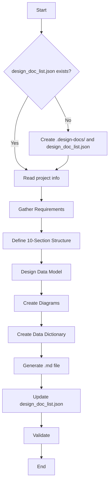
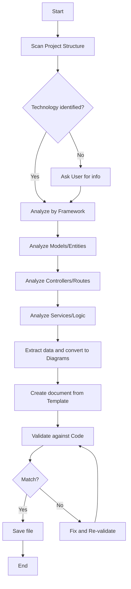
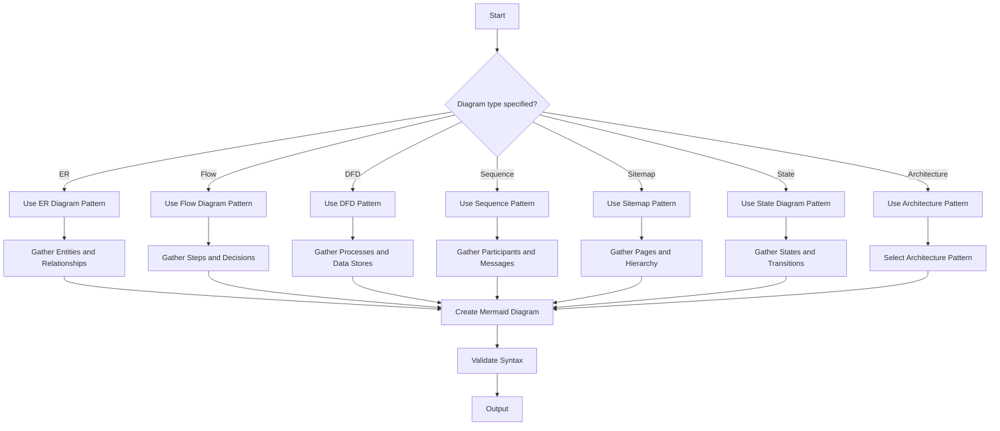
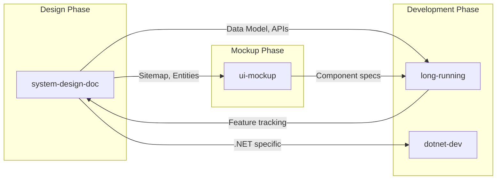

# System Design Document Skill

> **Response Language**: Always respond to users in Thai (ภาษาไทย)

Skill for creating enterprise-grade standardized system design documents with Mermaid diagrams. Supports both creating new documents and reverse engineering from existing codebases, including Architecture patterns for Microservices, Event-driven, Clean Architecture, and DDD.

---

## Commands Overview

| Command | Description |
|---------|-------------|
| `/create-design-doc` | Create a new system design document from requirements |
| `/reverse-engineer` | Create a document from an existing codebase |
| `/create-diagram` | Create a specific diagram type (ER, Flow, DFD, Sequence, etc.) |
| `/edit-section` | Edit a specific section of the document |
| `/validate-design-doc` | Validate completeness and consistency |
| `/import-plan` | Import a document from an implementation plan or free-form design doc |
| `/sync-with-mockups` | Sync entities and pages with ui-mockup |
| `/sync-with-features` | Sync APIs and entities with long-running |
| `/validate-integration` | Validate cross-references across all 3 plugins |
| `/brainstorm-design` | Interactive brainstorming and Q&A session for system design |
| `/system-design-doc` | General command (supports all modes) |

---

## Quick Start Examples

| What you need | Example command |
|---------------|---------------|
| **Full document** | `/create-design-doc สร้างเอกสารสำหรับระบบ HR` |
| **From Codebase** | `/reverse-engineer วิเคราะห์ codebase นี้` |
| **ER Diagram** | `/create-diagram ER Diagram สำหรับระบบจองห้องประชุม` |
| **ER from Code** | `/reverse-engineer สร้าง ER Diagram จาก entities` |
| **Flow Diagram** | `/create-diagram Flow Diagram สำหรับกระบวนการอนุมัติลา` |
| **Data Dictionary** | `/create-diagram Data Dictionary สำหรับตาราง employees` |
| **DFD** | `/create-diagram DFD Level 1 สำหรับระบบสั่งซื้อ` |
| **Sitemap** | `/create-diagram Sitemap สำหรับเว็บ E-commerce` |
| **Sequence Diagram** | `/create-diagram Sequence Diagram สำหรับ Login process` |
| **Edit Section** | `/edit-section ER Diagram - เพิ่ม entity Payment` |
| **Validate document** | `/validate-design-doc` |

---

## Workflow Diagrams

### Workflow 1: Create New Document from Requirements


```mermaid
flowchart TD
    A[Start] --> B{design_doc_list.json exists?}
    B -->|No| C[Create .design-docs/ and design_doc_list.json]
    B -->|Yes| D[Read project info]
    C --> D
    D --> E[Gather Requirements]
    E --> F[Define 10-Section Structure]
    F --> G[Design Data Model]
    G --> H[Create Diagrams]
    H --> I[Create Data Dictionary]
    I --> J[Generate .md file]
    J --> K[Update design_doc_list.json]
    K --> L[Validate]
    L --> M[End]
```

### Workflow 2: Reverse Engineering from Codebase


```mermaid
flowchart TD
    A[Start] --> B[Scan Project Structure]
    B --> C{Technology identified?}
    C -->|Yes| D[Analyze by Framework]
    C -->|No| E[Ask User for info]
    E --> D
    D --> F[Analyze Models/Entities]
    F --> G[Analyze Controllers/Routes]
    G --> H[Analyze Services/Logic]
    H --> I[Extract data and convert to Diagrams]
    I --> J[Create document from Template]
    J --> K[Validate against Code]
    K --> L{Match?}
    L -->|Yes| M[Save file]
    L -->|No| N[Fix and Re-validate]
    N --> K
    M --> O[End]
```

### Workflow 3: Create Specific Diagram


```mermaid
flowchart TD
    A[Start] --> B{Diagram type specified?}
    B -->|ER| C[Use ER Diagram Pattern]
    B -->|Flow| D[Use Flow Diagram Pattern]
    B -->|DFD| E[Use DFD Pattern]
    B -->|Sequence| F[Use Sequence Pattern]
    B -->|Sitemap| G[Use Sitemap Pattern]
    B -->|State| H[Use State Diagram Pattern]
    B -->|Architecture| I[Use Architecture Pattern]
    C --> J[Gather Entities and Relationships]
    D --> K[Gather Steps and Decisions]
    E --> L[Gather Processes and Data Stores]
    F --> M[Gather Participants and Messages]
    G --> N[Gather Pages and Hierarchy]
    H --> O[Gather States and Transitions]
    I --> P[Select Architecture Pattern]
    J --> Q[Create Mermaid Diagram]
    K --> Q
    L --> Q
    M --> Q
    N --> Q
    O --> Q
    P --> Q
    Q --> R[Validate Syntax]
    R --> S[Output]
```

### Workflow 4: Integration with Other Skills


```mermaid
flowchart LR
    subgraph DesignPhase["Design Phase"]
        SD[system-design-doc]
    end

    subgraph MockupPhase["Mockup Phase"]
        UM[ui-mockup]
    end

    subgraph DevPhase["Development Phase"]
        LR[long-running]
        DN[dotnet-dev]
    end

    SD -->|Sitemap, Entities| UM
    SD -->|Data Model, APIs| LR
    UM -->|Component specs| LR
    SD -->|.NET specific| DN
    LR -->|Feature tracking| SD
```

---

## Document Structure (10 Sections)

The system design document consists of 10 main sections:

| # | Section | Description | Required Diagrams |
|---|---------|-------------|-------------------|
| 1 | Introduction & Overview | Project info, objectives, scope, Stakeholders | High-Level Architecture |
| 2 | System Requirements | FR, NFR, Business Rules, Constraints | - |
| 3 | Module Overview | List of modules, dependencies | Module Dependency Diagram |
| 4 | Data Model | Entity overview, relationships | Class Diagram (optional) |
| 5 | Data Flow Diagram | Data movement, processes, stores | DFD Level 0, 1, 2 |
| 6 | Flow Diagrams | Business processes, workflows | Flowcharts |
| 7 | ER Diagram | Entity relationships, cardinality | ER Diagram |
| 8 | Data Dictionary | Table definitions, columns, constraints | - |
| 9 | Sitemap | Page hierarchy, navigation | Sitemap Diagram |
| 10 | User Roles & Permissions | Roles, permission matrix, access rules | - |

---

## Diagram Types Supported

| Diagram Type | Mermaid Syntax | Use Case |
|--------------|----------------|----------|
| ER Diagram | `erDiagram` | Entity relationships, database design |
| Flow Diagram | `flowchart TD/LR` | Business processes, approval workflows |
| DFD | `flowchart` + subgraphs | Data flow between systems |
| Sequence Diagram | `sequenceDiagram` | API calls, system interactions |
| Sitemap | `flowchart TD` | Page structure, navigation |
| State Diagram | `stateDiagram-v2` | Status transitions, lifecycle |
| Class Diagram | `classDiagram` | Data model, OOP structure |
| Architecture | `flowchart` + subgraphs | System architecture, microservices |

---

## Architecture Patterns

### Supported Patterns

| Category | Patterns |
|----------|----------|
| **Microservices** | Service Boundary, API Gateway, Service Mesh, Database per Service |
| **Event-driven** | Event Sourcing, CQRS, Saga (Choreography/Orchestration), Message Broker |
| **Clean Architecture** | Layer Diagram, Dependency Flow, Use Case Flow |
| **DDD** | Bounded Context, Aggregate, Domain Events, Context Mapping |

### When to Use

| Pattern | Use When |
|---------|----------|
| **Microservices** | Large team, independent deployment needs |
| **Event-Driven** | Loose coupling, async processing needed |
| **CQRS** | Different read/write patterns |
| **Event Sourcing** | Full audit history required |
| **Clean Architecture** | Long-lived apps, testability priority |
| **DDD** | Complex domain logic |

---

## Technology Support

### Supported Frameworks for Reverse Engineering

| Technology | Detection Files | Entities Location | Routes Location |
|------------|-----------------|-------------------|-----------------|
| **.NET Core** | `*.csproj`, `*.sln` | `Models/`, `Entities/` | `Controllers/` |
| **Node.js/Express** | `package.json` | `models/` | `routes/` |
| **Node.js/Prisma** | `package.json`, `schema.prisma` | `prisma/schema.prisma` | `routes/` |
| **Python/Django** | `requirements.txt` | `*/models.py` | `*/urls.py` |
| **Laravel** | `composer.json` | `app/Models/` | `routes/web.php` |
| **Java/Spring** | `pom.xml`, `build.gradle` | `**/entity/*.java` | `**/controller/` |
| **Go** | `go.mod` | `models/` | `handlers/` |
| **Ruby/Rails** | `Gemfile` | `app/models/` | `config/routes.rb` |

### Legacy Support

| Technology | Files to Analyze |
|------------|------------------|
| **ASP.NET WebForms** | `*.aspx`, `App_Code/`, `Web.config` |
| **Classic ASP** | `*.asp`, `includes/` |

---

## ⚠️ CRITICAL RULES (MUST FOLLOW)

### Section Completeness

1. **ALL 10 sections are mandatory** — Introduction, Requirements, Modules, Data Model, DFD, Flow Diagrams, ER Diagram, Data Dictionary, Sitemap, User Roles & Permissions
2. **No abbreviation** — every section must have full content, not summaries or placeholders
3. **No placeholder text** — "[TBD]", "[TODO]", "will be added later" is forbidden

### Diagram Rules

4. **Validate Mermaid syntax** — every diagram must render without errors
5. **Valid entity names** — use PascalCase or snake_case only (no hyphens, no spaces in identifiers)
6. **Close all subgraphs** — every `subgraph` must have a matching `end`

### Consistency Rules

7. **ER ↔ Data Dictionary** — every entity in ER Diagram must have a matching table in Data Dictionary, and vice versa
8. **DFD Level 0 ↔ Level 1** — all processes in Level 0 must be decomposed in Level 1
9. **Sitemap ↔ User Roles** — every page in Sitemap must have access rules defined in User Roles section

### Quality Rules

10. **Unique FR IDs** — every Functional Requirement must have a unique ID (FR-001, FR-002, etc.)
11. **PK required** — every table in Data Dictionary must have a Primary Key defined
12. **FK valid** — every Foreign Key must reference an existing table and column
13. **Permission matrix complete** — every role must have permissions defined for every module/page

### 🔍 Self-Check Checklist (MANDATORY before submitting output)

Before completing the design document, verify EVERY item:

- [ ] All 10 sections present with full content?
- [ ] All Mermaid diagrams render without errors?
- [ ] ER Diagram entities match Data Dictionary tables?
- [ ] DFD Level 0 processes match Level 1 decomposition?
- [ ] Sitemap pages match User Roles access rules?
- [ ] All Functional Requirements have unique IDs?
- [ ] All tables have Primary Keys defined?
- [ ] All Foreign Keys reference valid tables?
- [ ] No placeholder text remaining ("[TBD]", "[TODO]")?
- [ ] Permission matrix is complete for all roles?

If ANY checkbox is unchecked, DO NOT submit. Fix the issue first.

### ❌ Output Rejection Criteria

Your output will be REJECTED and you must REDO the entire task if:

- Any of the 10 sections is missing or contains only placeholder text
- ER Diagram entities don't match Data Dictionary tables (mismatch)
- Mermaid diagrams have syntax errors
- Placeholder text remains in any section
- Permission matrix is incomplete

### ⚠️ Penalty

Violating these rules means the document is INVALID. You must redo the ENTIRE document from scratch. There are no partial passes — either ALL rules are followed or the output is REJECTED.

---

### Consistency Checks

| Changed Section | Also Verify |
|-----------------|-------------|
| ER Diagram | Data Dictionary, Data Model |
| Data Dictionary | ER Diagram |
| Flow Diagrams | DFD, Sequence Diagrams |
| Sitemap | User Roles (access) |
| User Roles | Sitemap (access rules) |
| Modules | Flow Diagrams, ER Diagram |

---

## Integration with Other Skills

### ui-mockup Integration

```
system-design-doc → ui-mockup

Data passed:
• Sitemap → mockup_list.json pages
• Entities → Form fields, Table columns
• User Roles → Access control per page
• Flow Diagrams → User journey reference
```

### long-running Integration

```
system-design-doc → long-running

Data passed:
• Modules → Feature breakdown
• Data Model → Entity implementation
• APIs (Sequence) → Endpoint implementation
• Flow Diagrams → Business logic reference
```

### dotnet-dev Integration

```
system-design-doc → dotnet-dev

Data passed:
• Entities → C# Model classes
• Relationships → EF Core configurations
• Data Dictionary → Database migrations
• APIs → Controller scaffolding
```

---

## Output Files

### Directory Structure

```
.design-docs/
├── design_doc_list.json          # Tracking file
├── system-design-[project].md    # Main document
├── diagrams/                     # (optional) Exported diagrams
│   ├── er-diagram.png
│   └── architecture.png
└── exports/                      # (optional) Exported formats
    ├── system-design.pdf
    └── system-design.docx
```

### File Naming Convention

| Type | Pattern | Example |
|------|---------|---------|
| Main Document | `system-design-[project-name].md` | `system-design-hr-management.md` |
| Tracking File | `design_doc_list.json` | - |

---

## Success Output Examples

### Full Document

```
✅ สร้าง System Design Document สำเร็จ!

📁 File: .design-docs/system-design-hr-management.md

📊 Document Summary:
   • 10 sections completed
   • 7 diagrams (ER, 3 Flow, DFD L0+L1, Sitemap, 2 Sequence)
   • 12 tables in Data Dictionary
   • 4 User Roles defined

📈 Statistics:
   • Entities: 8
   • Relationships: 12
   • API Endpoints: 15
   • Pages: 20

💡 Next steps:
   • /ui-mockup → สร้าง UI Mockups จากเอกสาร
   • /validate-design-doc → ตรวจสอบความครบถ้วน
```

### Single Diagram

```
✅ สร้าง ER Diagram สำเร็จ!

📊 ER Diagram:
   • Entities: 8
   • Relationships: 12

💡 Next steps:
   • /create-design-doc → สร้างเอกสารฉบับเต็ม
   • /create-diagram Data Dictionary → สร้าง DD
```

---

## Resources

| Resource | Location | Description |
|----------|----------|-------------|
| Codebase Analysis Guide | `references/codebase-analysis.md` | How to analyze code for various frameworks |
| Mermaid Patterns | `references/mermaid-patterns.md` | All diagram patterns |
| Architecture Patterns | `references/architecture-patterns.md` | Microservices, Event-driven, Clean, DDD |
| Document Sections | `references/document-sections.md` | Details of each section |
| Data Dictionary Template | `references/data-dictionary-template.md` | Data Dictionary format |
| Troubleshooting | `references/troubleshooting.md` | Common problem solutions |
| Full Template | `templates/design-doc-template.md` | Full document template |
| Tracking File | `templates/design_doc_list.json` | Tracking schema |

---

## Troubleshooting Quick Reference

| Problem | Solution |
|---------|----------|
| Mermaid syntax error | See `references/troubleshooting.md` Section 1 |
| No models found | Search with pattern `*.entity.*`, `*.model.*` |
| Missing relationships | Check DbContext, Fluent API, or migrations |
| ER ↔ DD mismatch | Check naming convention and column count |
| DFD inconsistency | Check external entities and data stores |

---

## Version History

| Version | Date | Changes |
|---------|------|---------|
| 1.4.0 | | - Added CRITICAL RULES with self-check checklist, output rejection criteria, and penalty<br>- Added `/brainstorm-design` command (8-phase interactive brainstorming)<br>- Added hybrid brainstorm auto-detect in `/create-design-doc`<br>- Translated all content to English for AI comprehension |
| 1.3.0 | 2025-01-25 | Added /import-plan command, cross-plugin integration (/sync-with-mockups, /sync-with-features, /validate-integration), schema v2.1.0 with CRUD enabled/disabled + soft delete strategy |
| 1.2.0 | 2025-01-20 | Added 5 granular commands, architecture patterns, troubleshooting, tracking file |
| 1.1.0 | 2024-12-15 | Added DDD patterns, improved reverse engineering |
| 1.0.0 | 2024-11-01 | Initial release |
