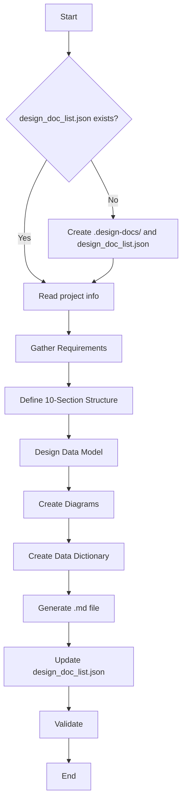
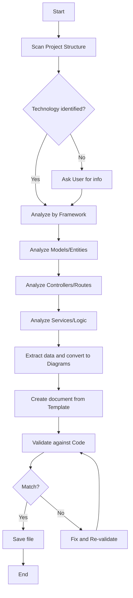
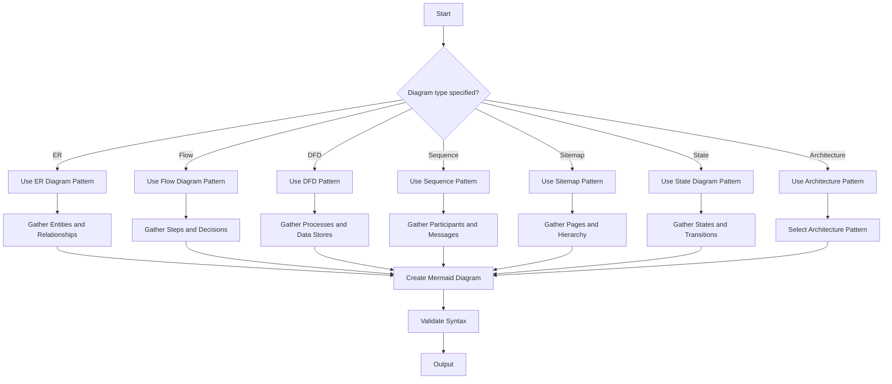
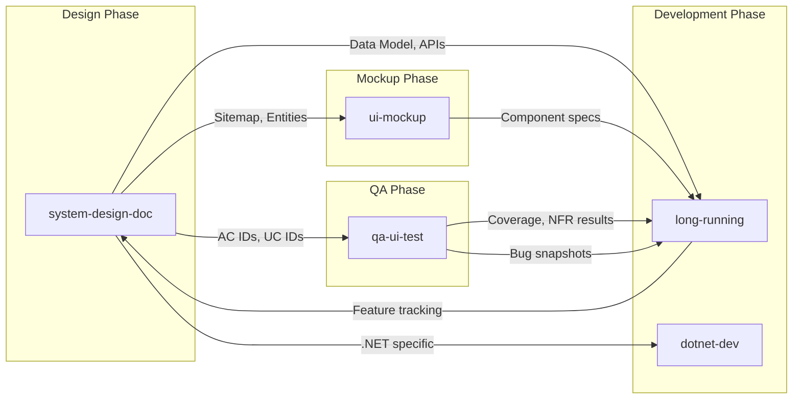

# System Design Document Skill

> **Response Language**: Always respond to users in Thai (ภาษาไทย)

Skill for creating enterprise-grade standardized system design documents with Mermaid diagrams. Supports both creating new documents and reverse engineering from existing codebases, including Architecture patterns for Microservices, Event-driven, Clean Architecture, and DDD.

---

## Commands Overview

| Command | Description |
|---------|-------------|
| `/create-design-doc` | Create a new system design document from requirements |
| `/reverse-engineer` | Create a document from an existing codebase |
| `/create-diagram` | Create a specific diagram type (ER, Flow, DFD, Sequence, etc.) |
| `/edit-section` | Edit a specific section of the document |
| `/validate-design-doc` | Validate completeness and consistency |
| `/import-plan` | Import a document from an implementation plan or free-form design doc |
| `/sync-with-mockups` | Sync entities and pages with ui-mockup |
| `/sync-with-features` | Sync APIs and entities with long-running |
| `/sync-with-qa-tracker` | Sync acceptance criteria + use cases with qa-ui-test (v1.7.0) |
| `/validate-integration` | Validate cross-references across all 4 plugins (v1.7.0: + qa-ui-test) |
| `/brainstorm-design` | Interactive brainstorming and Q&A session for system design |
| `/system-design-doc` | General command (supports all modes) |
| `/sitemap-init` | Initialize .design-docs/sitemap.json |
| `/sitemap-add-node` | Add node (page/api/mw/ext/master/template/nav/component) |
| `/sitemap-link` | Add edge between two nodes |
| `/sitemap-scan` | Auto-scan codebase to populate nodes |
| `/sync-sitemap` | Bidirectional sync md ↔ sitemap.json + pull downstream |
| `/sitemap-validate` | Run schema + R31-R35 validation |
| `/sitemap-graph` | Render Mermaid graph from edges |
| `/sitemap-export` | Export to Cytoscape / GraphML / DOT |
| `/split-design-doc` | Migrate single-file doc → split layout |

---

## Quick Start Examples

| What you need | Example command |
|---------------|---------------|
| **Full document** | `/create-design-doc สร้างเอกสารสำหรับระบบ HR` |
| **From Codebase** | `/reverse-engineer วิเคราะห์ codebase นี้` |
| **ER Diagram** | `/create-diagram ER Diagram สำหรับระบบจองห้องประชุม` |
| **ER from Code** | `/reverse-engineer สร้าง ER Diagram จาก entities` |
| **Flow Diagram** | `/create-diagram Flow Diagram สำหรับกระบวนการอนุมัติลา` |
| **Data Dictionary** | `/create-diagram Data Dictionary สำหรับตาราง employees` |
| **DFD** | `/create-diagram DFD Level 1 สำหรับระบบสั่งซื้อ` |
| **Sitemap** | `/create-diagram Sitemap สำหรับเว็บ E-commerce` |
| **Sequence Diagram** | `/create-diagram Sequence Diagram สำหรับ Login process` |
| **Edit Section** | `/edit-section ER Diagram - เพิ่ม entity Payment` |
| **Validate document** | `/validate-design-doc` |

---

## Workflow Diagrams

### Workflow 1: Create New Document from Requirements


```mermaid
flowchart TD
    A[Start] --> B{design_doc_list.json exists?}
    B -->|No| C[Create .design-docs/ and design_doc_list.json]
    B -->|Yes| D[Read project info]
    C --> D
    D --> E[Gather Requirements]
    E --> F[Define 10-Section Structure]
    F --> G[Design Data Model]
    G --> H[Create Diagrams]
    H --> I[Create Data Dictionary]
    I --> J[Generate .md file]
    J --> K[Update design_doc_list.json]
    K --> L[Validate]
    L --> M[End]
```

### Workflow 2: Reverse Engineering from Codebase


```mermaid
flowchart TD
    A[Start] --> B[Scan Project Structure]
    B --> C{Technology identified?}
    C -->|Yes| D[Analyze by Framework]
    C -->|No| E[Ask User for info]
    E --> D
    D --> F[Analyze Models/Entities]
    F --> G[Analyze Controllers/Routes]
    G --> H[Analyze Services/Logic]
    H --> I[Extract data and convert to Diagrams]
    I --> J[Create document from Template]
    J --> K[Validate against Code]
    K --> L{Match?}
    L -->|Yes| M[Save file]
    L -->|No| N[Fix and Re-validate]
    N --> K
    M --> O[End]
```

### Workflow 3: Create Specific Diagram


```mermaid
flowchart TD
    A[Start] --> B{Diagram type specified?}
    B -->|ER| C[Use ER Diagram Pattern]
    B -->|Flow| D[Use Flow Diagram Pattern]
    B -->|DFD| E[Use DFD Pattern]
    B -->|Sequence| F[Use Sequence Pattern]
    B -->|Sitemap| G[Use Sitemap Pattern]
    B -->|State| H[Use State Diagram Pattern]
    B -->|Architecture| I[Use Architecture Pattern]
    C --> J[Gather Entities and Relationships]
    D --> K[Gather Steps and Decisions]
    E --> L[Gather Processes and Data Stores]
    F --> M[Gather Participants and Messages]
    G --> N[Gather Pages and Hierarchy]
    H --> O[Gather States and Transitions]
    I --> P[Select Architecture Pattern]
    J --> Q[Create Mermaid Diagram]
    K --> Q
    L --> Q
    M --> Q
    N --> Q
    O --> Q
    P --> Q
    Q --> R[Validate Syntax]
    R --> S[Output]
```

### Workflow 4: Integration with Other Skills


```mermaid
flowchart LR
    subgraph DesignPhase["Design Phase"]
        SD[system-design-doc]
    end

    subgraph MockupPhase["Mockup Phase"]
        UM[ui-mockup]
    end

    subgraph DevPhase["Development Phase"]
        LR[long-running]
        DN[dotnet-dev]
    end

    subgraph QAPhase["QA Phase"]
        QA[qa-ui-test]
    end

    SD -->|Sitemap, Entities| UM
    SD -->|Data Model, APIs| LR
    SD -->|AC IDs, UC IDs| QA
    UM -->|Component specs| LR
    SD -->|.NET specific| DN
    LR -->|Feature tracking| SD
    QA -->|Coverage, NFR results| LR
    QA -->|Bug snapshots| LR
```

> **AC ID Propagation** is **one-way** from system-design-doc → consumers. Other plugins reference AC IDs but do **not** create them. Use `/sync-with-qa-tracker` to push IDs to qa-tracker scenarios and pull coverage back.

---

## Document Structure (10 Sections)

The system design document consists of 10 main sections:

| # | Section | Description | Required Diagrams |
|---|---------|-------------|-------------------|
| 1 | Introduction & Overview | Project info, objectives, scope, Stakeholders | High-Level Architecture |
| 2 | System Requirements | FR, NFR, Business Rules, Constraints | - |
| 3 | Module Overview | List of modules, dependencies | Module Dependency Diagram |
| 4 | Data Model | Entity overview, relationships | Class Diagram (optional) |
| 5 | Data Flow Diagram | Data movement, processes, stores | DFD Level 0, 1, 2 |
| 6 | Flow Diagrams | Business processes, workflows | Flowcharts |
| 7 | ER Diagram | Entity relationships, cardinality | ER Diagram |
| 8 | Data Dictionary | Table definitions, columns, constraints | - |
| 9 | Sitemap | Page hierarchy, navigation | Sitemap Diagram |
| 10 | User Roles & Permissions | Roles, permission matrix, access rules | - |

---

## Diagram Types Supported

| Diagram Type | Mermaid Syntax | Use Case |
|--------------|----------------|----------|
| ER Diagram | `erDiagram` | Entity relationships, database design |
| Flow Diagram | `flowchart TD/LR` | Business processes, approval workflows |
| DFD | `flowchart` + subgraphs | Data flow between systems |
| Sequence Diagram | `sequenceDiagram` | API calls, system interactions |
| Sitemap | `flowchart TD` | Page structure, navigation |
| State Diagram | `stateDiagram-v2` | Status transitions, lifecycle |
| Class Diagram | `classDiagram` | Data model, OOP structure |
| Architecture | `flowchart` + subgraphs | System architecture, microservices |

---

## Architecture Patterns

### Supported Patterns

| Category | Patterns |
|----------|----------|
| **Microservices** | Service Boundary, API Gateway, Service Mesh, Database per Service |
| **Event-driven** | Event Sourcing, CQRS, Saga (Choreography/Orchestration), Message Broker |
| **Clean Architecture** | Layer Diagram, Dependency Flow, Use Case Flow |
| **DDD** | Bounded Context, Aggregate, Domain Events, Context Mapping |

### When to Use

| Pattern | Use When |
|---------|----------|
| **Microservices** | Large team, independent deployment needs |
| **Event-Driven** | Loose coupling, async processing needed |
| **CQRS** | Different read/write patterns |
| **Event Sourcing** | Full audit history required |
| **Clean Architecture** | Long-lived apps, testability priority |
| **DDD** | Complex domain logic |

---

## Technology Support

### Supported Frameworks for Reverse Engineering

| Technology | Detection Files | Entities Location | Routes Location |
|------------|-----------------|-------------------|-----------------|
| **.NET Core** | `*.csproj`, `*.sln` | `Models/`, `Entities/` | `Controllers/` |
| **Node.js/Express** | `package.json` | `models/` | `routes/` |
| **Node.js/Prisma** | `package.json`, `schema.prisma` | `prisma/schema.prisma` | `routes/` |
| **Python/Django** | `requirements.txt` | `*/models.py` | `*/urls.py` |
| **Laravel** | `composer.json` | `app/Models/` | `routes/web.php` |
| **Java/Spring** | `pom.xml`, `build.gradle` | `**/entity/*.java` | `**/controller/` |
| **Go** | `go.mod` | `models/` | `handlers/` |
| **Ruby/Rails** | `Gemfile` | `app/models/` | `config/routes.rb` |

### Legacy Support

| Technology | Files to Analyze |
|------------|------------------|
| **ASP.NET WebForms** | `*.aspx`, `App_Code/`, `Web.config` |
| **Classic ASP** | `*.asp`, `includes/` |

---

## ⚠️ CRITICAL RULES (MUST FOLLOW)

### Section Completeness

1. **ALL 10 sections are mandatory** — Introduction, Requirements, Modules, Data Model, DFD, Flow Diagrams, ER Diagram, Data Dictionary, Sitemap, User Roles & Permissions
2. **No abbreviation** — every section must have full content, not summaries or placeholders
3. **No placeholder text** — "[TBD]", "[TODO]", "will be added later" is forbidden

### Diagram Rules

4. **Validate Mermaid syntax** — every diagram must render without errors
5. **Valid entity names** — use PascalCase or snake_case only (no hyphens, no spaces in identifiers)
6. **Close all subgraphs** — every `subgraph` must have a matching `end`

### Consistency Rules

7. **ER ↔ Data Dictionary** — every entity in ER Diagram must have a matching table in Data Dictionary, and vice versa
8. **DFD Level 0 ↔ Level 1** — all processes in Level 0 must be decomposed in Level 1
9. **Sitemap ↔ User Roles** — every page in Sitemap must have access rules defined in User Roles section

### Quality Rules

10. **Unique FR IDs** — every Functional Requirement must have a unique ID (FR-001, FR-002, etc.)
11. **PK required** — every table in Data Dictionary must have a Primary Key defined
12. **FK valid** — every Foreign Key must reference an existing table and column
13. **Permission matrix complete** — every role must have permissions defined for every module/page

### Cross-Validation Rules (v1.5.0 — from audit findings)

> **Background**: Audit found 8 types of inconsistencies: ER tables not in DD, DD tables not in DDL,
> section numbering gaps, FK type mismatches, and stale ER diagrams after schema changes.

14. **Section numbering continuous** — DD section numbers (e.g., 8.1, 8.2, ...) must be sequential with no gaps
15. **Table count declared = actual** — if summary claims "N tables", verify actual DD section count matches
16. **ER ↔ DD bidirectional** — every table in ER must have a DD section AND every DD section must appear in ER
17. **DD ↔ DDL sync** — if DDL files exist, every CREATE TABLE must have a DD section and vice versa
18. **FK column type consistency** — if DD says `column_id FK → other_table`, verify:
    - The FK column type matches the PK type of the referenced table
    - If ER shows FK relationship but DD shows VARCHAR, flag as inconsistency
19. **API ↔ DD cross-reference** — entities referenced in API docs must have DD sections
20. **ER auto-update rule** — when DD is edited (add/remove/rename table), ER diagram MUST be updated in the same edit session

### Living Document Rules (v1.5.0)

21. **ER diagrams are living documents** — NOT one-time creations. When DD changes, ER must update.
22. **Schema redesign tracking** — when a table is redesigned (e.g., FK → VARCHAR, 4 tables → 2 tables consolidated), the ER diagram must reflect the current design, not the original design
23. **Post-edit consistency report** — after any edit to DD or ER, generate a brief consistency check:

### Acceptance Criteria & Use Case Rules (v1.7.0 — qa-ui-test integration)

24. **AC ID format is fixed** — flat `AC-NNN` (3-digit zero-padded). Never use `AC-X.Y` or `AC-N` (no padding). The ID format is enforced by the schema; consumers (qa-tracker) reference these strings literally.
25. **UC heading pattern is fixed** — every Use Case must use `### Use Case (UC-NNN): <Title>` heading exactly. The `qa-trace` regex `^### Use Case \(UC-\d+\):.*$` greps this pattern; deviations (e.g., `### UC-001:`) will not be detected.
26. **Each AC must be independently testable** — one assertion per AC. If you find yourself writing "AC-001: User can login AND see dashboard", split into two ACs.
27. **AC must reference at least one of FR/BR/NFR** — orphan ACs (no upstream requirement) are forbidden. Cross-reference is bidirectional: every FR with testable behavior should be covered by ≥ 1 AC.
28. **UC ↔ AC bidirectional** — every UC must list `AC Refs` for the criteria derived from its main + alternative flows. Every AC derived from a UC step must list `UC Ref`.
29. **AC backward-compat** — pre-v1.7.0 design docs without Section 2.4 are valid (warn-only in `/validate-integration`). Adding ACs is **opt-in**, but once added, rules 24-28 apply strictly.
30. **AC line format for inline ACs** — AC lines outside the table must be `AC-NNN: <criterion>` (colon, single space, then criterion) on their own line. This is what `qa-trace` greps.
    ```
    Tables Summary:
    - DD sections: N
    - ER unique tables: M
    - DDL CREATE TABLE: P (if DDL exists)
    - Mismatches: [list or "none"]
    ```

### Sitemap Rules (v2.0.0 — sitemap.json integration)

31. **Page DS membership** — once Design System is defined, every Page must declare `uses_master` (error) and `uses_template` (warn)
32. **API mirror** — every API in sitemap.application.apis must have a matching `(method, path)` in md Section 3.3 (bidirectional)
33. **source_file existence** — every node with `source_file` set must reference an existing file (warn; error in `--strict` mode)
34. **No orphan edges** — every `edges[].from` and `edges[].to` must reference an existing node ID
35. **Cross-doc artifact integrity** — `linked_artifacts.{mockups, features, qa_scenarios}` paths/IDs must exist in their respective files

### Split-Layout Rules (v2.1.0 — doc_layout:"split")

36. **Naming & marker contract** — section files MUST be `NN-<section-key>.md`; line-1 marker `<!-- sdd-section: <key> | doc: <slug> | schema: 2.3.0 -->` must agree with filename + doc slug.
37. **Registry ↔ disk bidirectional** — every `sections[].file` exists; every `NN-*.md` on disk is registered. No orphans on either side.
38. **Index completeness** — `00-index.md` links every section file.

### 🔍 Self-Check Checklist (MANDATORY before submitting output)

Before completing the design document, verify EVERY item:

- [ ] All 10 sections present with full content?
- [ ] All Mermaid diagrams render without errors?
- [ ] ER Diagram entities match Data Dictionary tables? (bidirectional check)
- [ ] DD section numbers are sequential with no gaps? (v1.5.0)
- [ ] Declared table count matches actual DD section count? (v1.5.0)
- [ ] Every FK column type matches referenced table's PK type? (v1.5.0)
- [ ] DDL tables match DD tables? (if DDL exists) (v1.5.0)
- [ ] API-referenced entities have DD sections? (v1.5.0)
- [ ] DFD Level 0 processes match Level 1 decomposition?
- [ ] Sitemap pages match User Roles access rules?
- [ ] All Functional Requirements have unique IDs?
- [ ] All tables have Primary Keys defined?
- [ ] All Foreign Keys reference valid tables?
- [ ] No placeholder text remaining ("[TBD]", "[TODO]")?
- [ ] Permission matrix is complete for all roles?
- [ ] All ACs use flat `AC-NNN` format (no `AC-X.Y`, no unpadded IDs)? (v1.7.0)
- [ ] All UCs use `### Use Case (UC-NNN): Title` heading exactly? (v1.7.0)
- [ ] Each AC references at least one FR/BR/NFR? (v1.7.0)
- [ ] UC ↔ AC bidirectional refs are consistent? (v1.7.0)

If ANY checkbox is unchecked, DO NOT submit. Fix the issue first.

### ❌ Output Rejection Criteria

Your output will be REJECTED and you must REDO the entire task if:

- Any of the 10 sections is missing or contains only placeholder text
- ER Diagram entities don't match Data Dictionary tables (mismatch in either direction)
- DD section numbers have gaps (e.g., 8.31 jumps to 8.33)
- Declared table count doesn't match actual count
- FK column types don't match referenced PK types
- ER diagram shows tables that were redesigned/consolidated but not updated
- Mermaid diagrams have syntax errors
- Placeholder text remains in any section
- Permission matrix is incomplete

### ⚠️ Penalty

Violating these rules means the document is INVALID. You must redo the ENTIRE document from scratch. There are no partial passes — either ALL rules are followed or the output is REJECTED.

---

### Consistency Checks

| Changed Section | Also Verify |
|-----------------|-------------|
| ER Diagram | Data Dictionary (bidirectional), Data Model, DDL files |
| Data Dictionary | ER Diagram (bidirectional), DDL files, section numbering, table count |
| Flow Diagrams | DFD, Sequence Diagrams |
| Sitemap | User Roles (access) |
| User Roles | Sitemap (access rules) |
| Modules | Flow Diagrams, ER Diagram |
| API Docs | Data Dictionary (entity existence), ER Diagram |
| DDL Files | Data Dictionary (sync), ER Diagram |

### Post-Edit Consistency Report (v1.5.0 — MANDATORY)

After editing any section, generate this report:

```
Consistency Report:
───────────────────────────────────
DD sections: N
ER unique tables: M
DDL CREATE TABLE: P (if exists)
Section numbering: sequential / gap at [X]
FK type mismatches: N
Mismatches: [list or "none"]
───────────────────────────────────
```

---

## Reading Protocol for Consumers (split layout)

Other plugins (long-running, qa-ui-test) MUST locate sections via the registry — never `cat` the whole doc:

```
1. Read .design-docs/design_doc_list.json
2. documents[].doc_layout:
   - "split": sections[] maps key → file. Open ONLY the file you need.
              e.g. schema work → sections[key="data-dictionary"].file
              keys: introduction, requirements, modules, data-model, dfd,
                    flow-diagrams, er-diagram, data-dictionary, sitemap, permissions
   - "single" / absent: read the single file_path (legacy)
   - no JSON: fallback `find . -name "*design*.md"`
3. Section numbering is preserved inside files, so existing greps
   (`### 8.`, `^AC-\d+:`, `^### Use Case \(UC-\d+\):`) match within the resolved file.
```

---

## Integration with Other Skills

### ui-mockup Integration

```
system-design-doc → ui-mockup

Data passed:
• Sitemap → mockup_list.json pages
• Entities → Form fields, Table columns
• User Roles → Access control per page
• Flow Diagrams → User journey reference
```

### long-running Integration

```
system-design-doc → long-running

Data passed:
• Modules → Feature breakdown
• Data Model → Entity implementation
• APIs (Sequence) → Endpoint implementation
• Flow Diagrams → Business logic reference
```

### dotnet-dev Integration

```
system-design-doc → dotnet-dev

Data passed:
• Entities → C# Model classes
• Relationships → EF Core configurations
• Data Dictionary → Database migrations
• APIs → Controller scaffolding
```

### qa-ui-test Integration (v1.7.0)

```
system-design-doc → qa-ui-test

Data passed:
• Acceptance Criteria (AC-NNN) → scenario.acceptance_criteria_id[]
• Use Cases (UC-NNN)           → scenario.use_case_id (optional, wizard/state-machine)
• FR / NFR                     → seed data for /qa-create-scenario + /qa-nfr-assess
• Module names                 → grouping for traceability matrix

qa-ui-test → system-design-doc

Data flowed back:
• Scenario coverage per AC → documents[].acceptance_criteria[].linked_scenarios
• Gate decision per AC     → ac.sync_status (synced/partially-covered/gap)
• Pass rate, GAPs          → sync_status.qa_tracker.{covered_acs, gap_acs}
```

**Sync command**: `/sync-with-qa-tracker` (pushes AC IDs, pulls coverage)

**Validation**: `/validate-integration` reports AC coverage + UC coverage + release-ready flag

**ID propagation rule**: system-design-doc is the **source of truth** for AC + UC IDs. qa-tracker mirrors them; never create AC IDs in qa-tracker.

---

## Output Files

### Directory Structure

```
.design-docs/
├── design_doc_list.json           # section registry (schema 2.3.0) — machine source of truth
├── sitemap.json                   # unchanged
└── <project-slug>/                # split layout (default)
    ├── 00-index.md                # human TOC + status + links
    ├── 01-introduction.md
    ├── 02-requirements.md         # FR/NFR/BR/AC/UC
    ├── 03-modules.md
    ├── 04-data-model.md
    ├── 05-dfd.md
    ├── 06-flow-diagrams.md
    ├── 07-er-diagram.md
    ├── 08-data-dictionary.md
    ├── 09-sitemap.md
    └── 10-permissions.md

# Legacy single-file layout (doc_layout:"single"):
#   .design-docs/system-design-<slug>.md
```

### File Naming Convention

| Type | Pattern | Example |
|------|---------|---------|
| Main Document | `system-design-[project-name].md` | `system-design-hr-management.md` |
| Tracking File | `design_doc_list.json` | - |
| Section file | NN-<section-key>.md | 08-data-dictionary.md |
| Index | 00-index.md | - |

---

## Success Output Examples

### Full Document

```
✅ สร้าง System Design Document สำเร็จ!

📁 Folder: .design-docs/hr-management/  (00-index.md + 10 section files)

📊 Document Summary:
   • 10 sections completed
   • 7 diagrams (ER, 3 Flow, DFD L0+L1, Sitemap, 2 Sequence)
   • 12 tables in Data Dictionary
   • 4 User Roles defined

📈 Statistics:
   • Entities: 8
   • Relationships: 12
   • API Endpoints: 15
   • Pages: 20

💡 Next steps:
   • /ui-mockup → สร้าง UI Mockups จากเอกสาร
   • /validate-design-doc → ตรวจสอบความครบถ้วน
```

### Single Diagram

```
✅ สร้าง ER Diagram สำเร็จ!

📊 ER Diagram:
   • Entities: 8
   • Relationships: 12

💡 Next steps:
   • /create-design-doc → สร้างเอกสารฉบับเต็ม
   • /create-diagram Data Dictionary → สร้าง DD
```

---

## Resources

| Resource | Location | Description |
|----------|----------|-------------|
| Codebase Analysis Guide | `references/codebase-analysis.md` | How to analyze code for various frameworks |
| Mermaid Patterns | `references/mermaid-patterns.md` | All diagram patterns |
| Architecture Patterns | `references/architecture-patterns.md` | Microservices, Event-driven, Clean, DDD |
| Document Sections | `references/document-sections.md` | Details of each section |
| Data Dictionary Template | `references/data-dictionary-template.md` | Data Dictionary format |
| Troubleshooting | `references/troubleshooting.md` | Common problem solutions |
| Full Template | `templates/design-doc-template.md` | Full document template |
| Tracking File | `templates/design_doc_list.json` | Tracking schema |
| Sitemap Schema | `references/sitemap-schema.json` | JSON Schema draft-07 for sitemap.json |
| Node Types Reference | `references/node-types.md` | 8 node types reference |
| Sitemap Validation Rules | `references/sitemap-validation-rules.md` | R31-R35 details |
| Sitemap Template | `templates/sitemap-template.json` | Empty starter for sitemap.json |
| Section Templates | `templates/sections/NN-*.md` | One template per section (split) |
| Index Template | `templates/index-template.md` | 00-index.md generator |

---

## Troubleshooting Quick Reference

| Problem | Solution |
|---------|----------|
| Mermaid syntax error | See `references/troubleshooting.md` Section 1 |
| No models found | Search with pattern `*.entity.*`, `*.model.*` |
| Missing relationships | Check DbContext, Fluent API, or migrations |
| ER ↔ DD mismatch | Check naming convention and column count |
| DFD inconsistency | Check external entities and data stores |

---

## Version History

| Version | Date | Changes |
|---------|------|---------|
| 2.1.0 | 2026-05-29 | Split-doc layout: per-section files under `<slug>/` + `00-index.md`; `design_doc_list.json` schema 2.3.0 section registry (`doc_layout`, `doc_dir`, `sections[]`, meaningful `diagrams.*.file_path`); new `/split-design-doc`; per-section `/edit-section` + `/create-diagram`; cross-file `/validate-design-doc`; CRITICAL RULES 36-38; section + index templates; monolith template marked legacy. Backward compatible with single-file docs. |
| 2.0.0 | 2026-05-07 | Major: introduce `.design-docs/sitemap.json` (machine-readable mirror) with 8 node types in 2 layers (Design System: Master/Template/Nav/Component + Application: Page/API/Middleware/External Function), 8 new commands (`/sitemap-init`, `/sitemap-add-node`, `/sitemap-link`, `/sitemap-scan`, `/sync-sitemap`, `/sitemap-validate`, `/sitemap-graph`, `/sitemap-export`), Section 9 expansion (9.4-9.9), 5 new cross-validation rules (R31-R35), JSON Schema draft-07 validator (`ajv-cli`), `workflow_stages` + `linked_artifacts` + `stage_status` schema features for downstream VS Code extension (sub-project B) |
| 1.7.0 | 2026-05-05 | qa-ui-test v2.5 integration: Section 2.4 Acceptance Criteria + Section 2.5 Use Cases in template; flat AC-NNN / UC-NNN ID format; new `/sync-with-qa-tracker` command; expanded `/validate-integration` to 4 plugins (added qa-ui-test) with AC coverage + UC coverage + release-ready flag; schema bumped to 2.2.0 (added `documents[].acceptance_criteria[]`, `documents[].use_cases[]`, `integration.qa_tracker_path`, `sync_status.qa_tracker`); 7 new CRITICAL RULES (24-30) |
| 1.6.0 | | (Skipped — internal version)  |
| 1.5.0 | 2026-03-24 | Added cross-validation rules from audit: section numbering validation, ER↔DD bidirectional check, DD↔DDL sync, FK column type consistency, API↔DD cross-reference, table count validation, ER auto-update rule, living document enforcement, post-edit consistency report |
| 1.4.0 | | - Added CRITICAL RULES with self-check checklist, output rejection criteria, and penalty<br>- Added `/brainstorm-design` command (8-phase interactive brainstorming)<br>- Added hybrid brainstorm auto-detect in `/create-design-doc`<br>- Translated all content to English for AI comprehension |
| 1.3.0 | 2025-01-25 | Added /import-plan command, cross-plugin integration (/sync-with-mockups, /sync-with-features, /validate-integration), schema v2.1.0 with CRUD enabled/disabled + soft delete strategy |
| 1.2.0 | 2025-01-20 | Added 5 granular commands, architecture patterns, troubleshooting, tracking file |
| 1.1.0 | 2024-12-15 | Added DDD patterns, improved reverse engineering |
| 1.0.0 | 2024-11-01 | Initial release |
