# Architecture Patterns

รวม patterns สำหรับสร้าง diagrams ที่เกี่ยวกับ architecture ระดับต่างๆ

## Table of Contents

1. [Microservices Architecture](#1-microservices-architecture)
2. [Event-Driven Architecture](#2-event-driven-architecture)
3. [Clean Architecture](#3-clean-architecture)
4. [Domain-Driven Design (DDD)](#4-domain-driven-design-ddd)
5. [Common Patterns](#5-common-patterns)

---

## 1. Microservices Architecture

### 1.1 Service Boundary Diagram

แสดงขอบเขตของแต่ละ service และการสื่อสารระหว่างกัน

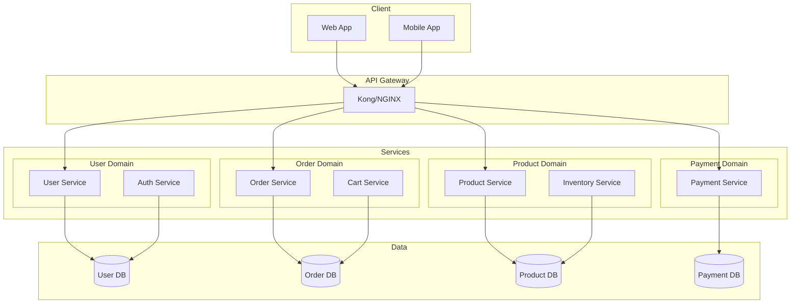
```mermaid
flowchart TB
    subgraph Client
        WEB[Web App]
        MOBILE[Mobile App]
    end

    subgraph API["API Gateway"]
        GW[Kong/NGINX]
    end

    subgraph Services
        subgraph UserDomain["User Domain"]
            USER[User Service]
            AUTH[Auth Service]
        end

        subgraph OrderDomain["Order Domain"]
            ORDER[Order Service]
            CART[Cart Service]
        end

        subgraph ProductDomain["Product Domain"]
            PRODUCT[Product Service]
            INVENTORY[Inventory Service]
        end

        subgraph PaymentDomain["Payment Domain"]
            PAYMENT[Payment Service]
        end
    end

    subgraph Data
        USER_DB[(User DB)]
        ORDER_DB[(Order DB)]
        PRODUCT_DB[(Product DB)]
        PAYMENT_DB[(Payment DB)]
    end

    WEB --> GW
    MOBILE --> GW
    GW --> USER
    GW --> ORDER
    GW --> PRODUCT
    GW --> PAYMENT

    USER --> USER_DB
    AUTH --> USER_DB
    ORDER --> ORDER_DB
    CART --> ORDER_DB
    PRODUCT --> PRODUCT_DB
    INVENTORY --> PRODUCT_DB
    PAYMENT --> PAYMENT_DB
```

### 1.2 API Gateway Pattern

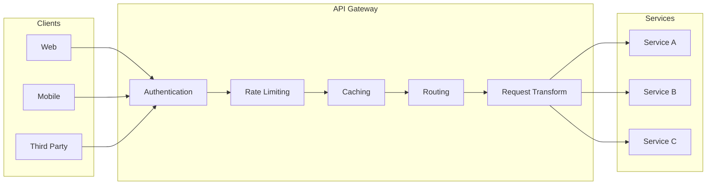
```mermaid
flowchart LR
    subgraph Clients
        C1[Web]
        C2[Mobile]
        C3[Third Party]
    end

    subgraph Gateway["API Gateway"]
        AUTH[Authentication]
        RATE[Rate Limiting]
        CACHE[Caching]
        ROUTE[Routing]
        TRANS[Request Transform]
    end

    subgraph Services
        S1[Service A]
        S2[Service B]
        S3[Service C]
    end

    C1 --> AUTH
    C2 --> AUTH
    C3 --> AUTH
    AUTH --> RATE
    RATE --> CACHE
    CACHE --> ROUTE
    ROUTE --> TRANS
    TRANS --> S1
    TRANS --> S2
    TRANS --> S3
```

### 1.3 Service Mesh Pattern

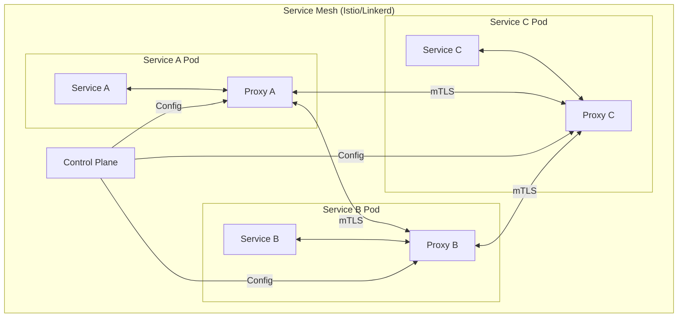
```mermaid
flowchart TB
    subgraph ServiceMesh["Service Mesh (Istio/Linkerd)"]
        subgraph ServiceA["Service A Pod"]
            A[Service A]
            PA[Proxy A]
        end

        subgraph ServiceB["Service B Pod"]
            B[Service B]
            PB[Proxy B]
        end

        subgraph ServiceC["Service C Pod"]
            C[Service C]
            PC[Proxy C]
        end

        CP[Control Plane]
    end

    A <--> PA
    B <--> PB
    C <--> PC

    PA <-->|mTLS| PB
    PB <-->|mTLS| PC
    PA <-->|mTLS| PC

    CP -->|Config| PA
    CP -->|Config| PB
    CP -->|Config| PC
```

### 1.4 Database per Service Pattern

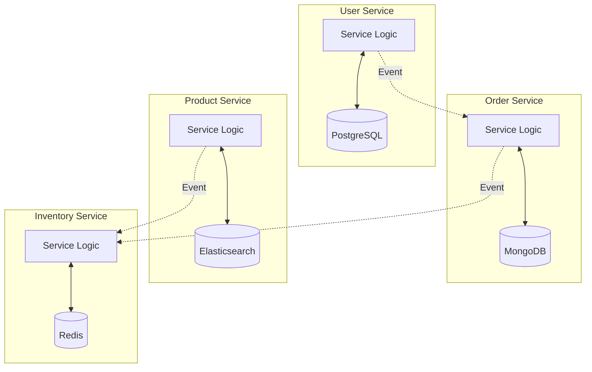
```mermaid
flowchart TB
    subgraph UserService["User Service"]
        US[Service Logic]
        UR[(PostgreSQL)]
    end

    subgraph OrderService["Order Service"]
        OS[Service Logic]
        OR[(MongoDB)]
    end

    subgraph ProductService["Product Service"]
        PS[Service Logic]
        PR[(Elasticsearch)]
    end

    subgraph InventoryService["Inventory Service"]
        IS[Service Logic]
        IR[(Redis)]
    end

    US <--> UR
    OS <--> OR
    PS <--> PR
    IS <--> IR

    US -.->|Event| OS
    OS -.->|Event| IS
    PS -.->|Event| IS
```

### 1.5 Service Communication Patterns

#### Synchronous (REST/gRPC)
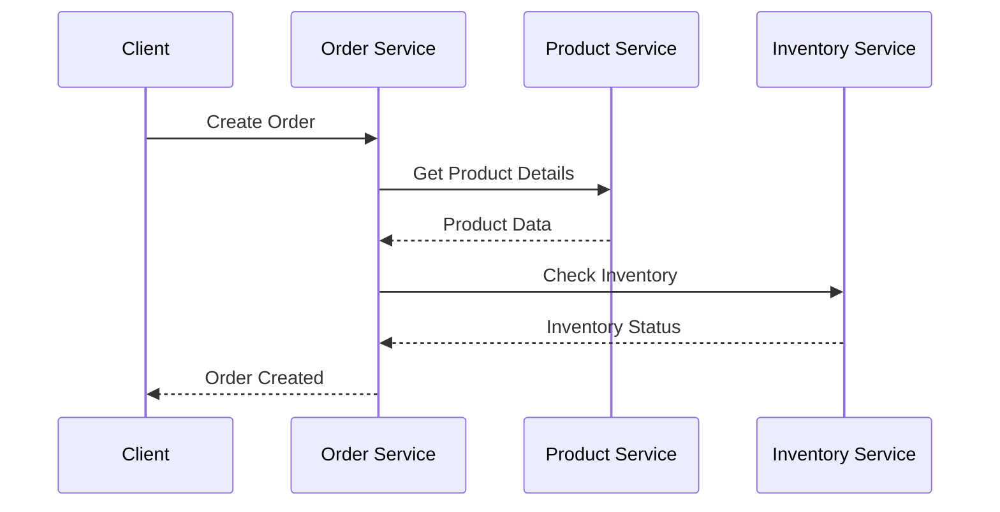
```mermaid
sequenceDiagram
    participant C as Client
    participant O as Order Service
    participant P as Product Service
    participant I as Inventory Service

    C->>O: Create Order
    O->>P: Get Product Details
    P-->>O: Product Data
    O->>I: Check Inventory
    I-->>O: Inventory Status
    O-->>C: Order Created
```

#### Asynchronous (Message Queue)
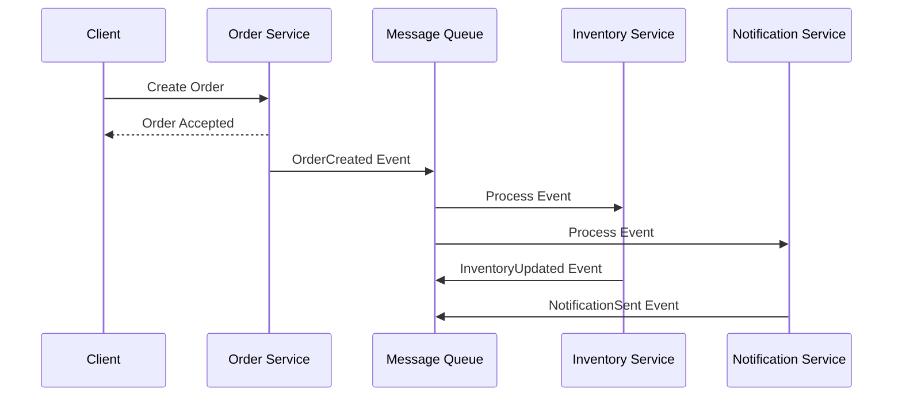
```mermaid
sequenceDiagram
    participant C as Client
    participant O as Order Service
    participant Q as Message Queue
    participant I as Inventory Service
    participant N as Notification Service

    C->>O: Create Order
    O-->>C: Order Accepted
    O->>Q: OrderCreated Event
    Q->>I: Process Event
    Q->>N: Process Event
    I->>Q: InventoryUpdated Event
    N->>Q: NotificationSent Event
```

---

## 2. Event-Driven Architecture

### 2.1 Event Sourcing Pattern

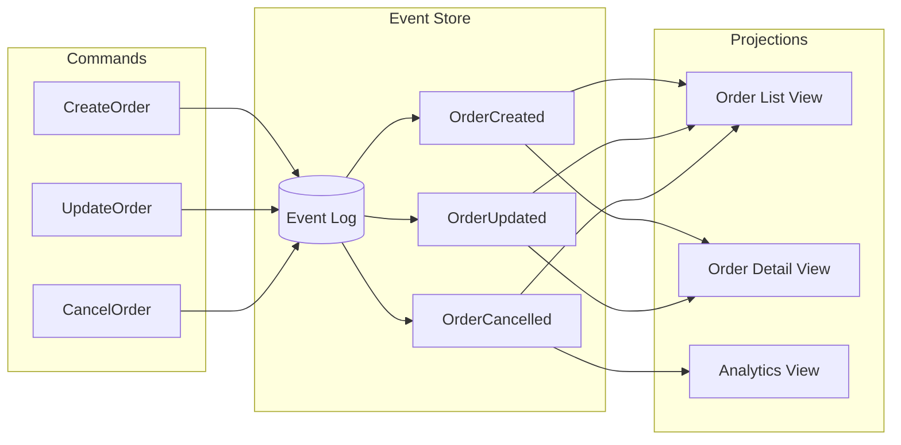
```mermaid
flowchart LR
    subgraph Commands
        C1[CreateOrder]
        C2[UpdateOrder]
        C3[CancelOrder]
    end

    subgraph EventStore["Event Store"]
        ES[(Event Log)]
        E1[OrderCreated]
        E2[OrderUpdated]
        E3[OrderCancelled]
    end

    subgraph Projections
        P1[Order List View]
        P2[Order Detail View]
        P3[Analytics View]
    end

    C1 --> ES
    C2 --> ES
    C3 --> ES
    ES --> E1
    ES --> E2
    ES --> E3
    E1 --> P1
    E1 --> P2
    E2 --> P1
    E2 --> P2
    E3 --> P1
    E3 --> P3
```

### 2.2 CQRS Pattern (Command Query Responsibility Segregation)

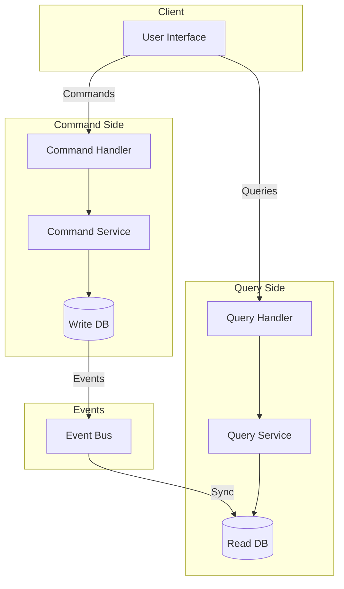
```mermaid
flowchart TB
    subgraph Client
        UI[User Interface]
    end

    subgraph Command["Command Side"]
        CH[Command Handler]
        CS[Command Service]
        WDB[(Write DB)]
    end

    subgraph Query["Query Side"]
        QH[Query Handler]
        QS[Query Service]
        RDB[(Read DB)]
    end

    subgraph Events
        EB[Event Bus]
    end

    UI -->|Commands| CH
    UI -->|Queries| QH
    CH --> CS
    CS --> WDB
    WDB -->|Events| EB
    EB -->|Sync| RDB
    QH --> QS
    QS --> RDB
```

### 2.3 Message Broker Integration

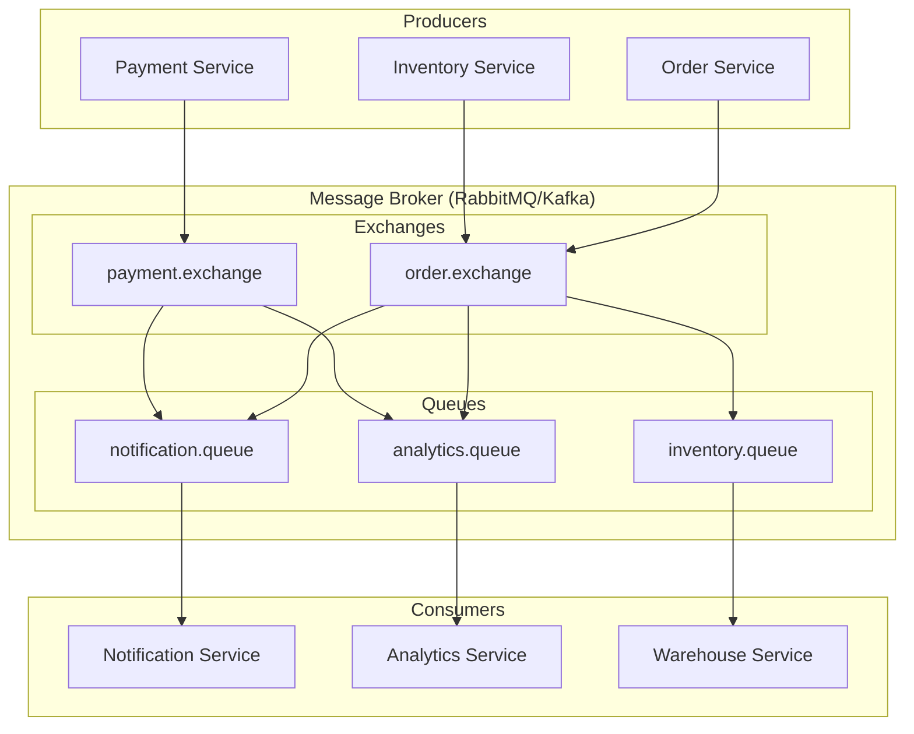
```mermaid
flowchart TB
    subgraph Producers
        P1[Order Service]
        P2[Payment Service]
        P3[Inventory Service]
    end

    subgraph Broker["Message Broker (RabbitMQ/Kafka)"]
        subgraph Exchanges
            EX1[order.exchange]
            EX2[payment.exchange]
        end

        subgraph Queues
            Q1[notification.queue]
            Q2[analytics.queue]
            Q3[inventory.queue]
        end
    end

    subgraph Consumers
        C1[Notification Service]
        C2[Analytics Service]
        C3[Warehouse Service]
    end

    P1 --> EX1
    P2 --> EX2
    P3 --> EX1

    EX1 --> Q1
    EX1 --> Q2
    EX1 --> Q3
    EX2 --> Q1
    EX2 --> Q2

    Q1 --> C1
    Q2 --> C2
    Q3 --> C3
```

### 2.4 Saga Pattern (Distributed Transactions)

#### Choreography-based Saga
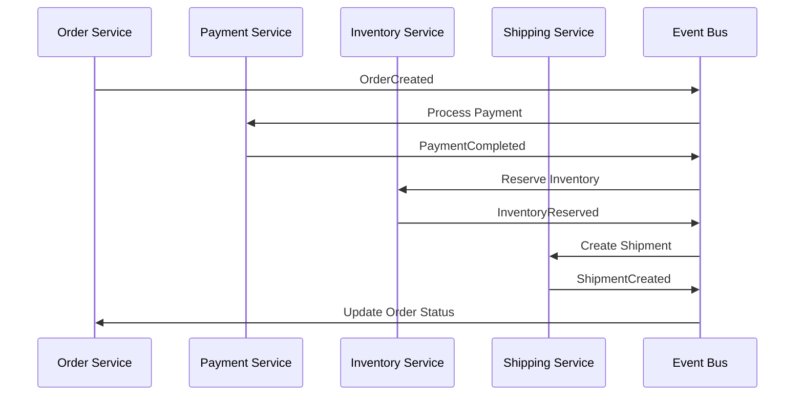
```mermaid
sequenceDiagram
    participant OS as Order Service
    participant PS as Payment Service
    participant IS as Inventory Service
    participant SS as Shipping Service
    participant Q as Event Bus

    OS->>Q: OrderCreated
    Q->>PS: Process Payment
    PS->>Q: PaymentCompleted
    Q->>IS: Reserve Inventory
    IS->>Q: InventoryReserved
    Q->>SS: Create Shipment
    SS->>Q: ShipmentCreated
    Q->>OS: Update Order Status
```

#### Orchestration-based Saga
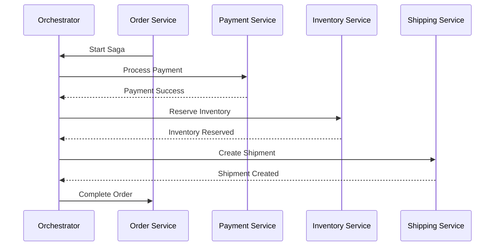
```mermaid
sequenceDiagram
    participant O as Orchestrator
    participant OS as Order Service
    participant PS as Payment Service
    participant IS as Inventory Service
    participant SS as Shipping Service

    OS->>O: Start Saga
    O->>PS: Process Payment
    PS-->>O: Payment Success
    O->>IS: Reserve Inventory
    IS-->>O: Inventory Reserved
    O->>SS: Create Shipment
    SS-->>O: Shipment Created
    O->>OS: Complete Order
```

#### Saga Compensation (Rollback)
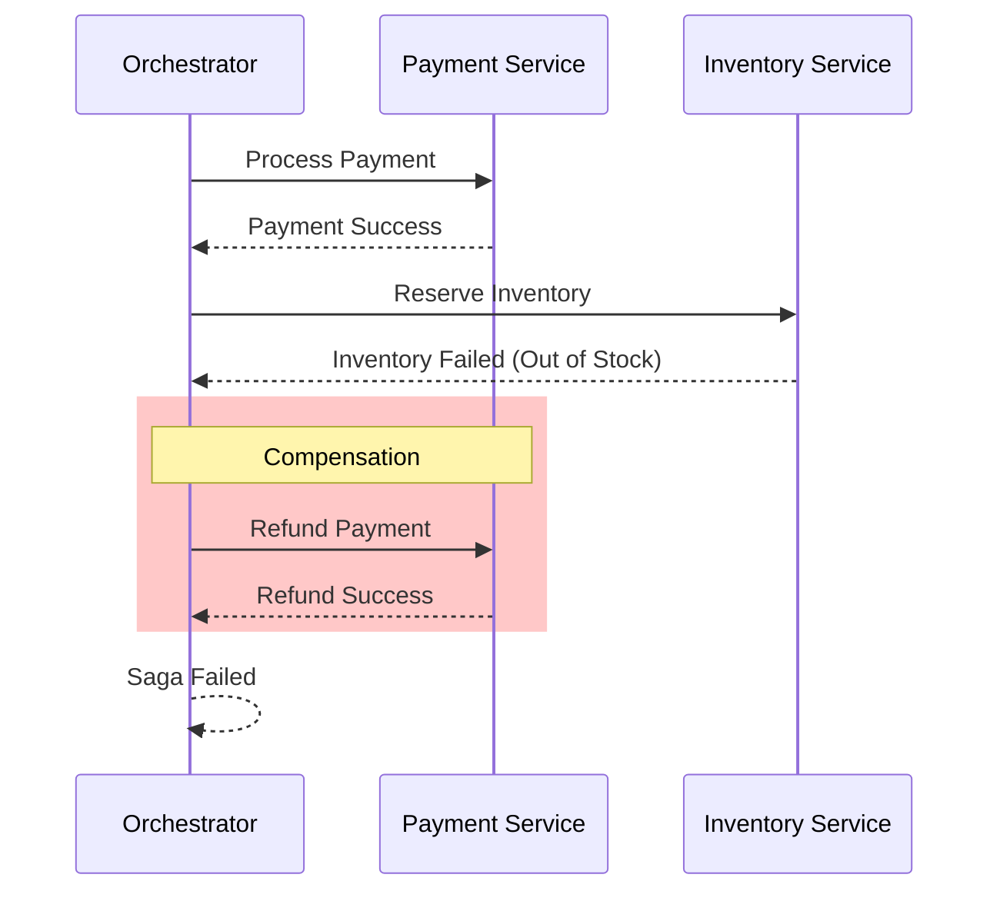
```mermaid
sequenceDiagram
    participant O as Orchestrator
    participant PS as Payment Service
    participant IS as Inventory Service

    O->>PS: Process Payment
    PS-->>O: Payment Success
    O->>IS: Reserve Inventory
    IS-->>O: Inventory Failed (Out of Stock)

    rect rgb(255, 200, 200)
        Note over O,PS: Compensation
        O->>PS: Refund Payment
        PS-->>O: Refund Success
    end

    O-->>O: Saga Failed
```

### 2.5 Event Notification Pattern

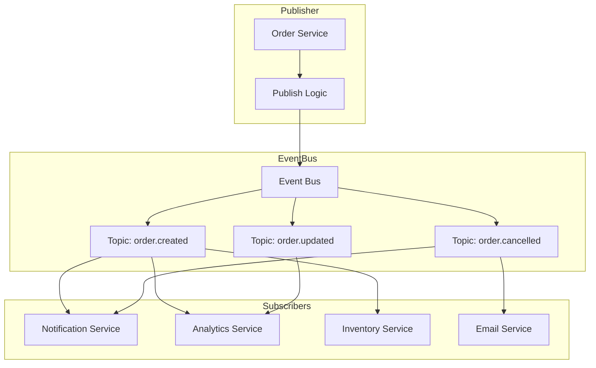
```mermaid
flowchart TB
    subgraph Publisher
        P[Order Service]
        PL[Publish Logic]
    end

    subgraph EventBus
        EB[Event Bus]
        T1[Topic: order.created]
        T2[Topic: order.updated]
        T3[Topic: order.cancelled]
    end

    subgraph Subscribers
        S1[Notification Service]
        S2[Analytics Service]
        S3[Inventory Service]
        S4[Email Service]
    end

    P --> PL
    PL --> EB
    EB --> T1
    EB --> T2
    EB --> T3

    T1 --> S1
    T1 --> S2
    T1 --> S3
    T2 --> S2
    T3 --> S1
    T3 --> S4
```

---

## 3. Clean Architecture

### 3.1 Layer Diagram

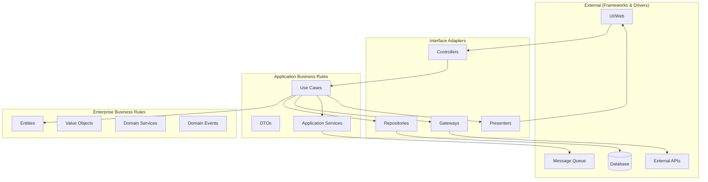
```mermaid
flowchart TB
    subgraph External["External (Frameworks & Drivers)"]
        UI[UI/Web]
        DB[(Database)]
        EXT[External APIs]
        MQ[Message Queue]
    end

    subgraph Interface["Interface Adapters"]
        CTRL[Controllers]
        REPO[Repositories]
        PRES[Presenters]
        GW[Gateways]
    end

    subgraph Application["Application Business Rules"]
        UC[Use Cases]
        DTO[DTOs]
        SVC[Application Services]
    end

    subgraph Domain["Enterprise Business Rules"]
        ENT[Entities]
        VO[Value Objects]
        DOM[Domain Services]
        EVT[Domain Events]
    end

    UI --> CTRL
    CTRL --> UC
    UC --> ENT
    UC --> REPO
    REPO --> DB
    UC --> GW
    GW --> EXT
    UC --> SVC
    SVC --> MQ
    UC --> PRES
    PRES --> UI
```

### 3.2 Dependency Flow

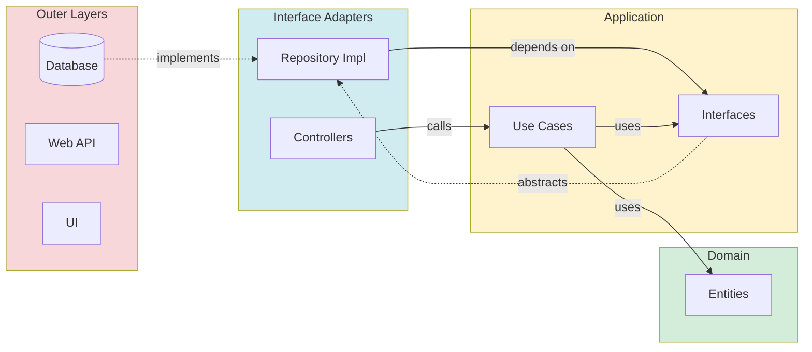
```mermaid
flowchart LR
    subgraph Outer["Outer Layers"]
        DB[(Database)]
        API[Web API]
        UI[UI]
    end

    subgraph Middle["Interface Adapters"]
        REPO[Repository Impl]
        CTRL[Controllers]
    end

    subgraph Inner["Application"]
        UC[Use Cases]
        INT[Interfaces]
    end

    subgraph Core["Domain"]
        ENT[Entities]
    end

    DB -.->|implements| REPO
    REPO -->|depends on| INT
    CTRL -->|calls| UC
    UC -->|uses| INT
    UC -->|uses| ENT
    INT -.->|abstracts| REPO

    style Core fill:#d4edda
    style Inner fill:#fff3cd
    style Middle fill:#d1ecf1
    style Outer fill:#f8d7da
```

### 3.3 Use Case Flow

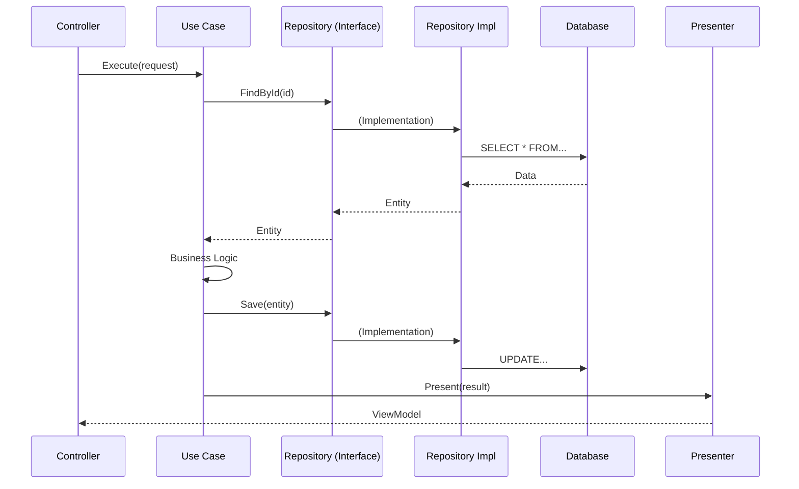
```mermaid
sequenceDiagram
    participant C as Controller
    participant UC as Use Case
    participant R as Repository (Interface)
    participant RI as Repository Impl
    participant DB as Database
    participant P as Presenter

    C->>UC: Execute(request)
    UC->>R: FindById(id)
    R->>RI: (Implementation)
    RI->>DB: SELECT * FROM...
    DB-->>RI: Data
    RI-->>R: Entity
    R-->>UC: Entity
    UC->>UC: Business Logic
    UC->>R: Save(entity)
    R->>RI: (Implementation)
    RI->>DB: UPDATE...
    UC->>P: Present(result)
    P-->>C: ViewModel
```

### 3.4 Project Structure Diagram

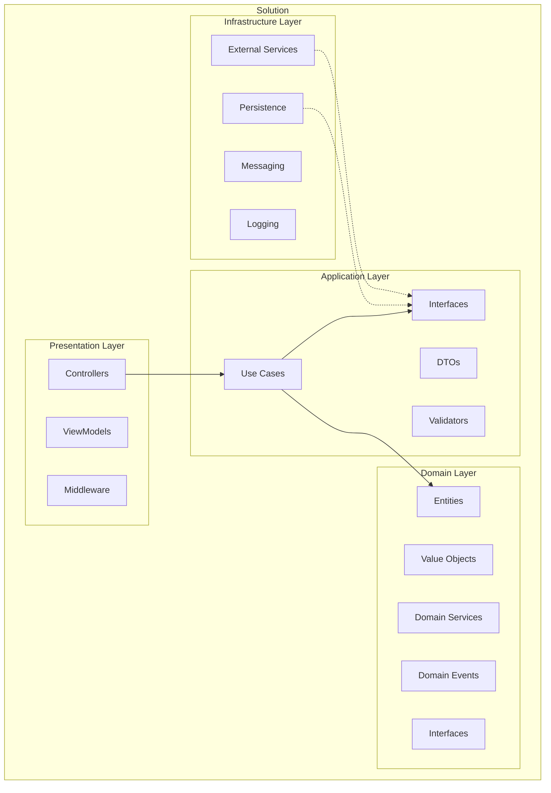
```mermaid
flowchart TD
    subgraph Solution
        subgraph Domain["Domain Layer"]
            D1[Entities]
            D2[Value Objects]
            D3[Domain Services]
            D4[Domain Events]
            D5[Interfaces]
        end

        subgraph Application["Application Layer"]
            A1[Use Cases]
            A2[DTOs]
            A3[Interfaces]
            A4[Validators]
        end

        subgraph Infrastructure["Infrastructure Layer"]
            I1[Persistence]
            I2[External Services]
            I3[Messaging]
            I4[Logging]
        end

        subgraph Presentation["Presentation Layer"]
            P1[Controllers]
            P2[ViewModels]
            P3[Middleware]
        end
    end

    P1 --> A1
    A1 --> D1
    A1 --> A3
    I1 -.-> A3
    I2 -.-> A3
```

---

## 4. Domain-Driven Design (DDD)

### 4.1 Bounded Context Diagram

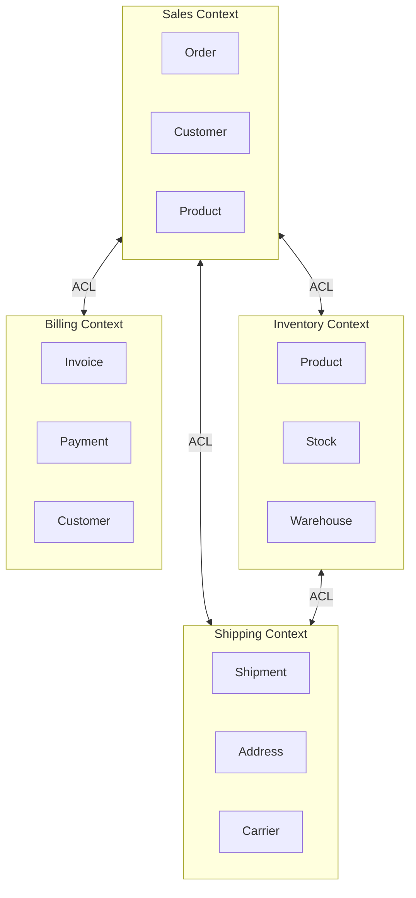
```mermaid
flowchart TB
    subgraph Sales["Sales Context"]
        SC_O[Order]
        SC_C[Customer]
        SC_P[Product]
    end

    subgraph Inventory["Inventory Context"]
        IC_P[Product]
        IC_S[Stock]
        IC_W[Warehouse]
    end

    subgraph Shipping["Shipping Context"]
        SH_S[Shipment]
        SH_A[Address]
        SH_C[Carrier]
    end

    subgraph Billing["Billing Context"]
        BC_I[Invoice]
        BC_P[Payment]
        BC_C[Customer]
    end

    Sales <-->|ACL| Inventory
    Sales <-->|ACL| Shipping
    Sales <-->|ACL| Billing
    Inventory <-->|ACL| Shipping
```

### 4.2 Aggregate Diagram

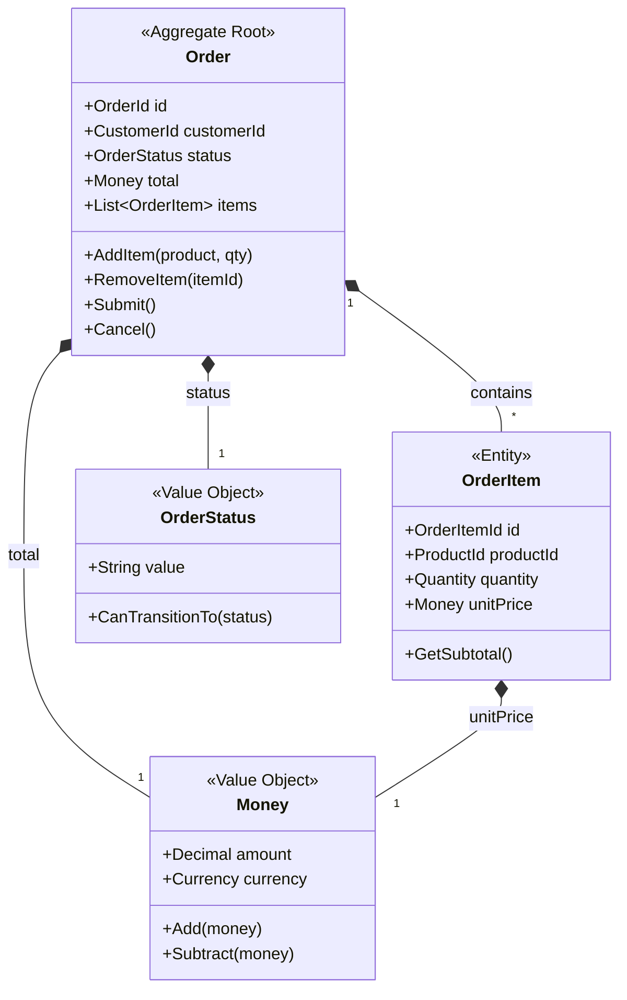
```mermaid
classDiagram
    class Order {
        <<Aggregate Root>>
        +OrderId id
        +CustomerId customerId
        +OrderStatus status
        +Money total
        +List~OrderItem~ items
        +AddItem(product, qty)
        +RemoveItem(itemId)
        +Submit()
        +Cancel()
    }

    class OrderItem {
        <<Entity>>
        +OrderItemId id
        +ProductId productId
        +Quantity quantity
        +Money unitPrice
        +GetSubtotal()
    }

    class Money {
        <<Value Object>>
        +Decimal amount
        +Currency currency
        +Add(money)
        +Subtract(money)
    }

    class OrderStatus {
        <<Value Object>>
        +String value
        +CanTransitionTo(status)
    }

    Order "1" *-- "*" OrderItem : contains
    Order *-- "1" Money : total
    Order *-- "1" OrderStatus : status
    OrderItem *-- "1" Money : unitPrice
```

### 4.3 Domain Events Flow

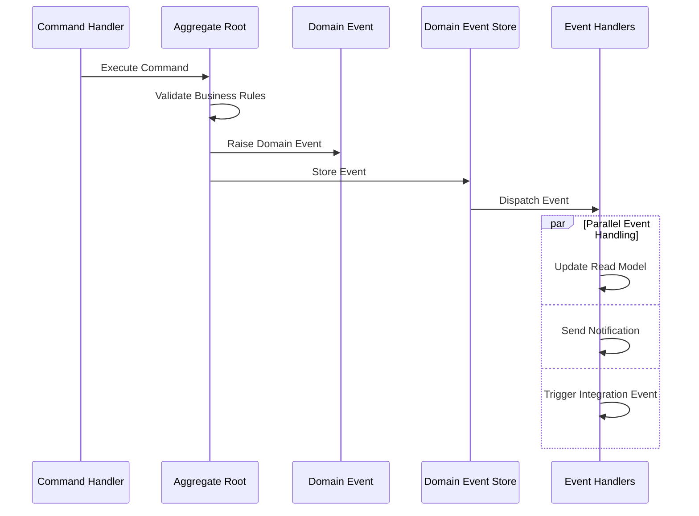
```mermaid
sequenceDiagram
    participant C as Command Handler
    participant AR as Aggregate Root
    participant DE as Domain Event
    participant DES as Domain Event Store
    participant EH as Event Handlers

    C->>AR: Execute Command
    AR->>AR: Validate Business Rules
    AR->>DE: Raise Domain Event
    AR->>DES: Store Event
    DES->>EH: Dispatch Event

    par Parallel Event Handling
        EH->>EH: Update Read Model
    and
        EH->>EH: Send Notification
    and
        EH->>EH: Trigger Integration Event
    end
```

### 4.4 Context Mapping

```mermaid
flowchart TB
    subgraph Upstream
        U1[Identity Context]
        U2[Product Catalog Context]
    end

    subgraph Downstream
        D1[Order Context]
        D2[Customer Context]
    end

    subgraph Shared["Shared Kernel"]
        SK[Common Types]
    end

    U1 -->|Customer-Supplier| D2
    U2 -->|Conformist| D1
    D1 <-->|Partnership| D2
    SK --- U1
    SK --- D1
    SK --- D2

    style SK fill:#e1f5fe
```

### 4.5 Strategic Design Patterns

```mermaid
flowchart LR
    subgraph Patterns
        subgraph Integration
            ACL[Anti-Corruption Layer]
            OHS[Open Host Service]
            PL[Published Language]
        end

        subgraph Relationship
            CS[Customer-Supplier]
            CF[Conformist]
            PS[Partnership]
        end

        subgraph Shared
            SK[Shared Kernel]
            SW[Separate Ways]
        end
    end
```

#### Anti-Corruption Layer Example

```mermaid
flowchart LR
    subgraph Our System
        OS[Order Service]
        ACL[Anti-Corruption Layer]
    end

    subgraph Legacy System
        LS[Legacy API]
    end

    OS --> ACL
    ACL -->|Transform| LS
    LS -->|Response| ACL
    ACL -->|Clean Model| OS
```

---

## 5. Common Patterns

### 5.1 High-Level System Architecture

```mermaid
flowchart TB
    subgraph Client Tier
        WEB[Web Browser]
        MOB[Mobile App]
        API_C[API Client]
    end

    subgraph CDN
        CF[CloudFlare/AWS CloudFront]
    end

    subgraph Load Balancer
        LB[NGINX/HAProxy]
    end

    subgraph Application Tier
        APP1[App Server 1]
        APP2[App Server 2]
        APP3[App Server 3]
    end

    subgraph Cache Tier
        REDIS[(Redis Cluster)]
    end

    subgraph Database Tier
        subgraph Primary
            DB_P[(Primary DB)]
        end
        subgraph Replicas
            DB_R1[(Replica 1)]
            DB_R2[(Replica 2)]
        end
    end

    subgraph Storage
        S3[Object Storage]
    end

    WEB --> CF
    MOB --> CF
    API_C --> CF
    CF --> LB
    LB --> APP1
    LB --> APP2
    LB --> APP3
    APP1 <--> REDIS
    APP2 <--> REDIS
    APP3 <--> REDIS
    APP1 --> DB_P
    APP2 --> DB_P
    APP3 --> DB_P
    DB_P --> DB_R1
    DB_P --> DB_R2
    APP1 --> S3
    APP2 --> S3
    APP3 --> S3
```

### 5.2 Authentication Flow (OAuth 2.0)

```mermaid
sequenceDiagram
    participant U as User
    participant C as Client App
    participant AS as Auth Server
    participant RS as Resource Server

    U->>C: Login Request
    C->>AS: Authorization Request
    AS->>U: Login Page
    U->>AS: Credentials
    AS->>AS: Validate
    AS->>C: Authorization Code
    C->>AS: Exchange Code for Token
    AS->>C: Access Token + Refresh Token
    C->>RS: Request + Access Token
    RS->>RS: Validate Token
    RS->>C: Protected Resource
    C->>U: Display Data
```

### 5.3 CI/CD Pipeline

```mermaid
flowchart LR
    subgraph Development
        DEV[Developer]
        GIT[Git Repository]
    end

    subgraph CI["CI Pipeline"]
        BUILD[Build]
        TEST[Unit Tests]
        LINT[Code Analysis]
        SEC[Security Scan]
    end

    subgraph CD["CD Pipeline"]
        STAGE[Staging]
        INT[Integration Tests]
        PROD[Production]
    end

    DEV -->|Push| GIT
    GIT -->|Trigger| BUILD
    BUILD --> TEST
    TEST --> LINT
    LINT --> SEC
    SEC -->|Pass| STAGE
    STAGE --> INT
    INT -->|Approve| PROD
```

### 5.4 Monitoring & Observability

```mermaid
flowchart TB
    subgraph Services
        S1[Service A]
        S2[Service B]
        S3[Service C]
    end

    subgraph Observability
        subgraph Logs
            ELK[ELK Stack]
        end

        subgraph Metrics
            PROM[Prometheus]
            GRAF[Grafana]
        end

        subgraph Tracing
            JAEGER[Jaeger]
        end

        subgraph Alerting
            ALERT[AlertManager]
            PD[PagerDuty]
        end
    end

    S1 -->|Logs| ELK
    S2 -->|Logs| ELK
    S3 -->|Logs| ELK
    S1 -->|Metrics| PROM
    S2 -->|Metrics| PROM
    S3 -->|Metrics| PROM
    PROM --> GRAF
    S1 -->|Traces| JAEGER
    S2 -->|Traces| JAEGER
    S3 -->|Traces| JAEGER
    PROM --> ALERT
    ALERT --> PD
```

---

## When to Use Each Pattern

| Pattern | Use When |
|---------|----------|
| **Microservices** | Large team, need independent deployment, different scaling needs |
| **Event-Driven** | Loose coupling, async processing, audit trail needed |
| **CQRS** | Different read/write patterns, complex queries, high read load |
| **Event Sourcing** | Full audit history, temporal queries, undo capability |
| **Clean Architecture** | Long-lived applications, testability priority, framework independence |
| **DDD** | Complex domain logic, strategic design, bounded contexts needed |
| **Saga** | Distributed transactions, eventual consistency acceptable |

---

## Tips

1. **Start Simple** - Don't over-architect. Begin with modular monolith, evolve to microservices if needed
2. **Context is King** - Define clear boundaries before splitting services
3. **Events First** - Design events before implementation
4. **Compensate, Don't Lock** - Use saga pattern instead of distributed transactions
5. **Observe Everything** - Monitoring is not optional in distributed systems
