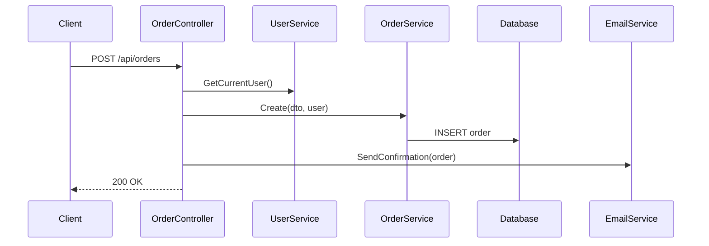
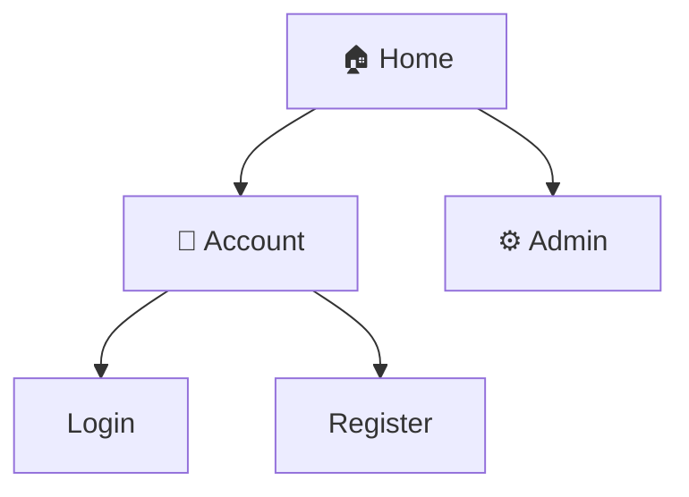

# Codebase Analysis Guide

คู่มือการวิเคราะห์ codebase เพื่อสร้างเอกสารออกแบบระบบ (Reverse Engineering)

## Quick Reference: ไฟล์ที่ต้องวิเคราะห์

| เป้าหมาย | .NET Core / ASP.NET | Node.js / Express | Python / Django | Laravel |
|----------|---------------------|-------------------|-----------------|---------|
| **ER Diagram** | `Models/*.cs`, `Entities/*.cs` | `models/*.js` | `models.py` | `app/Models/*.php` |
| **Data Dictionary** | `DbContext.cs`, Migrations | Sequelize models | `models.py` | Migrations, Models |
| **Flow Diagram** | `Services/*.cs` | `services/*.js` | `views.py` | `app/Services/*.php` |
| **Sequence Diagram** | `Controllers/*.cs` | `routes/*.js` | `views.py` | `app/Http/Controllers/*.php` |
| **Sitemap** | `Controllers/`, `Views/` | `routes/`, `pages/` | `urls.py` | `routes/web.php` |
| **Tech Stack** | `*.csproj`, `appsettings.json` | `package.json` | `requirements.txt` | `composer.json` |

## Step-by-Step: วิเคราะห์ Codebase

### Step 1: สแกนโครงสร้าง Project

```bash
# ดูโครงสร้างโฟลเดอร์
view /path/to/project

# ระบุ technology จาก config files
```

**ไฟล์ที่บอก Technology:**
- `.csproj` → .NET
- `package.json` → Node.js
- `requirements.txt` / `pyproject.toml` → Python
- `composer.json` → PHP/Laravel
- `pom.xml` / `build.gradle` → Java

### Step 2: วิเคราะห์ตาม Framework

---

## .NET Core / ASP.NET MVC

### สำหรับ ER Diagram & Data Dictionary

**วิเคราะห์ไฟล์:**
```
Models/
├── User.cs
├── Order.cs
└── Product.cs

Data/
└── AppDbContext.cs
```

**สิ่งที่ต้องดู:**
```csharp
// Entity class → Table
public class User
{
    public int Id { get; set; }                    // PK
    public string Username { get; set; }           // Column
    [Required] public string Email { get; set; }   // NOT NULL
    public virtual ICollection<Order> Orders { get; set; }  // Relationship
}

// DbContext → Relationships
protected override void OnModelCreating(ModelBuilder modelBuilder)
{
    modelBuilder.Entity<Order>()
        .HasOne(o => o.User)
        .WithMany(u => u.Orders);  // 1:N relationship
}
```

**แปลงเป็น:**
- Class → Entity (Table)
- Property → Column
- `[Key]` / `Id` → Primary Key
- `[Required]` → NOT NULL
- `[StringLength(50)]` → VARCHAR(50)
- `virtual ICollection<T>` → One-to-Many
- `virtual T` → Many-to-One / One-to-One

### สำหรับ Flow Diagram & Sequence Diagram

**วิเคราะห์ไฟล์:**
```
Controllers/
├── UserController.cs
├── OrderController.cs

Services/
├── UserService.cs
├── OrderService.cs
```

**สิ่งที่ต้องดู:**
```csharp
// Controller → Entry points
[HttpPost("api/orders")]
public async Task<IActionResult> CreateOrder(OrderDto dto)
{
    var user = await _userService.GetCurrentUser();
    var order = await _orderService.Create(dto, user);
    await _emailService.SendConfirmation(order);
    return Ok(order);
}
```

**แปลงเป็น Sequence:**


### สำหรับ Sitemap

**วิเคราะห์ไฟล์:**
```
Controllers/
├── HomeController.cs      → /
├── AccountController.cs   → /Account/*
├── AdminController.cs     → /Admin/*

Views/
├── Home/
│   └── Index.cshtml
├── Account/
│   ├── Login.cshtml
│   └── Register.cshtml
```

**แปลงเป็น Sitemap:**


---

## Node.js / Express

### สำหรับ ER Diagram & Data Dictionary

**วิเคราะห์ไฟล์ (Sequelize):**
```javascript
// models/User.js
module.exports = (sequelize, DataTypes) => {
  const User = sequelize.define('User', {
    id: { type: DataTypes.INTEGER, primaryKey: true, autoIncrement: true },
    username: { type: DataTypes.STRING(50), unique: true, allowNull: false },
    email: { type: DataTypes.STRING(100), unique: true, allowNull: false },
  });
  
  User.associate = (models) => {
    User.hasMany(models.Order, { foreignKey: 'userId' });
  };
  
  return User;
};
```

**วิเคราะห์ไฟล์ (Prisma):**
```prisma
model User {
  id       Int      @id @default(autoincrement())
  username String   @unique
  email    String   @unique
  orders   Order[]
}

model Order {
  id     Int   @id @default(autoincrement())
  userId Int
  user   User  @relation(fields: [userId], references: [id])
}
```

### สำหรับ Flow & Sequence Diagram

**วิเคราะห์ไฟล์:**
```javascript
// routes/orders.js
router.post('/', authenticate, async (req, res) => {
  const order = await orderService.create(req.body, req.user);
  await emailService.sendConfirmation(order);
  res.status(201).json(order);
});
```

### สำหรับ Sitemap

**วิเคราะห์ไฟล์:**
```javascript
// routes/index.js
app.use('/', homeRoutes);
app.use('/auth', authRoutes);
app.use('/api/users', userRoutes);
app.use('/api/orders', orderRoutes);
app.use('/admin', adminRoutes);
```

---

## Python / Django

### สำหรับ ER Diagram & Data Dictionary

**วิเคราะห์ไฟล์:**
```python
# models.py
class User(models.Model):
    username = models.CharField(max_length=50, unique=True)
    email = models.EmailField(unique=True)
    created_at = models.DateTimeField(auto_now_add=True)

class Order(models.Model):
    user = models.ForeignKey(User, on_delete=models.CASCADE, related_name='orders')
    total = models.DecimalField(max_digits=10, decimal_places=2)
    status = models.CharField(max_length=20, choices=STATUS_CHOICES, default='pending')
```

**แปลงเป็น:**
- `CharField(max_length=50)` → VARCHAR(50)
- `ForeignKey` → FK relationship
- `related_name='orders'` → ชื่อ relationship
- `on_delete=CASCADE` → Cascade delete rule

### สำหรับ Sitemap

**วิเคราะห์ไฟล์:**
```python
# urls.py
urlpatterns = [
    path('', views.home, name='home'),
    path('auth/', include('auth.urls')),
    path('orders/', include('orders.urls')),
    path('admin/', admin.site.urls),
]
```

---

## Laravel (PHP)

### สำหรับ ER Diagram & Data Dictionary

**วิเคราะห์ไฟล์:**
```php
// app/Models/User.php
class User extends Model
{
    protected $fillable = ['username', 'email', 'password'];
    
    public function orders()
    {
        return $this->hasMany(Order::class);
    }
}

// database/migrations/create_users_table.php
Schema::create('users', function (Blueprint $table) {
    $table->id();
    $table->string('username', 50)->unique();
    $table->string('email', 100)->unique();
    $table->string('password');
    $table->timestamps();
});
```

### สำหรับ Sitemap

**วิเคราะห์ไฟล์:**
```php
// routes/web.php
Route::get('/', [HomeController::class, 'index']);
Route::get('/login', [AuthController::class, 'showLogin']);
Route::post('/login', [AuthController::class, 'login']);

Route::middleware('auth')->group(function () {
    Route::get('/dashboard', [DashboardController::class, 'index']);
    Route::resource('orders', OrderController::class);
});

Route::middleware('admin')->prefix('admin')->group(function () {
    Route::resource('users', AdminUserController::class);
});
```

---

## การวิเคราะห์ Legacy Code (WebForms, Classic ASP)

### ASP.NET WebForms

**ไฟล์ที่ต้องดู:**
```
App_Code/
├── DAL/           → Data Access → ER Diagram
├── BLL/           → Business Logic → Flow Diagram
└── Entities/      → Data Model → Data Dictionary

*.aspx             → Pages → Sitemap
*.aspx.cs          → Code-behind → Logic Flow
Web.config         → Configuration → Tech Stack
```

**วิเคราะห์ Data Access:**
```csharp
// ดู SQL queries เพื่อเข้าใจ schema
public DataTable GetUsers()
{
    string sql = @"
        SELECT u.Id, u.Username, u.Email, r.RoleName
        FROM Users u
        INNER JOIN Roles r ON u.RoleId = r.Id
        WHERE u.IsActive = 1";
    // ...
}
```

### Classic ASP

**ไฟล์ที่ต้องดู:**
```
*.asp              → Pages + Logic
includes/
├── db.asp         → Database connection
├── functions.asp  → Business functions
```

---

## Output Mapping

เมื่อวิเคราะห์เสร็จ ให้สร้างเอกสารตาม mapping นี้:

| ข้อมูลที่ได้จาก Code | Section ในเอกสาร |
|---------------------|------------------|
| Project structure, config files | 1.5 High-Level Architecture, 1.6 Technology Stack |
| Controllers, Routes | 3. Module Overview, 9. Sitemap |
| Models/Entities | 4. Data Model, 7. ER Diagram |
| Database schema/migrations | 8. Data Dictionary |
| Service methods, business logic | 6. Flow Diagrams |
| API endpoints, method calls | Sequence Diagrams |
| Auth/Role code | 10. User Roles & Permissions |

---

## Checklist: ก่อนเริ่มวิเคราะห์

- [ ] ระบุ Framework/Technology ได้
- [ ] พบไฟล์ Models/Entities
- [ ] พบไฟล์ Controllers/Routes
- [ ] พบไฟล์ Config (database, settings)
- [ ] เข้าใจโครงสร้างโฟลเดอร์

## Tips

1. **เริ่มจาก Models** - จะได้ภาพรวมของ data ก่อน
2. **ดู Relationships** - `HasMany`, `BelongsTo`, `ForeignKey`
3. **ตาม Flow ของ Request** - Route → Controller → Service → Repository → Database
4. **สังเกต Patterns** - ชื่อ method บอก action (Create, Update, Delete, Get)
5. **อ่าน Comments** - บาง codebase มี docs อยู่แล้ว
