# Mermaid Diagram Patterns

รวม patterns สำหรับสร้าง diagrams ด้วย Mermaid

## 1. Flow Diagram (Flowchart)

### Basic Process Flow
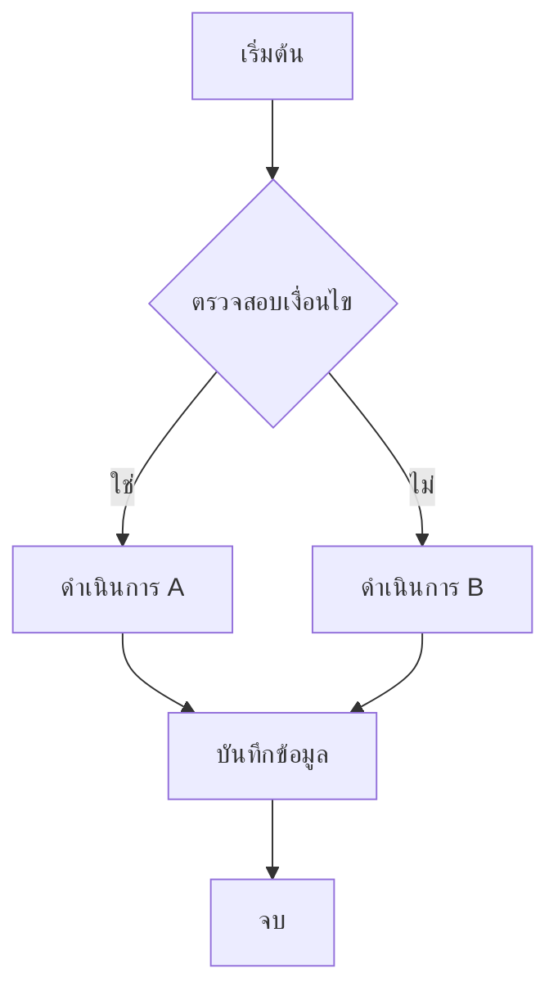

### Business Process Flow
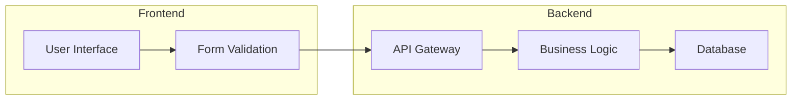

### Approval Workflow
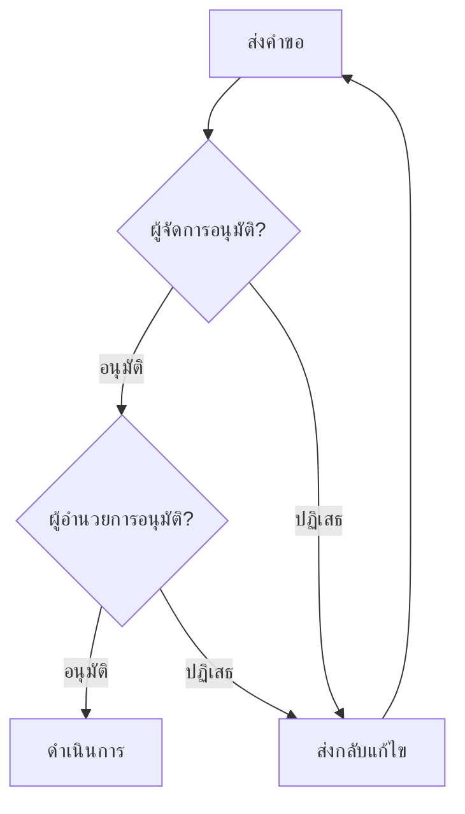

## 2. Data Flow Diagram (DFD)

### Context Diagram (Level 0)
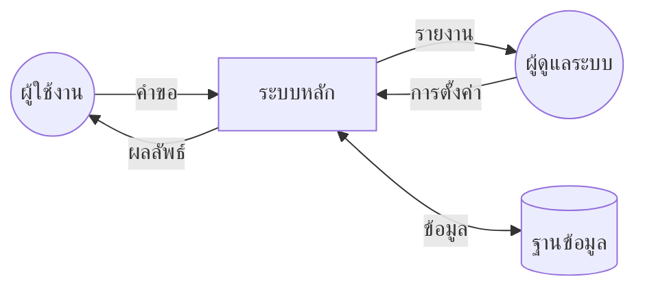

### Level 1 DFD
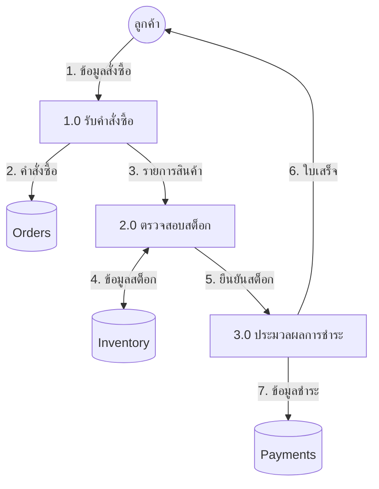

## 3. ER Diagram

### Basic Entity Relationships
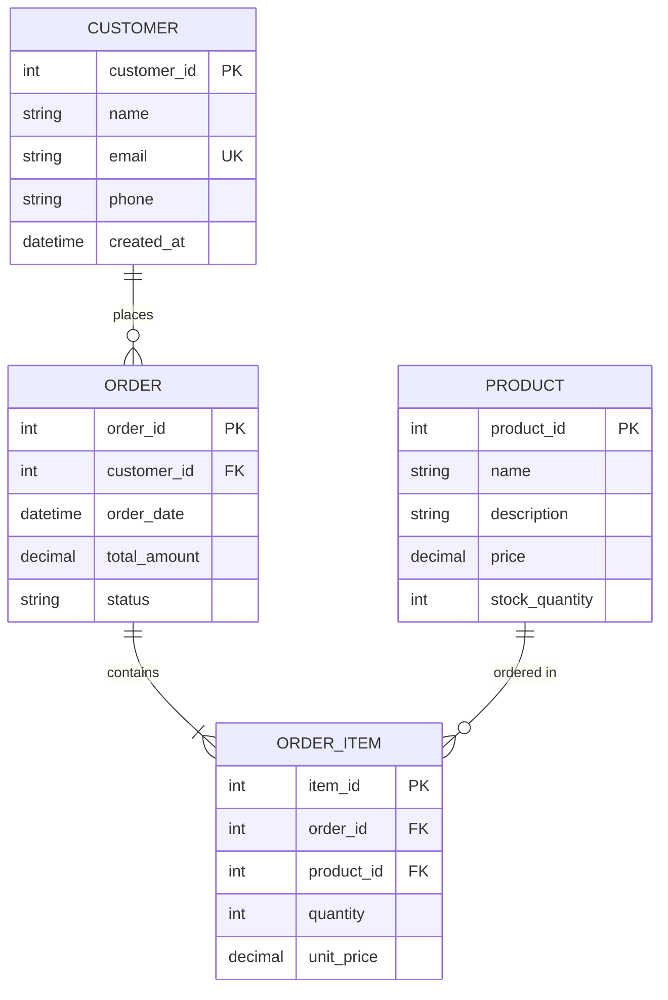

### Complex ER with Multiple Relationships
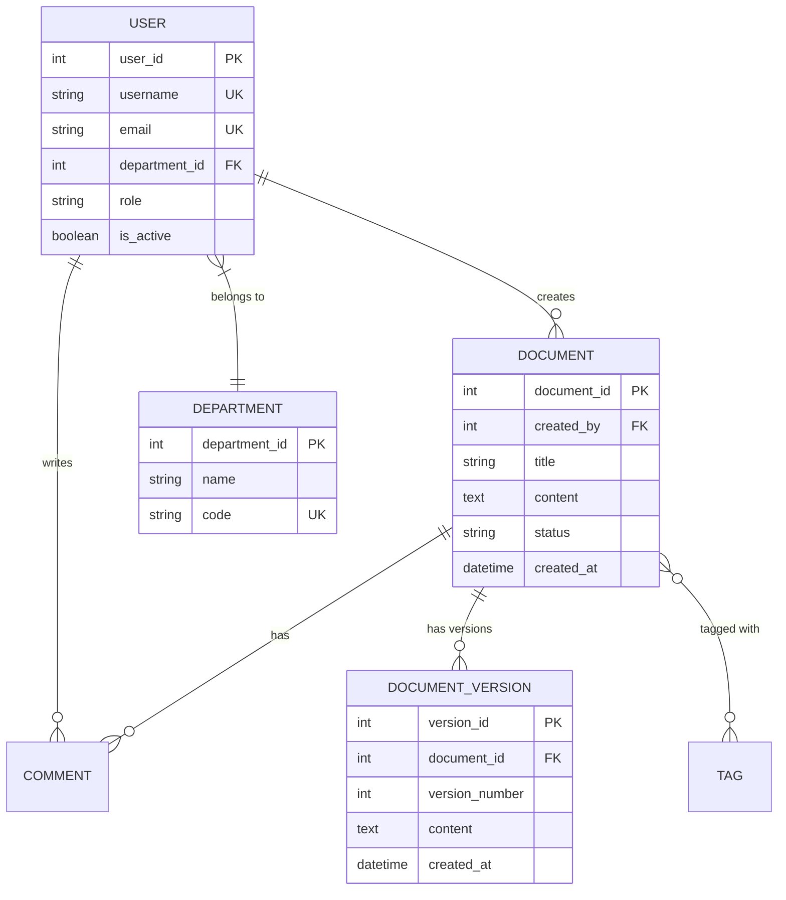

### Relationship Notation
| Notation | Meaning |
|----------|---------|
| `\|\|` | One (mandatory) |
| `o\|` | Zero or One |
| `\|{` | One or Many |
| `o{` | Zero or Many |

## 4. Sequence Diagram

### Basic API Flow
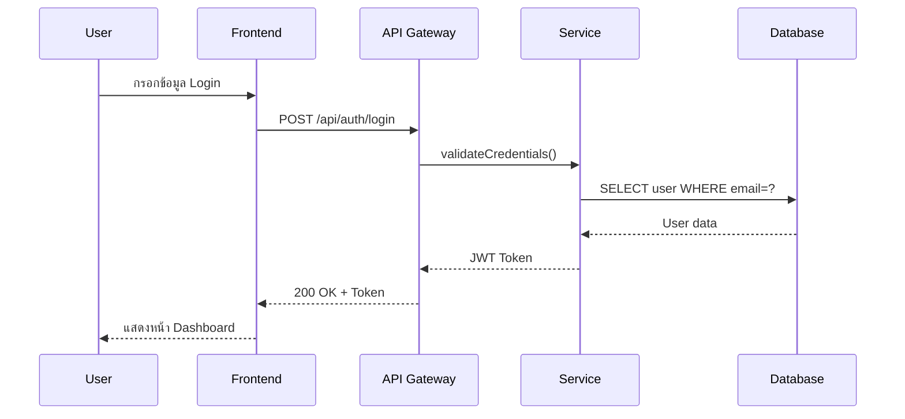

### Error Handling Flow
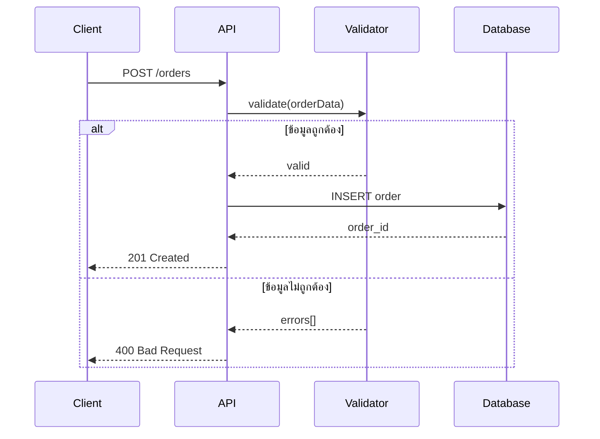

### Async Processing
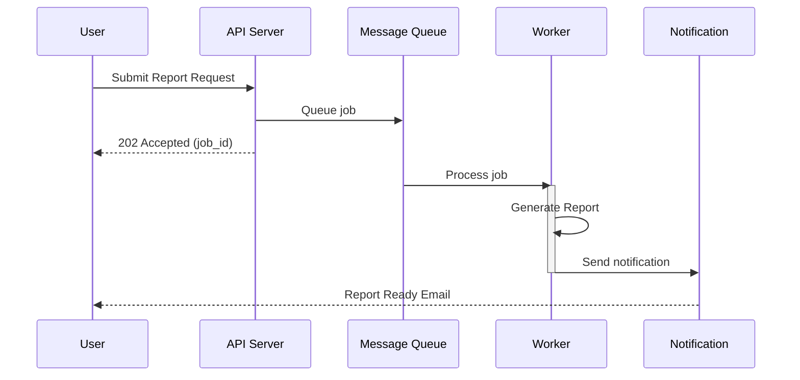

## 5. Sitemap

### Hierarchical Sitemap
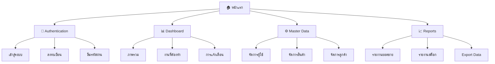

### Flat Sitemap with Roles
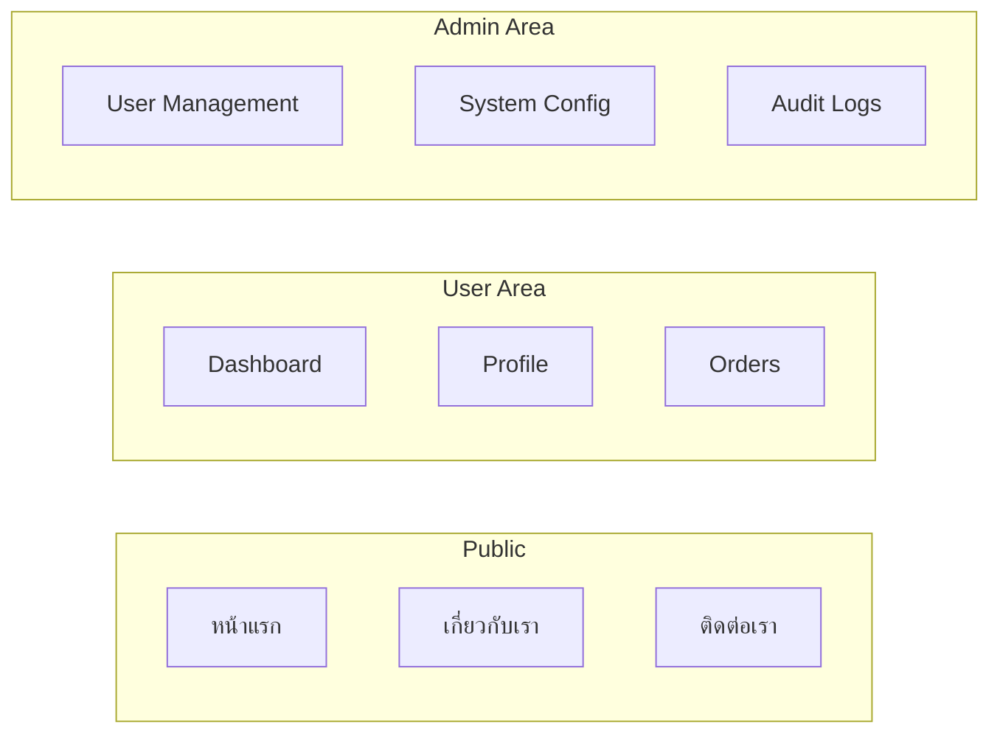

## 6. File Structure Diagram

### Project Structure
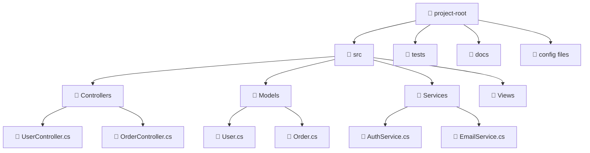

### Alternative: Text-based Structure
สำหรับโครงสร้างที่ซับซ้อน ใช้ code block แบบนี้:
```
📁 src/
├── 📁 Controllers/
│   ├── 📄 UserController.cs
│   ├── 📄 OrderController.cs
│   └── 📄 ProductController.cs
├── 📁 Models/
│   ├── 📄 User.cs
│   ├── 📄 Order.cs
│   └── 📄 Product.cs
├── 📁 Services/
│   ├── 📄 AuthService.cs
│   └── 📄 EmailService.cs
├── 📁 Data/
│   ├── 📄 AppDbContext.cs
│   └── 📁 Migrations/
└── 📄 Program.cs
```

## 7. State Diagram

### Document Status
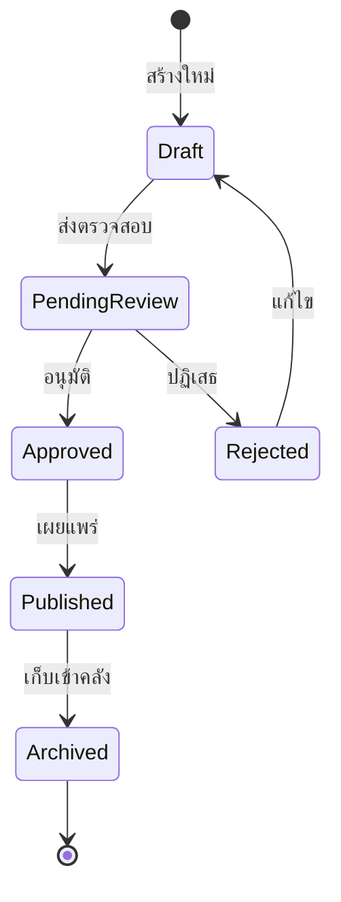

### Order Status with Notes
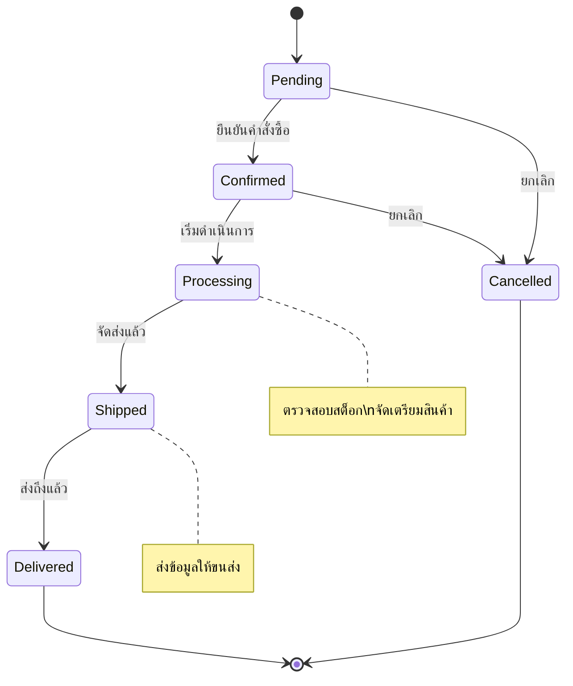

## 8. Class Diagram (For Data Model)

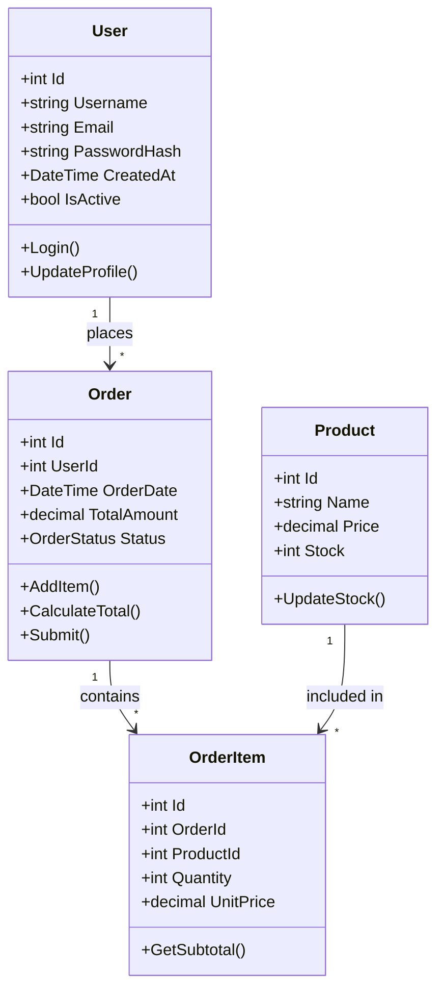

## Tips for Better Diagrams

1. **Keep it Simple**: อย่าใส่รายละเอียดมากเกินไปในหนึ่ง diagram
2. **Use Subgraphs**: จัดกลุ่ม nodes ที่เกี่ยวข้องกัน
3. **Consistent Naming**: ใช้ชื่อที่สอดคล้องกันทั้งเอกสาร
4. **Direction Matters**: ใช้ TD (top-down) สำหรับ hierarchies, LR (left-right) สำหรับ processes
5. **Color Coding**: ใช้ styles เพื่อแยกแยะประเภทของ elements
