# Mermaid Diagram Patterns

A collection of patterns for creating diagrams with Mermaid

## 1. Flow Diagram (Flowchart)

### Basic Process Flow
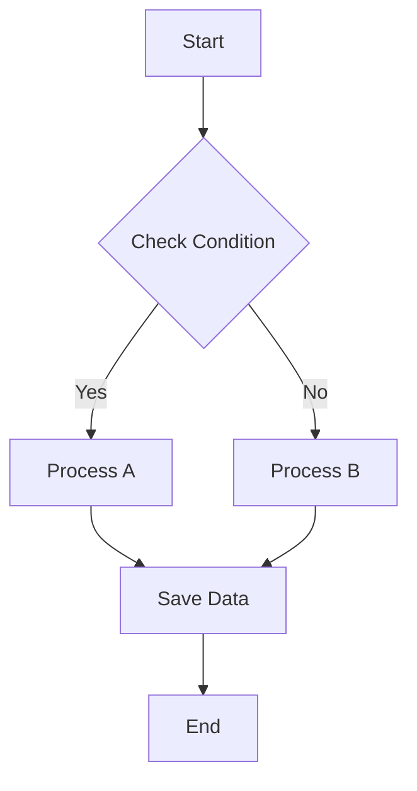
```mermaid
flowchart TD
    A[Start] --> B{Check Condition}
    B -->|Yes| C[Process A]
    B -->|No| D[Process B]
    C --> E[Save Data]
    D --> E
    E --> F[End]
```

### Business Process Flow
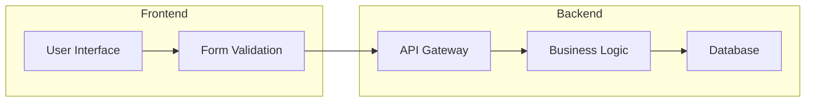
```mermaid
flowchart LR
    subgraph Frontend
        A[User Interface] --> B[Form Validation]
    end
    subgraph Backend
        C[API Gateway] --> D[Business Logic]
        D --> E[Database]
    end
    B --> C
```

### Approval Workflow
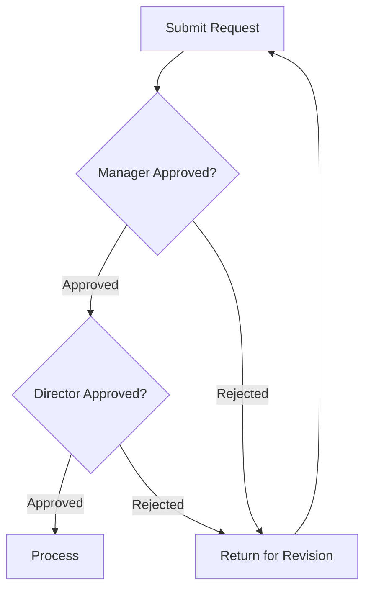
```mermaid
flowchart TD
    A[Submit Request] --> B{Manager Approved?}
    B -->|Approved| C{Director Approved?}
    B -->|Rejected| D[Return for Revision]
    C -->|Approved| E[Process]
    C -->|Rejected| D
    D --> A
```

## 2. Data Flow Diagram (DFD)

### Context Diagram (Level 0)
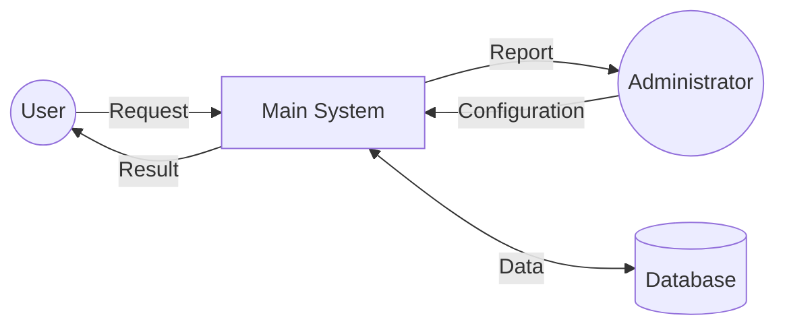
```mermaid
flowchart LR
    E1((User)) -->|Request| S[Main System]
    S -->|Result| E1
    E2((Administrator)) -->|Configuration| S
    S -->|Report| E2
    S <-->|Data| D1[(Database)]
```

### Level 1 DFD
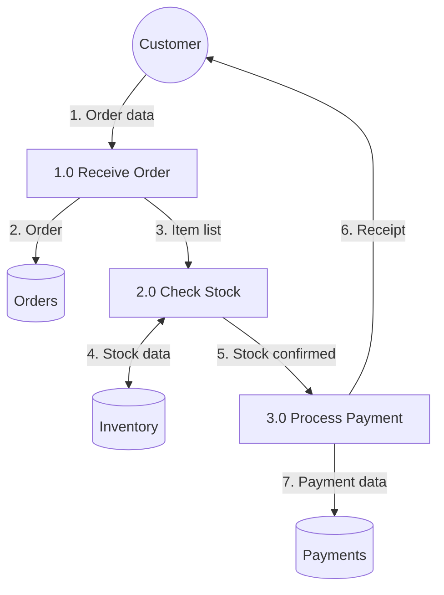
```mermaid
flowchart TB
    E1((Customer)) -->|1. Order data| P1[1.0 Receive Order]
    P1 -->|2. Order| D1[(Orders)]
    P1 -->|3. Item list| P2[2.0 Check Stock]
    P2 <-->|4. Stock data| D2[(Inventory)]
    P2 -->|5. Stock confirmed| P3[3.0 Process Payment]
    P3 -->|6. Receipt| E1
    P3 -->|7. Payment data| D3[(Payments)]
```

## 3. ER Diagram

### Basic Entity Relationships
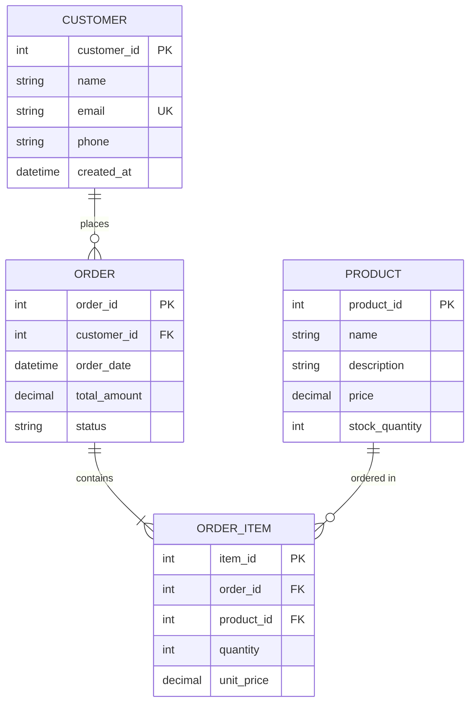
```mermaid
erDiagram
    CUSTOMER ||--o{ ORDER : places
    ORDER ||--|{ ORDER_ITEM : contains
    PRODUCT ||--o{ ORDER_ITEM : "ordered in"
    CUSTOMER {
        int customer_id PK
        string name
        string email UK
        string phone
        datetime created_at
    }
    ORDER {
        int order_id PK
        int customer_id FK
        datetime order_date
        decimal total_amount
        string status
    }
    ORDER_ITEM {
        int item_id PK
        int order_id FK
        int product_id FK
        int quantity
        decimal unit_price
    }
    PRODUCT {
        int product_id PK
        string name
        string description
        decimal price
        int stock_quantity
    }
```

### Complex ER with Multiple Relationships
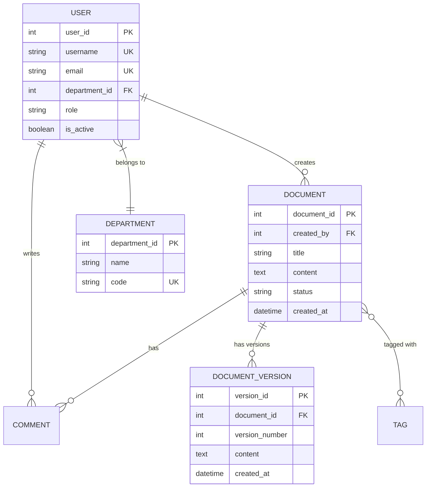
```mermaid
erDiagram
    USER ||--o{ DOCUMENT : creates
    USER ||--o{ COMMENT : writes
    USER }|--|| DEPARTMENT : "belongs to"
    DOCUMENT ||--o{ COMMENT : has
    DOCUMENT ||--o{ DOCUMENT_VERSION : "has versions"
    DOCUMENT }o--o{ TAG : "tagged with"
    
    USER {
        int user_id PK
        string username UK
        string email UK
        int department_id FK
        string role
        boolean is_active
    }
    DEPARTMENT {
        int department_id PK
        string name
        string code UK
    }
    DOCUMENT {
        int document_id PK
        int created_by FK
        string title
        text content
        string status
        datetime created_at
    }
    DOCUMENT_VERSION {
        int version_id PK
        int document_id FK
        int version_number
        text content
        datetime created_at
    }
```

### Relationship Notation
| Notation | Meaning |
|----------|---------|
| `\|\|` | One (mandatory) |
| `o\|` | Zero or One |
| `\|{` | One or Many |
| `o{` | Zero or Many |

## 4. Sequence Diagram

### Basic API Flow
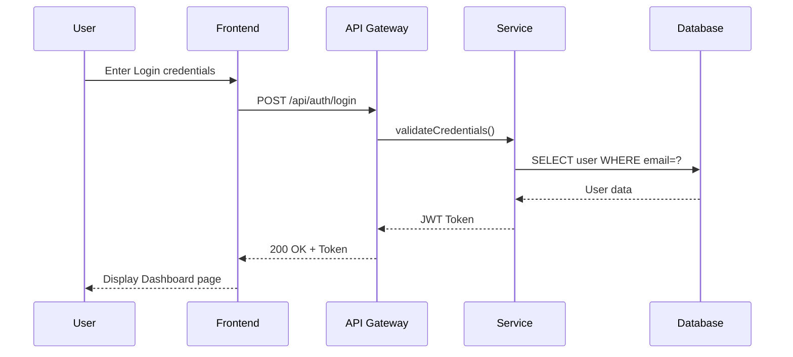
```mermaid
sequenceDiagram
    participant U as User
    participant F as Frontend
    participant A as API Gateway
    participant S as Service
    participant D as Database

    U->>F: Enter Login credentials
    F->>A: POST /api/auth/login
    A->>S: validateCredentials()
    S->>D: SELECT user WHERE email=?
    D-->>S: User data
    S-->>A: JWT Token
    A-->>F: 200 OK + Token
    F-->>U: Display Dashboard page
```

### Error Handling Flow
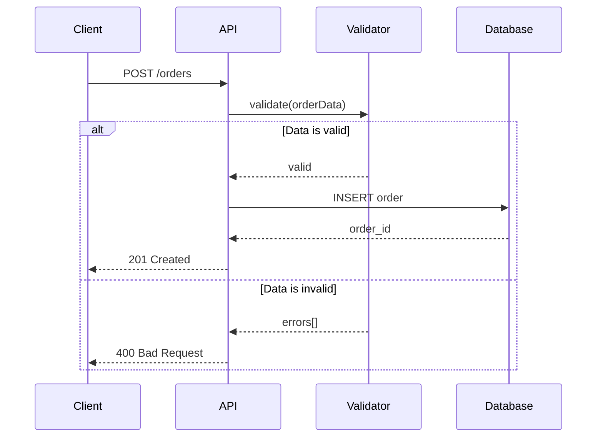
```mermaid
sequenceDiagram
    participant C as Client
    participant A as API
    participant V as Validator
    participant DB as Database

    C->>A: POST /orders
    A->>V: validate(orderData)
    alt Data is valid
        V-->>A: valid
        A->>DB: INSERT order
        DB-->>A: order_id
        A-->>C: 201 Created
    else Data is invalid
        V-->>A: errors[]
        A-->>C: 400 Bad Request
    end
```

### Async Processing
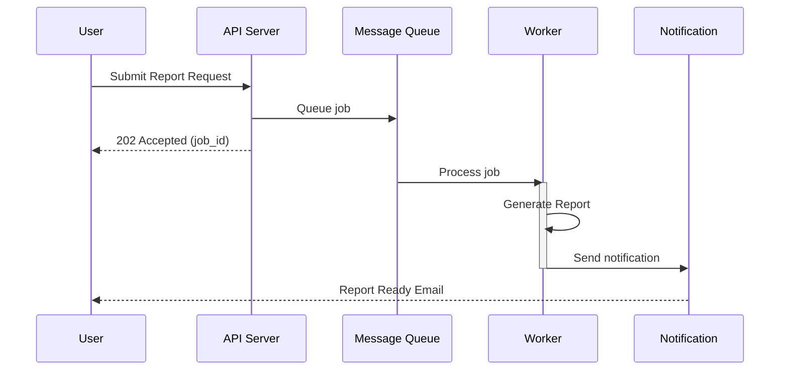
```mermaid
sequenceDiagram
    participant U as User
    participant API as API Server
    participant Q as Message Queue
    participant W as Worker
    participant N as Notification

    U->>API: Submit Report Request
    API->>Q: Queue job
    API-->>U: 202 Accepted (job_id)
    
    Q->>W: Process job
    activate W
    W->>W: Generate Report
    W->>N: Send notification
    deactivate W
    N-->>U: Report Ready Email
```

## 5. Sitemap

### Hierarchical Sitemap
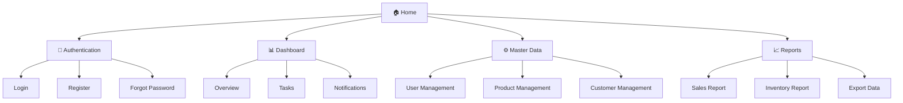
```mermaid
flowchart TD
    HOME[🏠 Home]

    HOME --> AUTH[🔐 Authentication]
    HOME --> DASH[📊 Dashboard]
    HOME --> MASTER[⚙️ Master Data]
    HOME --> REPORT[📈 Reports]

    AUTH --> LOGIN[Login]
    AUTH --> REGISTER[Register]
    AUTH --> FORGOT[Forgot Password]

    DASH --> OVERVIEW[Overview]
    DASH --> TASKS[Tasks]
    DASH --> NOTI[Notifications]

    MASTER --> USER[User Management]
    MASTER --> PRODUCT[Product Management]
    MASTER --> CUSTOMER[Customer Management]

    REPORT --> SALES[Sales Report]
    REPORT --> INVENTORY[Inventory Report]
    REPORT --> EXPORT[Export Data]
```

### Flat Sitemap with Roles
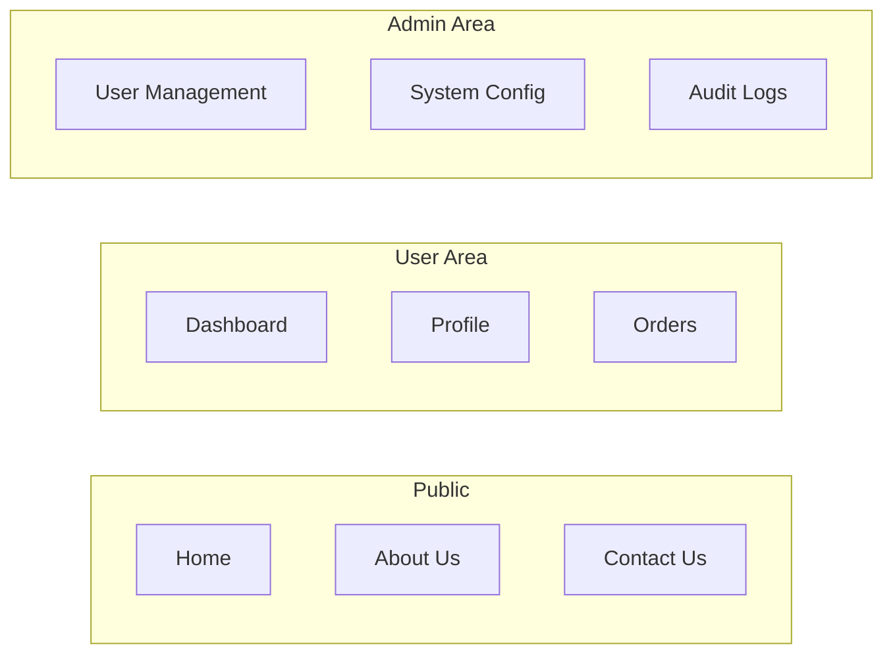
```mermaid
flowchart LR
    subgraph Public
        P1[Home]
        P2[About Us]
        P3[Contact Us]
    end
    
    subgraph User["User Area"]
        U1[Dashboard]
        U2[Profile]
        U3[Orders]
    end
    
    subgraph Admin["Admin Area"]
        A1[User Management]
        A2[System Config]
        A3[Audit Logs]
    end
```

## 6. File Structure Diagram

### Project Structure
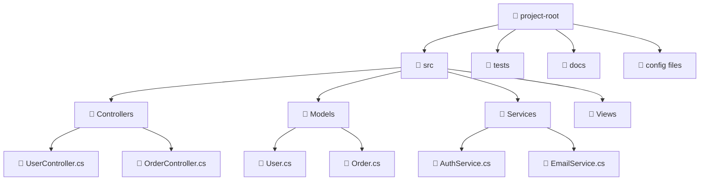
```mermaid
flowchart TD
    ROOT[📁 project-root]
    
    ROOT --> SRC[📁 src]
    ROOT --> TESTS[📁 tests]
    ROOT --> DOCS[📁 docs]
    ROOT --> CONFIG[📄 config files]
    
    SRC --> CONTROLLERS[📁 Controllers]
    SRC --> MODELS[📁 Models]
    SRC --> SERVICES[📁 Services]
    SRC --> VIEWS[📁 Views]
    
    CONTROLLERS --> C1[📄 UserController.cs]
    CONTROLLERS --> C2[📄 OrderController.cs]
    
    MODELS --> M1[📄 User.cs]
    MODELS --> M2[📄 Order.cs]
    
    SERVICES --> S1[📄 AuthService.cs]
    SERVICES --> S2[📄 EmailService.cs]
```

### Alternative: Text-based Structure
For complex structures, use a code block like this:
```
📁 src/
├── 📁 Controllers/
│   ├── 📄 UserController.cs
│   ├── 📄 OrderController.cs
│   └── 📄 ProductController.cs
├── 📁 Models/
│   ├── 📄 User.cs
│   ├── 📄 Order.cs
│   └── 📄 Product.cs
├── 📁 Services/
│   ├── 📄 AuthService.cs
│   └── 📄 EmailService.cs
├── 📁 Data/
│   ├── 📄 AppDbContext.cs
│   └── 📁 Migrations/
└── 📄 Program.cs
```

## 7. State Diagram

### Document Status
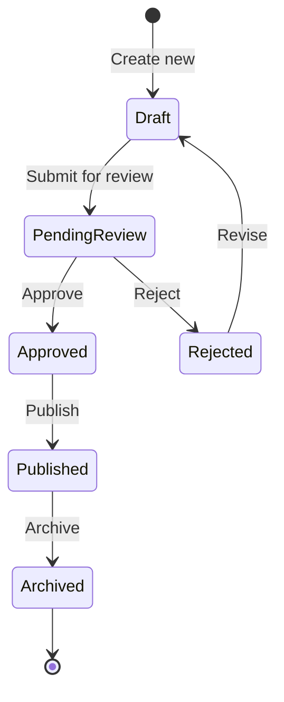
```mermaid
stateDiagram-v2
    [*] --> Draft: Create new
    Draft --> PendingReview: Submit for review
    PendingReview --> Approved: Approve
    PendingReview --> Rejected: Reject
    Rejected --> Draft: Revise
    Approved --> Published: Publish
    Published --> Archived: Archive
    Archived --> [*]
```

### Order Status with Notes
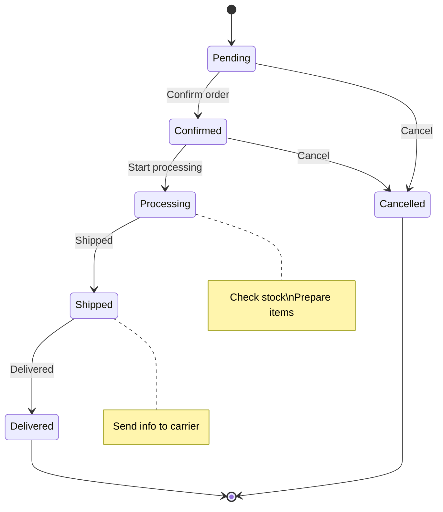
```mermaid
stateDiagram-v2
    [*] --> Pending
    Pending --> Confirmed: Confirm order
    Confirmed --> Processing: Start processing
    Processing --> Shipped: Shipped
    Shipped --> Delivered: Delivered
    Delivered --> [*]

    Pending --> Cancelled: Cancel
    Confirmed --> Cancelled: Cancel
    Cancelled --> [*]

    note right of Processing: Check stock\nPrepare items
    note right of Shipped: Send info to carrier
```

## 8. Class Diagram (For Data Model)

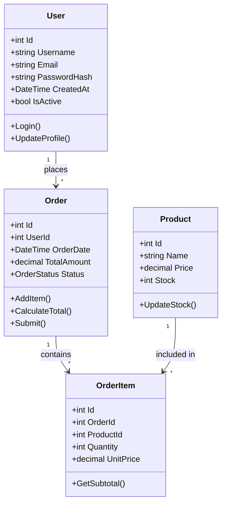
```mermaid
classDiagram
    class User {
        +int Id
        +string Username
        +string Email
        +string PasswordHash
        +DateTime CreatedAt
        +bool IsActive
        +Login()
        +UpdateProfile()
    }
    
    class Order {
        +int Id
        +int UserId
        +DateTime OrderDate
        +decimal TotalAmount
        +OrderStatus Status
        +AddItem()
        +CalculateTotal()
        +Submit()
    }
    
    class OrderItem {
        +int Id
        +int OrderId
        +int ProductId
        +int Quantity
        +decimal UnitPrice
        +GetSubtotal()
    }
    
    class Product {
        +int Id
        +string Name
        +decimal Price
        +int Stock
        +UpdateStock()
    }
    
    User "1" --> "*" Order : places
    Order "1" --> "*" OrderItem : contains
    Product "1" --> "*" OrderItem : included in
```

## Tips for Better Diagrams

1. **Keep it Simple**: Don't put too much detail in a single diagram
2. **Use Subgraphs**: Group related nodes together
3. **Consistent Naming**: Use consistent names throughout the document
4. **Direction Matters**: Use TD (top-down) for hierarchies, LR (left-right) for processes
5. **Color Coding**: Use styles to distinguish element types
