# Mermaid Diagram Patterns

รวม patterns สำหรับสร้าง diagrams ด้วย Mermaid

## 1. Flow Diagram (Flowchart)

### Basic Process Flow
```mermaid
flowchart TD
    A[เริ่มต้น] --> B{ตรวจสอบเงื่อนไข}
    B -->|ใช่| C[ดำเนินการ A]
    B -->|ไม่| D[ดำเนินการ B]
    C --> E[บันทึกข้อมูล]
    D --> E
    E --> F[จบ]
```

### Business Process Flow


### Approval Workflow
```mermaid
flowchart TD
    A[ส่งคำขอ] --> B{ผู้จัดการอนุมัติ?}
    B -->|อนุมัติ| C{ผู้อำนวยการอนุมัติ?}
    B -->|ปฏิเสธ| D[ส่งกลับแก้ไข]
    C -->|อนุมัติ| E[ดำเนินการ]
    C -->|ปฏิเสธ| D
    D --> A
```

## 2. Data Flow Diagram (DFD)

### Context Diagram (Level 0)
```mermaid
flowchart LR
    E1((ผู้ใช้งาน)) -->|คำขอ| S[ระบบหลัก]
    S -->|ผลลัพธ์| E1
    E2((ผู้ดูแลระบบ)) -->|การตั้งค่า| S
    S -->|รายงาน| E2
    S <-->|ข้อมูล| D1[(ฐานข้อมูล)]
```

### Level 1 DFD
```mermaid
flowchart TB
    E1((ลูกค้า)) -->|1. ข้อมูลสั่งซื้อ| P1[1.0 รับคำสั่งซื้อ]
    P1 -->|2. คำสั่งซื้อ| D1[(Orders)]
    P1 -->|3. รายการสินค้า| P2[2.0 ตรวจสอบสต็อก]
    P2 <-->|4. ข้อมูลสต็อก| D2[(Inventory)]
    P2 -->|5. ยืนยันสต็อก| P3[3.0 ประมวลผลการชำระ]
    P3 -->|6. ใบเสร็จ| E1
    P3 -->|7. ข้อมูลชำระ| D3[(Payments)]
```

## 3. ER Diagram

### Basic Entity Relationships


### Complex ER with Multiple Relationships


### Relationship Notation
| Notation | Meaning |
|----------|---------|
| `\|\|` | One (mandatory) |
| `o\|` | Zero or One |
| `\|{` | One or Many |
| `o{` | Zero or Many |

## 4. Sequence Diagram

### Basic API Flow
```mermaid
sequenceDiagram
    participant U as User
    participant F as Frontend
    participant A as API Gateway
    participant S as Service
    participant D as Database

    U->>F: กรอกข้อมูล Login
    F->>A: POST /api/auth/login
    A->>S: validateCredentials()
    S->>D: SELECT user WHERE email=?
    D-->>S: User data
    S-->>A: JWT Token
    A-->>F: 200 OK + Token
    F-->>U: แสดงหน้า Dashboard
```

### Error Handling Flow
```mermaid
sequenceDiagram
    participant C as Client
    participant A as API
    participant V as Validator
    participant DB as Database

    C->>A: POST /orders
    A->>V: validate(orderData)
    alt ข้อมูลถูกต้อง
        V-->>A: valid
        A->>DB: INSERT order
        DB-->>A: order_id
        A-->>C: 201 Created
    else ข้อมูลไม่ถูกต้อง
        V-->>A: errors[]
        A-->>C: 400 Bad Request
    end
```

### Async Processing


## 5. Sitemap

### Hierarchical Sitemap
```mermaid
flowchart TD
    HOME[🏠 หน้าแรก]
    
    HOME --> AUTH[🔐 Authentication]
    HOME --> DASH[📊 Dashboard]
    HOME --> MASTER[⚙️ Master Data]
    HOME --> REPORT[📈 Reports]
    
    AUTH --> LOGIN[เข้าสู่ระบบ]
    AUTH --> REGISTER[ลงทะเบียน]
    AUTH --> FORGOT[ลืมรหัสผ่าน]
    
    DASH --> OVERVIEW[ภาพรวม]
    DASH --> TASKS[งานที่ต้องทำ]
    DASH --> NOTI[การแจ้งเตือน]
    
    MASTER --> USER[จัดการผู้ใช้]
    MASTER --> PRODUCT[จัดการสินค้า]
    MASTER --> CUSTOMER[จัดการลูกค้า]
    
    REPORT --> SALES[รายงานยอดขาย]
    REPORT --> INVENTORY[รายงานสต็อก]
    REPORT --> EXPORT[Export Data]
```

### Flat Sitemap with Roles
```mermaid
flowchart LR
    subgraph Public
        P1[หน้าแรก]
        P2[เกี่ยวกับเรา]
        P3[ติดต่อเรา]
    end
    
    subgraph User["User Area"]
        U1[Dashboard]
        U2[Profile]
        U3[Orders]
    end
    
    subgraph Admin["Admin Area"]
        A1[User Management]
        A2[System Config]
        A3[Audit Logs]
    end
```

## 6. File Structure Diagram

### Project Structure
```mermaid
flowchart TD
    ROOT[📁 project-root]
    
    ROOT --> SRC[📁 src]
    ROOT --> TESTS[📁 tests]
    ROOT --> DOCS[📁 docs]
    ROOT --> CONFIG[📄 config files]
    
    SRC --> CONTROLLERS[📁 Controllers]
    SRC --> MODELS[📁 Models]
    SRC --> SERVICES[📁 Services]
    SRC --> VIEWS[📁 Views]
    
    CONTROLLERS --> C1[📄 UserController.cs]
    CONTROLLERS --> C2[📄 OrderController.cs]
    
    MODELS --> M1[📄 User.cs]
    MODELS --> M2[📄 Order.cs]
    
    SERVICES --> S1[📄 AuthService.cs]
    SERVICES --> S2[📄 EmailService.cs]
```

### Alternative: Text-based Structure
สำหรับโครงสร้างที่ซับซ้อน ใช้ code block แบบนี้:
```
📁 src/
├── 📁 Controllers/
│   ├── 📄 UserController.cs
│   ├── 📄 OrderController.cs
│   └── 📄 ProductController.cs
├── 📁 Models/
│   ├── 📄 User.cs
│   ├── 📄 Order.cs
│   └── 📄 Product.cs
├── 📁 Services/
│   ├── 📄 AuthService.cs
│   └── 📄 EmailService.cs
├── 📁 Data/
│   ├── 📄 AppDbContext.cs
│   └── 📁 Migrations/
└── 📄 Program.cs
```

## 7. State Diagram

### Document Status
```mermaid
stateDiagram-v2
    [*] --> Draft: สร้างใหม่
    Draft --> PendingReview: ส่งตรวจสอบ
    PendingReview --> Approved: อนุมัติ
    PendingReview --> Rejected: ปฏิเสธ
    Rejected --> Draft: แก้ไข
    Approved --> Published: เผยแพร่
    Published --> Archived: เก็บเข้าคลัง
    Archived --> [*]
```

### Order Status with Notes
```mermaid
stateDiagram-v2
    [*] --> Pending
    Pending --> Confirmed: ยืนยันคำสั่งซื้อ
    Confirmed --> Processing: เริ่มดำเนินการ
    Processing --> Shipped: จัดส่งแล้ว
    Shipped --> Delivered: ส่งถึงแล้ว
    Delivered --> [*]
    
    Pending --> Cancelled: ยกเลิก
    Confirmed --> Cancelled: ยกเลิก
    Cancelled --> [*]
    
    note right of Processing: ตรวจสอบสต็อก\nจัดเตรียมสินค้า
    note right of Shipped: ส่งข้อมูลให้ขนส่ง
```

## 8. Class Diagram (For Data Model)


## Tips for Better Diagrams

1. **Keep it Simple**: อย่าใส่รายละเอียดมากเกินไปในหนึ่ง diagram
2. **Use Subgraphs**: จัดกลุ่ม nodes ที่เกี่ยวข้องกัน
3. **Consistent Naming**: ใช้ชื่อที่สอดคล้องกันทั้งเอกสาร
4. **Direction Matters**: ใช้ TD (top-down) สำหรับ hierarchies, LR (left-right) สำหรับ processes
5. **Color Coding**: ใช้ styles เพื่อแยกแยะประเภทของ elements
