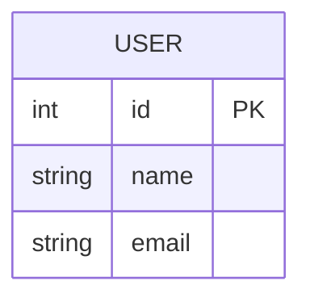
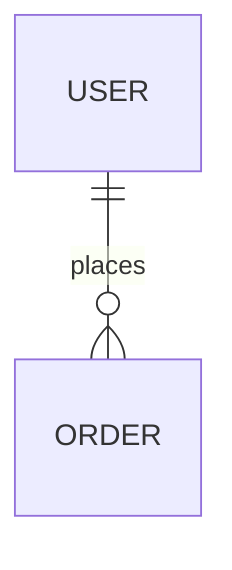
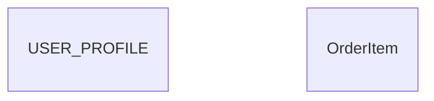
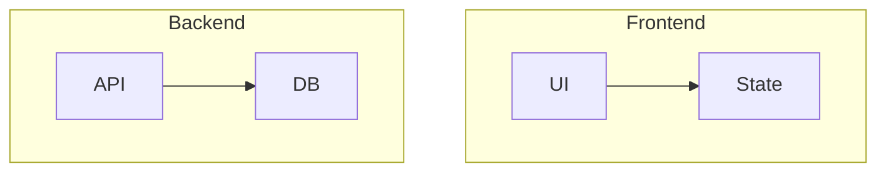
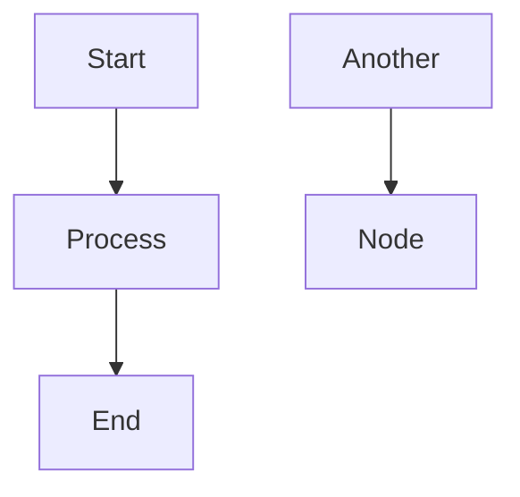
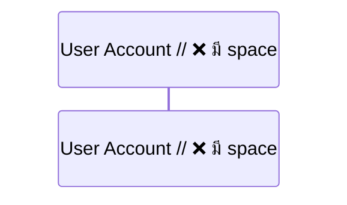
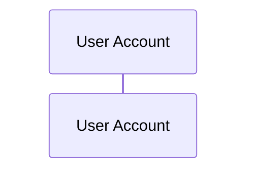
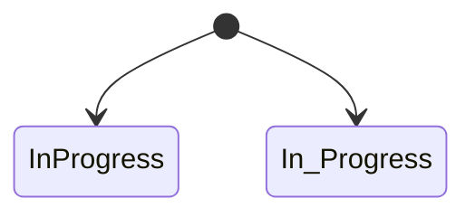

# Troubleshooting Guide

คู่มือแก้ไขปัญหาที่พบบ่อยในการสร้างเอกสารออกแบบระบบ

## Table of Contents

1. [Mermaid Syntax Errors](#1-mermaid-syntax-errors)
2. [Reverse Engineering Issues](#2-reverse-engineering-issues)
3. [Consistency Problems](#3-consistency-problems)
4. [Diagram Rendering Issues](#4-diagram-rendering-issues)
5. [Framework-Specific Issues](#5-framework-specific-issues)

---

## 1. Mermaid Syntax Errors

### 1.1 ER Diagram Errors

#### Error: "Parse error on line X"

**Cause:** Invalid syntax ใน entity definition

**Wrong:**
```mermaid
erDiagram
    USER {
        int id PK
        string name,  // ❌ มี comma
        email string  // ❌ สลับ type กับ name
    }
```

**Correct:**


#### Error: "Invalid relationship"

**Cause:** Relationship syntax ไม่ถูกต้อง

**Wrong:**
```mermaid
erDiagram
    USER -- ORDER : places      // ❌ ขาด cardinality
    USER 1-* ORDER : places     // ❌ syntax ผิด
```

**Correct:**


**Relationship Reference:**
| Notation | Meaning |
|----------|---------|
| `\|\|` | Exactly one (mandatory) |
| `o\|` | Zero or one (optional) |
| `\|{` | One or many |
| `o{` | Zero or many |

#### Error: "Entity name contains invalid characters"

**Cause:** ชื่อ entity มีอักขระพิเศษ

**Wrong:**
```mermaid
erDiagram
    USER-PROFILE { }    // ❌ มี hyphen
    Order Item { }      // ❌ มี space
```

**Correct:**


---

### 1.2 Flowchart Errors

#### Error: "Unclosed subgraph"

**Cause:** ลืมปิด `end` ของ subgraph

**Wrong:**
```mermaid
flowchart TD
    subgraph Frontend
        A[UI] --> B[State]
    // ❌ ลืม end

    subgraph Backend
        C[API] --> D[DB]
    end
```

**Correct:**


#### Error: "Node not defined"

**Cause:** ใช้ node ที่ยังไม่ได้ประกาศ

**Wrong:**
```mermaid
flowchart TD
    A --> B
    B --> C
    D --> E  // ❌ D ยังไม่ได้ประกาศ shape
```

**Correct:**


#### Error: "Invalid node shape"

**Cause:** Bracket ไม่ match

| Shape | Syntax | Example |
|-------|--------|---------|
| Rectangle | `[text]` | `A[Process]` |
| Rounded | `(text)` | `A(Process)` |
| Diamond | `{text}` | `A{Decision}` |
| Circle | `((text))` | `A((Start))` |
| Hexagon | `{{text}}` | `A{{Condition}}` |
| Database | `[(text)]` | `A[(Database)]` |

---

### 1.3 Sequence Diagram Errors

#### Error: "Invalid participant"

**Cause:** Participant name มี space หรืออักขระพิเศษ

**Wrong:**


**Correct:**


#### Error: "Invalid arrow"

**Arrow Reference:**
| Arrow | Meaning | Usage |
|-------|---------|-------|
| `->>` | Sync request | `A->>B: call` |
| `-->>` | Async response | `B-->>A: response` |
| `-x` | Lost message | `A-xB: failed` |
| `-)` | Async message | `A-)B: event` |

---

### 1.4 State Diagram Errors

#### Error: "Invalid state name"

**Cause:** State name มีอักขระพิเศษ

**Wrong:**
```mermaid
stateDiagram-v2
    [*] --> In-Progress  // ❌ มี hyphen
```

**Correct:**


---

## 2. Reverse Engineering Issues

### 2.1 No Models Found

**Symptoms:** ไม่พบ entity/model ในการวิเคราะห์ codebase

**Common Causes:**

| Cause | Solution |
|-------|----------|
| Non-standard folder structure | ค้นหาด้วย pattern: `*.entity.*`, `*.model.*` |
| Models in shared library | ค้นหาใน referenced projects |
| Code-first without explicit models | ดู DbContext หรือ migrations |
| Microservices architecture | วิเคราะห์ทีละ service |

**Search Commands:**
```bash
# .NET
find . -name "*.cs" | xargs grep -l "public class.*Entity\|DbSet<"

# Node.js
find . -name "*.js" -o -name "*.ts" | xargs grep -l "Schema\|@Entity\|model\."

# Python
find . -name "*.py" | xargs grep -l "models.Model\|Base.*declarative"
```

### 2.2 Missing Relationships

**Symptoms:** ER Diagram ไม่มี relationships ระหว่าง entities

**Common Causes:**

| Framework | Where to Look |
|-----------|---------------|
| EF Core | `OnModelCreating()` ใน DbContext |
| Sequelize | `associate()` method ใน models |
| Prisma | `@relation` ใน schema.prisma |
| Django | `ForeignKey`, `ManyToManyField` ใน models |

**Example - EF Core:**
```csharp
// Fluent API relationships
modelBuilder.Entity<Order>()
    .HasOne(o => o.Customer)
    .WithMany(c => c.Orders)
    .HasForeignKey(o => o.CustomerId);
```

### 2.3 Incomplete Data Types

**Symptoms:** Data Dictionary มี data types ไม่ครบถ้วน

**Solution:** ดูจากหลายแหล่ง

| Source | Information |
|--------|-------------|
| Model annotations | `[StringLength(50)]`, `[MaxLength]` |
| Migration files | `VARCHAR(50)`, `DECIMAL(10,2)` |
| Database schema | Query from `INFORMATION_SCHEMA` |
| ORM config | Fluent API configurations |

---

## 3. Consistency Problems

### 3.1 ER Diagram ↔ Data Dictionary Mismatch

**Problem:** Entity ใน ER ไม่ตรงกับ tables ใน Data Dictionary

**Checklist:**
- [ ] ชื่อ entity/table ตรงกัน (รวม naming convention)
- [ ] จำนวน columns ตรงกัน
- [ ] PK/FK ตรงกัน
- [ ] Relationships match

**Common Issues:**
| Issue | Solution |
|-------|----------|
| Naming convention different | Standardize: `USER` ↔ `users` |
| Extra audit columns in DD | Add to ER or mark as standard |
| Missing junction tables | Add M:N junction tables to both |

### 3.2 DFD Level Inconsistency

**Problem:** DFD Level 0 ไม่สอดคล้องกับ Level 1

**Rules:**
1. จำนวน external entities ต้องเท่ากัน
2. จำนวน data stores ใน Level 1 ต้องอธิบาย data flow ใน Level 0
3. Inputs/Outputs ของ System ใน Level 0 = รวม I/O ของทุก process ใน Level 1

**Example Fix:**
```
Level 0: Customer → [Order System] → Admin
Level 1: Customer → [1.0 Place Order] → [2.0 Process Payment] → Admin
                                    ↓
                            [Orders DB]

❌ Missing: Customer flow to Admin in Level 1
✅ Fix: Add flow from [2.0 Process Payment] → Admin (notification)
```

### 3.3 Sitemap ↔ Roles Mismatch

**Problem:** หน้าใน Sitemap ไม่มี access control ครบ

**Checklist:**
- [ ] ทุกหน้ามี Access level ระบุ
- [ ] Public pages ชัดเจน
- [ ] Protected pages มี required roles
- [ ] Admin pages restricted properly

---

## 4. Diagram Rendering Issues

### 4.1 Diagram Too Large

**Problem:** Diagram ไม่ render หรือแสดงผลผิด

**Solutions:**

1. **Split into multiple diagrams**
```markdown
## ER Diagram

### Core Entities
[diagram 1 - User, Order, Product]

### Support Entities
[diagram 2 - AuditLog, Settings, etc.]
```

2. **Use direction for better layout**
```mermaid
flowchart LR  // Left to Right for wide diagrams
flowchart TD  // Top Down for tall diagrams
```

3. **Reduce complexity**
- แยก complex processes เป็น sub-diagrams
- ใช้ subgraphs เพื่อจัดกลุ่ม

### 4.2 Overlapping Labels

**Problem:** Labels ซ้อนกันใน ER Diagram

**Solution:** ใช้ shorter relationship labels หรือลด entities

```mermaid
erDiagram
    USER ||--o{ ORDER : "places"          // ✅ short
    USER ||--o{ ORDER : "places order"    // ⚠️ may overlap
```

### 4.3 Markdown Preview Not Rendering

**Problem:** Mermaid ไม่แสดงใน preview

**Common Causes:**
- Editor ไม่รองรับ Mermaid
- Code block syntax ผิด

**Correct Syntax:**
```markdown
```mermaid
flowchart TD
    A --> B
`` `
```

---

## 5. Framework-Specific Issues

### 5.1 .NET Core

| Issue | Cause | Solution |
|-------|-------|----------|
| Can't find entities | Using code-first migrations | ดู `Migrations/` folder |
| Relationships missing | Using Data Annotations only | Check `[ForeignKey]`, `[InverseProperty]` |
| Complex types not shown | Owned types | Include owned types as separate or nested |

### 5.2 Node.js (Sequelize/Prisma)

| Issue | Cause | Solution |
|-------|-------|----------|
| No schema found | Using raw queries | ดู SQL ใน repository files |
| TypeScript types only | No runtime models | Use interface definitions |
| Prisma schema outdated | Not synced with DB | Run `prisma db pull` |

### 5.3 Python/Django

| Issue | Cause | Solution |
|-------|-------|----------|
| Abstract models included | Base classes | Skip models with `abstract = True` |
| Proxy models | Override behavior only | Skip or note as proxy |
| Through models missing | M2M relationships | Include explicit through tables |

### 5.4 Laravel

| Issue | Cause | Solution |
|-------|-------|----------|
| No types in models | Dynamic attributes | ดู migrations หรือ `$casts` |
| Relationships hidden | Protected `$with` | Check `with()` in queries |
| Pivot tables | M2M relationships | Include pivot in DD |

---

## Quick Reference: Error Messages

| Error Message | Likely Cause | Quick Fix |
|---------------|--------------|-----------|
| "Parse error" | Syntax error | Check brackets, quotes, commas |
| "Unexpected token" | Invalid character | Remove special chars from names |
| "Duplicate definition" | Same name twice | Rename or merge |
| "Not defined" | Missing declaration | Define node/participant first |
| "Unclosed block" | Missing end/bracket | Add closing `end` or `}` |

---

## Need More Help?

1. **Check Mermaid Live Editor**: https://mermaid.live/
2. **Validate syntax** before adding to document
3. **Use simpler patterns** first, then add complexity
4. **Split large diagrams** into manageable parts
