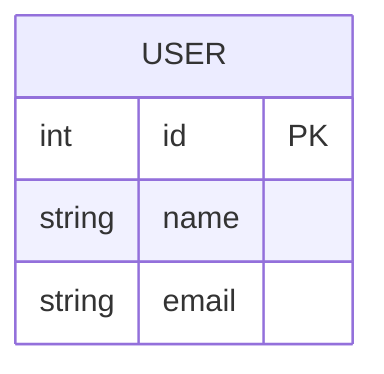
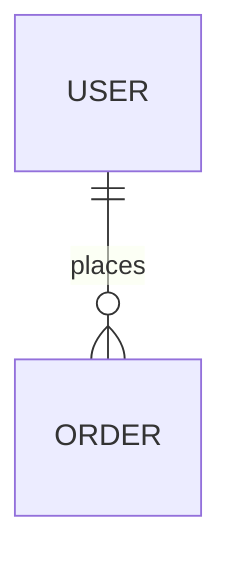
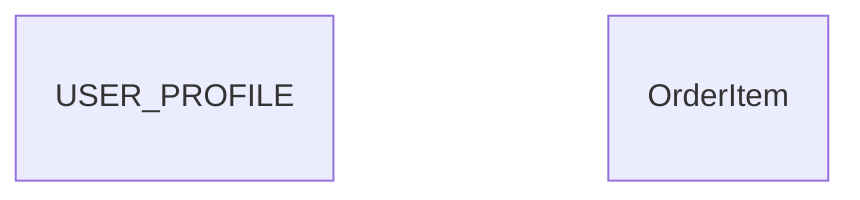
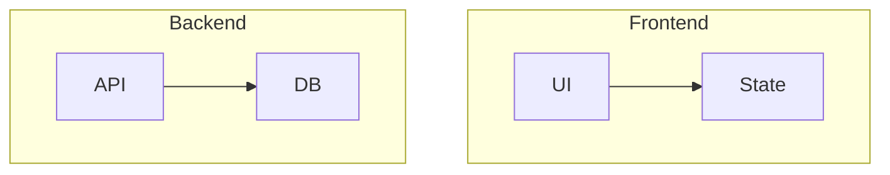
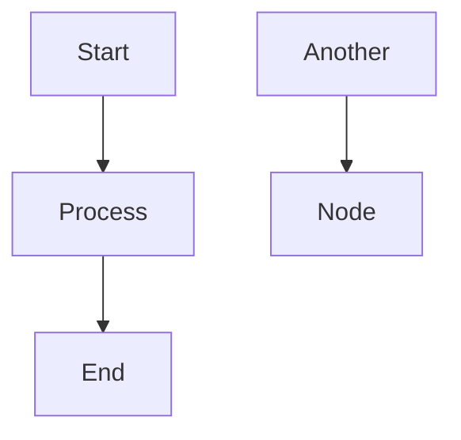
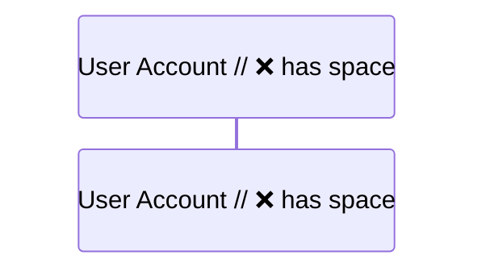
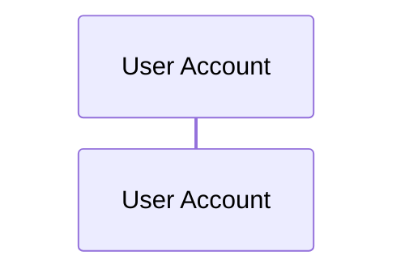
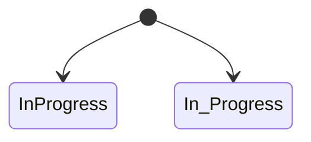

# Troubleshooting Guide

Guide for troubleshooting common issues when creating system design documents

## Table of Contents

1. [Mermaid Syntax Errors](#1-mermaid-syntax-errors)
2. [Reverse Engineering Issues](#2-reverse-engineering-issues)
3. [Consistency Problems](#3-consistency-problems)
4. [Diagram Rendering Issues](#4-diagram-rendering-issues)
5. [Framework-Specific Issues](#5-framework-specific-issues)

---

## 1. Mermaid Syntax Errors

### 1.1 ER Diagram Errors

#### Error: "Parse error on line X"

**Cause:** Invalid syntax in entity definition

**Wrong:**
```mermaid
erDiagram
    USER {
        int id PK
        string name,  // ❌ has comma
        email string  // ❌ type and name swapped
    }
```

**Correct:**

```mermaid
erDiagram
    USER {
        int id PK
        string name
        string email
    }
```

#### Error: "Invalid relationship"

**Cause:** Incorrect relationship syntax

**Wrong:**
```mermaid
erDiagram
    USER -- ORDER : places      // ❌ missing cardinality
    USER 1-* ORDER : places     // ❌ wrong syntax
```

**Correct:**

```mermaid
erDiagram
    USER ||--o{ ORDER : places
```

**Relationship Reference:**
| Notation | Meaning |
|----------|---------|
| `\|\|` | Exactly one (mandatory) |
| `o\|` | Zero or one (optional) |
| `\|{` | One or many |
| `o{` | Zero or many |

#### Error: "Entity name contains invalid characters"

**Cause:** Entity name contains special characters

**Wrong:**
```mermaid
erDiagram
    USER-PROFILE { }    // ❌ has hyphen
    Order Item { }      // ❌ has space
```

**Correct:**

```mermaid
erDiagram
    USER_PROFILE { }
    OrderItem { }
```

---

### 1.2 Flowchart Errors

#### Error: "Unclosed subgraph"

**Cause:** Forgot to close the `end` of a subgraph

**Wrong:**
```mermaid
flowchart TD
    subgraph Frontend
        A[UI] --> B[State]
    // ❌ missing end

    subgraph Backend
        C[API] --> D[DB]
    end
```

**Correct:**

```mermaid
flowchart TD
    subgraph Frontend
        A[UI] --> B[State]
    end

    subgraph Backend
        C[API] --> D[DB]
    end
```

#### Error: "Node not defined"

**Cause:** Using a node that has not been declared

**Wrong:**
```mermaid
flowchart TD
    A --> B
    B --> C
    D --> E  // ❌ D has no shape declared
```

**Correct:**

```mermaid
flowchart TD
    A[Start] --> B[Process]
    B --> C[End]
    D[Another] --> E[Node]
```

#### Error: "Invalid node shape"

**Cause:** Brackets don't match

| Shape | Syntax | Example |
|-------|--------|---------|
| Rectangle | `[text]` | `A[Process]` |
| Rounded | `(text)` | `A(Process)` |
| Diamond | `{text}` | `A{Decision}` |
| Circle | `((text))` | `A((Start))` |
| Hexagon | `{{text}}` | `A{{Condition}}` |
| Database | `[(text)]` | `A[(Database)]` |

---

### 1.3 Sequence Diagram Errors

#### Error: "Invalid participant"

**Cause:** Participant name contains spaces or special characters

**Wrong:**

```mermaid
sequenceDiagram
    participant User Account  // ❌ has space
```

**Correct:**

```mermaid
sequenceDiagram
    participant UA as User Account
```

#### Error: "Invalid arrow"

**Arrow Reference:**
| Arrow | Meaning | Usage |
|-------|---------|-------|
| `->>` | Sync request | `A->>B: call` |
| `-->>` | Async response | `B-->>A: response` |
| `-x` | Lost message | `A-xB: failed` |
| `-)` | Async message | `A-)B: event` |

---

### 1.4 State Diagram Errors

#### Error: "Invalid state name"

**Cause:** State name contains special characters

**Wrong:**
```mermaid
stateDiagram-v2
    [*] --> In-Progress  // ❌ has hyphen
```

**Correct:**

```mermaid
stateDiagram-v2
    [*] --> InProgress
    [*] --> In_Progress
```

---

## 2. Reverse Engineering Issues

### 2.1 No Models Found

**Symptoms:** No entity/model found when analyzing the codebase

**Common Causes:**

| Cause | Solution |
|-------|----------|
| Non-standard folder structure | Search using pattern: `*.entity.*`, `*.model.*` |
| Models in shared library | Search in referenced projects |
| Code-first without explicit models | Check DbContext or migrations |
| Microservices architecture | Analyze one service at a time |

**Search Commands:**
```bash
# .NET
find . -name "*.cs" | xargs grep -l "public class.*Entity\|DbSet<"

# Node.js
find . -name "*.js" -o -name "*.ts" | xargs grep -l "Schema\|@Entity\|model\."

# Python
find . -name "*.py" | xargs grep -l "models.Model\|Base.*declarative"
```

### 2.2 Missing Relationships

**Symptoms:** ER Diagram has no relationships between entities

**Common Causes:**

| Framework | Where to Look |
|-----------|---------------|
| EF Core | `OnModelCreating()` in DbContext |
| Sequelize | `associate()` method in models |
| Prisma | `@relation` in schema.prisma |
| Django | `ForeignKey`, `ManyToManyField` in models |

**Example - EF Core:**
```csharp
// Fluent API relationships
modelBuilder.Entity<Order>()
    .HasOne(o => o.Customer)
    .WithMany(c => c.Orders)
    .HasForeignKey(o => o.CustomerId);
```

### 2.3 Incomplete Data Types

**Symptoms:** Data Dictionary has incomplete data types

**Solution:** Check from multiple sources

| Source | Information |
|--------|-------------|
| Model annotations | `[StringLength(50)]`, `[MaxLength]` |
| Migration files | `VARCHAR(50)`, `DECIMAL(10,2)` |
| Database schema | Query from `INFORMATION_SCHEMA` |
| ORM config | Fluent API configurations |

---

## 3. Consistency Problems

### 3.1 ER Diagram ↔ Data Dictionary Mismatch

**Problem:** Entities in ER do not match tables in Data Dictionary

**Checklist:**
- [ ] Entity/table names match (including naming convention)
- [ ] Column counts match
- [ ] PK/FK match
- [ ] Relationships match

**Common Issues:**
| Issue | Solution |
|-------|----------|
| Naming convention different | Standardize: `USER` ↔ `users` |
| Extra audit columns in DD | Add to ER or mark as standard |
| Missing junction tables | Add M:N junction tables to both |

### 3.2 DFD Level Inconsistency

**Problem:** DFD Level 0 is inconsistent with Level 1

**Rules:**
1. The number of external entities must be the same
2. Data stores in Level 1 must explain the data flow in Level 0
3. System Inputs/Outputs in Level 0 = combined I/O of all processes in Level 1

**Example Fix:**
```
Level 0: Customer → [Order System] → Admin
Level 1: Customer → [1.0 Place Order] → [2.0 Process Payment] → Admin
                                    ↓
                            [Orders DB]

❌ Missing: Customer flow to Admin in Level 1
✅ Fix: Add flow from [2.0 Process Payment] → Admin (notification)
```

### 3.3 Sitemap ↔ Roles Mismatch

**Problem:** Pages in Sitemap do not have complete access control

**Checklist:**
- [ ] Every page has an Access level specified
- [ ] Public pages are clearly identified
- [ ] Protected pages have required roles
- [ ] Admin pages restricted properly

---

## 4. Diagram Rendering Issues

### 4.1 Diagram Too Large

**Problem:** Diagram does not render or displays incorrectly

**Solutions:**

1. **Split into multiple diagrams**
```markdown
## ER Diagram

### Core Entities
[diagram 1 - User, Order, Product]

### Support Entities
[diagram 2 - AuditLog, Settings, etc.]
```

2. **Use direction for better layout**
```mermaid
flowchart LR  // Left to Right for wide diagrams
flowchart TD  // Top Down for tall diagrams
```

3. **Reduce complexity**
- Split complex processes into sub-diagrams
- Use subgraphs to group elements

### 4.2 Overlapping Labels

**Problem:** Labels overlap in ER Diagram

**Solution:** Use shorter relationship labels or reduce entities

```mermaid
erDiagram
    USER ||--o{ ORDER : "places"          // ✅ short
    USER ||--o{ ORDER : "places order"    // ⚠️ may overlap
```

### 4.3 Markdown Preview Not Rendering

**Problem:** Mermaid does not display in preview

**Common Causes:**
- Editor does not support Mermaid
- Code block syntax is incorrect

**Correct Syntax:**
```markdown
```mermaid
flowchart TD
    A --> B
`` `
```

---

## 5. Framework-Specific Issues

### 5.1 .NET Core

| Issue | Cause | Solution |
|-------|-------|----------|
| Can't find entities | Using code-first migrations | Check `Migrations/` folder |
| Relationships missing | Using Data Annotations only | Check `[ForeignKey]`, `[InverseProperty]` |
| Complex types not shown | Owned types | Include owned types as separate or nested |

### 5.2 Node.js (Sequelize/Prisma)

| Issue | Cause | Solution |
|-------|-------|----------|
| No schema found | Using raw queries | Check SQL in repository files |
| TypeScript types only | No runtime models | Use interface definitions |
| Prisma schema outdated | Not synced with DB | Run `prisma db pull` |

### 5.3 Python/Django

| Issue | Cause | Solution |
|-------|-------|----------|
| Abstract models included | Base classes | Skip models with `abstract = True` |
| Proxy models | Override behavior only | Skip or note as proxy |
| Through models missing | M2M relationships | Include explicit through tables |

### 5.4 Laravel

| Issue | Cause | Solution |
|-------|-------|----------|
| No types in models | Dynamic attributes | Check migrations or `$casts` |
| Relationships hidden | Protected `$with` | Check `with()` in queries |
| Pivot tables | M2M relationships | Include pivot in DD |

---

## Quick Reference: Error Messages

| Error Message | Likely Cause | Quick Fix |
|---------------|--------------|-----------|
| "Parse error" | Syntax error | Check brackets, quotes, commas |
| "Unexpected token" | Invalid character | Remove special chars from names |
| "Duplicate definition" | Same name twice | Rename or merge |
| "Not defined" | Missing declaration | Define node/participant first |
| "Unclosed block" | Missing end/bracket | Add closing `end` or `}` |

---

## Need More Help?

1. **Check Mermaid Live Editor**: https://mermaid.live/
2. **Validate syntax** before adding to document
3. **Use simpler patterns** first, then add complexity
4. **Split large diagrams** into manageable parts
