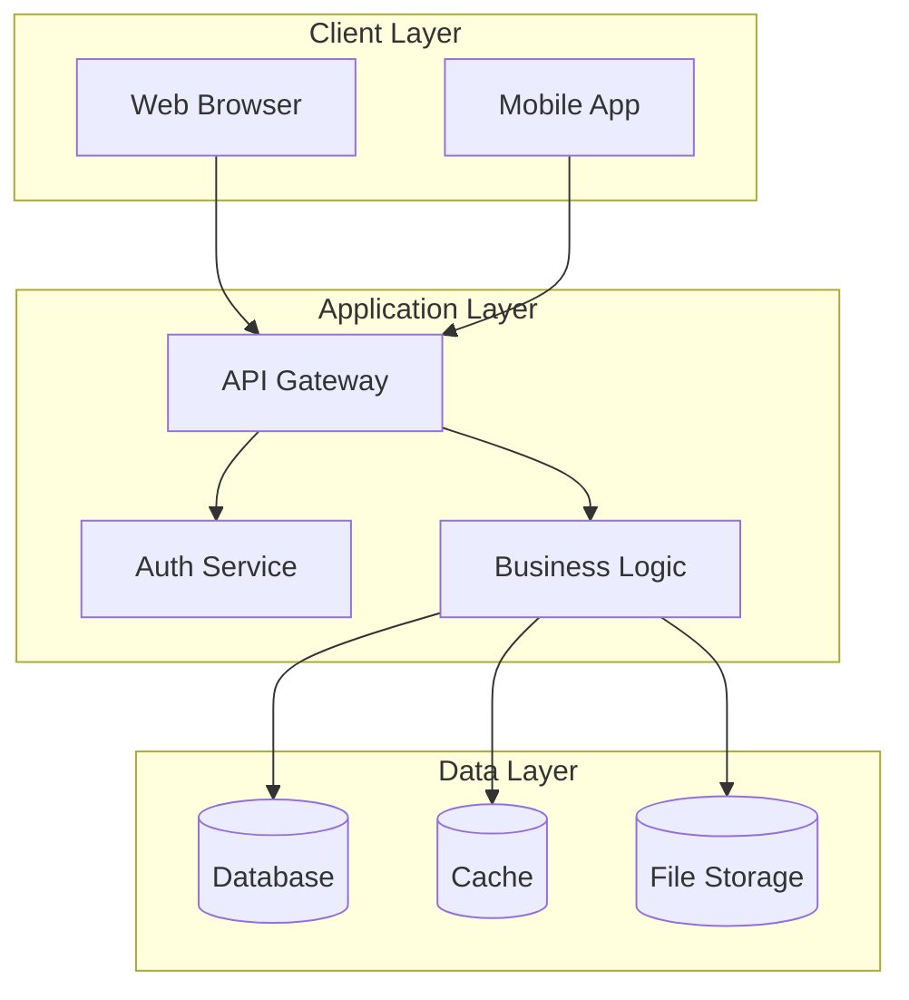
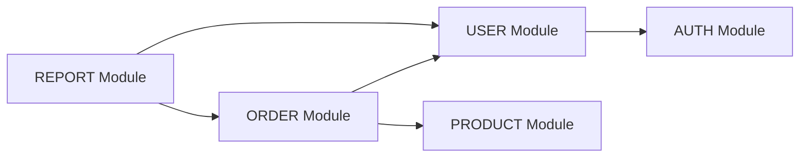
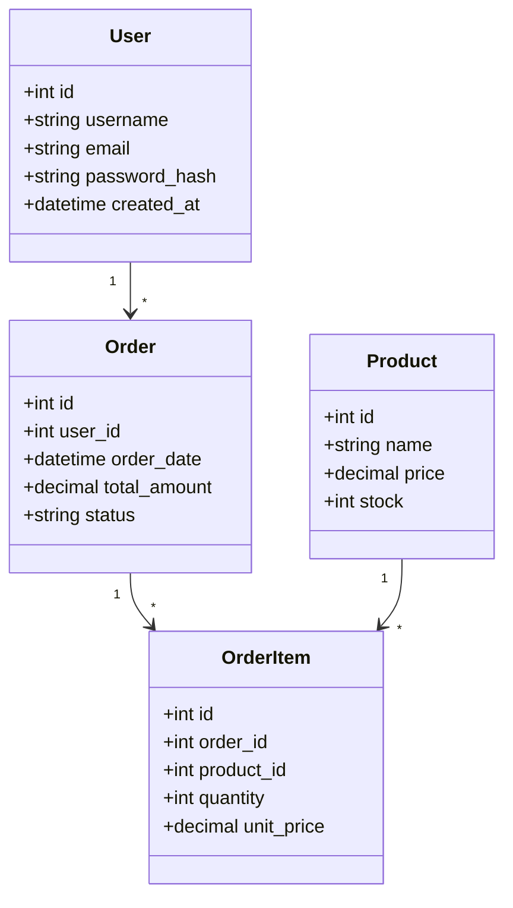
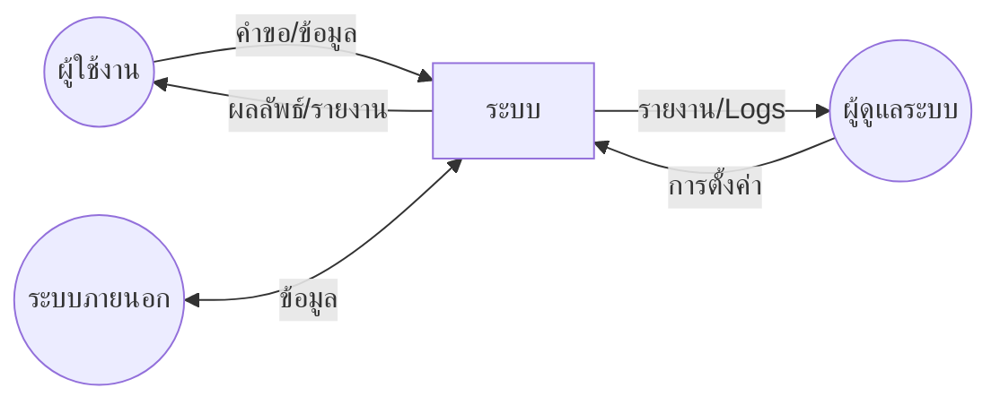
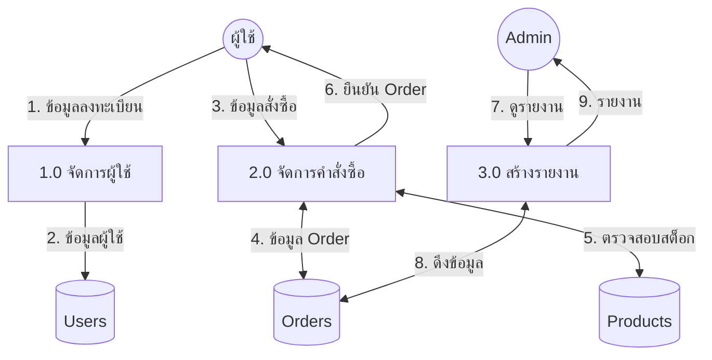
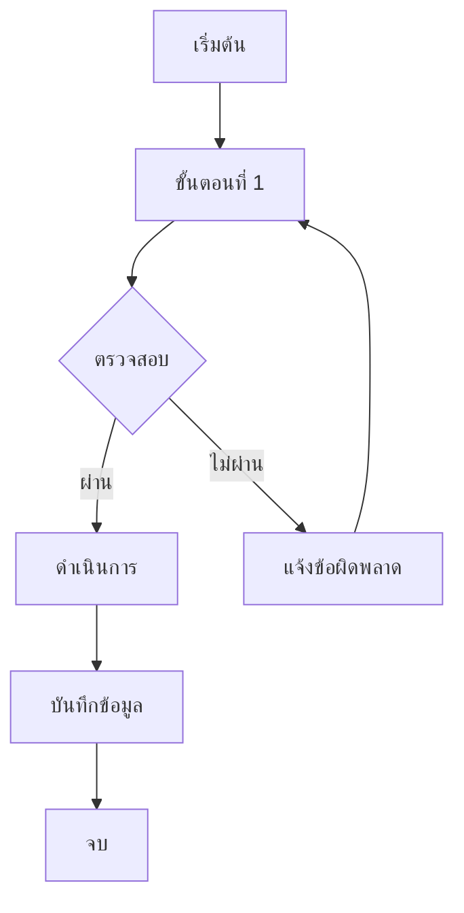
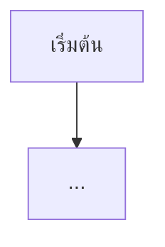
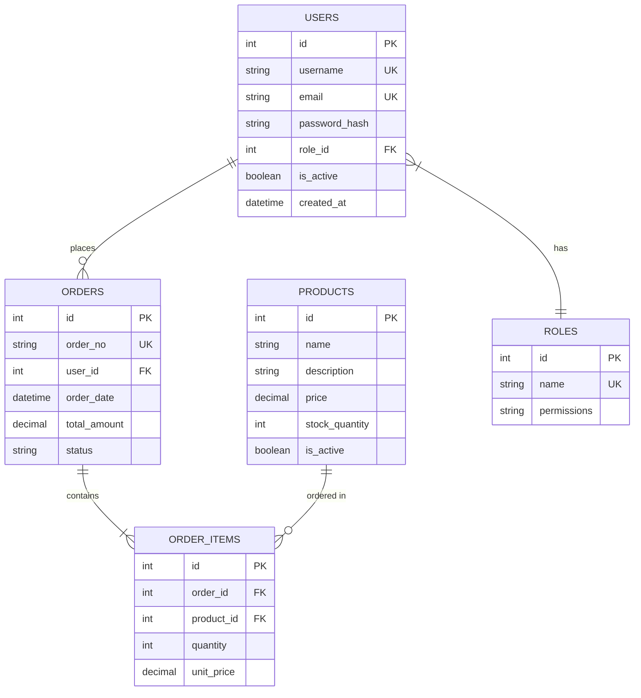
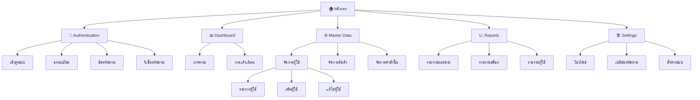

# [ชื่อโครงการ] - System Design Document

**Version**: 1.0.0  
**Date**: [DD/MM/YYYY]  
**Author**: [ชื่อผู้จัดทำ]  
**Status**: Draft | Review | Approved

---

## Document History

| Version | Date | Author | Changes |
|---------|------|--------|---------|
| 1.0.0 | [date] | [name] | Initial version |

---

## Table of Contents

1. [บทนำและภาพรวมระบบ](#1-บทนำและภาพรวมระบบ)
2. [ความต้องการระบบ](#2-ความต้องการระบบ)
3. [โมดูลที่เกี่ยวข้อง](#3-โมดูลที่เกี่ยวข้อง)
4. [Data Model](#4-data-model)
5. [Data Flow Diagram](#5-data-flow-diagram)
6. [Flow Diagrams](#6-flow-diagrams)
7. [ER Diagram](#7-er-diagram)
8. [Data Dictionary](#8-data-dictionary)
9. [Sitemap](#9-sitemap)
10. [User Roles & Permissions](#10-user-roles--permissions)

---

## 1. บทนำและภาพรวมระบบ

### 1.1 ข้อมูลโครงการ

| รายการ | รายละเอียด |
|--------|-----------|
| ชื่อโครงการ | [ชื่อ] |
| รหัสโครงการ | [รหัส] |
| เจ้าของโครงการ | [ชื่อ/แผนก] |
| วันที่เริ่มโครงการ | [DD/MM/YYYY] |
| วันที่คาดว่าจะแล้วเสร็จ | [DD/MM/YYYY] |

### 1.2 วัตถุประสงค์

[อธิบายวัตถุประสงค์หลักของระบบ]

- วัตถุประสงค์ที่ 1
- วัตถุประสงค์ที่ 2
- วัตถุประสงค์ที่ 3

### 1.3 ขอบเขตระบบ (Scope)

#### In Scope
- [รายการ 1]
- [รายการ 2]

#### Out of Scope
- [รายการ 1]
- [รายการ 2]

### 1.4 Stakeholders

| ผู้มีส่วนได้ส่วนเสีย | บทบาท | ความรับผิดชอบ |
|---------------------|-------|--------------|
| [ชื่อ/กลุ่ม] | [บทบาท] | [ความรับผิดชอบ] |

### 1.5 High-Level Architecture

### 1.6 Technology Stack

| Layer | Technology |
|-------|------------|
| Frontend | [เทคโนโลยี] |
| Backend | [เทคโนโลยี] |
| Database | [เทคโนโลยี] |
| Infrastructure | [เทคโนโลยี] |

---

## 2. ความต้องการระบบ

### 2.1 Functional Requirements

| รหัส | ความต้องการ | Priority | Module |
|------|-------------|----------|--------|
| FR-001 | [รายละเอียด] | High | [module] |
| FR-002 | [รายละเอียด] | Medium | [module] |
| FR-003 | [รายละเอียด] | Low | [module] |

#### FR-001: [ชื่อ Requirement]

**คำอธิบาย**: [รายละเอียด]

**Input**:
- [ข้อมูลนำเข้า 1]
- [ข้อมูลนำเข้า 2]

**Process**:
1. [ขั้นตอนที่ 1]
2. [ขั้นตอนที่ 2]

**Output**:
- [ผลลัพธ์]

**Business Rules**:
- [กฎ 1]
- [กฎ 2]

### 2.2 Non-Functional Requirements

| รหัส | ประเภท | ความต้องการ | เกณฑ์วัด |
|------|--------|-------------|----------|
| NFR-001 | Performance | Response time | < 3 seconds |
| NFR-002 | Availability | Uptime | 99.9% |
| NFR-003 | Security | Authentication | JWT, HTTPS |
| NFR-004 | Scalability | Concurrent users | 1,000+ |

### 2.3 Business Rules

| รหัส | Business Rule | Module |
|------|---------------|--------|
| BR-001 | [กฎ] | [module] |
| BR-002 | [กฎ] | [module] |

---

## 3. โมดูลที่เกี่ยวข้อง

### 3.1 Module Overview

| Module | คำอธิบาย | Dependencies |
|--------|---------|--------------|
| AUTH | การยืนยันตัวตนและ authorization | - |
| USER | จัดการข้อมูลผู้ใช้ | AUTH |
| [MODULE] | [คำอธิบาย] | [dependencies] |

### 3.2 Module Dependency Diagram

### 3.3 Module Details

#### 3.3.1 AUTH Module

**หน้าที่**: จัดการการ login/logout และ token management

**APIs**:
| Method | Endpoint | Description |
|--------|----------|-------------|
| POST | /api/auth/login | เข้าสู่ระบบ |
| POST | /api/auth/logout | ออกจากระบบ |
| POST | /api/auth/refresh | รีเฟรช token |

#### 3.3.2 [Module Name]

**หน้าที่**: [คำอธิบาย]

**APIs**:
| Method | Endpoint | Description |
|--------|----------|-------------|
| [METHOD] | [endpoint] | [description] |

---

## 4. Data Model

### 4.1 Entity Overview

### 4.2 Entity Relationships

| Entity 1 | Relationship | Entity 2 | Description |
|----------|--------------|----------|-------------|
| User | 1:N | Order | ผู้ใช้ 1 คนมีได้หลาย Order |
| Order | 1:N | OrderItem | Order 1 รายการมีได้หลาย Item |
| Product | 1:N | OrderItem | สินค้า 1 ชิ้นอยู่ได้หลาย OrderItem |

---

## 5. Data Flow Diagram

### 5.1 Context Diagram (Level 0)

### 5.2 Level 1 DFD

### 5.3 Data Flow Description

| Flow ID | From | To | Data Description |
|---------|------|-----|------------------|
| 1 | ผู้ใช้ | Process 1.0 | ข้อมูลลงทะเบียน |
| 2 | Process 1.0 | D1: Users | ข้อมูลผู้ใช้ |

---

## 6. Flow Diagrams

### 6.1 [Process Name] Flow

**วัตถุประสงค์**: [อธิบาย]

**Actors**: [ผู้เกี่ยวข้อง]

**Steps**:
1. [ขั้นตอนที่ 1]
2. [ขั้นตอนที่ 2]
3. [ขั้นตอนที่ 3]

### 6.2 [Another Process] Flow

---

## 7. ER Diagram

### 7.1 Complete ER Diagram

### 7.2 Relationship Summary

| Entity 1 | Cardinality | Entity 2 | Relationship Description |
|----------|-------------|----------|-------------------------|
| USERS | 1:N | ORDERS | ผู้ใช้ 1 คนสร้างได้หลาย Order |
| ORDERS | 1:N | ORDER_ITEMS | Order มีได้หลายรายการสินค้า |
| PRODUCTS | 1:N | ORDER_ITEMS | สินค้าถูกสั่งได้หลายครั้ง |
| USERS | N:1 | ROLES | ผู้ใช้มี Role เดียว |

---

## 8. Data Dictionary

### 8.1 Table: users

**Description**: เก็บข้อมูลผู้ใช้งานระบบ

| Column | Data Type | Constraints | Default | Description |
|--------|-----------|-------------|---------|-------------|
| id | INT | PK, AI | - | รหัสผู้ใช้ |
| username | VARCHAR(50) | UK, NN | - | ชื่อผู้ใช้ |
| email | VARCHAR(100) | UK, NN | - | อีเมล |
| password_hash | VARCHAR(255) | NN | - | รหัสผ่าน (hashed) |
| role_id | INT | FK, NN | - | รหัส Role |
| is_active | BOOLEAN | NN | true | สถานะใช้งาน |
| created_at | DATETIME | NN | NOW() | วันที่สร้าง |
| updated_at | DATETIME | | NULL | วันที่แก้ไข |

**Indexes**:
- PRIMARY KEY (id)
- UNIQUE INDEX idx_username (username)
- UNIQUE INDEX idx_email (email)

**Foreign Keys**:
- FK_users_role: role_id → roles(id)

---

### 8.2 Table: orders

**Description**: เก็บข้อมูลคำสั่งซื้อ

| Column | Data Type | Constraints | Default | Description |
|--------|-----------|-------------|---------|-------------|
| id | INT | PK, AI | - | รหัส Order |
| order_no | VARCHAR(20) | UK, NN | - | เลขที่ Order |
| user_id | INT | FK, NN | - | รหัสผู้สั่ง |
| order_date | DATETIME | NN | NOW() | วันที่สั่ง |
| subtotal | DECIMAL(12,2) | NN | 0 | ยอดรวมก่อน VAT |
| vat_amount | DECIMAL(12,2) | NN | 0 | VAT |
| total_amount | DECIMAL(12,2) | NN | 0 | ยอดรวมสุทธิ |
| status | ENUM | NN | 'pending' | สถานะ |
| created_at | DATETIME | NN | NOW() | วันที่สร้าง |

**Status Values**: pending, confirmed, processing, shipped, delivered, cancelled

---

### 8.3 Table: [table_name]

**Description**: [คำอธิบาย]

| Column | Data Type | Constraints | Default | Description |
|--------|-----------|-------------|---------|-------------|
| [column] | [type] | [constraints] | [default] | [description] |

---

## 9. Sitemap

### 9.1 Visual Sitemap

### 9.2 Page Inventory

| Page ID | ชื่อหน้า | URL | Access Level | Description |
|---------|---------|-----|--------------|-------------|
| P001 | หน้าแรก | / | Public | Landing page |
| P002 | เข้าสู่ระบบ | /auth/login | Public | หน้า Login |
| P003 | ลงทะเบียน | /auth/register | Public | หน้าลงทะเบียน |
| P004 | Dashboard | /dashboard | User | หน้าหลักผู้ใช้ |
| P005 | รายการผู้ใช้ | /admin/users | Admin | จัดการผู้ใช้ |
| P006 | รายงานยอดขาย | /reports/sales | Manager | รายงาน |

### 9.3 Navigation Structure

**Primary Navigation** (Header):
- หน้าแรก
- Dashboard
- Master Data
- Reports

**User Menu**:
- โปรไฟล์
- ตั้งค่า
- ออกจากระบบ

---

## 10. User Roles & Permissions

### 10.1 Roles Definition

| Role ID | Role Name | Description | Level |
|---------|-----------|-------------|-------|
| 1 | Super Admin | ผู้ดูแลระบบสูงสุด | 1 |
| 2 | Admin | ผู้ดูแลระบบ | 2 |
| 3 | Manager | ผู้จัดการ | 3 |
| 4 | User | ผู้ใช้งานทั่วไป | 4 |
| 5 | Guest | ผู้เยี่ยมชม | 5 |

### 10.2 Permission Matrix

| Permission | Super Admin | Admin | Manager | User | Guest |
|------------|:-----------:|:-----:|:-------:|:----:|:-----:|
| **Dashboard** |
| View Dashboard | ✅ | ✅ | ✅ | ✅ | ❌ |
| **User Management** |
| View Users | ✅ | ✅ | ✅ | ❌ | ❌ |
| Create User | ✅ | ✅ | ❌ | ❌ | ❌ |
| Edit User | ✅ | ✅ | ❌ | ❌ | ❌ |
| Delete User | ✅ | ❌ | ❌ | ❌ | ❌ |
| **Orders** |
| View All Orders | ✅ | ✅ | ✅ | ❌ | ❌ |
| View Own Orders | ✅ | ✅ | ✅ | ✅ | ❌ |
| Create Order | ✅ | ✅ | ✅ | ✅ | ❌ |
| Cancel Order | ✅ | ✅ | ✅ | 🔸 | ❌ |
| **Reports** |
| View Reports | ✅ | ✅ | ✅ | ❌ | ❌ |
| Export Reports | ✅ | ✅ | ✅ | ❌ | ❌ |
| **Settings** |
| System Config | ✅ | ❌ | ❌ | ❌ | ❌ |
| User Profile | ✅ | ✅ | ✅ | ✅ | ❌ |

**Legend**: ✅ = Full Access, 🔸 = Limited (own data only), ❌ = No Access

### 10.3 Access Control Rules

#### Rule 1: Data Ownership
- ผู้ใช้สามารถดูและแก้ไขข้อมูลของตัวเองเท่านั้น
- Manager ขึ้นไปสามารถดูข้อมูลของทีมได้
- Admin ขึ้นไปสามารถดูข้อมูลทั้งหมดได้

#### Rule 2: Hierarchical Access
- Role ที่มี Level ต่ำกว่า มีสิทธิ์มากกว่า
- Super Admin (Level 1) มีสิทธิ์ทุกอย่าง

#### Rule 3: Action Restrictions
- การลบข้อมูลต้องเป็น Admin ขึ้นไป
- การลบ User ต้องเป็น Super Admin เท่านั้น

---

## Appendix

### A. Glossary

| Term | Definition |
|------|------------|
| [คำศัพท์] | [คำจำกัดความ] |

### B. References

- [เอกสารอ้างอิง 1]
- [เอกสารอ้างอิง 2]

### C. Change Log

| Date | Version | Changes | Author |
|------|---------|---------|--------|
| [date] | [ver] | [changes] | [author] |
