<!-- LEGACY single-file template. Used ONLY when doc_layout:"single". New docs default to doc_layout:"split" — see templates/sections/ + templates/index-template.md and the spec 2026-05-29-system-design-doc-split-files-design.md. -->

# [Project Name] - System Design Document

**Version**: 1.0.0
**Date**: [DD/MM/YYYY]
**Author**: [Author Name]
**Status**: Draft | Review | Approved

---

## Document History

| Version | Date | Author | Changes |
|---------|------|--------|---------|
| 1.0.0 | [date] | [name] | Initial version |

---

## Table of Contents

1. [Introduction & System Overview](#1-introduction--system-overview)
2. [System Requirements](#2-system-requirements)
3. [Related Modules](#3-related-modules)
4. [Data Model](#4-data-model)
5. [Data Flow Diagram](#5-data-flow-diagram)
6. [Flow Diagrams](#6-flow-diagrams)
7. [ER Diagram](#7-er-diagram)
8. [Data Dictionary](#8-data-dictionary)
9. [Sitemap](#9-sitemap)
10. [User Roles & Permissions](#10-user-roles--permissions)

---

## 1. Introduction & System Overview

### 1.1 Project Information

| Item | Details |
|------|---------|
| Project Name | [Name] |
| Project Code | [Code] |
| Project Owner | [Name/Department] |
| Project Start Date | [DD/MM/YYYY] |
| Expected Completion Date | [DD/MM/YYYY] |

### 1.2 Objectives

[Describe the primary objectives of the system]

- Objective 1
- Objective 2
- Objective 3

### 1.3 System Scope

#### In Scope
- [Item 1]
- [Item 2]

#### Out of Scope
- [Item 1]
- [Item 2]

### 1.4 Stakeholders

| Stakeholder | Role | Responsibility |
|-------------|------|----------------|
| [Name/Group] | [Role] | [Responsibility] |

### 1.5 High-Level Architecture

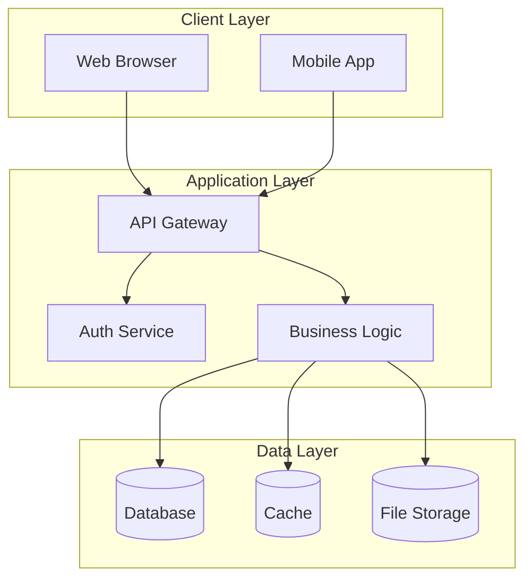
```mermaid
flowchart TB
    subgraph Client["Client Layer"]
        WEB[Web Browser]
        MOBILE[Mobile App]
    end
    
    subgraph Server["Application Layer"]
        API[API Gateway]
        AUTH[Auth Service]
        BIZ[Business Logic]
    end
    
    subgraph Data["Data Layer"]
        DB[(Database)]
        CACHE[(Cache)]
        STORAGE[(File Storage)]
    end
    
    WEB --> API
    MOBILE --> API
    API --> AUTH
    API --> BIZ
    BIZ --> DB
    BIZ --> CACHE
    BIZ --> STORAGE
```

### 1.6 Technology Stack

| Layer | Technology |
|-------|------------|
| Frontend | [Technology] |
| Backend | [Technology] |
| Database | [Technology] |
| Infrastructure | [Technology] |

---

## 2. System Requirements

### 2.1 Functional Requirements

| ID | Requirement | Priority | Module |
|----|-------------|----------|--------|
| FR-001 | [Details] | High | [module] |
| FR-002 | [Details] | Medium | [module] |
| FR-003 | [Details] | Low | [module] |

#### FR-001: [Requirement Name]

**Description**: [Details]

**Input**:
- [Input data 1]
- [Input data 2]

**Process**:
1. [Step 1]
2. [Step 2]

**Output**:
- [Result]

**Business Rules**:
- [Rule 1]
- [Rule 2]

### 2.2 Non-Functional Requirements

| ID | Type | Requirement | Metric |
|----|------|-------------|--------|
| NFR-001 | Performance | Response time | < 3 seconds |
| NFR-002 | Availability | Uptime | 99.9% |
| NFR-003 | Security | Authentication | JWT, HTTPS |
| NFR-004 | Scalability | Concurrent users | 1,000+ |

### 2.3 Business Rules

| ID | Business Rule | Module |
|----|---------------|--------|
| BR-001 | [Rule] | [module] |
| BR-002 | [Rule] | [module] |

### 2.4 Acceptance Criteria

> **Purpose**: Machine-readable acceptance criteria — referenced by `qa-ui-test` traceability matrix (`/qa-trace`) and `long-running` release-gate coverage check.
>
> **ID Format**: `AC-NNN` (flat, 3-digit zero-padded). System-design-doc is the **source of truth** — other plugins reference these IDs.
>
> **Detection Pattern**: `qa-trace` greps `^AC-\d+(\.\d+)?:` so each AC must appear on its own line in the form `AC-001: <criterion>` somewhere in the document (table row, bullet, or heading all work).

| AC ID | Criterion | Module | FR Ref | UC Ref | Type |
|-------|-----------|--------|--------|--------|------|
| AC-001 | [Specific, testable criterion] | [MODULE] | FR-001 | UC-001 | functional |
| AC-002 | [Specific, testable criterion] | [MODULE] | FR-001 | UC-001 | functional |
| AC-003 | [Specific, testable criterion] | [MODULE] | BR-001 | - | business-rule |
| AC-004 | Response time < 3s for list endpoints | [MODULE] | NFR-001 | - | non-functional |

**Type values**: `functional` | `non-functional` | `business-rule`

**Authoring rules**:
- Each AC must be **independently testable** (one assertion = one AC; avoid "AND" / "OR" combiners)
- Reference at least one of: FR, BR, or NFR (preferably FR)
- If derived from a Use Case step → set UC Ref to `UC-NNN`
- Keep titles ≤ 100 chars; details belong in the linked FR/UC

**Inline AC line example** (alternative form for narrative sections):

```
AC-005: Cancel button on order detail must show confirmation dialog before issuing DELETE.
```

### 2.5 Use Cases

> **Purpose**: Structured use cases — used by `qa-create-scenario` to seed multi-step / state-machine scenarios.
>
> **ID Format**: `UC-NNN` (flat, 3-digit zero-padded).
>
> **Heading Pattern**: each UC must use the heading `### Use Case (UC-NNN): <Title>` — `qa-trace` regex: `^### Use Case \(UC-\d+\):.*$`.

#### 2.5.1 Use Case Inventory

| UC ID | Title | Module | Primary Actor | FR Refs | AC Refs |
|-------|-------|--------|---------------|---------|---------|
| UC-001 | Place Order | CHECKOUT | Customer | FR-001 | AC-001, AC-002 |
| UC-002 | Cancel Order | CHECKOUT | Customer | FR-002 | AC-005 |

#### 2.5.2 Use Case Details

### Use Case (UC-001): Place Order

| Field | Value |
|-------|-------|
| **Module** | CHECKOUT |
| **Primary Actor** | Customer |
| **Secondary Actors** | Payment Gateway |
| **Preconditions** | User is authenticated; cart has at least 1 item |
| **Postconditions** | Order created with status `confirmed`; inventory decremented |
| **FR Refs** | FR-001 |
| **AC Refs** | AC-001, AC-002 |

**Main Flow**:
1. Customer reviews cart on `/checkout`
2. Customer selects payment method
3. System validates payment input → `AC-001`
4. System reserves stock and creates order → `AC-002`
5. System redirects to `/order/{id}/confirmation`

**Alternative Flows**:

- **A1: Payment declined** — at step 3, gateway returns `declined` → show error banner, allow retry, do not deduct stock
- **A2: Stock unavailable** — at step 4, item out of stock → show "out of stock" message, remove item from cart

**Exception Flows**:

- **E1: Network timeout to gateway** — auto-retry once after 5s; if still fails, show recoverable error

### Use Case (UC-002): [Title]

| Field | Value |
|-------|-------|
| **Module** | [MODULE] |
| **Primary Actor** | [Actor] |
| **Preconditions** | [...] |
| **Postconditions** | [...] |
| **FR Refs** | FR-NNN |
| **AC Refs** | AC-NNN |

**Main Flow**:
1. [Step 1]

---

## 3. Related Modules

### 3.1 Module Overview

| Module | Description | Dependencies |
|--------|-------------|--------------|
| AUTH | Authentication and authorization | - |
| USER | User data management | AUTH |
| [MODULE] | [Description] | [dependencies] |

### 3.2 Module Dependency Diagram

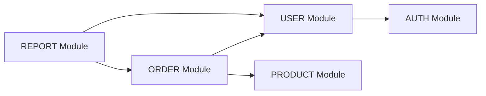
```mermaid
flowchart LR
    AUTH[AUTH Module]
    USER[USER Module]
    ORDER[ORDER Module]
    PRODUCT[PRODUCT Module]
    REPORT[REPORT Module]
    
    USER --> AUTH
    ORDER --> USER
    ORDER --> PRODUCT
    REPORT --> ORDER
    REPORT --> USER
```

### 3.3 Module Details

#### 3.3.1 AUTH Module

**Responsibility**: Handle login/logout and token management

**APIs**:
| Method | Endpoint | Description |
|--------|----------|-------------|
| POST | /api/auth/login | Login |
| POST | /api/auth/logout | Logout |
| POST | /api/auth/refresh | Refresh token |

#### 3.3.2 [Module Name]

**Responsibility**: [Description]

**APIs**:
| Method | Endpoint | Description |
|--------|----------|-------------|
| [METHOD] | [endpoint] | [description] |

---

## 4. Data Model

### 4.1 Entity Overview

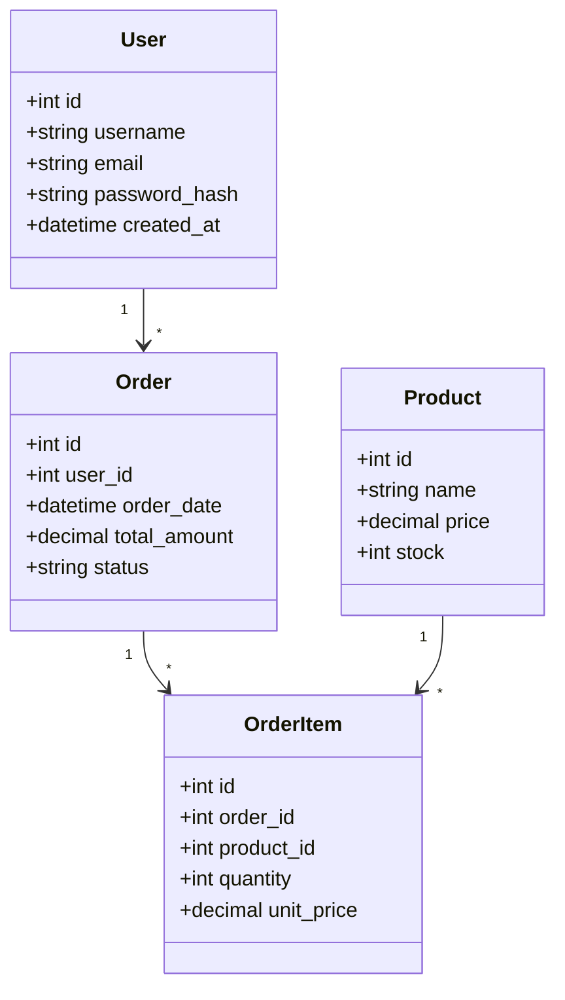
```mermaid
classDiagram
    class User {
        +int id
        +string username
        +string email
        +string password_hash
        +datetime created_at
    }
    
    class Order {
        +int id
        +int user_id
        +datetime order_date
        +decimal total_amount
        +string status
    }
    
    class OrderItem {
        +int id
        +int order_id
        +int product_id
        +int quantity
        +decimal unit_price
    }
    
    class Product {
        +int id
        +string name
        +decimal price
        +int stock
    }
    
    User "1" --> "*" Order
    Order "1" --> "*" OrderItem
    Product "1" --> "*" OrderItem
```

### 4.2 Entity Relationships

| Entity 1 | Relationship | Entity 2 | Description |
|----------|--------------|----------|-------------|
| User | 1:N | Order | One user can have many orders |
| Order | 1:N | OrderItem | One order can have many items |
| Product | 1:N | OrderItem | One product can be in many order items |

---

## 5. Data Flow Diagram

### 5.1 Context Diagram (Level 0)

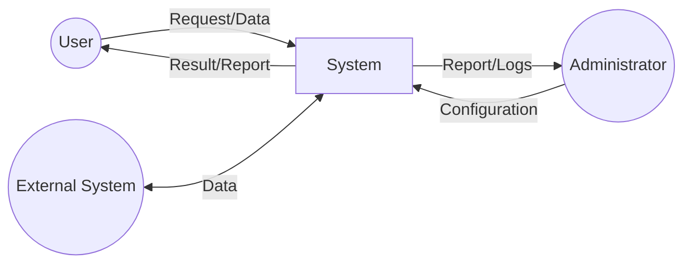
```mermaid
flowchart LR
    E1((User)) -->|Request/Data| S[System]
    S -->|Result/Report| E1

    E2((Administrator)) -->|Configuration| S
    S -->|Report/Logs| E2

    E3((External System)) <-->|Data| S
```

### 5.2 Level 1 DFD

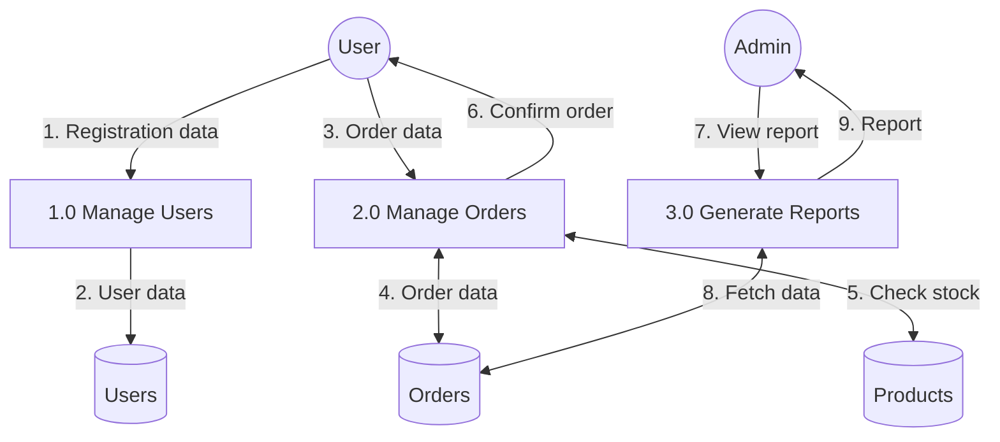
```mermaid
flowchart TB
    E1((User)) -->|1. Registration data| P1[1.0 Manage Users]
    P1 -->|2. User data| D1[(Users)]

    E1 -->|3. Order data| P2[2.0 Manage Orders]
    P2 <-->|4. Order data| D2[(Orders)]
    P2 <-->|5. Check stock| D3[(Products)]
    P2 -->|6. Confirm order| E1

    E2((Admin)) -->|7. View report| P3[3.0 Generate Reports]
    P3 <-->|8. Fetch data| D2
    P3 -->|9. Report| E2
```

### 5.3 Data Flow Description

| Flow ID | From | To | Data Description |
|---------|------|-----|------------------|
| 1 | User | Process 1.0 | Registration data |
| 2 | Process 1.0 | D1: Users | User data |

---

## 6. Flow Diagrams

### 6.1 [Process Name] Flow

**Objective**: [Description]

**Actors**: [Involved parties]

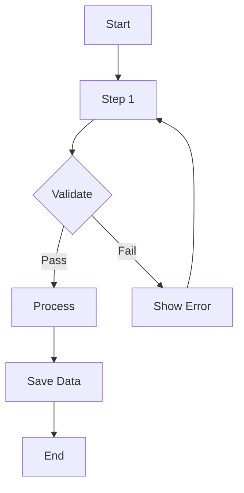
```mermaid
flowchart TD
    A[Start] --> B[Step 1]
    B --> C{Validate}
    C -->|Pass| D[Process]
    C -->|Fail| E[Show Error]
    E --> B
    D --> F[Save Data]
    F --> G[End]
```

**Steps**:
1. [Step 1]
2. [Step 2]
3. [Step 3]

### 6.2 [Another Process] Flow

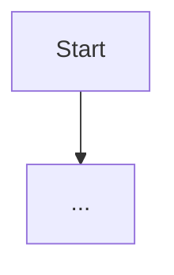
```mermaid
flowchart TD
    A[Start] --> B[...]
```

---

## 7. ER Diagram

### 7.1 Complete ER Diagram

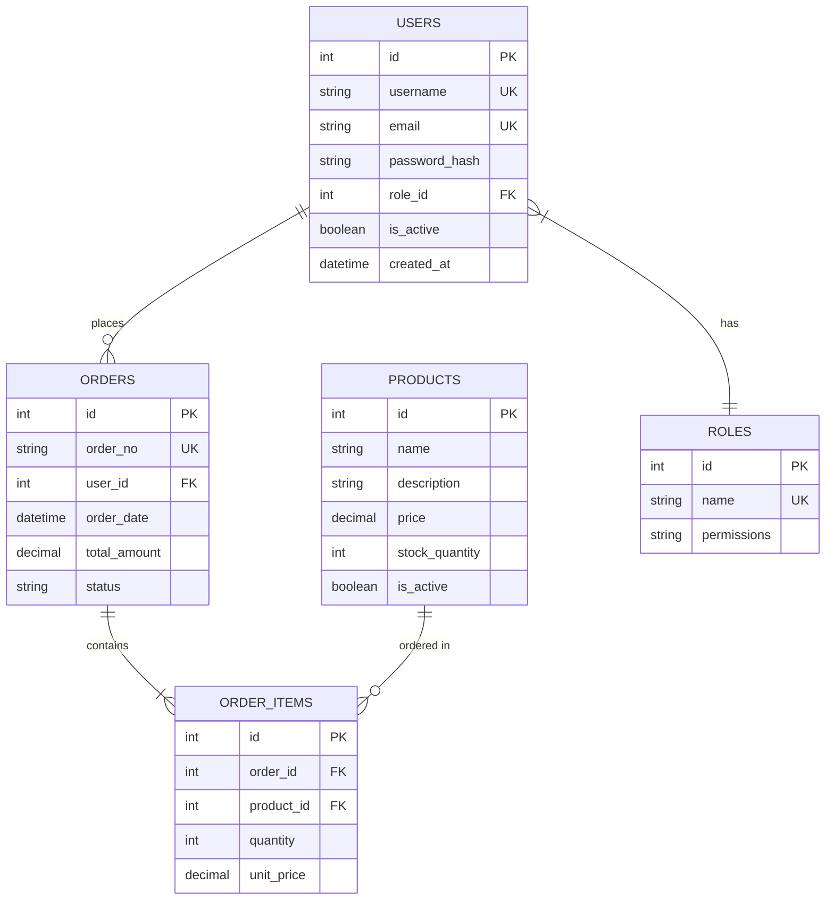
```mermaid
erDiagram
    USERS ||--o{ ORDERS : places
    ORDERS ||--|{ ORDER_ITEMS : contains
    PRODUCTS ||--o{ ORDER_ITEMS : "ordered in"
    USERS }|--|| ROLES : "has"
    
    USERS {
        int id PK
        string username UK
        string email UK
        string password_hash
        int role_id FK
        boolean is_active
        datetime created_at
    }
    
    ROLES {
        int id PK
        string name UK
        string permissions
    }
    
    ORDERS {
        int id PK
        string order_no UK
        int user_id FK
        datetime order_date
        decimal total_amount
        string status
    }
    
    ORDER_ITEMS {
        int id PK
        int order_id FK
        int product_id FK
        int quantity
        decimal unit_price
    }
    
    PRODUCTS {
        int id PK
        string name
        string description
        decimal price
        int stock_quantity
        boolean is_active
    }
```

### 7.2 Relationship Summary

| Entity 1 | Cardinality | Entity 2 | Relationship Description |
|----------|-------------|----------|-------------------------|
| USERS | 1:N | ORDERS | One user can create many orders |
| ORDERS | 1:N | ORDER_ITEMS | One order can have many items |
| PRODUCTS | 1:N | ORDER_ITEMS | One product can be ordered many times |
| USERS | N:1 | ROLES | A user has one role |

---

## 8. Data Dictionary

### 8.1 Table: users

**Description**: Stores system user information

| Column | Data Type | Constraints | Default | Description |
|--------|-----------|-------------|---------|-------------|
| id | INT | PK, AI | - | User ID |
| username | VARCHAR(50) | UK, NN | - | Username |
| email | VARCHAR(100) | UK, NN | - | Email |
| password_hash | VARCHAR(255) | NN | - | Password (hashed) |
| role_id | INT | FK, NN | - | Role ID |
| is_active | BOOLEAN | NN | true | Active status |
| created_at | DATETIME | NN | NOW() | Created date |
| updated_at | DATETIME | | NULL | Updated date |

**Indexes**:
- PRIMARY KEY (id)
- UNIQUE INDEX idx_username (username)
- UNIQUE INDEX idx_email (email)

**Foreign Keys**:
- FK_users_role: role_id → roles(id)

---

### 8.2 Table: orders

**Description**: Stores order information

| Column | Data Type | Constraints | Default | Description |
|--------|-----------|-------------|---------|-------------|
| id | INT | PK, AI | - | Order ID |
| order_no | VARCHAR(20) | UK, NN | - | Order number |
| user_id | INT | FK, NN | - | Orderer's user ID |
| order_date | DATETIME | NN | NOW() | Order date |
| subtotal | DECIMAL(12,2) | NN | 0 | Subtotal before VAT |
| vat_amount | DECIMAL(12,2) | NN | 0 | VAT |
| total_amount | DECIMAL(12,2) | NN | 0 | Net total |
| status | ENUM | NN | 'pending' | Status |
| created_at | DATETIME | NN | NOW() | Created date |

**Status Values**: pending, confirmed, processing, shipped, delivered, cancelled

---

### 8.3 Table: [table_name]

**Description**: [Description]

| Column | Data Type | Constraints | Default | Description |
|--------|-----------|-------------|---------|-------------|
| [column] | [type] | [constraints] | [default] | [description] |

---

## 9. Sitemap

### 9.1 Visual Sitemap

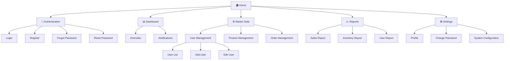
```mermaid
flowchart TD
    HOME[🏠 Home]

    HOME --> AUTH[🔐 Authentication]
    HOME --> DASH[📊 Dashboard]
    HOME --> MASTER[⚙️ Master Data]
    HOME --> REPORT[📈 Reports]
    HOME --> SETTING[🛠️ Settings]

    AUTH --> LOGIN[Login]
    AUTH --> REGISTER[Register]
    AUTH --> FORGOT[Forgot Password]
    AUTH --> RESET[Reset Password]

    DASH --> OVERVIEW[Overview]
    DASH --> NOTI[Notifications]

    MASTER --> USER_MGT[User Management]
    MASTER --> PRODUCT_MGT[Product Management]
    MASTER --> ORDER_MGT[Order Management]

    USER_MGT --> USER_LIST[User List]
    USER_MGT --> USER_ADD[Add User]
    USER_MGT --> USER_EDIT[Edit User]

    REPORT --> RPT_SALES[Sales Report]
    REPORT --> RPT_INV[Inventory Report]
    REPORT --> RPT_USER[User Report]

    SETTING --> PROFILE[Profile]
    SETTING --> CHANGE_PWD[Change Password]
    SETTING --> SYS_CONFIG[System Configuration]
```

### 9.2 Page Inventory

| Page ID | Page Name | URL | Access Level | Description |
|---------|-----------|-----|--------------|-------------|
| P001 | Home | / | Public | Landing page |
| P002 | Login | /auth/login | Public | Login page |
| P003 | Register | /auth/register | Public | Registration page |
| P004 | Dashboard | /dashboard | User | Main user page |
| P005 | User List | /admin/users | Admin | User management |
| P006 | Sales Report | /reports/sales | Manager | Report |

### 9.3 Navigation Structure

**Primary Navigation** (Header):
- Home
- Dashboard
- Master Data
- Reports

**User Menu**:
- Profile
- Settings
- Logout

---

### 9.4 Design System Inventory

> **Source of truth**: `.design-docs/sitemap.json` `design_system` block.
> **Sync command**: `/sync-sitemap`

#### 9.4.1 Master Pages

| ID | Name | Description | Source File |
|----|------|-------------|-------------|
| MP-001 | AdminLayout | Sidebar + topbar + profile chrome | `.mockups/html/master-page.js` |

#### 9.4.2 Page Templates

| ID | Name | Uses Master | Default Components |
|----|------|-------------|--------------------|
| TPL-001 | ListPage | MP-001 | CMP-001, CMP-002 |

#### 9.4.3 Nav Templates

| ID | Name | Type | Items |
|----|------|------|-------|
| NAV-001 | PrimarySidebar | sidebar | Dashboard, Orders, Reports |

#### 9.4.4 Components

| ID | Name | Category | Source File |
|----|------|----------|-------------|
| CMP-001 | DataTable | data-display | `src/Components/DataTable.tsx` |

---

### 9.5 API Inventory (flat unified list)

> Mirror of `application.apis` in `sitemap.json`. Section 3.3 (Module APIs) groups APIs by module for human reading; this section is the flat machine-readable inventory.

| ID | Method | Path | Controller | Auth | Middlewares |
|----|--------|------|------------|------|-------------|
| API-001 | GET | /api/orders | OrdersController.GetAll | ✓ | MW-001, MW-002 |

---

### 9.6 Middleware Inventory

| ID | Name | Type | Applies To | Order |
|----|------|------|------------|-------|
| MW-001 | JwtAuth | auth | all-api-except-public | 1 |
| MW-002 | RateLimit | rate-limit | all-api | 2 |

---

### 9.7 External Functions Inventory

| ID | Name | Kind | Provider | Auth Method |
|----|------|------|----------|-------------|
| EXT-001 | Stripe Charge | 3rd-party-api | Stripe | api-key |

---

### 9.8 Node Relationships

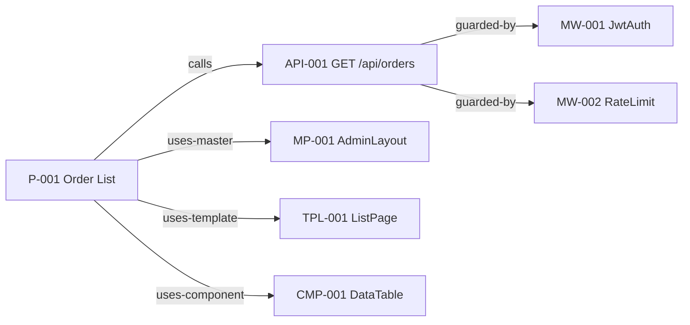
```mermaid
flowchart LR
    P001[P-001 Order List] -->|calls| API001[API-001 GET /api/orders]
    API001 -->|guarded-by| MW001[MW-001 JwtAuth]
    API001 -->|guarded-by| MW002[MW-002 RateLimit]
    P001 -->|uses-master| MP001[MP-001 AdminLayout]
    P001 -->|uses-template| TPL001[TPL-001 ListPage]
    P001 -->|uses-component| CMP001[CMP-001 DataTable]
```

**Edge Table** (auto-extracted by `/sitemap-graph`):

| From | To | Type |
|------|-----|------|
| P-001 | API-001 | calls |
| API-001 | MW-001 | guarded-by |
| API-001 | MW-002 | guarded-by |
| P-001 | MP-001 | uses-master |
| P-001 | TPL-001 | uses-template |
| P-001 | CMP-001 | uses-component |

---

### 9.9 File Structure Map

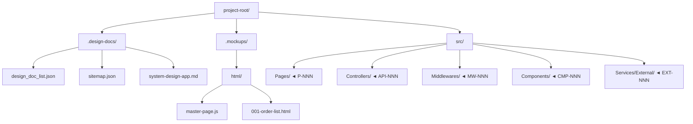
```mermaid
flowchart TD
    ROOT[project-root/]
    ROOT --> DD[.design-docs/]
    ROOT --> MK[.mockups/]
    ROOT --> SRC[src/]

    DD --> DDL[design_doc_list.json]
    DD --> SM[sitemap.json]
    DD --> MD[system-design-app.md]

    MK --> HTML[html/]
    HTML --> MP[master-page.js]
    HTML --> P001H[001-order-list.html]

    SRC --> Pages[Pages/ ◄ P-NNN]
    SRC --> Ctrl[Controllers/ ◄ API-NNN]
    SRC --> MW[Middlewares/ ◄ MW-NNN]
    SRC --> Comp[Components/ ◄ CMP-NNN]
    SRC --> Ext[Services/External/ ◄ EXT-NNN]
```

**File-to-Node Mapping** (auto-extracted from `source_file` fields):

| Path | Node IDs |
|------|----------|
| `.mockups/html/master-page.js` | MP-001 |
| `src/Pages/OrderListPage.tsx` | P-001 |
| `src/Controllers/OrdersController.cs` | API-001 |
| `src/Middlewares/JwtAuthMiddleware.cs` | MW-001 |
| `src/Components/DataTable.tsx` | CMP-001 |

---

## 10. User Roles & Permissions

### 10.1 Roles Definition

| Role ID | Role Name | Description | Level |
|---------|-----------|-------------|-------|
| 1 | Super Admin | Highest system administrator | 1 |
| 2 | Admin | System administrator | 2 |
| 3 | Manager | Manager | 3 |
| 4 | User | General user | 4 |
| 5 | Guest | Visitor | 5 |

### 10.2 Permission Matrix

| Permission | Super Admin | Admin | Manager | User | Guest |
|------------|:-----------:|:-----:|:-------:|:----:|:-----:|
| **Dashboard** |
| View Dashboard | ✅ | ✅ | ✅ | ✅ | ❌ |
| **User Management** |
| View Users | ✅ | ✅ | ✅ | ❌ | ❌ |
| Create User | ✅ | ✅ | ❌ | ❌ | ❌ |
| Edit User | ✅ | ✅ | ❌ | ❌ | ❌ |
| Delete User | ✅ | ❌ | ❌ | ❌ | ❌ |
| **Orders** |
| View All Orders | ✅ | ✅ | ✅ | ❌ | ❌ |
| View Own Orders | ✅ | ✅ | ✅ | ✅ | ❌ |
| Create Order | ✅ | ✅ | ✅ | ✅ | ❌ |
| Cancel Order | ✅ | ✅ | ✅ | 🔸 | ❌ |
| **Reports** |
| View Reports | ✅ | ✅ | ✅ | ❌ | ❌ |
| Export Reports | ✅ | ✅ | ✅ | ❌ | ❌ |
| **Settings** |
| System Config | ✅ | ❌ | ❌ | ❌ | ❌ |
| User Profile | ✅ | ✅ | ✅ | ✅ | ❌ |

**Legend**: ✅ = Full Access, 🔸 = Limited (own data only), ❌ = No Access

### 10.3 Access Control Rules

#### Rule 1: Data Ownership
- Users can only view and edit their own data
- Manager and above can view team data
- Admin and above can view all data

#### Rule 2: Hierarchical Access
- Lower level roles have more privileges
- Super Admin (Level 1) has full access to everything

#### Rule 3: Action Restrictions
- Deleting data requires Admin level or above
- Deleting users requires Super Admin only

---

## Appendix

### A. Glossary

| Term | Definition |
|------|------------|
| [Term] | [Definition] |

### B. References

- [Reference 1]
- [Reference 2]

### C. Change Log

| Date | Version | Changes | Author |
|------|---------|---------|--------|
| [date] | [ver] | [changes] | [author] |
