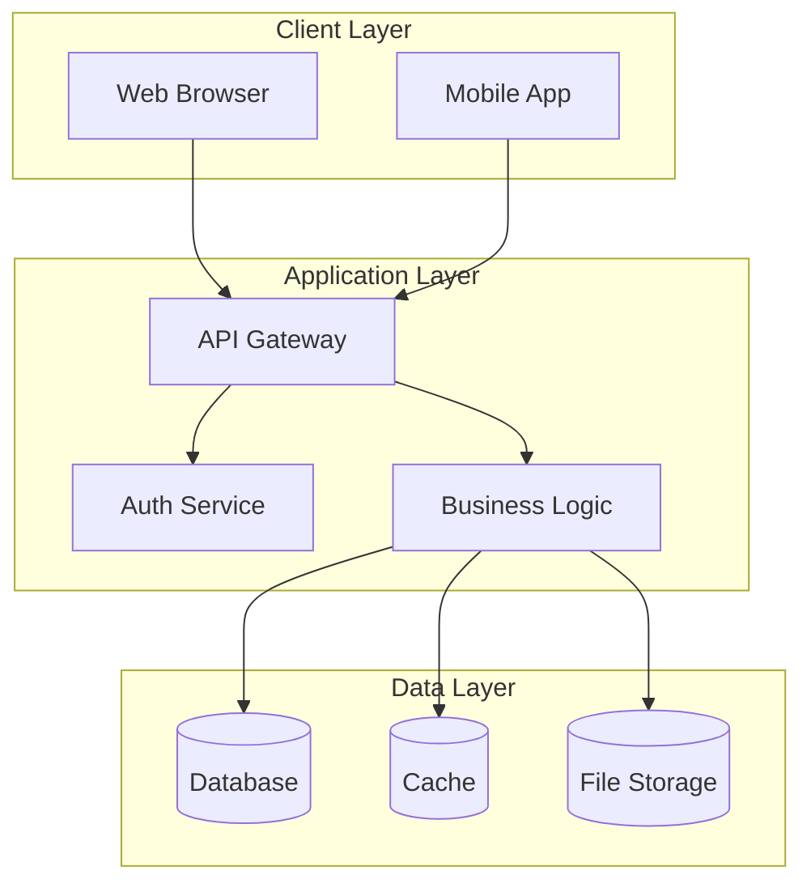

<!-- sdd-section: introduction | doc: __PROJECT_SLUG__ | schema: 2.3.0 -->
# Section 1 — Introduction & System Overview

> [← Back to Index](00-index.md) · __PROJECT_NAME__ System Design Document

## 1. Introduction & System Overview

### 1.1 Project Information

| Item | Details |
|------|---------|
| Project Name | [Name] |
| Project Code | [Code] |
| Project Owner | [Name/Department] |
| Project Start Date | [DD/MM/YYYY] |
| Expected Completion Date | [DD/MM/YYYY] |

### 1.2 Objectives

[Describe the primary objectives of the system]

- Objective 1
- Objective 2
- Objective 3

### 1.3 System Scope

#### In Scope
- [Item 1]
- [Item 2]

#### Out of Scope
- [Item 1]
- [Item 2]

### 1.4 Stakeholders

| Stakeholder | Role | Responsibility |
|-------------|------|----------------|
| [Name/Group] | [Role] | [Responsibility] |

### 1.5 High-Level Architecture

### 1.6 Technology Stack

| Layer | Technology |
|-------|------------|
| Frontend | [Technology] |
| Backend | [Technology] |
| Database | [Technology] |
| Infrastructure | [Technology] |
