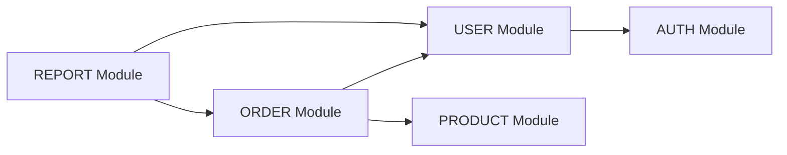

<!-- sdd-section: modules | doc: __PROJECT_SLUG__ | schema: 2.3.0 -->
# Section 3 — Related Modules

> [← Back to Index](00-index.md) · __PROJECT_NAME__ System Design Document

## 3. Related Modules

### 3.1 Module Overview

| Module | Description | Dependencies |
|--------|-------------|--------------|
| AUTH | Authentication and authorization | - |
| USER | User data management | AUTH |
| [MODULE] | [Description] | [dependencies] |

### 3.2 Module Dependency Diagram

### 3.3 Module Details

#### 3.3.1 AUTH Module

**Responsibility**: Handle login/logout and token management

**APIs**:
| Method | Endpoint | Description |
|--------|----------|-------------|
| POST | /api/auth/login | Login |
| POST | /api/auth/logout | Logout |
| POST | /api/auth/refresh | Refresh token |

#### 3.3.2 [Module Name]

**Responsibility**: [Description]

**APIs**:
| Method | Endpoint | Description |
|--------|----------|-------------|
| [METHOD] | [endpoint] | [description] |
