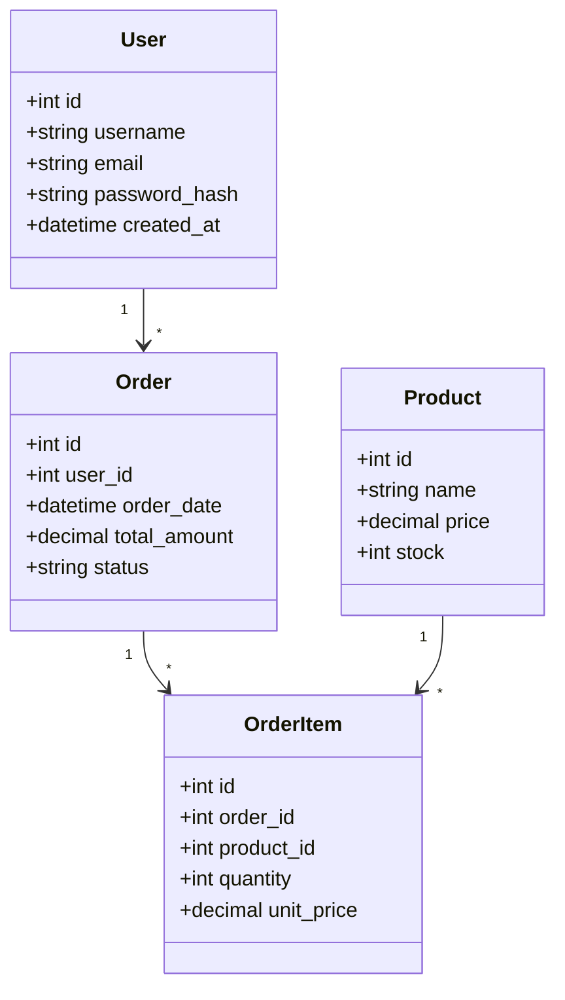

<!-- sdd-section: data-model | doc: __PROJECT_SLUG__ | schema: 2.3.0 -->
# Section 4 — Data Model

> [← Back to Index](00-index.md) · __PROJECT_NAME__ System Design Document

## 4. Data Model

### 4.1 Entity Overview

### 4.2 Entity Relationships

| Entity 1 | Relationship | Entity 2 | Description |
|----------|--------------|----------|-------------|
| User | 1:N | Order | One user can have many orders |
| Order | 1:N | OrderItem | One order can have many items |
| Product | 1:N | OrderItem | One product can be in many order items |
