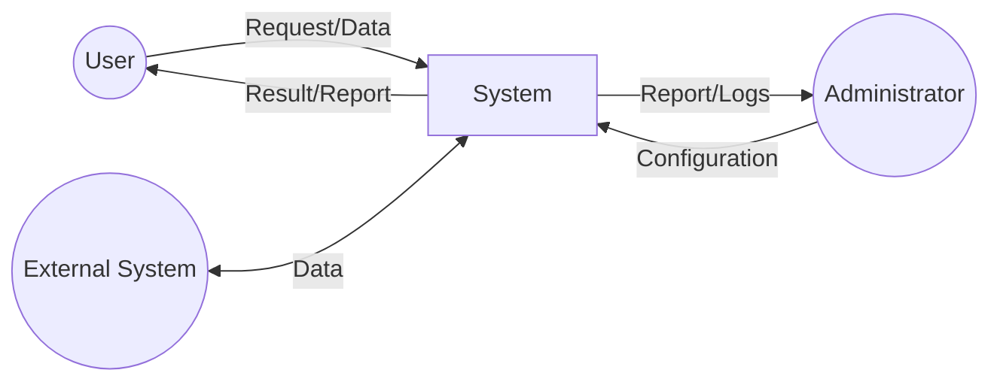
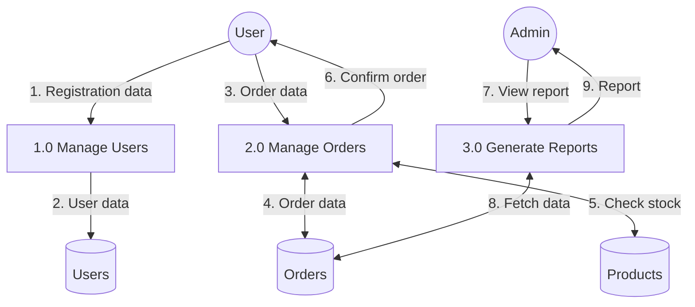

<!-- sdd-section: dfd | doc: __PROJECT_SLUG__ | schema: 2.3.0 -->
# Section 5 — Data Flow Diagram

> [← Back to Index](00-index.md) · __PROJECT_NAME__ System Design Document

## 5. Data Flow Diagram

### 5.1 Context Diagram (Level 0)

### 5.2 Level 1 DFD

### 5.3 Data Flow Description

| Flow ID | From | To | Data Description |
|---------|------|-----|------------------|
| 1 | User | Process 1.0 | Registration data |
| 2 | Process 1.0 | D1: Users | User data |
