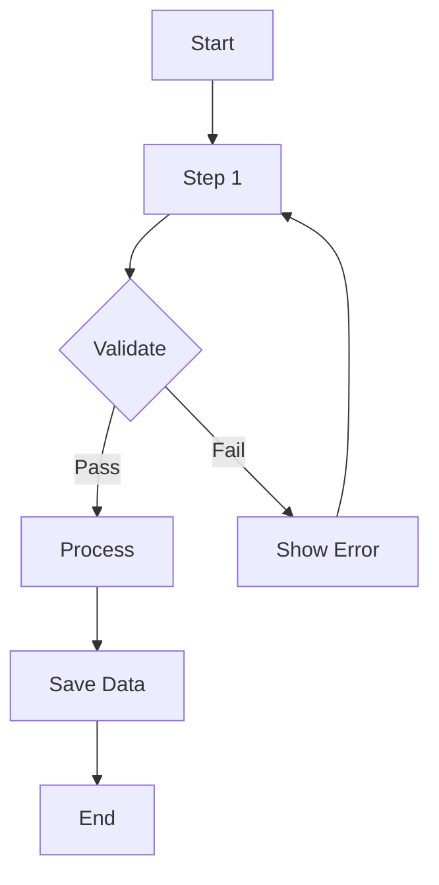
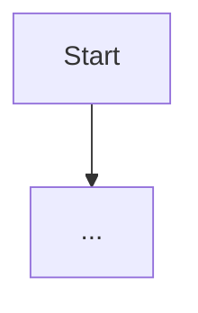

<!-- sdd-section: flow-diagrams | doc: __PROJECT_SLUG__ | schema: 2.3.0 -->
# Section 6 — Flow Diagrams

> [← Back to Index](00-index.md) · __PROJECT_NAME__ System Design Document

## 6. Flow Diagrams

### 6.1 [Process Name] Flow

**Objective**: [Description]

**Actors**: [Involved parties]

**Steps**:
1. [Step 1]
2. [Step 2]
3. [Step 3]

### 6.2 [Another Process] Flow

