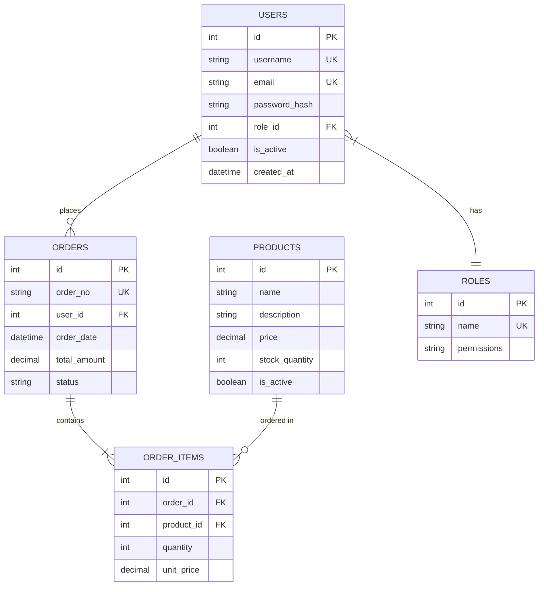

<!-- sdd-section: er-diagram | doc: __PROJECT_SLUG__ | schema: 2.3.0 -->
# Section 7 — ER Diagram

> [← Back to Index](00-index.md) · __PROJECT_NAME__ System Design Document

## 7. ER Diagram

### 7.1 Complete ER Diagram

### 7.2 Relationship Summary

| Entity 1 | Cardinality | Entity 2 | Relationship Description |
|----------|-------------|----------|-------------------------|
| USERS | 1:N | ORDERS | One user can create many orders |
| ORDERS | 1:N | ORDER_ITEMS | One order can have many items |
| PRODUCTS | 1:N | ORDER_ITEMS | One product can be ordered many times |
| USERS | N:1 | ROLES | A user has one role |
