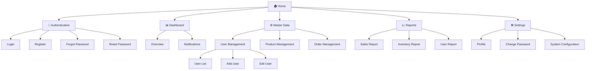
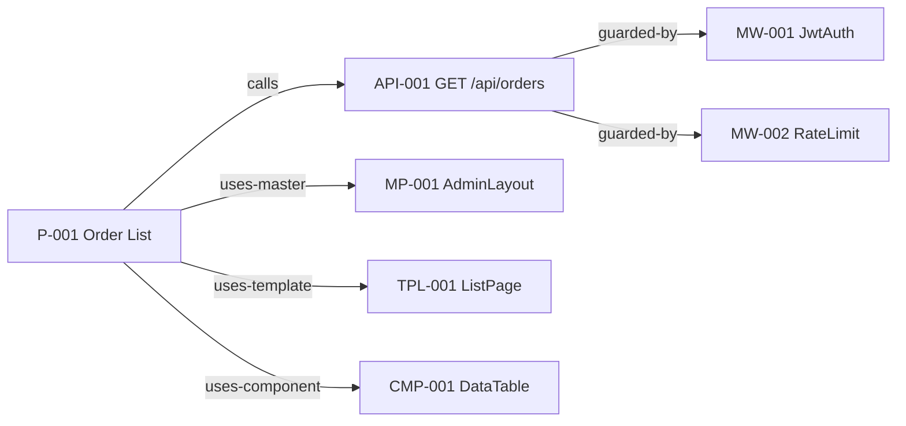
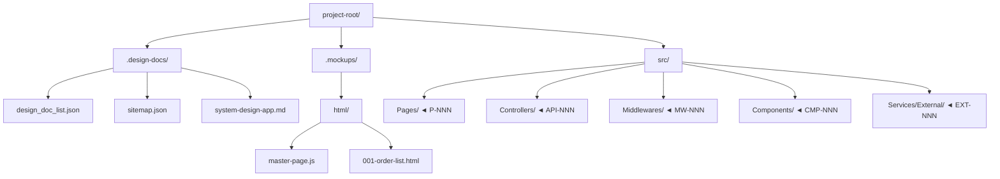

<!-- sdd-section: sitemap | doc: __PROJECT_SLUG__ | schema: 2.3.0 -->
# Section 9 — Sitemap

> [← Back to Index](00-index.md) · __PROJECT_NAME__ System Design Document

## 9. Sitemap

### 9.1 Visual Sitemap

### 9.2 Page Inventory

| Page ID | Page Name | URL | Access Level | Description |
|---------|-----------|-----|--------------|-------------|
| P001 | Home | / | Public | Landing page |
| P002 | Login | /auth/login | Public | Login page |
| P003 | Register | /auth/register | Public | Registration page |
| P004 | Dashboard | /dashboard | User | Main user page |
| P005 | User List | /admin/users | Admin | User management |
| P006 | Sales Report | /reports/sales | Manager | Report |

### 9.3 Navigation Structure

**Primary Navigation** (Header):
- Home
- Dashboard
- Master Data
- Reports

**User Menu**:
- Profile
- Settings
- Logout

---

### 9.4 Design System Inventory

> **Source of truth**: `.design-docs/sitemap.json` `design_system` block.
> **Sync command**: `/sync-sitemap`

#### 9.4.1 Master Pages

| ID | Name | Description | Source File |
|----|------|-------------|-------------|
| MP-001 | AdminLayout | Sidebar + topbar + profile chrome | `.mockups/html/master-page.js` |

#### 9.4.2 Page Templates

| ID | Name | Uses Master | Default Components |
|----|------|-------------|--------------------|
| TPL-001 | ListPage | MP-001 | CMP-001, CMP-002 |

#### 9.4.3 Nav Templates

| ID | Name | Type | Items |
|----|------|------|-------|
| NAV-001 | PrimarySidebar | sidebar | Dashboard, Orders, Reports |

#### 9.4.4 Components

| ID | Name | Category | Source File |
|----|------|----------|-------------|
| CMP-001 | DataTable | data-display | `src/Components/DataTable.tsx` |

---

### 9.5 API Inventory (flat unified list)

> Mirror of `application.apis` in `sitemap.json`. Section 3.3 (Module APIs) groups APIs by module for human reading; this section is the flat machine-readable inventory.

| ID | Method | Path | Controller | Auth | Middlewares |
|----|--------|------|------------|------|-------------|
| API-001 | GET | /api/orders | OrdersController.GetAll | ✓ | MW-001, MW-002 |

---

### 9.6 Middleware Inventory

| ID | Name | Type | Applies To | Order |
|----|------|------|------------|-------|
| MW-001 | JwtAuth | auth | all-api-except-public | 1 |
| MW-002 | RateLimit | rate-limit | all-api | 2 |

---

### 9.7 External Functions Inventory

| ID | Name | Kind | Provider | Auth Method |
|----|------|------|----------|-------------|
| EXT-001 | Stripe Charge | 3rd-party-api | Stripe | api-key |

---

### 9.8 Node Relationships

**Edge Table** (auto-extracted by `/sitemap-graph`):

| From | To | Type |
|------|-----|------|
| P-001 | API-001 | calls |
| API-001 | MW-001 | guarded-by |
| API-001 | MW-002 | guarded-by |
| P-001 | MP-001 | uses-master |
| P-001 | TPL-001 | uses-template |
| P-001 | CMP-001 | uses-component |

---

### 9.9 File Structure Map

**File-to-Node Mapping** (auto-extracted from `source_file` fields):

| Path | Node IDs |
|------|----------|
| `.mockups/html/master-page.js` | MP-001 |
| `src/Pages/OrderListPage.tsx` | P-001 |
| `src/Controllers/OrdersController.cs` | API-001 |
| `src/Middlewares/JwtAuthMiddleware.cs` | MW-001 |
| `src/Components/DataTable.tsx` | CMP-001 |
